# Ogohlantiruvchi belgilar

Всего знаков: 44

## 1.1

«Shlagbaumli temir yo‘l kesishmasi».

---

## 1.2

«Shlagbaumsiz temir yo‘l kesishmasi».

---

## 1.3.1

«Bir izli temir yo‘l».

Bir izli temir yo’l belgilari shlagbaum bilan jihozlanmagan temir yo’l kesishmasi oldida o’rnatiladi.

---

## 1.3.2

«Ko‘p izli temir yo‘l».

Ikki va undan ortiq izli temir yo’l belgilari shlagbaum bilan jihozlanmagan temir yo’l kesishmasi oldida o’rnatiladi.

---

## 1.4.1 – 1.4.6

«Temir yo‘l kesishmasiga yaqinlashuv».

Aholi punktlaridan tashqarida temir yo‘l kesishmasiga yaqinlashayotganlik haqida qo‘shimcha ogohlantirish beradi.

---

## 1.5

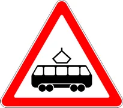

«Tramvay yo‘li bilan kesishuv».

---

## 1.6

«Teng ahamiyatli yo‘llar kesishuvi».

---

## 1.7

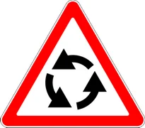

«Aylanma harakatlanish bilan kesishuv».

---

## 1.8

«Svetofor bilan tartibga solish».

Harakatlanish svetofor bilan tartibga solinadigan chorraha, piyodalar o‘tish joyi yoki yo‘l qismini bildiradi.

---

## 1.9

«Ko‘tarma ko‘prik».

Ko‘tarma ko‘prik yoki solda kesib o‘tish.

---

## 1.10

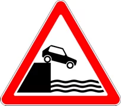

«Sohilga chiqish».

Daryo yoki suv havzasi qirg‘og‘iga chiqishni bildiradi.

---

## 1.11.1

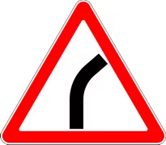

«Xavfli burilish o‘ngga».

O‘ngga yo‘l belgilari yo‘lning kichik radiusli yoki ko‘rinishi cheklangan burilish joyini bildiradi.

---

## 1.11.2

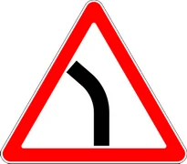

«Xavfli burilish chapga».

Chapga yo‘l belgilari yo‘lning kichik radiusli yoki ko‘rinishi cheklangan burilish joyini bildiradi.

---

## 1.12.1

«Xavfli burilishlar».

Birinchi burilish o‘ngga yo‘l belgilari yo‘lning xavfli burilishlari bo‘lgan qismini bildiradi.

---

## 1.12.2

«Xavfli burilishlar».

Birinchi burilish chapga yo‘l belgilari yo‘lning xavfli burilishlari bo‘lgan qismini bildiradi.

---

## 1.13

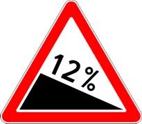

«Tik nishablik».

---

## 1.14

«Tik balandlik».

---

## 1.15

«Sirpanchiq yo‘l».

Qatnov qismi o‘ta sirpanchiq bo‘lgan yo‘l qismi.

---

## 1.16

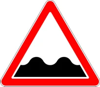

«Notekis yo‘l».

Qatnov qismi notekis bo‘lgan yo‘l (o‘nqir-cho‘nqir, o‘ydim-chuqur joylar, ko‘prikning yo‘lga notekis tutashuvi va shu kabilar) qismini bildiradi.

---

## 1.17

«Tosh otilishi xavfi».

Transport vositasining g‘ildiragi ostidan shag‘al, tosh va shunga o‘xshashlarning otilib chiqish ehtimoli bo‘lgan yo‘l qismini bildiradi.

---

## 1.18.1

«Yo‘lning torayishi».

Ikki tomonlama torayish

---

## 1.18.2

«Yo‘lning torayishi».

O‘ngga torayish

---

## 1.18.3

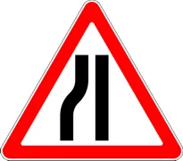

«Yo‘lning torayishi».

Chapga torayish

---

## 1.19

«Ikki tomonlama harakatlanish».

Yo‘lning (qatnov qismining) qarama-qarshi harakatlanish qismi boshlanishini bildiradi.

---

## 1.20

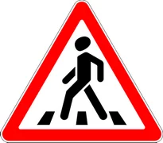

«Piyodalar o‘tish joyi».

5.16.1, 5.16.2, 5.48 belgilari va (yoki) 1.14.1 — 1.14.4, 1.29.1 — 1.29.3 yo‘l chiziqlari bilan belgilangan piyodalar o‘tish joyini bildiradi.

---

## 1.21

«Bolalar».

Bolalar muassasasi (maktablar, bolalarning dam olish maskanlari va shunga o‘xshashlar)ga yaqin yo‘lning qatnov qismidan bolalarning chiqib qolish ehtimolini bildiradi.

---

## 1.22

«Velosiped yo‘lkasi bilan kesishuv».

---

## 1.23

«Ta’mirlash ishlari».

---

## 1.24

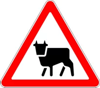

«Mol haydab o‘tish».

---

## 1.25.1

«Yovvoyi hayvonlar».

---

## 1.25.2

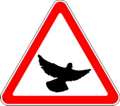

«Pastlab uchuvchi qushlar».

---

## 1.25.3

«Kemiruvchi va sudralib yuruvchi hayvonlar».

---

## 1.26

«Toshlar tushishi».

Tosh ko‘chishi, surilishi va tushishi mumkin bo‘lgan yo‘l qismini bildiradi.

---

## 1.27

«Yonlama shamol».

---

## 1.28

«Pastlab uchuvchi samolyotlar».

---

## 1.29

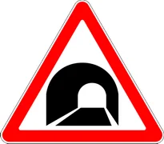

«Tunnel».

Sun’iy ravishda yoritilmagan yoki kirish peshtog‘ining ko‘rinishi cheklangan tunnelni bildiradi.

---

## 1.30

«Boshqa xavf-xatarlar».

Ogohlantiruvchi belgilarda ko‘zda tutilmagan xavf-xatarlar bo‘lgan yo‘l qismini bildiradi.

---

## 1.31

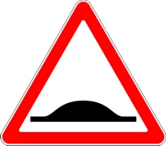

«Sun’iy yo‘l notekisligi».

Yo‘lning sun’iy notekislik o‘rnatilgan qismiga yaqinlashayotganligi to‘g‘risida ogohlantiradi. Transport vositasining harakatlanish tezligini majburiy tarzda kamaytirish uchun qo‘llaniladi.

---

## 1.31.3

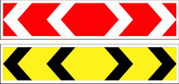

«Burilishning yo‘nalishi».

T-simon chorrahada yoki yo‘l ayrilishlarida harakatlanish yo‘nalishini, ta’mirlanayotgan yo‘l qismini aylanib o‘tish yo‘nalishini bildiradi.

---

## 1.31.1 – 1.31.2

«Burilishning yo‘nalishi».

Kichik radiusli, ko‘rinishi cheklangan yo‘lda harakatlanish yo‘nalishini va yo‘lning ta’mirlanayotgan qismini aylanib o‘tish yo‘nalishini bildiradi.

---

## 1.32

«Tirbandlik».

Ushbu yo‘l belgisi vaqtinchalik yoki tasviri o‘zgaradigan holatda tirbandlik hosil bo‘lgan yo‘l yoki chorrahaga kirish oldidan yo‘lni yoki chorrahani aylanib o‘tish imkoniyati bo‘lgan joyga o‘rnatiladi.

---

## 1.33

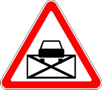

«Qatnov qismi kesishmasi hududi».

1. 30 yotiq chizig‘i bilan belgilangan chorrahaga yaqinlashayotganligini anglatib, oldinda tirbandlik yuzaga kelganligi tufayli majburiy to‘xtab, ko‘ndalang yo‘nalishdagi transport vositalarining harakatlanishiga to‘sqinlik tug‘diradigan bo‘lsa, chorrahaga kirish, agar to‘xtash chizig‘i yoki 5.33 yo‘l belgisidan o‘tib bo‘lgan haydovchiga esa qatnov qismlari kesishmasiga kirishni taqiqlanishini bildiradi.

---

## 1.34

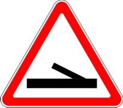

«Diqqat, boshqariladigan to‘siq».

Ushbu yo‘l belgisi boshqariladigan to‘suvchi qurilmasiga yetmasdan o‘rnatiladi va transport vositalari haydovchilarini oldinda to‘suvchi qurilma borligi haqida ogohlantiradi.

---

## 1.35

«Piyodalarning yo‘l yoqasidan yurishi mumkin bo‘lgan hudud».

---

