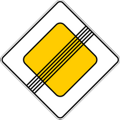
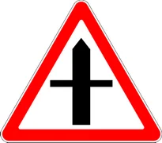

# Imtiyoz belgilari

Всего знаков: 9

## 2.1

«Asosiy yo‘l».

Harakat tartibga solinmagan chorrahalarda oldin o‘tish huquqini beradi.

Belgi asosiy yo‘l boshiga va chorrahalarning bevosita oldiga o‘rnatiladi.

---

## 2.2

«Asosiy yo‘lning oxiri».

---

## 2.3.1

«Ikkinchi darajali yo‘l bilan kesishuv».

Yo‘l belgilari aholi punktlarida kesishmagacha 50 — 100 metr masofada, aholi punktlaridan tashqarida esa 150 — 300 metr masofada o‘rnatiladi.

---

## 2.3.2

«Ikkinchi darajali yo‘l bilan tutashuv o‘ngdan».

Yo‘l belgilari aholi punktlarida kesishmagacha 50 — 100 metr masofada, aholi punktlaridan tashqarida esa 150 — 300 metr masofada o‘rnatiladi.

---

## 2.3.3

«Ikkinchi darajali yo‘l bilan tutashuv chapdan».

Yo‘l belgilari aholi punktlarida kesishmagacha 50 — 100 metr masofada, aholi punktlaridan tashqarida esa 150 — 300 metr masofada o‘rnatiladi.

---

## 2.4

«Yo‘l bering».

Haydovchi kesib o‘tilayotgan yo‘ldan, 7.13 qo‘shimcha-axborot belgisi bo‘lganda esa asosiy yo‘ldan harakatlanayotgan transport vositasiga yo‘l berishi kerak.

---

## 2.5

«To‘xtamasdan harakatlanish taqiqlangan».

To‘xtash chizig‘i oldida, agar u bo‘lmasa, kesib o‘tiladigan qatnov qismining chetida to‘xtamasdan harakatlanish taqiqlanadi. Haydovchi kesib o‘tilayotgan yo‘ldan, 7.13 qo‘shimcha-axborot belgisi bo‘lganda esa asosiy yo‘ldan harakatlanayotgan transport vositalariga yo‘l berishi kerak.

Bu belgi temir yo‘l kesishmasi yoki karantin maskanidan oldin o‘rnatilishi mumkin. Bunday hollarda haydovchi to‘xtash chizig‘i oldida, u bo‘lmasa, belgi oldida to‘xtashi kerak.

---

## 2.6

«Ro‘para harakatlanishning ustunligi».

Qarama-qarshi harakatlanishni qiyinlashtiradigan hollarda yo‘lning tor qismiga kirish taqiqlanadi. Haydovchi yo‘lning tor qismida bo‘lgan yoki ro‘paradan unga yaqin bo‘lgan transport vositasiga yo‘l berishi kerak.

---

## 2.7

«Ro‘paradagi harakatlanishga nisbatan imtiyoz».

Yo‘lning tor qismida harakatlanishda haydovchi ro‘paradan kelayotgan transport vositasiga nisbatan imtiyozga egaligini bildiradi.

---

