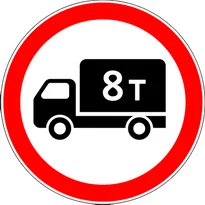
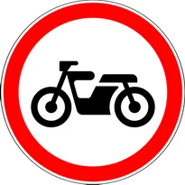
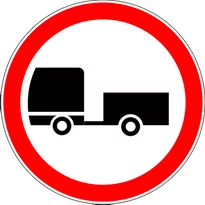
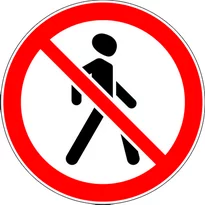
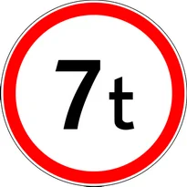
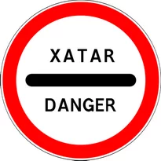
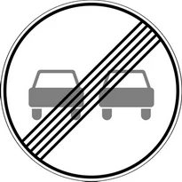
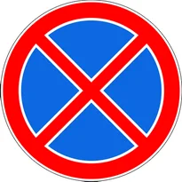

# Taqiqlovchi belgilar

Всего знаков: 36

## 3.1

«Kirish taqiqlangan».

Barcha transport vositalarining kirishi taqiqlanishini bildiradi.

---

## 3.2

«Harakatlanish taqiqlangan».

Barcha transport vositalarining harakatlanishi taqiqlanishini bildiradi.

---

## 3.3

«Mexanik transport vositalarining harakatlanishi taqiqlangan».

---

## 3.4

«Yuk avtomobillarining harakatlanishi taqiqlangan».

Ruxsat etilgan to‘liq vazni 3,5 tonnadan (agar vazni belgida ko‘rsatilmagan bo‘lsa) yoki ruxsat etilgan to‘liq vazni belgida ko‘rsatilgandan ortiq bo‘lgan yuk avtomobillari va transport vositalari tarkiblarining, shuningdek traktorlar, o‘ziyurar uskunalarning harakatlanishi taqiqlanadi.

3.4. yo‘l belgisi bortlariga qiya oq chiziq tortilgan yoki odamlarni tashish uchun mo‘ljallangan yuk avtomobillarining harakatlanishini taqiqlamaydi.

---

## 3.5

«Mototsikllar harakatlanishi taqiqlangan».

---

## 3.6

«Traktorlar harakatlanishi taqiqlangan».

Traktorlar va o‘ziyurar uskunalarning harakatlanishi taqiqlanadi.

---

## 3.7

«Tirkama bilan harakatlanish taqiqlangan».

Yuk avtomobillari va traktorlarning barcha turdagi tirkamalar bilan harakatlanishi, shuningdek, mexanik transport vositalarini shatakka olish taqiqlanadi.

---

## 3.8

«Ot-arava harakatlanishi taqiqlangan».

Ot-arava (chana), otliqlar, yuk ortilgan hayvonlarning harakatlanishi, shuningdek, chorva (poda) haydab o‘tish taqiqlanadi.

---

## 3.9

«Velosipedda harakatlanish taqiqlangan».

Velosipedda va mopedda harakatlanish taqiqlanadi.

---

## 3.10

«Piyodaning harakatlanishi taqiqlangan».

---

## 3.11

«Vazn cheklangan».

Haqiqiy umumiy vazni belgida ko‘rsatilganidan ortiq bo‘lgan transport vositalarining, shuningdek, transport vositalari tarkiblarining harakatlanishi taqiqlanadi.

---

## 3.12

«O‘qqa tushadigan og‘irlik cheklangan».

Har qanday o‘qiga tushadigan haqiqiy og‘irlik belgida ko‘rsatilganidan ortiq bo‘lgan transport vositalarining harakatlanishi taqiqlanadi.

---

## 3.13

«Cheklangan balandlik».

Gabarit balandligi (yuk bilan yoki yuksiz) belgida ko‘rsatilgandan ortiq bo‘lgan transport vositalarining harakatlanishi taqiqlanadi.

---

## 3.14

«Cheklangan kenglik».

Gabarit kengligi (yuk bilan yoki yuksiz) belgida ko‘rsatilganidan ortiq bo‘lgan transport vositalarining harakatlanishi taqiqlanadi.

---

## 3.15

«Cheklangan uzunlik».

Gabarit uzunligi (yuk bilan yoki yuksiz) belgida ko‘rsatilganidan ortiq bo‘lgan transport vositalari (transport vositalari tarkiblari)ning harakatlanishi taqiqlanadi.

---

## 3.16

«Eng kam oraliq».

Belgida ko‘rsatilganidan kam bo‘ylama oraliq masofada harakatlanish taqiqlanadi.

---

## 3.17.1

«Bojxona».

Bojxona (nazorat punkti) oldida to‘xtamasdan o‘tib ketish taqiqlanadi.

---

## 3.17.2

«Xavf-xatar».

Yo‘l-transport hodisasi, avariya, yong‘in yoki boshqa xavf-xatar vaziyatlar tufayli, istisnosiz, barcha transport vositalarining bundan keyin harakatlanishi taqiqlanadi.

---

## 3.17.3

«Nazorat joyi».

Transport vositalarining tekshirib o‘tkazilishi majburiy bo‘lgan vaqtincha yoki doimiy nazorat punktlarida o‘rnatiladi.

Ushbu yo‘l belgisi 2.5 yo‘l belgisi bilan birga o‘rnatilishi mumkin.

---

## 3.18.1

«O‘ngga burilish taqiqlangan».

---

## 3.18.2

«Chapga burilish taqiqlanadi».

---

## 3.19

«Qayrilish taqiqlangan».

---

## 3.20

«Quvib o‘tish taqiqlangan».

Soatiga 40 km dan kam tezlikda harakatlanayotgan yakka transport vositasidan boshqa transport vositalarini quvib o‘tish taqiqlanishini bildiradi.

---

## 3.21

«Quvib o‘tish taqiqlangan hududning oxiri».

---

## 3.22

«Yuk avtomobillarida quvib o‘tish taqiqlangan».

To‘liq vazni 3,5 tonnadan ortiq bo‘lgan yuk avtomobillarida barcha transport vositalarini quvib o‘tish taqiqlanishini bildiradi (soatiga 40 km dan kam tezlikda harakatlanayotgan transport vositasi, traktor, ot-arava, velosiped bundan mustasno).

---

## 3.23

«Yuk avtomobillarida quvib o‘tish taqiqlangan hududning oxiri».

---

## 3.24

«Yuqori tezlik cheklangan».

Belgida ko‘rsatilganidan ortiq tezlikda (km/s) harakatlanish taqiqlanishini bildiradi.

---

## 3.25

«Yuqori tezlik cheklangan hududning oxiri».

---

## 3.26

«Tovush moslamalaridan foydalanish taqiqlangan».

Yo‘l transport hodisasining oldini olish hollaridan boshqa vaziyatlarda tovush moslamasidan foydalanish taqiqlanadi.

---

## 3.27

«To‘xtash taqiqlangan».

Transport vositalarining to‘xtashi va to‘xtab turishi taqiqlanadi (xizmat vazifasini bajarayotgan xodimga biriktirilgan ko‘k yoki qizil yoxud ko‘k va qizil rangli yaltiroq mayoqchasi bilan jihozlangan hamda maxsus rangli bo‘yoq sxemalar va yozuvlar bilan belgilangan transport vositalari bundan mustasno).

---

## 3.28

«To‘xtab turish taqiqlangan».

Transport vositalarining to‘xtab turishi taqiqlanadi (xizmat vazifasini bajarayotgan xodimga biriktirilgan ko‘k yoki qizil yoxud ko‘k va qizil rangli yaltiroq mayoqchasi bilan jihozlangan hamda maxsus rangli bo‘yoq sxemalar va yozuvlar bilan belgilangan transport vositalari bundan mustasno).

---

## 3.29

«Oyning toq kunlarida to‘xtab turish taqiqlangan».

(xizmat vazifasini bajarayotgan xodimga biriktirilgan ko‘k yoki qizil yoxud ko‘k va qizil rangli yaltiroq mayoqchasi bilan jihozlangan hamda maxsus rangli bo‘yoq sxemalar va yozuvlar bilan belgilangan transport vositalari bundan mustasno).

---

## 3.30

«Oyning juft kunlarida to‘xtab turish taqiqlangan».

(xizmat vazifasini bajarayotgan xodimga biriktirilgan ko‘k yoki qizil yoxud ko‘k va qizil rangli yaltiroq mayoqchasi bilan jihozlangan hamda maxsus rangli bo‘yoq sxemalar va yozuvlar bilan belgilangan transport vositalari bundan mustasno).3.29 va 3.30 belgilari qatnov qismining qarama-qarshi tomonlarida bir vaqtda o‘rnatilganda, qatnov qismining har ikkala tomonida soat 19:00 dan 21:00 gacha to‘xtab turishga ruxsat etiladi (joyini o‘zgartirish vaqti).

---

## 3.31

«Barcha cheklovlarning oxiri».

3.16, 3.20, 3.22, 3.24, 3.26 — 3.30 belgilaridan bir nechtasiga bir vaqtda amal qiladigan hududlarning oxiri.

---

## 3.32

«Xavfli yuk tashiyotgan transport vositasining harakati taqiqlangan».

---

## 3.33

«Portlovchi va tez alangalanuvchi yukni tashiyotgan transport vositasining harakati taqiqlangan».

---

