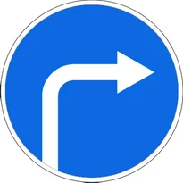
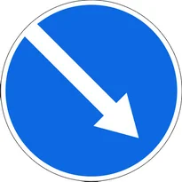
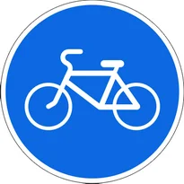
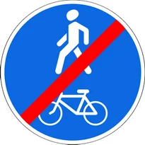
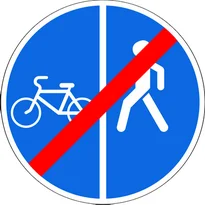
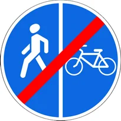

# Buyuruvchi belgilar

Всего знаков: 24

## 4.1.1

«Harakatlanish to‘g‘riga».

---

## 4.1.2

«Harakatlanish o‘ngga».

---

## 4.1.3

«Harakatlanish chapga».

---

## 4.1.4

«Harakatlanish to‘g‘riga yoki o‘ngga».

---

## 4.1.5

«Harakatlanish to‘g‘riga yoki chapga».

---

## 4.1.6

«Harakatlanish o‘ngga yoki chapga».

---

## 4.2.1

«To‘siqni o‘ngdan aylanib o‘tish».

Faqat ko‘rsatkich ko‘rsatgan tomondan aylanib o‘tish ruxsat etiladi.

---

## 4.2.2

«To‘siqni chapdan aylanib o‘tish».

Faqat ko‘rsatkich ko‘rsatgan tomondan aylanib o‘tish ruxsat etiladi.

---

## 4.2.3

«To‘siqni o‘ngdan yoki chapdan aylanib o‘tish».

Har tomonidan aylanib o‘tish ruxsat etiladi.

---

## 4.3

«Aylanma harakatlanish».

Ko‘rsatkichlar yo‘nalishlarida harakatlanish ruxsat etiladi.

---

## 4.4

«Yengil avtomobillar harakati».

Yengil avtomobillar, avtobus, mototsikllar, belgilangan yo‘nalishli transport vositalari va ruxsat etilgan to‘liq vazni 3,5 tonnadan oshmaydigan yuk avtomobillari harakatlanishiga ruxsat etilishini bildiradi.

Belgining ta’sir oralig‘ida yashovchi va ishlovchi fuqarolarga tegishli, ularga va korxonalarga xizmat ko‘rsatuvchi transport vositalariga bu belgi tatbiq etilmaydi. Bunday hollarda transport vositalari belgilangan joyga eng yaqin chorrahadan kirib yoki chiqib ketishlari kerak.

---

## 4.5

«Velosiped yo‘lkasi».

Faqat velosiped va mopedlarda harakatlanishga ruxsat etilishini bildiradi. Trotuar yoki piyodalar yo‘lkasi bo‘lmasa, velosiped yo‘lkasidan piyodalar ham yurishlari mumkin.

---

## 4.6

«Piyodalar yo‘lkasi».

Faqat piyodalar yurishiga ruxsat etiladi.

---

## 4.6.1

«Piyodalar va velosipedchilarning birgalikdagi harakati tashkil etilgan yo‘lak».

---

## 4.6.2

«Piyodalar va velosipedchilarning birgalikdagi harakati tashkil etilgan yo‘lakning oxiri».

---

## 4.6.3

«Piyodalar va velosipedchilarning harakati alohida tashkil etilgan yo‘lak».

1.1, 1.25 va 1.26 yotiq yo‘l chizig‘i yordamida, konstruktiv tarzda yoxud boshqa usulda piyodalar va velosipedchilarning harakati ajratilgan piyodalar va velosipedchilar yo‘lagi.

---

## 4.6.4

«Piyodalar va velosipedchilarning harakati alohida tashkil etilgan yo‘lakning oxiri».

---

## 4.6.5

«Piyodalar va velosipedchilarning harakati alohida tashkil etilgan yo‘lak».

1.1, 1.25 va 1.26 yotiq yo‘l chizig‘i yordamida, konstruktiv tarzda yoxud boshqa usulda piyodalar va velosipedchilarning harakati ajratilgan piyodalar va velosipedchilar yo‘lagi.

---

## 4.6.6

«Piyodalar va velosipedchilarning harakati alohida tashkil etilgan yo‘lakning oxiri».

---

## 4.7

«Eng kam tezlik».

Faqat belgida ko‘rsatilgan yoki undan yuqori tezlikda (km/soat) harakatlanishga ruxsat etilishini bildiradi.

---

## 4.8

«Eng kam tezlik belgilangan yo‘lning oxiri».

---

## 4.9.1

«Xavfli yuk tashiyotgan transport vositalarining harakat yo‘nalishi».

«Xavfli yuk» tanish belgisi bilan jihozlangan transport vositalarining harakatiga yo‘l belgisida ko‘rsatilgan yo‘nalishlarda ruxsat beriladi: to‘g‘riga.

---

## 4.9.2

«Xavfli yuk tashiyotgan transport vositalarining harakat yo‘nalishi».

«Xavfli yuk» tanish belgisi bilan jihozlangan transport vositalarining harakatiga yo‘l belgisida ko‘rsatilgan yo‘nalishlarda ruxsat beriladi: chapga.

---

## 4.9.3

«Xavfli yuk tashiyotgan transport vositalarining harakat yo‘nalishi».

«Xavfli yuk» tanish belgisi bilan jihozlangan transport vositalarining harakatiga yo‘l belgisida ko‘rsatilgan yo‘nalishlarda ruxsat beriladi: o‘ngga.

---

