# Axborot belgilari

Всего знаков: 70

## 5.1

«Avtomagistral».

Yo‘l harakati qoidalarining avtomagistrallarda harakatlanish tartibi o‘rnatilgan yo‘lni bildiradi.

---

## 5.2

«Avtomagistralning oxiri».

---

## 5.3

«Avtomobillar uchun mo‘ljallangan yo‘l».

Faqat avtomobillar, avtobus va mototsikllarning harakatlanishi uchun mo‘ljallangan yo‘lni bildiradi.

---

## 5.4

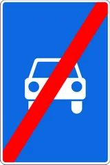

«Avtomobillar uchun mo‘ljallangan yo‘lning oxiri».

---

## 5.5

«Bir tomonlama harakatli yo‘l».

Transport vositalari butun kenglik bo‘yicha bir yo‘nalishda harakatlanadigan yo‘l yoki qatnov qismi.

---

## 5.6

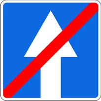

«Bir tomonlama harakatli yo‘lning oxiri».

---

## 5.7.1 – 5.7.2

«Bir tomonlama harakatli yo‘lga chiqish».

Harakatlanish bir tomonlama bo‘lgan yo‘lga yoki qatnov qismiga chiqish.

---

## 5.8.1

«Tasmalar bo‘yicha harakat yo‘nalishi».

Tasmalar soni va har biri bo‘yicha ruxsat etilgan harakatlanish yo‘nalishlari. Boshqa yo‘nalishlar bo‘yicha harakatlanish taqiqlanadi.

---

## 5.8.2

«Tasma bo‘yicha harakatlanish yo‘nalishi».

Tasma bo‘yicha ruxsat etilgan harakatlanish yo‘nalishi. Boshqa yo‘nalishlar bo‘yicha harakatlanish taqiqlanadi.

---

## 5.8.3

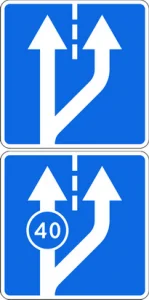

«Tasmaning boshlanishi».

Yo‘lning sekinlashish bo‘lagi yoki balandlikka ko‘tarilishdagi qo‘shimcha tasmaning boshlanish qismi.

Agar belgiga 4.7 “Eng kam tezlik” belgisining tasviri tushgan bo‘lsa, ko‘rsatilgan yoki undan kattaroq tezlikda harakatlana olmaydigan transport vositasining haydovchisi asosiy tasmadan qo‘shimcha tasmaga qayta tizilishi kerak.

---

## 5.8.4

«Tasmaning boshlanishi».

Uch tasmali yo‘llarda shu yo‘nalishda harakatlanish uchun mo‘ljallangan o‘rta tasma qismining boshlanishi.

---

## 5.8.5

«Tasma oxiri».

Balandlikka ko‘tarilishdagi qo‘shimcha tasmaning yoki tezlanish tasmaning oxirini bildiradi.

---

## 5.8.6

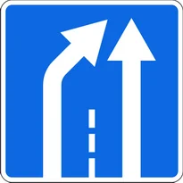

«Tasma oxiri».

Uch tasmali yo‘llarda shu yo‘nalishda harakatlanish uchun mo‘ljallangan o‘rta tasma qismining oxirini bildiradi.

---

## 5.8.7
5.8.8

«Tasmalar bo‘yicha harakatlanish yo‘nalishi».

Agar 5.8.7 belgisida biror transport vositasining harakatlanishini taqiqlovchi belgi tasvirlangan bo‘lsa, unda bu tur transport vositasining tegishli tasmada harakatlanishi taqiqlanishini bildiradi.

5.8.7 va 5.8.8 belgilari yo‘nalishlar soniga ko‘ra to‘rt va undan ortiq tasmali yo‘llarga ham tatbiq etilishi mumkin. Tasviri almashadigan 5.8.7, 5.8.8 belgilari yordamida reversiv harakat tashkil etilishi mumkin.

---

## 5.9

«Yo‘nalishli transport vositalari uchun mo‘ljallangan tasma».

Transport vositalari yo‘nalishida harakatlanadigan yo‘nalishli transport vositalari uchun mo‘ljallangan tasmani bildiradi.

Belgi qaysi tasma ustida joylashgan bo‘lsa, shu tasmaga tatbiq etiladi. Yo‘lning o‘ng tomoniga o‘rnatilgan belgining ta’siri o‘ng tasmaga tatbiq etiladi.

---

## 5.10.1

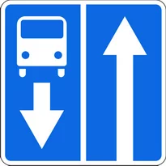

«Yo‘nalishli transport vositalari uchun alohida ajratilgan tasmasi bor yo‘l».

Yo‘nalishli transport vositalarining umumiy oqimga qarshi harakatlanishi uchun ajratilgan tasmani bildiradi.

---

## 5.10.4

«Yo‘nalishli transport vositalari uchun alohida ajratilgan tasmasi bor yo‘lning oxiri».

---

## 5.10.2 – 5.10.3

«Yo‘nalishli transport vositalari uchun alohida ajratilgan tasmasi bor yo‘lga chiqish».

---

## 5.11.1

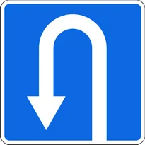

«Qayrilib olish joyi».

Chapga burilish taqiqlanadi.

---

## 5.11.2

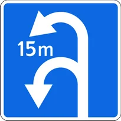

«Qayrilib olish oralig‘i».

Qayrilib olish oralig‘ining uzunligini bildiradi. Chapga burilish taqiqlanadi.

---

## 5.12

«Avtobus va (yoki) trolleybus to‘xtash joyi».

---

## 5.13

«Tramvay to‘xtash joyi».

---

## 5.14

«Yo‘nalishsiz taksilar to‘xtab turish joyi».

---

## 5.15

«To‘xtab turish joyi».

---

## 5.15.1

«Pullik to‘xtab turish joyi».

---

## 5.15.2

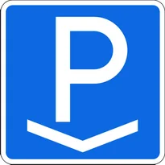

«Yer usti avtomobil qo‘yish joyi».

---

## 5.15.3

«Yer osti avtomobil qo‘yish joyi».

---

## 5.15.4

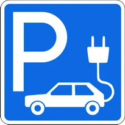

«Elektr quvvatlashli avtomobil qo‘yish joyi».

---

## 5.16.1 – 5.16.2

«Piyodalar o‘tish joyi».

O‘tish joyi oldida 1.14.1-1.14.2 yotiq chizig‘i bo‘lmaganda 5.16.2 belgisi yo‘ldan o‘ng tomonga o‘tish joyining old chegarasiga, 5.16.1 belgisi esa chap tomonga o‘tish joyining orqa chegarasiga o‘rnatiladi.

---

## 5.17.1 – 5.17.2

«Piyodalarning yer ostidan o‘tish joyi».

---

## 5.17.3 – 5.17.4

«Piyodalarning yer ustidan o‘tish joyi».

---

## 5.18

«Tavsiya etilgan tezlik».

Yo‘lning shu qismida tavsiya etilgan harakatlanish tezligini bildiradi. Belgiga eng yaqin chorrahagacha amal qilinadi. 5.18 belgisi ogohlantiruvchi belgi bilan birga qo‘llansa, uning ta’sir oralig‘i xavfli qismning uzunligi bilan aniqlanadi. 5.48 yo‘l belgisi o‘rnatilgan ko‘cha va yo‘llarda o‘rnatilishi lozimligini bildiradi.

---

## 5.19.1 – 5.19.4

«Oxiri berk yo‘l».

Yo‘lning ko‘rsatilgan yo‘nalishda oxiri berkligini bildiradi.

---

## 5.20.1

«Yo‘nalishlarning dastlabki ko‘rsatkichi».

---

## 5.20.2

«Yo‘nalishlarning dastlabki ko‘rsatkichi».

---

## 5.20.3

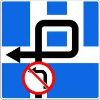

«Harakatlanish chizmasi».

Chorrahada ayrim yo‘nalishlarda harakatlanish taqiqlangan bo‘lsa harakatlanish yo‘nalishi yoki murakkab chorrahalarda ruxsat etilgan harakatlanish yo‘nalishini bildiradi.

---

## 5.20.4

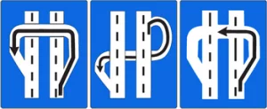

«Yo‘llarining bir sathda kesishmaydigan qismlarida burilish yoki qayrilib olish yo‘nalish ko‘rsatkichi».

Avtomobil yo‘llarning bir sathda kesishmaydigan qismlarida yer ostidan yoki yer ustidan transport vositalarining burilish va qayrilib olish yo‘nalishini ko‘rsatish uchun qo‘llaniladi.

---

## 5.20.5

«Xizmat ko‘rsatish maydoni».

---

## 5.21.1

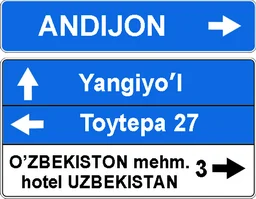

«Yo‘nalish ko‘rsatkichi».

---

## 5.21.2

«Yo‘nalishlar ko‘rsatkichi».

Ko‘rsatilgan manzillarga harakatlanish yo‘nalishlarini bildiradi. Belgilarda manzillargacha bo‘lgan masofa (km) ko‘rsatilishi, avtomagistrallar, aeroportlar va boshqa ramziy belgilar tasvirlangan bo‘lishi mumkin.

---

## 5.22

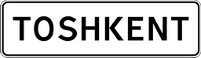

«Aholi punktining boshlanishi».

Ushbu Qoidalarning aholi punktlarida harakatlanish tartibini belgilovchi talablariga amal qilinadigan joylarning nomi hamda uning boshlanishini bildiradi.

---

## 5.23

«Aholi punktining oxiri».

Ushbu Qoidalarning aholi punktlarida harakatlanish tartib-talablari bekor qilingan joyni bildiradi.

---

## 5.24

«Aholi punktining boshlanishi».

Ushbu Qoidalarning aholi punktlarida harakatlanish tartibini belgilovchi talablariga amal qilinmaydigan joylarning nomi hamda uning boshlanishini bildiradi.

---

## 5.25

«Aholi punktining oxiri».

5.24 yo‘l belgisi bilan ko‘rsatilgan aholi punktining oxirini bildiradi.

---

## 5.26

«Manzil nomi».

Aholi punktlaridan boshqa manzillarning nomini bildiradi (daryo, ko‘l, dovon, xushmanzara joy va boshqalar).

---

## 5.27

«Masofalar ko‘rsatkichi».

Yo‘nalish bo‘yicha joylashgan aholi punktlarigacha bo‘lgan masofani bildiradi (km).

---

## 5.28

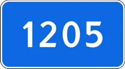

«Kilometr belgisi».

Yo‘lning boshi yoki oxirigacha bo‘lgan masofani bildiradi (km).

---

## 5.29.1

«Yo‘l raqami».

Yo‘lga berilgan raqam

---

## 5.29.2

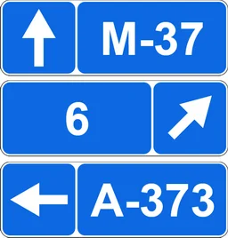

«Yo‘l raqami».

Yo‘lning raqami va yo‘nalishini bildiradi.

---

## 5.30.1 – 5.30.3

«Yuk avtomobillari uchun harakatlanish yo‘nalishi».

Chorrahada yuk avtomobillari, traktorlar va o‘ziyurar moslamalarga biror yo‘nalishda harakatlanish taqiqlangan bo‘lsa, bunday transport vositalariga tavsiya etilgan harakatlanish yo‘nalishlari ko‘rsatadi.

---

## 5.31

«Aylanib o‘tish tasviri».

Harakatlanish uchun vaqtincha yopib qo‘yilgan yo‘l qismini chetlab o‘tish chizmasi.

---

## 5.32.1 – 5.32.3

«Chetlab o‘tish yo‘nalishi».

Harakatlanish vaqtincha yopib qo‘yilgan yo‘l qismini chetlab o‘tish yo‘nalishini bildiradi.

---

## 5.33

«To‘xtash chizig‘i».

Svetoforning (tartibga soluvchining) taqiqlovchi ishorasida transport vositalari to‘xtaydigan yo‘nalishini bildiradi.

---

## 5.34.1 – 5.34.2

«Boshqa qatnov qismiga qayta tizilishning boshlang‘ich ko‘rsatkichi».

Ajratuvchi bo‘lagi bo‘lgan yo‘lning harakatlanish uchun yopiq hududini aylanib o‘tish yoki o‘ng tomondagi qatnov qismiga qaytish uchun harakatlanish yo‘nalishini bildiradi.

---

## 5.35

«Reversiv harakatlanish».

Bir yoki bir necha tasmalarda harakatlanish yo‘nalishi qarama-qarshi tomonga o‘zgarishi mumkin bo‘lgan yo‘l qismining boshlanishini bildiradi.

---

## 5.36

«Reversiv harakatlanishning oxiri».

---

## 5.37

«Reversiv harakatlanish yo‘liga chiqish».

---

## 5.38

«Turar joy dahasi».

Yo‘l harakati qoidalarining turar joy dahalarida harakatlanish tartibi o‘rnatilgan yo‘l.

---

## 5.39

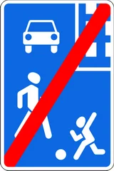

«Turar joy dahasining oxiri».

---

## 5.40

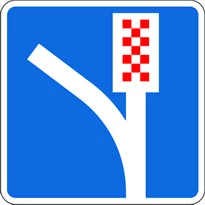

«Falokatli holatlar uchun kirish yo‘li».

Yo‘l harakati ushbu Qoidalaridagi 128-bandda ko‘rsatilgan holatlarda foydalaniladigan yo‘l.

---

## 5.41

«Foto va video qayd etish».

Yo‘llarda avtomobil haydovchilari Qoidalar talabiga rioya etishi elektron qurilmalar yordamida nazorat qilinayotganligini bildiruvchi yo‘l belgisi. Ushbu yo‘l belgisi Qoidalar talabiga rioya etilishi statsionar elektron qurilmalar orqali nazoratga olingan joylarga o‘rnatiladi.

---

## 5.42

«Qizil chiroqda o‘ngga harakatlanish».

Transport svetofori qizil chirog‘ining o‘ng yoniga 5.42 yo‘l belgisi o‘rnatilgan bo‘lsa, transport vositalarining haydovchilari svetoforning taqiqlovchi ishorasi yonib turganda, barcha xavfsizlik choralarini ko‘rgan holda o‘ngga burilishlari mumkin. Bunda ular harakat yo‘nalishi bo‘yicha va burilayotgan ko‘chani kesib o‘tayotgan piyodalarga hamda boshqa transport vositalariga yo‘l berishlari shart.

---

## 5.43

«Radar».

Yo‘llarda avtomobil haydovchilari belgilangan tezlikka rioya etishi radarlar yordamida nazorat qilinayotganligini bildiruvchi yo‘l belgisi.

Ushbu yo‘l belgisi belgilangan harakatlanish tezligi statsionar maxsus texnika vositalari yordamida nazoratga olingan joylarga o‘rnatiladi.

Shuningdek, viloyat, tuman, shaharlar boshlanadigan joylardagi ko‘cha va yo‘llarda harakatlanish tezligi mobil radarlar yordamida nazorat qilinayotganligi to‘g‘risida haydovchilarni ogohlantirish maqsadida o‘rnatilishi mumkin.

---

## 5.44

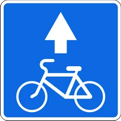

«Velosipedchilar uchun tasma».

---

## 5.45

«Velosipedchilar uchun tasmaning oxiri».

---

## 5.46

«Maktab».

Maktab yoki maktabgacha ta’lim tashkilotlari oldida o‘rnatiladi.

---

## 5.47

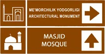

«Turizm obyektlari yo‘nalish ko‘rsatgichi».

Turizm obyektlari joylashgan manzillarga harakatlanish yo‘nalishlarini bildiradi. Belgilarda manzillargacha bo‘lgan masofa (km) ko‘rsatilishi, temir yo‘l vokzallari, aeroportlar va boshqa turizm obyektlari ramziy belgilari tasvirlangan bo‘lishi mumkin.

---

## 5.47.1

«Turizm obyektlari».

---

## 5.47.2

«Turizm axborot markazi».

---

## 5.48

«Baland piyodalar o‘tish joyi».

5.16.1-5.16.2 yo‘l belgilari bilan birga qo‘llaniladi.

---

