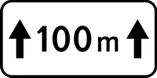
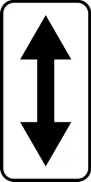
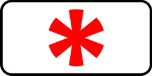
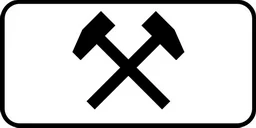
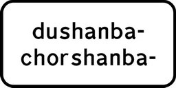
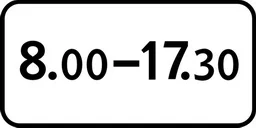
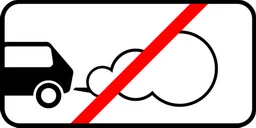
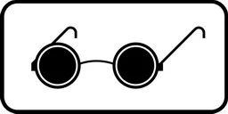
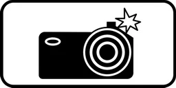
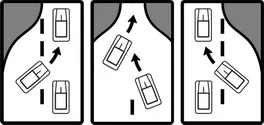

# Qo'shimcha axborot belgilari

Всего знаков: 36

## 7.1.1

«Obyektgacha bo‘lgan masofa».

Belgidan yo‘lning xavfli joyi, yo‘l harakatiga tegishli cheklovlar kiritiladigan joyi yoki harakat yo‘nalishi bo‘yicha oldindagi muayyan joygacha bo‘lgan masofani ko‘rsatadi.

---

## 7.1.2

«Obyektgacha bo‘lgan masofa».

Aholi punktlaridan tashqarida chorraha oldiga 2.5. yo‘l belgisi o‘rnatilgan bo‘lsa, 2.4. yo‘l belgisi bilan o‘rnatilib, chorrahagacha bo‘lgan masofani ko‘rsatadi.

---

## 7.1.3 – 7.1.4

«Obyektgacha bo‘lgan masofa».

Yo‘ldan chetda joylashgan manzilgacha bo‘lgan masofani bildiradi.

---

## 7.2.1

«Ta’sir oralig‘i».

Ogohlantiruvchi belgilar bilan belgilangan xavfli joyning uzunligini yoki taqiqlovchi va axborot-ko‘rsatkich belgilarining ta’sir oralig‘ini ko‘rsatadi.

---

## 7.2.2

«Ta’sir oralig‘i».

3.27 — 3.30 taqiqlovchi belgilarining ta’siri saqlangan oraliqni ko‘rsatadi.

---

## 7.2.3

«Ta’sir oralig‘i».

3.27 — 3.30 taqiqlovchi belgilarining ta’sir oralig‘i oxirini ko‘rsatadi.

---

## 7.2.4

«Ta’sir oralig‘i».

Haydovchilarga ularning 3.27 — 3.30 yo‘l belgilari ta’sir doirasida ekanliklari haqida axborot beradi.

---

## 7.2.5 – 7.2.6

«Ta’sir oralig‘i».

Maydon, binolar oldi va shunga o‘xshash joylar chetida to‘xtash va to‘xtab turish taqiqlanganda 3.27 — 3.30 belgilarining ta’sir oralig‘i va yo‘nalishini ko‘rsatadi.

---

## 7.3.1 – 7.3.3

«Ta’sir yo‘nalishlari».

Chorraha oldida o‘rnatilgan belgilarning ta’sir yo‘nalishini yoki bevosita yo‘l yaqinida joylashgan manzillarga harakatlanish yo‘nalishini ko‘rsatadi.

---

## 7.4.1 – 7.4.10

«Transport vositasining turi».

Belgining ta’siri joriy etilgan transport vositalari turini ko‘rsatadi.

7.4.1 belgi bilan o‘rnatilgan yo‘l belgisining ta’siri yuk tashuvchi, shu jumladan, tirkamali, to‘liq vazni 3,5 tonnadan ortiq bo‘lgan transport vositalariga, 7.4.3 belgi bilan o‘rnatilgan yo‘l belgisining ta’siri yengil avtomobillarga, 7.4.9 elektromobillarga, 7.4.10 yo‘nalishsiz taksilarga, shuningdek, to‘liq vazni 3,5 tonnagacha bo‘lgan yuk tashuvchi transport vositalariga tatbiq etiladi.

---

## 7.5.1

«Shanba, yakshanba va bayram kunlari».

---

## 7.5.2

«Ish kunlari».

---

## 7.5.3

«Hafta kunlari».

Belgiga haftaning qaysi kunlari amal qilinishi ko‘rsatilgan.

---

## 7.5.4

«Amal qilish vaqti».

Belgiga kunning qaysi vaqtida amal qilishni ko‘rsatadi.

---

## 7.5.5 – 7.5.7

«Amal qilish vaqti».

Belgiga haftaning qaysi kuni va qaysi soatlarida amal qilishni ko‘rsatadi.

---

## 7.6.1 – 7.6.9

«Transport vositasini to‘xtab turish joyiga qo‘yish usuli».

7.6.1 barcha turdagi transport vositalarini to‘xtab turishi uchun yo‘lning qatnov qismida, trotuar yoniga qo‘yish usulini, 7.6.2 — 7.6.9 trotuar yonidagi to‘xtab turish joyiga yengil avtomobillar va mototsikllarni qo‘yish usulini bildiradi.

---

## 7.7

«Dvigatelni ishlatmasdan to‘xtab turish joyi».

5.15 belgisi bilan belgilangan to‘xtab turish joyida transport vositalarining dvigatelini ishlatmasdan to‘xtab turishiga ruxsat etilganligini ko‘rsatadi.

---

## 7.8

«Pulli xizmat ko‘rsatish joyi».

To‘lov asosida xizmat ko‘rsatilishini bildiradi.

---

## 7.9

«To‘xtab turish muddati cheklangan».

5.15 belgisi o‘rnatilgan to‘xtab turish joyida transport vositalari to‘xtab turishining eng ko‘p muddatini ko‘rsatadi.

---

## 7.10

«Avtomobillarni ko‘rikdan o‘tkazish joyi».

5.15 yoki 6.11 belgisi bilan ko‘rsatilgan maydonlarda estakada yoki ko‘zdan kechirish chuqurchalari borligini bildiradi.

---

## 7.11

«Ruxsat etilgan to‘la vazni cheklangan».

Belgining ta’siri ruxsat etilgan to‘la vazni qo‘shimcha-axborot yo‘l belgisida ko‘rsatilgan miqdordan ortiq bo‘lgan transport vositalariga taalluqli ekanligini ko‘rsatadi.

---

## 7.12

«Xavfli yo‘l yoqasi».

Yo‘l ishlari bajarilayotgani sababli yo‘l yoqasiga chiqish xavfli ekanligi haqida ogohlantiradi. 1.23 belgisi bilan qo‘llaniladi.

---

## 7.13

«Asosiy yo‘lning yo‘nalishi».

Chorrahada asosiy yo‘lning yo‘nalishini ko‘rsatadi.

---

## 7.14

«Harakatlanish tasmasi».

Belgi yoki svetofor ta’siridagi harakatlanish bo‘lagini ko‘rsatadi.

---

## 7.15

«Ko‘zi ojiz piyodalar».

1.20, 5.16.1, 5.16.2 belgilari hamda svetofor bilan birga qo‘llaniladi, piyodalar o‘tish joyidan ko‘zi ojiz piyodalar foydalanishi mumkinligi haqida ogohlantiradi.

---

## 7.16

«Nam qoplama».

Belgi qatnov qismining qoplamasi nam bo‘lgan vaqtda ta’sir etishini ko‘rsatadi.

---

## 7.17

«Nogironlar».

5.15 belgisi bilan qo‘llaniladi. To‘xtab turish joyi (yoki uning bir qismi) ushbu Qoidalarning 176-bandiga muvofiq “Nogiron” taniqlik belgisi o‘rnatilgan transport vositalari uchun ajratilganligini ko‘rsatadi.

---

## 7.18

«Nogironlar mustasno».

Belgilarning ta’siri ushbu Qoidalarning 175-bandiga muvofiq “Nogiron” taniqlik belgisi o‘rnatilgan transport vositalariga joriy etilmaydi.

---

## 7.19

«Foto va video qayd etish».

Yo‘l harakati qatnashchilarining harakatlari maxsus avtomatlashtirilgan foto va video qayd etish texnika vositalari orqali qayd etilayotganligini bildiradi. Ogohlantiruvchi, imtiyoz, taqiqlovchi, buyuruvchi va axborot ishora belgilari bilan birgalikda qo‘llaniladi.

---

## 7.20

«Xavfli yuk toifasi».

Xavfli yuk toifasining (toifalarining) raqamini ko‘rsatadi.

---

## 7.21

«Evakuator ishlamoqda».

3.27 — 3.30 yo‘l belgilari ta’sir oralig‘ida to‘xtagan transport vositalari majburiy evakuatsiya qilinishini ko‘rsatadi.

---

## 7.22.1 – 7.22.3

«To‘siq».

Haydovchilarga to‘siqning uzoqdan ko‘rinishini ta’minlash maqsadida o‘rnatiladi. 4.2.1 — 4.2.3 yo‘l belgilari bilan birgalikda o‘rnatiladi.

---

## 7.23

«Navbat bilan o‘tish».

---

## 7.24

«Transport vositasining davlat raqami».

---

## 7.25

«Faqat xizmat avtomobillari».

---

## 7.26

«Sun’iy notekislik».

---

