# Xizmat ko'rsatish belgilari

Всего знаков: 30

## 6.1

«Tibbiy yordam ko‘rsatish joyi».

---

## 6.2

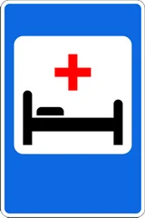

«Shifoxona».

---

## 6.3.1

«Avtomobillarga yonilg‘i quyish shoxobchasi».

---

## 6.3.2

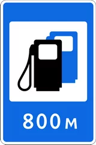

«Avtomobillarga ko‘p tarmoqli yonilg‘i quyish shoxobchasi».

---

## 6.3.3

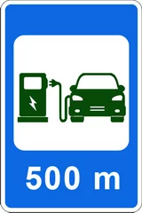

«Elektromobillarni quvvatlash shaxobchasi».

---

## 6.4

«Avtomobillarga texnik xizmat ko‘rsatish joyi».

---

## 6.5

«Avtomobillarni yuvish joyi».

---

## 6.6

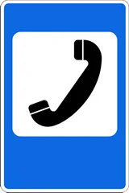

«Telefon».

---

## 6.7

«Oshxona».

---

## 6.8

«Ichimlik suvi».

---

## 6.9

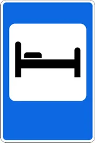

«Mehmonxona yoki motel».

---

## 6.10

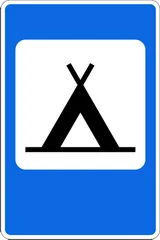

«Kemping».

---

## 6.11

«Dam olish joyi».

---

## 6.12

«YPX maskani».

---

## 6.13

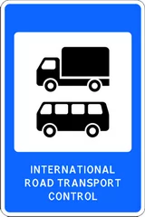

«Avtotashuvchilarning nazorat punkti».

---

## 6.14

«Hojatxona».

---

## 6.15

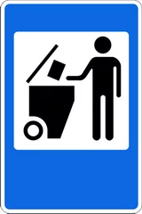

«Chiqindi yig‘ish joyi».

---

## 6.16

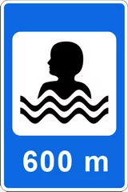

«Cho‘milish havzasi».

---

## 6.17

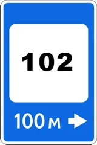

«Ichki ishlar bo‘limi».

---

## 6.18

«Radio aloqasi».

---

## 6.19

«Jome’ masjidi».

---

## 6.20

«Cherkov».

---

## 6.21

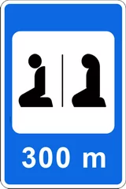

«Ibodatxona».

---

## 6.22

«Temir yo‘l vokzali».

---

## 6.23

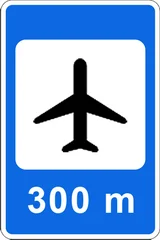

«Aeroport».

---

## 6.24

«Bozor».

---

## 6.25

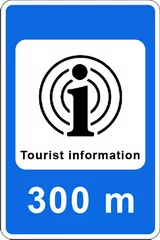

«Turistik axborot markazi».

---

## 6.26

«Qo‘riqxona».

---

## 6.27

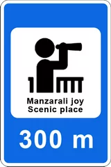

«Manzarali joy».

---

## 6.28

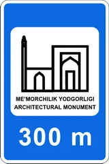

«Me’morchilik yodgorligi».

---

