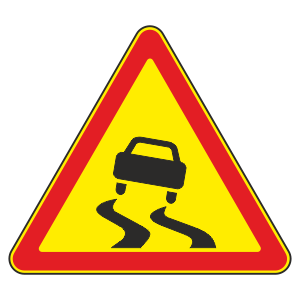
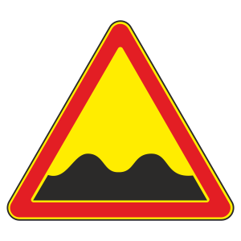
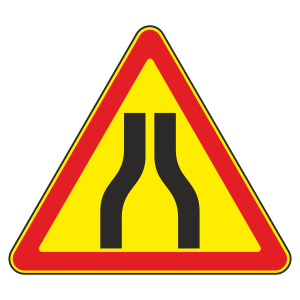
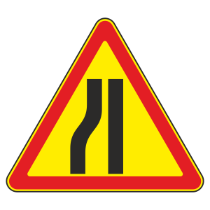
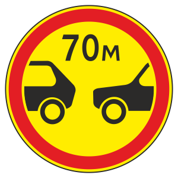
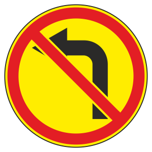
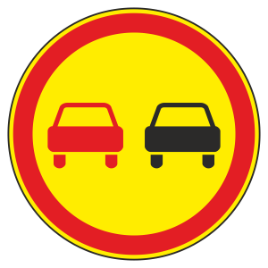

# Vaqtinchalik belgilar

Всего знаков: 25

## 1.8

«Svetofor bilan tartibga solish»

---

## 1.15

«Sirpanchiq yo‘l»

---

## 1.16

«Notekis yo‘l»

---

## 1.17

«Tosh otilishi xavfi»

---

## 1.18.1

«Yo‘lning torayishi»

---

## 1.18.2

«Yo‘lning torayishi»

---

## 1.18.3

«Yo‘lning torayishi»

---

## 1.23

«Ta’mirlash ishlari»

---

## 1.30

«Boshqa xavf-xatarlar»

---

## 2.6

«Ro‘para harakatlanishning ustunligi»

---

## 2.7

«Ro‘paradagi harakatlanishga nisbatan imtiyoz»

---

## 3.1

«Kirish taqiqlangan»

---

## 3.2

«Harakatlanish taqiqlangan»

---

## 3.11

«Vazn cheklangan»

---

## 3.12

«O‘qqa tushadigan og‘irlik cheklangan»

---

## 3.13

«Cheklangan balandlik»

---

## 3.14

«Cheklangan kenglik»

---

## 3.15

«Cheklangan uzunlik»

---

## 3.16

«Eng kam oraliq»

---

## 3.18.1

«O‘ngga burilish taqiqlangan»

---

## 3.18.2

«Chapga burilish taqiqlanadi»

---

## 3.19

«Qayrilish taqiqlangan»

---

## 3.20

«Quvib o‘tish taqiqlangan»

---

## 3.22

«Yuk avtomobillarida quvib o‘tish taqiqlangan»

---

## 3.24

«Yuqori tezlik cheklangan»

---

