# Предупреждающие знаки

Всего знаков: 44

## 1.1

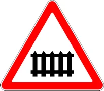

«Железнодорожный переезд со шлагбаумом».

---

## 1.2

«Железнодорожный переезд без шлагбаума».

---

## 1.3.1

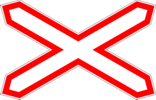

«Однопутная железная дорога».

“Однопутная железная дорога”. Обозначение не оборудованного шлагбаумом переезда через железную дорогу с одним путем

---

## 1.3.2

«Многопутная железная дорога».

“Многопутная железная дорога”. Обозначение не оборудованного шлагбаумом переезда через железную дорогу с двумя и более путями

---

## 1.4.1 – 1.4.6

«Приближение к железнодорожному переезду».

Даёт дополнительное предупреждение о приближении к железнодорожному переезду вне населённых пунктов.

---

## 1.5

«Пересечение с трамвайной линией».

---

## 1.6

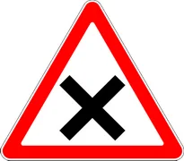

«Пересечение равнозначных дорог».

---

## 1.7

«Пересечение с круговым движением».

---

## 1.8

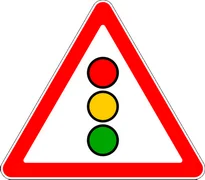

«Светофорное регулирование».

Означает, что перекресток, пешеходный переход или участок дороги, движение на котором регулируется светофором.

---

## 1.9

«Разводной мост».

Разводной мост или паромная переправа.

---

## 1.10

«Выезд на набережную».

Означает выезд на набережную или берег.

---

## 1.11.1

«Опасный поворот направо».

“Опасный поворот”. Закругление дороги малого радиуса или с ограниченной видимостью: направо

---

## 1.11.2

«Опасный поворот налево».

“Опасный поворот”. Закругление дороги малого радиуса или с ограниченной видимостью: налево

---

## 1.12.1

«Опасные повороты».

“Опасные повороты”. Участок дороги с опасными поворотами: с первым поворотом направо

---

## 1.12.2

«Опасные повороты».

“Опасные повороты”. Участок дороги с опасными поворотами: с первым поворотом налево

---

## 1.13

«Крутой спуск».

---

## 1.14

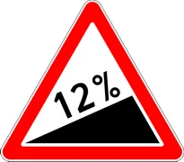

«Крутой подъем».

---

## 1.15

«Скользкая дорога».

Участок дороги с повышенной скользкостью проезжей части.

---

## 1.16

«Неровная дорога».

Означает участок дороги, имеющий неровности на проезжей части (волнистость, выбоины, неплавные сопряжения с мостами и т. п.).

---

## 1.17

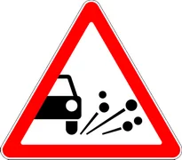

«Выброс гравия».

Участок дороги, на котором возможен выброс гравия щебня и тому подобного из-под колес транспортных средств.

---

## 1.18.1

«Сужение дороги».

Означает сужения с обеих сторон

---

## 1.18.2

«Сужение дороги».

Означает сужения с справа

---

## 1.18.3

«Сужение дороги».

Означает сужения с слева

---

## 1.19

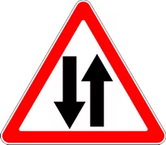

«Двустороннее движение».

Означает начало участка дороги (проезжей части) с встречным движением.

---

## 1.20

«Пешеходный переход».

Пешеходный переход, обозначенный знаками 5.16.1, 5.16.2, 5.48 и (или) 1.14.1 — 1.14.4, 1.29.1 — 1.29.3 означают пешеходный переход.

---

## 1.21

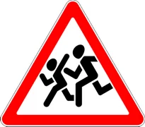

«Дети».

Означает участок дороги вблизи детского учреждения (школы, места отдыха детей и т. п.), на проезжей части которого возможно появление детей.

---

## 1.22

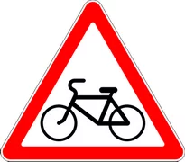

«Пересечение с велосипедной дорожкой».

---

## 1.23

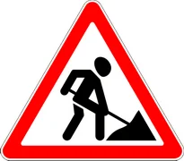

«Дорожные работы».

---

## 1.24

«Перегон скота».

---

## 1.25.1

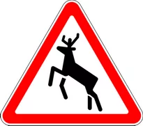

«Дикие животные».

---

## 1.25.2

«Низколетящие птицы».

---

## 1.25.3

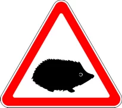

«Грызуны и пресмыкающиеся животные».

---

## 1.26

«Падение камней».

Означает участок дороги, на котором возможны обвалы, оползни, падение камней.

---

## 1.27

«Боковой ветер».

---

## 1.28

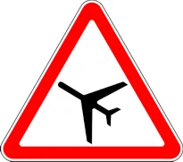

«Низколетящие самолеты».

---

## 1.29

«Тоннель».

Означает тоннель, в котором отсутствует искусственное освещение, или тоннель, видимость въездного портала которого ограничена.

---

## 1.30

«Прочие опасности».

Означает участок дороги, на котором имеются опасности, не предусмотренные другими предупреждающими знаками.

---

## 1.31

«Искусственная неровность дороги».

Предупреждает о приближении к участку дороги с искусственной неровностью. Применяется для принудительного снижения скорости движения транспортного средства.

---

## 1.31.3

«Направление поворота».

Означает направление движения на Т-образном перекрестке или разветвлении дорог и направление объезда ремонтируемого участка дороги.

---

## 1.31.1 – 1.31.2

«Направление поворота».

Указывает направление движения на закруглении дороги малого радиуса с ограниченной видимостью и направление объезда ремонтируемого участка дороги.

---

## 1.32

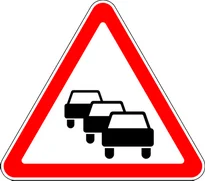

«Затор».

Знак применяется в качестве временного или в знаках с изменяемым изображением перед перекрестком, откуда возможен объезд участка дороги, на котором образовался затор.

---

## 1.33

«Территория пересечения проезжих частей».

Означает приближение к перекрестку, который обозначен горизонтальной разметкой 1.30. Означает, что водителю, который проехал стоп-линию или дорожный знак 5.33 запрещается выезжать на пересечение проезжих частей, если он совершит вынужденную остановку из-за впереди образовавщегося затора и этим создаст помеху движению транспортных средств в поперечном направлении.

---

## 1.34

«Внимание, управляемое заградительное устройство».

Предупреждает водителей о наличии заградительного устройства и устанавливается не доезжая до него.

---

## 1.35

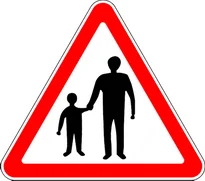

«Территория, где пешеходы могут двигаться по обочине».

---

