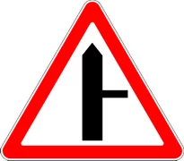
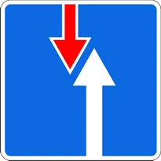

# Знаки приоритета

Всего знаков: 9

## 2.1

«Главная дорога».

Предоставляет право на первоочередное движение через нерегулируемые перекрестки.

Знак устанавливается в начале главной дороги и непосредственно перед перекрестками.

---

## 2.2

«Конец главной дороги».

---

## 2.3.1

«Пересечение с второстепенной дорогой».

устанавливаются в населенных пунктах на расстоянии 50—100 м, а вне населенных пунктов—на расстоянии 150—300 м до пересечения.

---

## 2.3.2

«Примыкание второстепенной дороги примыкание справа».

устанавливаются в населенных пунктах на расстоянии 50—100 м, а вне населенных пунктов—на расстоянии 150—300 м до пересечения.

---

## 2.3.3

«Примыкание второстепенной дороги примыкание слева».

устанавливаются в населенных пунктах на расстоянии 50—100 м, а вне населенных пунктов—на расстоянии 150—300 м до пересечения.

---

## 2.4

«Уступите дорогу».

Водитель должен уступить дорогу транспортным средствам, движущимся по пересекаемой дороге, а при наличии знака дополнительной информации 7.13 — по главной.

---

## 2.5

«Движение без остановки запрещено».

Запрещается движение без остановки перед стоп-линией, а если ее нет — перед краем пересекаемой проезжей части. Водитель должен уступить дорогу транспортным средствам, движущимся по пересекаемой, а при наличии знака дополнительной информации 7.13 — по главной дороге.

Этот знак может быть установлен перед железнодорожным переездом или карантинным постом. В этих случаях водитель должен остановиться перед стоп-линией, а при ее отсутствии — перед знаком.

---

## 2.6

«Преимущество встречного движения».

Запрещается въезд на узкий участок дороги, если это может затруднить встречное движение. Водитель должен уступить дорогу встречным транспортным средствам, находящимся на узком участке или противоположном подъезде к нему.

---

## 2.7

«Преимущество перед встречным движением».

Узкий участок дороги, при движении по которому водитель пользуется приоритетом по отношению к встречным транспортным средствам.

---

