# Запрещающие знаки

Всего знаков: 36

## 3.1

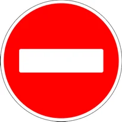

«Въезд запрещен».

Запрещается въезд всех транспортных средств в данном направлении.

---

## 3.2

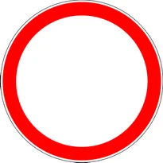

«Движение запрещено».

Запрещается движение всех транспортных средств.

---

## 3.3

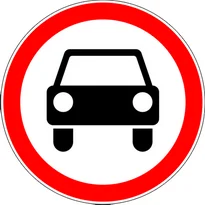

«Движение механических транспортных средств запрещено».

---

## 3.4

«Движение грузовых автомобилей запрещено».

Запрещается движение грузовых автомобилей и составов транспортных средств с разрешенной максимальной массой более 3,5 т (если на знаке не указана масса) или с разрешенной максимальной массой более указанной на знаке, а также тракторов и самоходных машин.

Знак 3.4 не запрещает движение грузовых автомобилей с наклонной белой полосой на бортах или предназначенных для перевозки людей.

---

## 3.5

«Движение мотоциклов запрещено».

---

## 3.6

«Движение тракторов запрещено».

Запрещается движение тракторов и самоходных машин.

---

## 3.7

«Движение транспортных средств с прицепом запрещено».

Запрещается движение грузовых автомобилей и тракторов с прицепами любого типа, а также всякая буксировка механических транспортных средств.

---

## 3.8

«Движение гужевых повозок запрещено».

Запрещается движение гужевых повозок (саней), верховых и вьючных животных, а также прогон скота.

---

## 3.9

«Движение на велосипедах запрещено».

Запрещается движение велосипедов и мопедов.

---

## 3.10

«Движение пешеходов запрещено».

---

## 3.11

«Ограничение массы».

Запрещается движение транспортных средств, в том числе составов транспортных средств, общая фактическая масса которых больше указанной на знаке.

---

## 3.12

«Ограничение нагрузки на ось».

Запрещается движение транспортных средств, у которых фактическая нагрузка на какую-либо ось больше указанной на знаке.

---

## 3.13

«Ограничение высоты».

Запрещается движение транспортных средств, габаритная высота которых (с грузом или без груза) больше указанной на знаке.

---

## 3.14

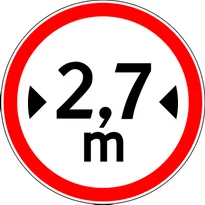

«Ограничение ширины».

Запрещается движение транспортных средств, габаритная ширина которых (с грузом или без груза) больше указанной на знаке.

---

## 3.15

«Ограничение длины».

Запрещается движение транспортных средств (составов транспортных средств), габаритная длина которых (с грузом или без груза) больше указанной на знаке.

---

## 3.16

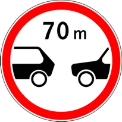

«Ограничение минимальной дистанции».

Запрещается движение транспортных средств с дистанцией между ними меньше указанной на знаке.

---

## 3.17.1

«Таможня».

Запрещается проезд без остановки у таможни (контрольного пункта).

---

## 3.17.2

«Опасность».

Запрещается дальнейшее движение всех без исключения транспортных средств в связи с дорожно-транспортным происшествием, аварией или другой опасностью.

---

## 3.17.3

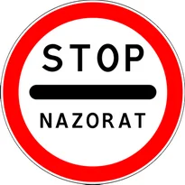

«Контроль».

Устанавливается на временных или постоянных контрольно-пропускных пунктах, где обязательна проверка транспортных средств.

Этот дорожный знак может быть установлен вместе с дорожным знаком 2.5.

---

## 3.18.1

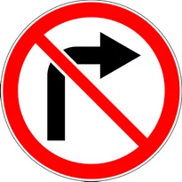

«Поворот направо запрещен».

---

## 3.18.2

«Поворот налево запрещен».

---

## 3.19

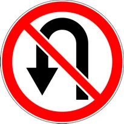

«Разворот запрещен».

---

## 3.20

«Обгон запрещен».

Запрещается обгон всех транспортных средств, кроме одиночных, движущихся со скоростью менее 40 км/ч.

---

## 3.21

«К��нец зоны запрещения обгона».

---

## 3.22

«Обгон грузовым автомобилям запрещен».

Запрещается грузовым автомобилям с разрешенной максимальной массой более 3,5 т обгон всех транспортных средств, кроме одиночных, движущихся со скоростью менее 40 км/ч. Тракторам запрещается обгон всех транспортных средств, кроме гужевых повозок и велосипедов.

---

## 3.23

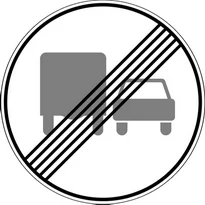

«Конец зоны запрещения обгона грузовым автомобилям».

---

## 3.24

«Ограничение максимальной скорости».

Запрещается движение со скоростью (км/ч), превышающей указанную на знаке.

---

## 3.25

«Конец зоны ограничения максимальной скорости».

---

## 3.26

«Подача звукового сигнала запрещена».

Запрещается пользоваться звуковыми сигналами, кроме тех случаев, когда сигнал подается для предотвращения дорожно-транспортного происшествия.

---

## 3.27

«Остановка запрещена».

Запрещается остановка и стоянка транспортных средств, за исключением транспортных средств, прикрепленных к сотруднику, выполняющему служебные обязанности, и имеющих соответствующие цветографические схемы, нанесенные на наружной поверхности, оборудованных проблесковыми маячками красного или синего или синего и красного цветов.

---

## 3.28

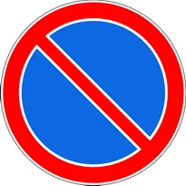

«Стоянка запрещена».

Запрещается стоянка транспортных средств, за исключением транспортных средств, прикрепленных к сотруднику, выполняющему служебные обязанности, и имеющих соответствующие цветографические схемы, нанесенные на наружной поверхности, оборудованных проблесковыми маячками красного или синего или синего и красного цветов.

---

## 3.29

«Стоянка запрещена по нечетным числам месяца».

За исключением транспортных средств, прикрепленных к сотруднику, выполняющему служебные обязанности, и имеющих соответствующие цветографические схемы, нанесенные на наружной поверхности, оборудованных проблесковыми маячками красного или синего или синего и красного цветов.

---

## 3.30

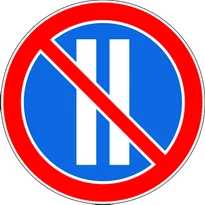

«Стоянка запрещена по четным числам месяца».

За исключением транспортных средств, прикрепленных к сотруднику, выполняющему служебные обязанности, и имеющих соответствующие цветографические схемы, нанесенные на наружной поверхности, оборудованных проблесковыми маячками красного или синего или синего и красного цветов. При одновременном применении знаков 3.29 и 3.30 на противоположных сторонах проезжей части разрешается стоянка на обеих сторонах проезжей части с 19 до 21 часа (время перестановки).

---

## 3.31

«Конец зоны всех ограничений».

Обозначение конца зоны действия одновременно несколькими знаками из следующих: 3.16, 3.20, 3.22, 3.24, 3.26-3.30.

---

## 3.32

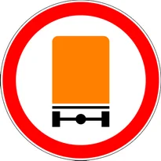

«Движение транспортных средств с опасными грузами запрещено».

---

## 3.33

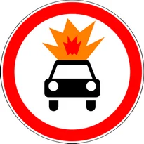

«Движение транспортных средств со взрывчатыми и легковоспламеняющимися грузами запрещено».

---

