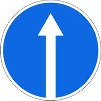
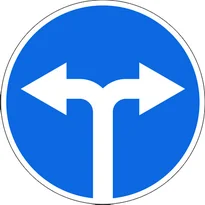
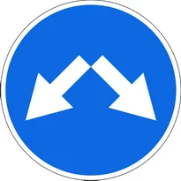
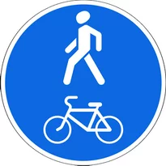
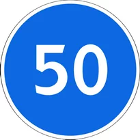
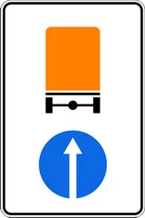
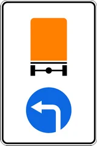
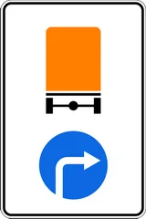

# Предписывающие знаки

Всего знаков: 24

## 4.1.1

«Движение прямо».

---

## 4.1.2

«Движение направо».

---

## 4.1.3

«Движение налево».

---

## 4.1.4

«Движение прямо или направо».

---

## 4.1.5

«Движение прямо или налево».

---

## 4.1.6

«Движение направо или налево».

---

## 4.2.1

«Объезд препятствия справа».

Объезд разрешается только со стороны, указанной стрелкой.

---

## 4.2.2

«Объезд препятствия слева».

Объезд разрешается только со стороны, указанной стрелкой.

---

## 4.2.3

«Объезд препятствия справа или слева».

Объезд разрешается с любой стороны.

---

## 4.3

«Круговое движение».

Разрешается движение в указанном стрелками направлении.

---

## 4.4

«Движение легковых автомобилей».

Разрешается движение легковых автомобилей, автобусов, мотоциклов и грузовых автомобилей, разрешенная максимальная масса которых не превышает 3,5 т.

Действие знака не распространяется на транспортные средства, которые обслуживают предприятия, находящиеся в обозначенной зоне, а также обслуживают граждан или принадлежат гражданам, проживающим или работающим в обозначенной зоне. В этих случаях транспортные средства должны въезжать в обозначенную зону и выезжать из нее на ближайшем к месту назначения перекрестке.

---

## 4.5

«Велосипедная дорожка».

Разрешается движение только на велосипедах и мопедах. При отсутствии тротуара или пешеходной дорожки по велосипедной дорожке могут двигаться также пешеходы.

---

## 4.6

«Пешеходная дорожка».

Разрешается движение только пешеходам.

---

## 4.6.1

«Пешеходный и велосипедный коридор с совмещенным движением».

---

## 4.6.2

«Конец пешеходного и велосипедного коридора с совмещенным движением».

---

## 4.6.3

«Пешеходный и велосипедный коридор с разделением движения».

Пешеходный и велосипедный коридор с разделением на пешеходный и велосипедный коридоры, выделенные конструктивно, обозначенные горизонтальной разметкой 1.1, 1.25 и 1.26 или иным способом.

---

## 4.6.4

«Конец пешеходного и велосипедного коридора с разделением движения».

---

## 4.6.5

«Пешеходный и велосипедный коридор с разделением движения».

Пешеходный и велосипедный коридор с разделением на пешеходный и велосипедный коридоры, выделенные конструктивно, обозначенные горизонтальной разметкой 1.1, 1.25 и 1.26 или иным способом.

---

## 4.6.6

«Конец пешеходного и велосипедного коридора с разделением движения».

---

## 4.7

«Ограничение минимальной скорости».

Разрешается движение только с указанной или большей скоростью (км/ч).

---

## 4.8

«Конец зоны ограничения минимальной скорости».

---

## 4.9.1

«Направление движения транспортных средств с опасными грузами».

Движение транспортных средств, оборудованных опознавательными знаками «Опасный груз», разрешается только прямо.

---

## 4.9.2

«Направление движения транспортных средств с опасными грузами».

Движение транспортных средств, оборудованных опознавательными знаками «Опасный груз», разрешается только налево.

---

## 4.9.3

«Направление движения транспортных средств с опасными грузами».

Движение транспортных средств, оборудованных опознавательными знаками «Опасный груз», разрешается только направо.

---

