# Информационные знаки

Всего знаков: 70

## 5.1

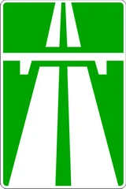

«Автомагистраль».

Дорога, на которой действуют требования Правил, устанавливающие порядок движения по автомагистралям.

---

## 5.2

«Конец автомагистрали».

---

## 5.3

«Дорога для автомобилей».

Дорога, предназначенная для движения только автомобилей и мотоциклов.

---

## 5.4

«Конец дороги для автомобилей».

---

## 5.5

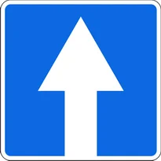

«Дорога с односторонним движением».

Дорога или проезжая часть, по которой движение транспортных средств по всей ширине осуществляется в одном направлении.

---

## 5.6

«Конец дороги с односторонним движением».

---

## 5.7.1 – 5.7.2

«Выезд на дорогу с односторонним движением».

Движение осуществляется в одном направлении по всей ширине проезжей части.

---

## 5.8.1

«Направления движения по полосам».

Число полос и разрешенные направления движения на каждой из них. Движение по другим направлениям запрещается.

---

## 5.8.2

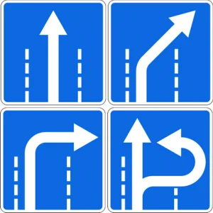

«Направления движения по полосе».

Разрешенные направления движения по полосе. Движение по другим направлениям запрещается.

---

## 5.8.3

«Начало полосы».

Начало дополнительной полосы на подъеме или полосы торможения.

Если на знаке, установленном перед дополнительной полосой, изображен знак 4.7 «Ограничение минимальной скорости», то водитель транспортного средства, который не может продолжать движение по основной полосе с указанной или большей скоростью, должен перестроиться на дополнительную полосу.

---

## 5.8.4

«Начало полосы».

Начало участка средней полосы для движения в данном направлении на трехполосной дороге.

---

## 5.8.5

«Конец полосы».

Конец дополнительной полосы на подъеме или полосы разгона.

---

## 5.8.6

«Конец полосы».

Конец участка средней полосы на трехполосной дороге, предназначенного для движения в данном направлении.

---

## 5.8.7
5.8.8

«Направление движения по полосам».

Если на знаке 5.8.7 изображен знак, запрещающий движение каким-либо транспортным средствам, то движение этих транспортных средств по соответствующей полосе запрещается.

Знаки 5.8.7 и 5.8.8 с соответствующим числом стрелок могут применяться на дорогах с четырьмя полосами и более.

С помощью знаков 5.8.7 и 5.8.8 со сменным изображением может быть организовано реверсивное движение.

---

## 5.9

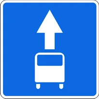

«Полоса для маршрутных транспортных средств».

Полоса, предназначенную для движения маршрутных транспортных средств, движущихся попутно общему потоку транспортных средств.

Действие знака распространяется на полосу, над которой он расположен. Действие знака, установленного справа у дороги, распространяется на правую полосу.

---

## 5.10.1

«Дорога с полосой для маршрутных транспортных средств».

Дорога, по которой движение маршрутных транспортных средств осуществляется по специально выделенной полосе навстречу общему потоку транспортных средств.

---

## 5.10.4

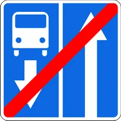

«Конец дороги с полосой для маршрутных транспортных средств».

---

## 5.10.2 – 5.10.3

«Полоса, выделенная для маршрутных транспортных средств».

Полоса, предназначенная только для маршрутных транспортных средств, движущихся попутно общему потоку транспортных средств.

---

## 5.11.1

«Место для разворота».

Поворот налево запрещается.

---

## 5.11.2

«Зона для разворота».

Протяженность зоны для разворота. Поворот налево запрещается.

---

## 5.12

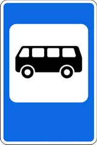

«Место остановки автобуса и (или) троллейбуса».

---

## 5.13

«Место остановки трамвая».

---

## 5.14

«Место стоянки легковых такси».

---

## 5.15

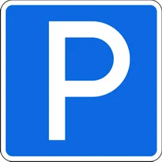

«Место стоянки».

---

## 5.15.1

«Платная стоянка».

---

## 5.15.2

«Надземная автомобильная стоянка».

---

## 5.15.3

«Подземная автомобильная стоянка».

---

## 5.15.4

«Автомобильная стоянка с электрической подзарядкой».

---

## 5.16.1 – 5.16.2

«Пешеходный переход».

Перед переходом устанавливаются дорожные разметки 1.14.1–1.14.2 или 1.29.1–1.29.3.

---

## 5.17.1 – 5.17.2

«Подземный пешеходный переход».

---

## 5.17.3 – 5.17.4

«Надземный пешеходный переход».

---

## 5.18

«Рекомендуемая скорость».

Скорость, с которой рекомендуется движение на данном участке дороги. Зона действия знака распространяется до ближайшего перекрестка, а при применении знака 5.18 совместно с предупреждающим знаком определяется протяженностью опасного участка. 5.48 означает, что дорожные знаки должны быть установлены на улицах и дорогах, где они установлены.

---

## 5.19.1 – 5.19.4

«Тупик».

Дорога, не имеющая сквозного проезда в указанном направлении.

---

## 5.20.1

«Предварительный указатель направлений».

---

## 5.20.2

«Предварительный указатель направления».

---

## 5.20.3

«Схема движения».

Маршрут движения при запрещении на перекрестке отдельных маневров или разрешенные направления движения на сложном перекрестке.

---

## 5.20.4

«Указатель направления поворота или разворота на участках, где дороги не пересекаются на одном уровне».

Применяется для указания направления надземного или подземного поворота или разворота на участках, где автомобильные дороги не пересекаются на одном уровне.

---

## 5.20.5

«Площадка для сервиса».

---

## 5.21.1

«Указатель направлений».

---

## 5.21.2

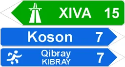

«Указатель направления».

Применяется для указания направления движений к пунктам маршрута. На знаках может быть указано расстояние до обозначенных на нем объектов (км), нанесены символы автомагистрали, аэропорта и иные пиктограммы.

---

## 5.22

«Начало населенного пункта».

Наименование и начало населенного пункта, в котором действуют требования Правил, устанавливающие порядок движения в населенных пунктах.

---

## 5.23

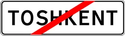

«Конец населенного пункта».

Место, с которого на данной дороге утрачивают силу требования Правил, устанавливающие порядок движения в населенных пунктах.

---

## 5.24

«Начало населенного пункта».

Наименование и начало населенного пункта, в котором на данной дороге не действуют требования Правил, устанавливающие порядок движения в населенных пунктах.

---

## 5.25

«Конец населенного пункта».

Конец населенного пункта, обозначенного знаком 5.24.

---

## 5.26

«Наименование объекта».

Наименование объекта иного, чем населенный пункт (река, озеро, перевал, достопримечательность и тому подобное).

---

## 5.27

«Указатель расстояний».

Расстояние до населенных пунктов (км), расположенных на маршруте.

---

## 5.28

«Километровый знак».

Расстояние до начала или конца дороги (км).

---

## 5.29.1

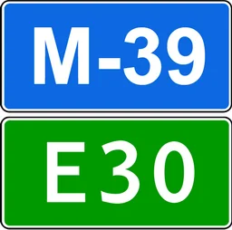

«Номер маршрута».

Номер, присвоенный дороге (маршруту).

---

## 5.29.2

«Номер маршрута».

Номер и направление дороги (маршрута).

---

## 5.30.1 – 5.30.3

«Направление движения для грузовых автомобилей».

На перекрёстке, где поворот запрещён, рекомендуемое направление движения для грузовых автомобилей, тракторов и самоходных машин.

---

## 5.31

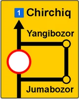

«Схема объезда».

Маршрут объезда участка дороги, временно закрытого для движения.

---

## 5.32.1 – 5.32.3

«Направление объезда».

Направление объезда участка дороги, временно закрытого для движения.

---

## 5.33

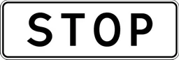

«Стоп-линия».

Место остановки транспортных средств при запрещающем сигнале светофора (регулировщика).

---

## 5.34.1 – 5.34.2

«Предварительный указатель перестроения на другую проезжую часть».

Направление перестроения на другую проезжую часть через разделительную полосу.

---

## 5.35

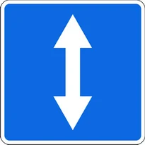

«Реверсивное движение».

Начало участка дороги, на котором на одной или нескольких полосах направление движения может изменяться на противоположное.

---

## 5.36

«Конец реверсивного движения».

---

## 5.37

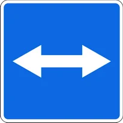

«Выезд на дорогу с реверсивным движением».

---

## 5.38

«Жилая зона».

Дорога, на которой действуют требования Правил дорожного движения, устанавливающие порядок движения в жилой зоне.

---

## 5.39

«Конец жилой зоны».

---

## 5.40

«Площадка для аварийной остановки».

Дорога, используемая в случаях, указанных в пункте 128 Правил.

---

## 5.41

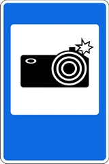

«Фото и видео фиксация».

Знак, означающий, что соблюдение требований Правил со стороны водителей автомобилей контролируется с помощью электронных устройств. Этот дорожный знак устанавливается в местах, где соблюдение Правил контролируется стационарными электронными устройствами.

---

## 5.42

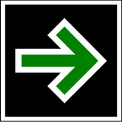

«Движение направо при красном сигнале».

Если с правой стороны красного сигнала транспортного светофора установлен дорожный знак 5.42, водители транспортных средств при включенном запрещающем сигнале светофора могут поворачивать направо, соблюдая все меры безопасности. При этом они обязаны уступить дорогу пешеходам, переходящим проезжую часть дороги в направлении движения и дороги, на которую транспортные средства поворачивают, а также другим транспортным средствам.

---

## 5.43

«Радар».

Дорожный знак, означающий, что на дороге контроль за соблюдением водителями автомобилей установленного скоростного режима производится при помощи радаров. Знак устанавливается на участках дорог, где скорость движения контролируется стационарными специальными техническими средствами .

Знак также может быть установлен на дорогах и улицах в начале областей, районов, городов в целях предупреждения водителей, что скорость движения контролируется мобильными радарами.

---

## 5.44

«Полоса для велосипедистов».

---

## 5.45

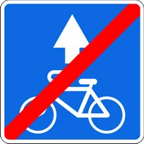

«Конец полосы для велосипедистов».

---

## 5.46

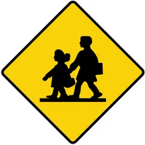

«Школа».

Устанавливается перед школами или дошкольными учреждениями.

---

## 5.47

«Указатель направления туристического объекта».

Направления движения к туристическим объектам. На знаках может быть указано расстояние до обозначенных на нем объектов (км), нанесены символы железнодорожных вокзалов, аэропортов и других туристических объектов.

---

## 5.47.1

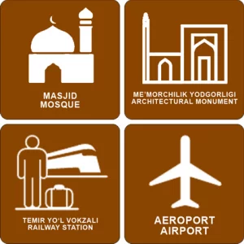

«Туристические объекты».

---

## 5.47.2

«Информационный центр туризма».

---

## 5.48

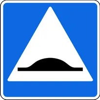

«Высокий пешеходный переход».

5.16.1 — 5.16.2 Используется вместе с дорожными знаками.

---

