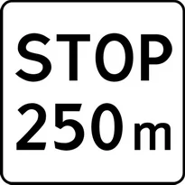
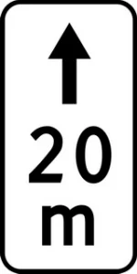
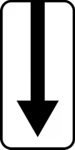
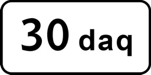
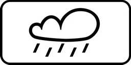
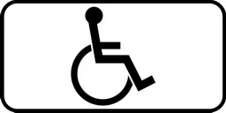
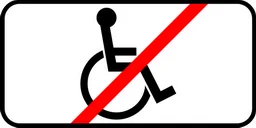
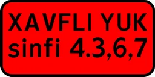
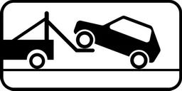
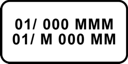

# Знаки дополнительной информации

Всего знаков: 36

## 7.1.1

«Расстояние до объекта».

Указывает расстояние от знака до начала опасного участка, места введения соответствующего ограничения или определенного объекта (места), находящегося впереди по ходу движения.

---

## 7.1.2

«Расстояние до объекта».

Вне населенного пункта указывает расстояние от знака 2.4. до перекрестка в случае, если непосредственно перед перекрестком установлен знак 2.5.

---

## 7.1.3 – 7.1.4

«Расстояние до объекта».

Означает расстояние до объекта, находящегося в стороне от дороги.

---

## 7.2.1

«Зона действия».

Указывает протяженность опасного участка дороги, обозначенного предупреждающими знаками или зону действия запрещающих и информационно-указательных знаков.

---

## 7.2.2

«Зона действия».

Указывает зону действия запрещающих знаков 3.27—3.30.

---

## 7.2.3

«Зона действия».

Указывает конец зоны действия запрещающих знаков 3.27—3.30.

---

## 7.2.4

«Зона действия».

Информирует водителей о нахождении их в зоне действия знаков 3.27—3.30.

---

## 7.2.5 – 7.2.6

«Зона действия».

Указывают направление и зону действия знаков 3.27—3.30 при запрещении остановки или стоянки вдоль одной стороны площади, фасада здания и т. п.

---

## 7.3.1 – 7.3.3

«Направление действия».

Указывают направления действия знаков, установленных перед перекрестком или направления движения к обозначенным объектам, находящимся непосредственно у дороги.

---

## 7.4.1 – 7.4.10

«Вид транспортного средства».

Указывают вид транспортного средства, на который распространяется действие знака.

Дорожный знак, установленный со знаком 7.4.1 распространяет действие знака на грузовые автомобили, в том числе и с прицепом, с максимальной массой более 3,5 т, дорожный знак, установленный со знаком 7.4.3 — на легковые автомобили, 7.4.9 — на электромобили, 7.4.10 – легковые такси, а также на грузовые автомобили с разрешенной максимальной массой до 3,5 т.

---

## 7.5.1

«Субботние, воскресные и праздничные дни».

---

## 7.5.2

«Рабочие дни».

---

## 7.5.3

«Дни недели».

Указаны дни недели, в течение которых действует знак.

---

## 7.5.4

«Время действия».

Указывает время суток, в течение которого действует знак.

---

## 7.5.5 – 7.5.7

«Время действия».

Указывают дни недели и время суток, в течение которых действует знак.

---

## 7.6.1 – 7.6.9

«Способ постановки транспортного средства на стоянку».

7.6.1 указывает способ постановки транспортного средства на проезжую часть дороги, вдоль тротуара, 7.6.2—7.6.9 означают способ постановки легковых автомобилей и мотоциклов на околотротуарной стоянке.

---

## 7.7

«Стоянка с неработающим двигателем».

Указывает, что на стоянке, обозначенной знаком 5.15, разрешается стоянка транспортных средств только с неработающим двигателем.

---

## 7.8

«Платные услуги».

Означает, что услуги предоставляются только за плату.

---

## 7.9

«Ограничение продолжительности стоянки».

Указывает максимальную продолжительность пребывания транспортного средства на стоянке, обозначенной знаком 5.15.

---

## 7.10

«Место для осмотра автомобилей».

Указывает, что на площадке, обозначенной знаком 5.15 или 6.11, имеется эстакада или смотровая канава.

---

## 7.11

«Ограничение разрешенной максимальной массы».

Указывает, что действие знака распространяется только на транспортные средства с разрешенной максимальной массой, превышающей указанную на знаке дополнительной информации.

---

## 7.12

«Опасная обочина».

Предупреждает, что съезд на обочину опасен в связи с проведением на ней дорожных работ. Применяется со знаком 1.23.

---

## 7.13

«Направление главной дороги».

Указывает направление главной дороги на перекрестке.

---

## 7.14

«Полоса движения».

Указывает полосу движения, на которую распространяется действие знака или светофора.

---

## 7.15

«Слепые пешеходы».

Предупреждает, что пешеходным переходом могут пользоваться слепые пешеходы. Применяется со знаками 1.20, 5.16.1, 5.16.2 и светофорами.

---

## 7.16

«Влажное покрытие».

Указывает, что действие знака распространяется на период времени, когда покрытие проезжей части влажное.

---

## 7.17

«Инвалиды».

Применяется со знаком 5.15. Указывает, что место стоянки (или её часть) выделена на транспортные средства, на которых установлены опознавательные знаки “Инвалид” в соответствии с пунктом 176 настоящих Правил.

---

## 7.18

«Кроме инвалидов».

Указывает, что действие знака не распространяется на транспортные средства, на которых установлены опознавательные знаки “Инвалид” в соответствии с пунктом 175 настоящих Правил.

---

## 7.19

«Фото и видео фиксация».

Означает, что действия участников дорожного движения фиксируются автоматизированными специальными техническими средствами фото- и видеофиксации. Применяется вместе с предупреждающими, приоритетными, запрещающими, предписывающими и информационно-указательными знаками.

---

## 7.20

«Класс опасного груза».

Указывает номер класса (классов) опасных грузов.

---

## 7.21

«Работает эвакуатор».

Указывает, что транспортные средства, остановившиеся в зоне действия дорожных знаков 3.27—3.30, подвергаются принудительной эвакуации.

---

## 7.22.1 – 7.22.3

«Препятствие».

Устанавливается для обеспечения своевременного обнаружения препятствия издалека. Устанавливается с дорожными знаками 4.2.1—4.2.3.

---

## 7.23

«Поочередный проезд».

---

## 7.24

«Государственный номер транспортного средства».

---

## 7.25

«Только служебные автомобили».

---

## 7.26

«Искусственная неровность».

---

