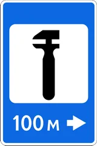
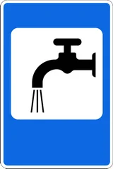
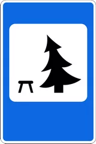
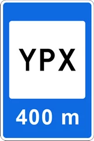
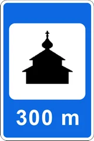
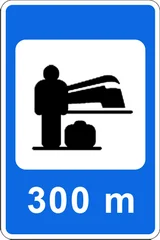

# Знаки сервиса

Всего знаков: 30

## 6.1

«Пункт медицинской помощи».

---

## 6.2

«Больница».

---

## 6.3.1

«Автомобильная заправочная станция».

---

## 6.3.2

«Многофункциональная автомобильная заправочная станция».

---

## 6.3.3

«Станция для подзарядки электромобилей».

---

## 6.4

«Техническое обслуживание автомобилей».

---

## 6.5

«Мойка автомобилей».

---

## 6.6

«Телефон».

---

## 6.7

«Пункт пи��ания».

---

## 6.8

«Питьевая вода».

---

## 6.9

«Гостиница».

---

## 6.10

«Кемпинг».

---

## 6.11

«Место отдыха».

---

## 6.12

«Пост ДПС».

---

## 6.13

«Контрольный пункт международных автоперевозчиков».

---

## 6.14

«Туалет».

---

## 6.15

«Место сбора мусора».

---

## 6.16

«Водоем для купания».

---

## 6.17

«Отдел внутренних дел».

---

## 6.18

«Радиосвязь».

---

## 6.19

«Соборная мечеть».

---

## 6.20

«Церковь».

---

## 6.21

«Молитвенный дом».

---

## 6.22

«Железнодорожный вокзал».

---

## 6.23

«Аэропорт».

---

## 6.24

«Рынок».

---

## 6.25

«Центр информации туризма».

---

## 6.26

«Заповедник».

---

## 6.27

«Живописное место».

---

## 6.28

«Памятник зодчества».

---

