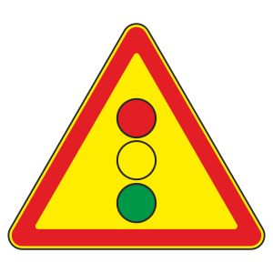
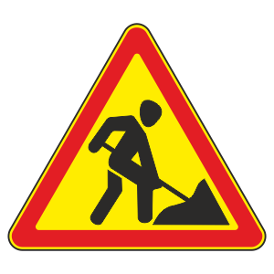
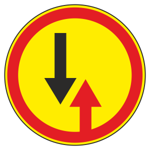
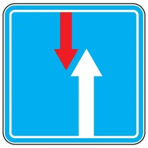
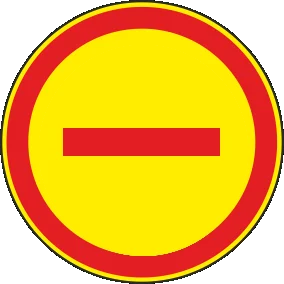
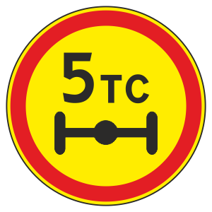
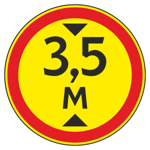
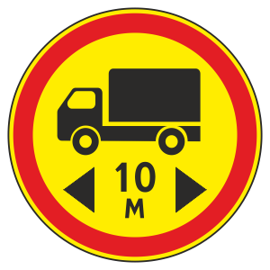
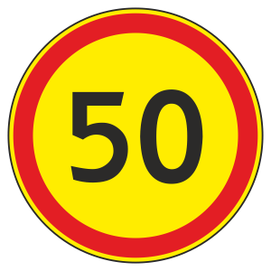

# Временные знаки

Всего знаков: 25

## 1.8

«Светофорное регулирование»

---

## 1.15

«Скользкая дорога»

---

## 1.16

«Неровная дорога»

---

## 1.17

«Выброс гравия»

---

## 1.18.1

«Сужение дороги»

---

## 1.18.2

«Сужение дороги»

---

## 1.18.3

«Сужение дороги»

---

## 1.23

«Дорожные работы»

---

## 1.30

«Прочие опасности»

---

## 2.6

«Преимущество встречного движения»

---

## 2.7

«Преимущество перед встречным движением»

---

## 3.1

«Въезд запрещен»

---

## 3.2

«Движение запрещено»

---

## 3.11

«Ограничение массы»

---

## 3.12

«Ограничение нагрузки на ось»

---

## 3.13

«Ограничение высоты»

---

## 3.14

«Ограничение ширины»

---

## 3.15

«Ограничение длины»

---

## 3.16

«Ограничение минимальной дистанции»

---

## 3.18.1

«Поворот направо запрещен»

---

## 3.18.2

«Поворот налево запрещен»

---

## 3.19

«Разворот запрещен»

---

## 3.20

«Обгон запрещен»

---

## 3.22

«Обгон грузовым автомобилям запрещен»

---

## 3.24

«Ограничение максимальной скорости»

---

