# Огоҳлантирувчи белгилар

Всего знаков: 44

## 1.1

«Шлагбаумли темир йўл кесишмаси».

---

## 1.2

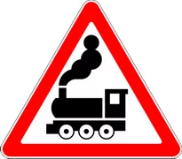

«Шлагбаумсиз темир йўл кесишмаси».

---

## 1.3.1

«Бир изли темир йўл».

Бир изли темир йўл белгилари шлагбаум билан жиҳозланмаган темир йўл кесишмаси олдида ўрнатилади.

---

## 1.3.2

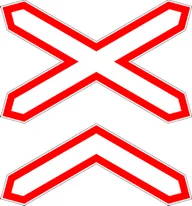

«Кўп изли темир йўл».

Икки ва ундан ортиқ изли темир йўл белгилари шлагбаум билан жиҳозланмаган темир йўл кесишмаси олдида ўрнатилади.

---

## 1.4.1 – 1.4.6

«Темир йўл кесишмасига яқинлашиш».

Аҳоли пунктларидан ташқарида темир йўл кесишмасига яқинлашаётганлик ҳақида қўшимча огоҳлантириш беради.

---

## 1.5

«Трамвай йўли билан кесишув».

---

## 1.6

«Тенг аҳамиятли йўллар кесишуви».

---

## 1.7

«Айланма ҳаракатланиш билан кесишув».

---

## 1.8

«Светофор билан тартибга солиш».

Ҳаракатланиш светофор билан тартибга солинадиган чорраҳа, пиёдалар ўтиш жойи ёки йўл қисмини билдиради.

---

## 1.9

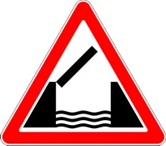

«Кўтарма кўприк».

Кўтарма кўприк ёки солда кесиб ўтиш.

---

## 1.10

«Соҳилга чиқиш».

Дарё ёки сув ҳавзаси қирғоғига чиқишни билдиради.

---

## 1.11.1

«Хавфли бурилиш ўнгга».

Ўнгга йўл белгилари йўлнинг кичик радиусли ёки кўриниши чекланган бурилиш жойини билдиради.

---

## 1.11.2

«Хавфли бурилиш чапга».

Чапга йўл белгилари йўлнинг кичик радиусли ёки кўриниши чекланган бурилиш жойини билдиради.

---

## 1.12.1

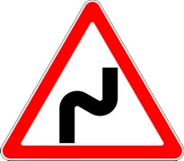

«Хавфли бурилишлар».

Биринчи бурилиш ўнгга йўл белгилари йўлнинг хавфли бурилишлари бўлган қисмини билдиради.

---

## 1.12.2

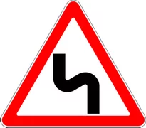

«Хавфли бурилишлар».

Биринчи бурилиш чапга йўл белгилари йўлнинг хавфли бурилишлари бўлган қисмини билдиради.

---

## 1.13

«Тик нишаблик».

---

## 1.14

«Тик баландлик».

---

## 1.15

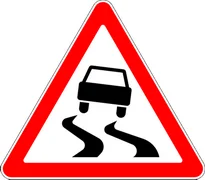

«Сирпанчиқ йўл».

Қатнов қисми ўта сирпанчиқ бўлган йўл қисми.

---

## 1.16

«Нотекис йўл».

Қатнов қисми нотекис бўлган йўл (ўнқир-чўнқир, ўйдим-чуқур жойлар, кўприкнинг йўлга нотекис туташуви ва шу кабилар) қисмини билдиради.

---

## 1.17

«Тош отилиши хавфи».

Транспорт воситасининг ғилдираги остидан шағал, тош ва шунга ўхшашларнинг отилиб чиқиш эҳтимоли бўлган йўл қисмини билдиради.

---

## 1.18.1

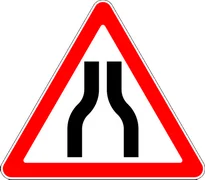

«Йўлнинг торайиши».

Икки томонлама торайиш

---

## 1.18.2

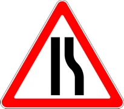

«Йўлнинг торайиши».

Ўнгга торайиш

---

## 1.18.3

«Йўлнинг торайиши».

Чапга торайиш

---

## 1.19

«Икки томонлама ҳаракатланиш».

Йўлнинг (қатнов қисмининг) қарама-қарши ҳаракатланиш қисми бошланишини билдиради.

---

## 1.20

«Пиёдалар ўтиш жойи».

5.16.1, 5.16.2, 5.48 белгилари ва (ёки) 1.14.1 — 1.14.4, 1.29.1 — 1.29.3 йўл чизиқлари билан белгиланган пиёдалар ўтиш жойини билдиради.

---

## 1.21

«Болалар».

Болалар муассасаси (мактаблар, болаларнинг дам олиш масканлари ва шунга ўхшашлар)га яқин йўлнинг қатнов қисмидан болаларнинг чиқиб қолиш эҳтимолини билдиради.

---

## 1.22

«Велосипед йўлкаси билан кесишув».

---

## 1.23

«Таъмирлаш ишлари».

---

## 1.24

«Мол ҳайдаб ўтиш».

---

## 1.25.1

«Ёввойи ҳайвонлар».

---

## 1.25.2

«Пастлаб учувчи қушлар».

---

## 1.25.3

«Кемирувчи ва судралиб юрувчи ҳайвонлар».

---

## 1.26

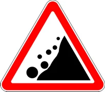

«Тошлар тушиши».

Тош кўчиши, сурилиши ва тушиши мумкин бўлган йўл қисмини билдиради.

---

## 1.27

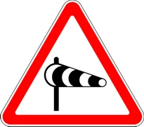

«Ёнлама шамол».

---

## 1.28

«Пастлаб учувчи самолётлар».

---

## 1.29

«Туннел».

Сунъий равишда ёритилмаган ёки кириш пештоғининг кўриниши чекланган туннелни билдиради.

---

## 1.30

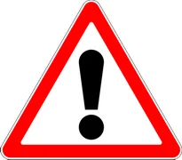

«Бошқа хавф-хатарлар».

Огоҳлантирувчи белгиларда кўзда тутилмаган хавф-хатарлар бўлган йўл қисмини билдиради.

---

## 1.31

«Сунъий йўл нотекислиги».

Йўлнинг сунъий нотекислик ўрнатилган қисмига яқинлашаётганлиги тўғрисида огоҳлантиради. Транспорт воситасининг ҳаракатланиш тезлигини мажбурий тарзда камайтириш учун қўлланилади.

---

## 1.31.3

«Бурилишнинг йўналиши».

Т-симон чорраҳада ёки йўл айрилишларида ҳаракатланиш йўналишини, таъмирланаётган йўл қисмини айланиб ўтиш йўналишини билдиради.

---

## 1.31.1 – 1.31.2

«Бурилишнинг йўналиши».

Кичик радиусли, кўриниши чекланган йўлда ҳаракатланиш йўналишини ва йўлнинг таъмирланаётган қисмини айланиб ўтиш йўналишини билдиради.

---

## 1.32

«Тирбандлик».

Ушбу йўл белгиси вақтинчалик ёки тасвири ўзгарадиган ҳолатда тирбандлик ҳосил бўлган йўл ёки чорраҳага кириш олдидан йўлни ёки чорраҳани айланиб ўтиш имконияти бўлган жойга ўрнатилади.

---

## 1.33

«Қатнов қисми кесишмаси ҳудуди».

1.30 ётиқ чизиғи билан белгиланган чорраҳага яқинлашаётганлигини англатиб, олдинда тирбандлик юзага келганлиги туфайли мажбурий тўхтаб, кўндаланг йўналишдаги транспорт воситаларининг ҳаракатланишига тўсқинлик туғдирадиган бўлса, чорраҳага кириш, агар тўхташ чизиғи ёки 5.33 йўл белгисидан ўтиб бўлган ҳайдовчига эса қатнов қисмлари кесишмасига киришни тақиқланишини билдиради.

---

## 1.34

«Диққат, бошқариладиган тўсиқ».

Ушбу йўл белгиси бошқариладиган тўсувчи қурилмасига етмасдан ўрнатилади ва транспорт воситалари ҳайдовчиларини олдинда тўсувчи қурилма борлиги ҳақида огоҳлантиради.

---

## 1.35

«Пиёдаларнинг йўл ёқасидан юриши мумкин бўлган ҳудуд».

---

