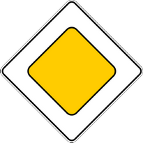
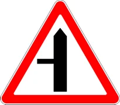
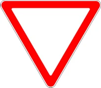
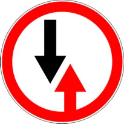

# Имтиёз белгилари

Всего знаков: 9

## 2.1

«Асосий йўл».

Ҳаракат тартибга солинмаган чорраҳаларда олдин ўтиш ҳуқуқини беради.

Белги асосий йўл бошига ва чорраҳаларнинг бевосита олдига ўрнатилади.

---

## 2.2

«Асосий йўлнинг охири».

---

## 2.3.1

«Иккинчи даражали йўл билан кесишув».

йўл белгилари аҳоли пунктларида кесишмагача 50 — 100 метр масофада, аҳоли пунктларидан ташқарида эса 150 — 300 метр масофада ўрнатилади.

---

## 2.3.2

«Иккинчи даражали йўл билан туташув ўнгдан».

йўл белгилари аҳоли пунктларида кесишмагача 50 — 100 метр масофада, аҳоли пунктларидан ташқарида эса 150 — 300 метр масофада ўрнатилади.

---

## 2.3.3

«Иккинчи даражали йўл билан туташув чапдан».

йўл белгилари аҳоли пунктларида кесишмагача 50 — 100 метр масофада, аҳоли пунктларидан ташқарида эса 150 — 300 метр масофада ўрнатилади.

---

## 2.4

«Йўл беринг».

Ҳайдовчи кесиб ўтилаётган йўлдан, 7.13 қўшимча-ахборот белгиси бўлганда эса асосий йўлдан ҳаракатланаётган транспорт воситасига йўл бериши керак.

---

## 2.5

«Тўхтамасдан ҳаракатланиш тақиқланган».

Тўхташ чизиғи олдида, агар у бўлмаса, кесиб ўтиладиган қатнов қисмининг четида тўхтамасдан ҳаракатланиш тақиқланади. Ҳайдовчи кесиб ўтилаётган йўлдан, 7.13 қўшимча-ахборот белгиси бўлганда эса асосий йўлдан ҳаракатланаётган транспорт воситаларига йўл бериши керак.

Бу белги темир йўл кесишмаси ёки карантин масканидан олдин ўрнатилиши мумкин. Бундай ҳолларда ҳайдовчи тўхташ чизиғи олдида, у бўлмаса, белги олдида тўхташи керак.

---

## 2.6

«Рўпара ҳаракатланишнинг устунлиги».

Қарама-қарши ҳаракатланишни қийинлаштирадиган ҳолларда йўлнинг тор қисмига кириш тақиқланади. Ҳайдовчи йўлнинг тор қисмида бўлган ёки рўпарадан унга яқин бўлган транспорт воситасига йўл бериши керак.

---

## 2.7

«Рўпарадаги ҳаракатланишга нисбатан имтиёз».

Йўлнинг тор қисмида ҳаракатланишда ҳайдовчи рўпарадан келаётган транспорт воситасига нисбатан имтиёзга эгалигини билдиради.

---

