# Тақиқловчи белгилар

Всего знаков: 36

## 3.1

«Кириш тақиқланган».

Барча транспорт воситаларининг кириши тақиқланишини билдиради.

---

## 3.2

«Ҳаракатланиш тақиқланган».

Барча транспорт воситаларининг ҳаракатланиши тақиқланишини билдиради.

---

## 3.3

«Механик транспорт воситаларининг ҳаракатланиши тақиқланган».

---

## 3.4

«Юк автомобилларининг ҳаракатланиши тақиқланган».

Рухсат этилган тўлиқ вазни 3,5 тоннадан (агар вазни белгида кўрсатилмаган бўлса) ёки рухсат этилган тўлиқ вазни белгида кўрсатилгандан ортиқ бўлган юк автомобиллари ва транспорт воситалари таркибларининг, шунингдек тракторлар, ўзиюрар ускуналарнинг ҳаракатланиши тақиқланади.

3.4. йўл белгиси бортларига қия оқ чизиқ тортилган ёки одамларни ташиш учун мўлжалланган юк автомобилларининг ҳаракатланишини тақиқламайди.

---

## 3.5

«Мотоцикллар ҳаракатланиши тақиқланган».

---

## 3.6

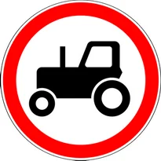

«Тракторлар ҳаракатланиши тақиқланган».

Тракторлар ва ўзиюрар ускуналарнинг ҳаракатланиши тақиқланади.

---

## 3.7

«Тиркама билан ҳаракатланиш тақиқланган».

Юк автомобиллари ва тракторларнинг барча турдаги тиркамалар билан ҳаракатланиши, шунингдек, механик транспорт воситаларини шатакка олиш тақиқланади.

---

## 3.8

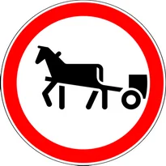

«От-арава ҳаракатланиши тақиқланган».

От-арава (чана), отлиқлар, юк ортилган ҳайвонларнинг ҳаракатланиши, шунингдек, чорва (пода) ҳайдаб ўтиш тақиқланади.

---

## 3.9

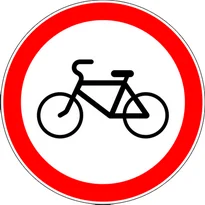

«Велосипедда ҳаракатланиш тақиқланган».

Велосипедда ва мопедда ҳаракатланиш тақиқланади.

---

## 3.10

«Пиёданинг ҳаракатланиши тақиқланган».

---

## 3.11

«Вазн чекланган».

Ҳақиқий умумий вазни белгида кўрсатилганидан ортиқ бўлган транспорт воситаларининг, шунингдек, транспорт воситалари таркибларининг ҳаракатланиши тақиқланади.

---

## 3.12

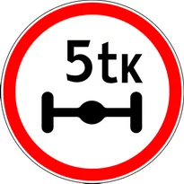

«Ўққа тушадиган оғирлик чекланган».

Ҳар қандай ўқига тушадиган ҳақиқий оғирлик белгида кўрсатилганидан ортиқ бўлган транспорт воситаларининг ҳаракатланиши тақиқланади.

---

## 3.13

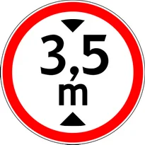

«Чекланган баландлик».

Габарит баландлиги (юк билан ёки юксиз) белгида кўрсатилгандан ортиқ бўлган транспорт воситаларининг ҳаракатланиши тақиқланади.

---

## 3.14

«Чекланган кенглик».

Габарит кенглиги (юк билан ёки юксиз) белгида кўрсатилганидан ортиқ бўлган транспорт воситаларининг ҳаракатланиши тақиқланади.

---

## 3.15

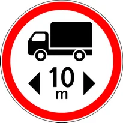

«Чекланган узунлик».

Габарит узунлиги (юк билан ёки юксиз) белгида кўрсатилганидан ортиқ бўлган транспорт воситалари (транспорт воситалари таркиблари)нинг ҳаракатланиши тақиқланади.

---

## 3.16

«Энг кам оралиқ».

Белгида кўрсатилганидан кам бўйлама оралиқ масофада ҳаракатланиш тақиқланади.

---

## 3.17.1

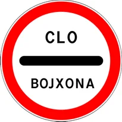

«Божхона».

Божхона (назорат пункти) олдида тўхтамасдан ўтиб кетиш тақиқланади.

---

## 3.17.2

«Хавф-хатар».

Йўл-транспорт ҳодисаси, авария, ёнғин ёки бошқа хавф-хатар вазиятлар туфайли, истисносиз, барча транспорт воситаларининг бундан кейин ҳаракатланиши тақиқланади.

---

## 3.17.3

«Назорат жойи».

Транспорт воситаларининг текшириб ўтказилиши мажбурий бўлган вақтинча ёки доимий назорат пунктларида ўрнатилади. Ушбу йўл белгиси 2.5 йўл белгиси билан бирга ўрнатилиши мумкин.

---

## 3.18.1

«Ўнгга бурилиш тақиқланган».

---

## 3.18.2

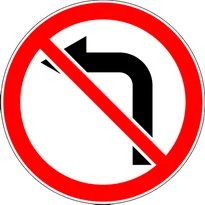

«Чапга бурилиш тақиқланади».

---

## 3.19

«Қайрилиш тақиқланган».

---

## 3.20

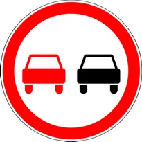

«Қувиб ўтиш тақиқланган».

Соатига 40 км дан кам тезликда ҳаракатланаётган якка транспорт воситасидан бошқа транспорт воситаларини қувиб ўтиш тақиқланишини билдиради.

---

## 3.21

«Қувиб ўтиш тақиқланган ҳудуднинг охири».

---

## 3.22

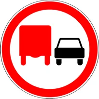

«Юк автомобилларида қувиб ўтиш тақиқланган».

Тўлиқ вазни 3,5 тоннадан ортиқ бўлган юк автомобилларида барча транспорт воситаларини қувиб ўтиш тақиқланишини билдиради (соатига 40 км дан кам тезликда ҳаракатланаётган транспорт воситаси, трактор, от-арава, велосипед бундан мустасно).

---

## 3.23

«Юк автомобилларида қувиб ўтиш тақиқланган ҳудуднинг охири».

---

## 3.24

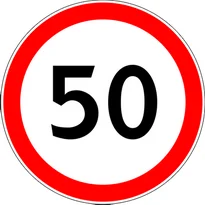

«Юқори тезлик чекланган».

Белгида кўрсатилганидан ортиқ тезликда (км/с) ҳаракатланиш тақиқланишини билдиради.

---

## 3.25

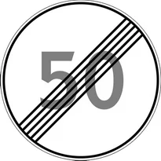

«Юқори тезлик чекланган ҳудуднинг охири».

---

## 3.26

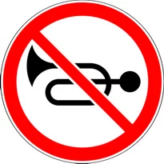

«Товуш мосламаларидан фойдаланиш тақиқланган».

Йўл транспорт ҳодисасининг олдини олиш ҳолларидан бошқа вазиятларда товуш мосламасидан фойдаланиш тақиқланади.

---

## 3.27

«Тўхташ тақиқланган».

Транспорт воситаларининг тўхташи ва тўхтаб туриши тақиқланади (хизмат вазифасини бажараётган ходимга бириктирилган кўк ёки қизил ёхуд кўк ва қизил рангли ялтироқ маёқчаси билан жиҳозланган ҳамда махсус рангли бўёқ схемалар ва ёзувлар билан белгиланган транспорт воситалари бундан мустасно).

---

## 3.28

«Тўхтаб туриш тақиқланган».

Транспорт воситаларининг тўхтаб туриши тақиқланади (хизмат вазифасини бажараётган ходимга бириктирилган кўк ёки қизил ёхуд кўк ва қизил рангли ялтироқ маёқчаси билан жиҳозланган ҳамда махсус рангли бўёқ схемалар ва ёзувлар билан белгиланган транспорт воситалари бундан мустасно).

---

## 3.29

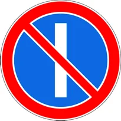

«Ойнинг тоқ кунларида тўхтаб туриш тақиқланган».

(хизмат вазифасини бажараётган ходимга бириктирилган кўк ёки қизил ёхуд кўк ва қизил рангли ялтироқ маёқчаси билан жиҳозланган ҳамда махсус рангли бўёқ схемалар ва ёзувлар билан белгиланган транспорт воситалари бундан мустасно).

---

## 3.30

«Ойнинг жуфт кунларида тўхтаб туриш тақиқланган».

(хизмат вазифасини бажараётган ходимга бириктирилган кўк ёки қизил ёхуд кўк ва қизил рангли ялтироқ маёқчаси билан жиҳозланган ҳамда махсус рангли бўёқ схемалар ва ёзувлар билан белгиланган транспорт воситалари бундан мустасно).3.29 ва 3.30 белгилари қатнов қисмининг қарама-қарши томонларида бир вақтда ўрнатилганда, қатнов қисмининг ҳар иккала томонида соат 19:00 дан 21:00 гача тўхтаб туришга рухсат этилади (жойини ўзгартириш вақти).

---

## 3.31

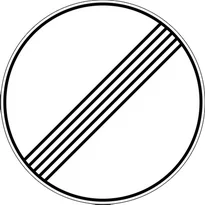

«Барча чекловларнинг охири».

3.16, 3.20, 3.22, 3.24, 3.26 — 3.30 белгиларидан бир нечтасига бир вақтда амал қиладиган ҳудудларнинг охири.

---

## 3.32

«Хавфли юк ташиётган транспорт воситасининг ҳаракати тақиқланган».

---

## 3.33

«Портловчи ва тез алангаланувчи юкни ташиётган транспорт воситасининг ҳаракати тақиқланган».

---

