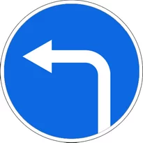
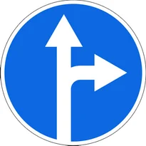
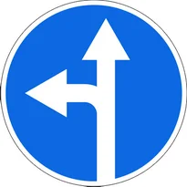
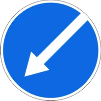
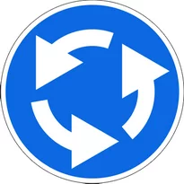
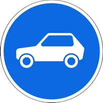
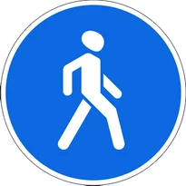
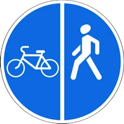
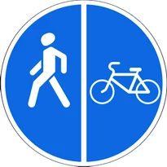
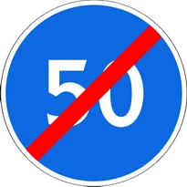

# Буюрувчи белгилар

Всего знаков: 24

## 4.1.1

«Ҳаракатланиш тўғрига».

---

## 4.1.2

«Ҳаракатланиш ўнгга».

---

## 4.1.3

«Ҳаракатланиш чапга».

---

## 4.1.4

«Ҳаракатланиш тўғрига ёки ўнгга».

---

## 4.1.5

«Ҳаракатланиш тўғрига ёки чапга».

---

## 4.1.6

«Ҳаракатланиш ўнгга ёки чапга».

---

## 4.2.1

«Тўсиқни ўнгдан айланиб ўтиш».

Фақат кўрсаткич кўрсатган томондан айланиб ўтиш рухсат этилади.

---

## 4.2.2

«Тўсиқни чапдан айланиб ўтиш».

Фақат кўрсаткич кўрсатган томондан айланиб ўтиш рухсат этилади.

---

## 4.2.3

«Тўсиқни ўнгдан ёки чапдан айланиб ўтиш».

Ҳар томонидан айланиб ўтиш рухсат этилади.

---

## 4.3

«Айланма ҳаракатланиш».

Кўрсаткичлар йўналишларида ҳаракатланиш рухсат этилади.

---

## 4.4

«Енгил автомобиллар ҳаракати».

Енгил автомобиллар, автобус, мотоцикллар, белгиланган йўналишли транспорт воситалари ва рухсат этилган тўлиқ вазни 3,5 тоннадан ошмайдиган юк автомобиллари ҳаракатланишига рухсат этилишини билдиради.

Белгининг таъсир оралиғида яшовчи ва ишловчи фуқароларга тегишли, уларга ва корхоналарга хизмат кўрсатувчи транспорт воситаларига бу белги татбиқ этилмайди. Бундай ҳолларда транспорт воситалари белгиланган жойга энг яқин чорраҳадан кириб ёки чиқиб кетишлари керак.

---

## 4.5

«Велосипед йўлкаси».

Фақат велосипед ва мопедларда ҳаракатланишга рухсат этилишини билдиради. Тротуар ёки пиёдалар йўлкаси бўлмаса, велосипед йўлкасидан пиёдалар ҳам юришлари мумкин.

---

## 4.6

«Пиёдалар йўлкаси».

Фақат пиёдалар юришига рухсат этилади.

---

## 4.6.1

«Пиёдалар ва велосипедчиларнинг биргаликдаги ҳаракати ташкил этилган йўлак».

---

## 4.6.2

«Пиёдалар ва велосипедчиларнинг биргаликдаги ҳаракати ташкил этилган йўлакнинг охири».

---

## 4.6.3

«Пиёдалар ва велосипедчиларнинг ҳаракати алоҳида ташкил этилган йўлак».

1.1, 1.25 ва 1.26 ётиқ йўл чизиғи ёрдамида, конструктив тарзда ёхуд бошқа усулда пиёдалар ва велосипедчиларнинг ҳаракати ажратилган пиёдалар ва велосипедчилар йўлаги.

---

## 4.6.4

«Пиёдалар ва велосипедчиларнинг ҳаракати алоҳида ташкил этилган йўлакнинг охири».

---

## 4.6.5

«Пиёдалар ва велосипедчиларнинг ҳаракати алоҳида ташкил этилган йўлак».

1.1, 1.25 ва 1.26 ётиқ йўл чизиғи ёрдамида, конструктив тарзда ёхуд бошқа усулда пиёдалар ва велосипедчиларнинг ҳаракати ажратилган пиёдалар ва велосипедчилар йўлаги.

---

## 4.6.6

«Пиёдалар ва велосипедчиларнинг ҳаракати алоҳида ташкил этилган йўлакнинг охири».

---

## 4.7

«Энг кам тезлик».

Фақат белгида кўрсатилган ёки ундан юқори тезликда (км/соат) ҳаракатланишга рухсат этилишини билдиради.

---

## 4.8

«Энг кам тезлик белгиланган йўлнинг охири».

---

## 4.9.1

«Хавфли юк ташиётган транспорт воситаларининг ҳаракат йўналиши».

«Хавфли юк» таниш белгиси билан жиҳозланган транспорт воситаларининг ҳаракатига йўл белгисида кўрсатилган йўналишларда рухсат берилади: тўғрига.

---

## 4.9.2

«Хавфли юк ташиётган транспорт воситаларининг ҳаракат йўналиши».

«Хавфли юк» таниш белгиси билан жиҳозланган транспорт воситаларининг ҳаракатига йўл белгисида кўрсатилган йўналишларда рухсат берилади: чапга.

---

## 4.9.3

«Хавфли юк ташиётган транспорт воситаларининг ҳаракат йўналиши».

«Хавфли юк» таниш белгиси билан жиҳозланган транспорт воситаларининг ҳаракатига йўл белгисида кўрсатилган йўналишларда рухсат берилади: ўнгга.

---

