# Ахборот белгилари

Всего знаков: 70

## 5.1

«Автомагистраль».

Йўл ҳаракати қоидаларининг автомагистралларда ҳаракатланиш тартиби ўрнатилган йўлни билдиради.

---

## 5.2

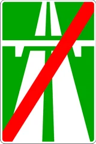

«Автомагистралнинг охири».

---

## 5.3

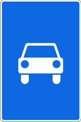

«Автомобиллар учун мўлжалланган йўл».

Фақат автомобиллар, автобус ва мотоциклларнинг ҳаракатланиши учун мўлжалланган йўлни билдиради.

---

## 5.4

«Автомобиллар учун мўлжалланган йўлнинг охири».

---

## 5.5

«Бир томонлама ҳаракатли йўл».

Транспорт воситалари бутун кенглик бўйича бир йўналишда ҳаракатланадиган йўл ёки қатнов қисми.

---

## 5.6

«Бир томонлама ҳаракатли йўлнинг охири».

---

## 5.7.1 – 5.7.2

«Бир томонлама ҳаракатли йўлга чиқиш».

Ҳаракатланиш бир томонлама бўлган йўлга ёки қатнов қисмига чиқиш.

---

## 5.8.1

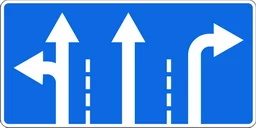

«Тасмалар бўйича ҳаракат йўналиши».

Тасмалар сони ва ҳар бири бўйича рухсат этилган ҳаракатланиш йўналишлари. Бошқа йўналишлар бўйича ҳаракатланиш тақиқланади.

---

## 5.8.2

«Тасма бўйича ҳаракатланиш йўналиши».

Тасма бўйича рухсат этилган ҳаракатланиш йўналиши. Бошқа йўналишлар бўйича ҳаракатланиш тақиқланади.

---

## 5.8.3

«Тасманинг бошланиши».

Йўлнинг секинлашиш бўлаги ёки баландликка кўтарилишдаги қўшимча тасманинг бошланиш қисми.

Агар белгига 4.7 «Энг кам тезлик» белгисининг тасвири тушган бўлса, кўрсатилган ёки ундан каттароқ тезликда ҳаракатлана олмайдиган транспорт воситасининг ҳайдовчиси асосий тасмадан қўшимча тасмага қайта тизилиши керак.

---

## 5.8.4

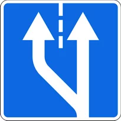

«Тасманинг бошланиши».

Уч тасмали йўлларда шу йўналишда ҳаракатланиш учун мўлжалланган ўрта тасма қисмининг бошланиши.

---

## 5.8.5

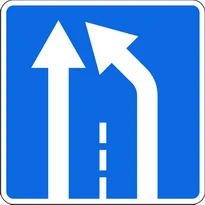

«Тасма охири».

Баландликка кўтарилишдаги қўшимча тасманинг ёки тезланиш тасманинг охирини билдиради.

---

## 5.8.6

«Тасма охири».

Уч тасмали йўлларда шу йўналишда ҳаракатланиш учун мўлжалланган ўрта тасма қисмининг охирини билдиради.

---

## 5.8.7
5.8.8

«Тасмалар бўйича ҳаракатланиш йўналиши».

Агар 5.8.7 белгисида бирор транспорт воситасининг ҳаракатланишини тақиқловчи белги тасвирланган бўлса, унда бу тур транспорт воситасининг тегишли тасмада ҳаракатланиши тақиқланишини билдиради.

5.8.7 ва 5.8.8 белгилари йўналишлар сонига кўра тўрт ва ундан ортиқ тасмали йўлларга ҳам татбиқ этилиши мумкин. Тасвири алмашадиган 5.8.7, 5.8.8 белгилари ёрдамида реверсив ҳаракат ташкил этилиши мумкин.

---

## 5.9

«Йўналишли транспорт воситалари учун мўлжалланган тасма».

Транспорт воситалари йўналишида ҳаракатланадиган йўналишли транспорт воситалари учун мўлжалланган тасмани билдиради.

Белги қайси тасма устида жойлашган бўлса, шу тасмага татбиқ этилади. Йўлнинг ўнг томонига ўрнатилган белгининг таъсири ўнг тасмага татбиқ этилади.

---

## 5.10.1

«Йўналишли транспорт воситалари учун алоҳида ажратилган тасмаси бор йўл».

Йўналишли транспорт воситаларининг умумий оқимга қарши ҳаракатланиши учун ажратилган тасмани билдиради.

---

## 5.10.4

«Йўналишли транспорт воситалари учун алоҳида ажратилган тасмаси бор йўлнинг охири».

---

## 5.10.2 – 5.10.3

«Йўналишли транспорт воситалари учун алоҳида ажратилган тасмаси бор йўлга чиқиш».

---

## 5.11.1

«Қайрилиб олиш жойи».

Чапга бурилиш тақиқланади.

---

## 5.11.2

«Қайрилиб олиш оралиғи».

Қайрилиб олиш оралиғининг узунлигини билдиради. Чапга бурилиш тақиқланади.

---

## 5.12

«Автобус ва (ёки) троллейбус тўхташ жойи».

---

## 5.13

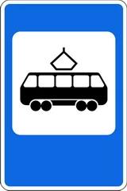

«Трамвай тўхташ жойи».

---

## 5.14

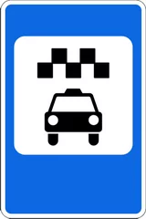

«Йўналишсиз таксилар тўхтаб туриш жойи».

---

## 5.15

«Тўхтаб туриш жойи».

---

## 5.15.1

«Пуллик тўхтаб туриш жойи».

---

## 5.15.2

«Ер усти автомобиль қўйиш жойи».

---

## 5.15.3

«Ер ости автомобиль қўйиш жойи».

---

## 5.15.4

«Электр қувватлашли автомобиль қўйиш жойи».

---

## 5.16.1 – 5.16.2

«Пиёдалар ўтиш жойи».

Ўтиш жойи олдида 1.14.1-1.14.2 ётиқ чизиғи бўлмаганда 5.16.2 белгиси йўлдан ўнг томонга ўтиш жойининг олд чегарасига, 5.16.1 белгиси эса чап томонга ўтиш жойининг орқа чегарасига ўрнатилади.

---

## 5.17.1 – 5.17.2

«Пиёдаларнинг ер остидан ўтиш жойи».

---

## 5.17.3 – 5.17.4

«Пиёдаларнинг ер устидан ўтиш жойи».

---

## 5.18

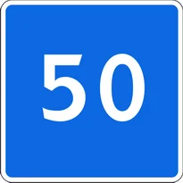

«Тавсия этилган тезлик».

Йўлнинг шу қисмида тавсия этилган ҳаракатланиш тезлигини билдиради. Белгига энг яқин чорраҳагача амал қилинади. 5.18 белгиси огоҳлантирувчи белги билан бирга қўлланса, унинг таъсир оралиғи хавфли қисмнинг узунлиги билан аниқланади. 5.48 йўл белгиси ўрнатилган кўча ва йўлларда ўрнатилиши лозимлигини билдиради.

---

## 5.19.1 – 5.19.4

«Охири берк йўл».

Йўлнинг кўрсатилган йўналишда охири берклигини билдиради.

---

## 5.20.1

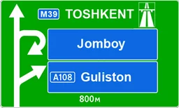

«Йўналишларнинг дастлабки кўрсаткичи».

---

## 5.20.2

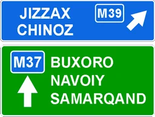

«Йўналишларнинг дастлабки кўрсаткичи».

---

## 5.20.3

«Ҳаракатланиш чизмаси».

Чорраҳада айрим йўналишларда ҳаракатланиш тақиқланган бўлса ҳаракатланиш йўналиши ёки мураккаб чорраҳаларда рухсат этилган ҳаракатланиш йўналишини билдиради.

---

## 5.20.4

«Йўлларининг бир сатҳда кесишмайдиган қисмларида бурилиш ёки қайрилиб олиш йўналиш кўрсаткичи».

Автомобиль йўлларнинг бир сатҳда кесишмайдиган қисмларида ер остидан ёки ер устидан транспорт воситаларининг бурилиш ва қайрилиб олиш йўналишини кўрсатиш учун қўлланилади.

---

## 5.20.5

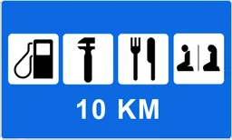

«Хизмат кўрсатиш майдони».

---

## 5.21.1

«Йўналиш кўрсаткичи».

---

## 5.21.2

«Йўналишлар кўрсаткичи».

Кўрсатилган манзилларга ҳаракатланиш йўналишларини билдиради. Белгиларда манзилларгача бўлган масофа (км) кўрсатилиши, автомагистраллар, аэропортлар ва бошқа рамзий белгилар тасвирланган бўлиши мумкин.

---

## 5.22

«Аҳоли пунктининг бошланиши».

Ушбу Қоидаларнинг аҳоли пунктларида ҳаракатланиш тартибини белгиловчи талабларига амал қилинадиган жойларнинг номи ҳамда унинг бошланишини билдиради.

---

## 5.23

«Аҳоли пунктининг охири».

Ушбу Қоидаларнинг аҳоли пунктларида ҳаракатланиш тартиб-талаблари бекор қилинган жойни билдиради.

---

## 5.24

«Аҳоли пунктининг бошланиши».

Ушбу Қоидаларнинг аҳоли пунктларида ҳаракатланиш тартибини белгиловчи талабларига амал қилинмайдиган жойларнинг номи ҳамда унинг бошланишини билдиради.

---

## 5.25

«Аҳоли пунктининг охири».

5.24 йўл белгиси билан кўрсатилган аҳоли пунктининг охирини билдиради.

---

## 5.26

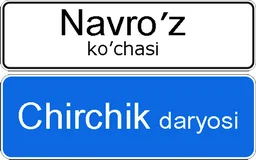

«Манзил номи».

Аҳоли пунктларидан бошқа манзилларнинг номини билдиради (дарё, кўл, довон, хушманзара жой ва бошқалар).

---

## 5.27

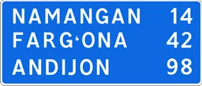

«Масофалар кўрсаткичи».

Йўналиш бўйича жойлашган аҳоли пунктларигача бўлган масофани билдиради (км).

---

## 5.28

«Километр белгиси».

Йўлнинг боши ёки охиригача бўлган масофани билдиради (км).

---

## 5.29.1

«Йўл рақами».

Йўлга берилган рақам.

---

## 5.29.2

«Йўл рақами».

Йўлнинг рақами ва йўналишини билдиради.

---

## 5.30.1 – 5.30.3

«Юк автомобиллари учун ҳаракатланиш йўналиши».

Чорраҳада юк автомобиллари, тракторлар ва ўзиюрар мосламаларга бирор йўналишда ҳаракатланиш тақиқланган бўлса, бундай транспорт воситаларига тавсия этилган ҳаракатланиш йўналишлари кўрсатади.

---

## 5.31

«Айланиб ўтиш тасвири».

Ҳаракатланиш учун вақтинча ёпиб қўйилган йўл қисмини четлаб ўтиш чизмаси.

---

## 5.32.1 – 5.32.3

«Четлаб ўтиш йўналиши».

Ҳаракатланиш вақтинча ёпиб қўйилган йўл қисмини четлаб ўтиш йўналишини билдиради.

---

## 5.33

«Тўхташ чизиғи».

Светофорнинг (тартибга солувчининг) тақиқловчи ишорасида транспорт воситалари тўхтайдиган йўналишини билдиради.

---

## 5.34.1 – 5.34.2

«Бошқа қатнов қисмига қайта тизилишнинг бошланғич кўрсаткичи».

Ажратувчи бўлаги бўлган йўлнинг ҳаракатланиш учун ёпиқ ҳудудини айланиб ўтиш ёки ўнг томондаги қатнов қисмига қайтиш учун ҳаракатланиш йўналишини билдиради.

---

## 5.35

«Реверсив ҳаракатланиш».

Бир ёки бир неча тасмаларда ҳаракатланиш йўналиши қарама-қарши томонга ўзгариши мумкин бўлган йўл қисмининг бошланишини билдиради.

---

## 5.36

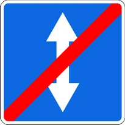

«Реверсив ҳаракатланишнинг охири».

---

## 5.37

«Реверсив ҳаракатланиш йўлига чиқиш».

---

## 5.38

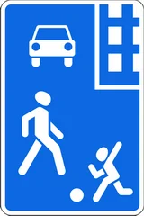

«Турар жой даҳаси».

Йўл ҳаракати қоидаларининг турар жой даҳаларида ҳаракатланиш тартиби ўрнатилган йўл.

---

## 5.39

«Турар жой даҳасининг охири».

---

## 5.40

«Фалокатли ҳолатлар учун кириш йўли».

Йўл ҳаракати ушбу Қоидаларидаги 128-бандда кўрсатилган ҳолатларда фойдаланиладиган йўл.

---

## 5.41

«Фото ва видео қайд этиш».

Йўлларда автомобиль ҳайдовчилари Қоидалар талабига риоя этиши электрон қурилмалар ёрдамида назорат қилинаётганлигини билдирувчи йўл белгиси. Ушбу йўл белгиси Қоидалар талабига риоя этилиши стационар электрон қурилмалар орқали назоратга олинган жойларга ўрнатилади.

---

## 5.42

«Қизил чироқда ўнгга ҳаракатланиш».

Транспорт светофори қизил чироғининг ўнг ёнига 5.42 йўл белгиси ўрнатилган бўлса, транспорт воситаларининг ҳайдовчилари светофорнинг тақиқловчи ишораси ёниб турганда, барча хавфсизлик чораларини кўрган ҳолда ўнгга бурилишлари мумкин. Бунда улар ҳаракат йўналиши бўйича ва бурилаётган кўчани кесиб ўтаётган пиёдаларга ҳамда бошқа транспорт воситаларига йўл беришлари шарт.

---

## 5.43

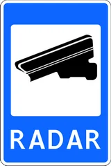

«Радар».

Йўлларда автомобиль ҳайдовчилари белгиланган тезликка риоя этиши радарлар ёрдамида назорат қилинаётганлигини билдирувчи йўл белгиси.

Ушбу йўл белгиси белгиланган ҳаракатланиш тезлиги стационар махсус техника воситалари ёрдамида назоратга олинган жойларга ўрнатилади.

Шунингдек, вилоят, туман, шаҳарлар бошланадиган жойлардаги кўча ва йўлларда ҳаракатланиш тезлиги мобиль радарлар ёрдамида назорат қилинаётганлиги тўғрисида ҳайдовчиларни огоҳлантириш мақсадида ўрнатилиши мумкин.

---

## 5.44

«Велосипедчилар учун тасма».

---

## 5.45

«Велосипедчилар учун тасманинг охири».

---

## 5.46

«Мактаб».

Мактаб ёки мактабгача таълим ташкилотлари олдида ўрнатилади.

---

## 5.47

«Туризм объектлари йўналиш кўрсатгичи».

Туризм объектлари жойлашган манзилларга ҳаракатланиш йўналишларини билдиради. Белгиларда манзилларгача бўлган масофа (км) кўрсатилиши, темир йўл вокзаллари, аэропортлар ва бошқа туризм объектлари рамзий белгилари тасвирланган бўлиши мумкин.

---

## 5.47.1

«Туризм объектлари».

---

## 5.47.2

«Туризм ахборот маркази».

---

## 5.48

«Баланд пиёдалар ўтиш жойи».

5.16.1-5.16.2 йўл белгилари билан бирга қўлланилади.

---

