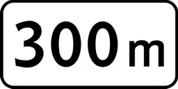
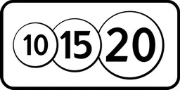
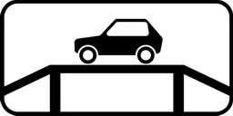
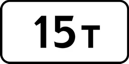
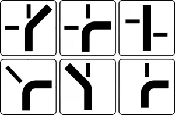
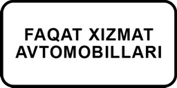
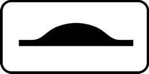

# Қўшимча ахборот белгилари

Всего знаков: 36

## 7.1.1

«Объектгача бўлган масофа».

Белгидан йўлнинг хавфли жойи, йўл ҳаракатига тегишли чекловлар киритиладиган жойи ёки ҳаракат йўналиши бўйича олдиндаги муайян жойгача бўлган масофани кўрсатади.

---

## 7.1.2

«Объектгача бўлган масофа».

Аҳоли пунктларидан ташқарида чорраҳа олдига 2.5. йўл белгиси ўрнатилган бўлса, 2.4. йўл белгиси билан ўрнатилиб, чорраҳагача бўлган масофани кўрсатади.

---

## 7.1.3 – 7.1.4

«Объектгача бўлган масофа».

Йўлдан четда жойлашган манзилгача бўлган масофани билдиради.

---

## 7.2.1

«Таъсир оралиғи».

Огоҳлантирувчи белгилар билан белгиланган хавфли жойнинг узунлигини ёки тақиқловчи ва ахборот-кўрсаткич белгиларининг таъсир оралиғини кўрсатади.

---

## 7.2.2

«Таъсир оралиғи».

3.27 — 3.30 тақиқловчи белгиларининг таъсири сақланган оралиқни кўрсатади.

---

## 7.2.3

«Таъсир оралиғи».

3.27 — 3.30 тақиқловчи белгиларининг таъсир оралиғи охирини кўрсатади.

---

## 7.2.4

«Таъсир оралиғи».

Ҳайдовчиларга уларнинг 3.27 — 3.30 йўл белгилари таъсир доирасида эканликлари ҳақида ахборот беради.

---

## 7.2.5 – 7.2.6

«Таъсир оралиғи».

Майдон, бинолар олди ва шунга ўхшаш жойлар четида тўхташ ва тўхтаб туриш тақиқланганда 3.27 — 3.30 белгиларининг таъсир оралиғи ва йўналишини кўрсатади.

---

## 7.3.1 – 7.3.3

«Таъсир йўналишлари».

Чорраҳа олдида ўрнатилган белгиларнинг таъсир йўналишини ёки бевосита йўл яқинида жойлашган манзилларга ҳаракатланиш йўналишини кўрсатади.

---

## 7.4.1 – 7.4.10

«Транспорт воситасининг тури».

Белгининг таъсири жорий этилган транспорт воситалари турини кўрсатади.7.4.1 белги билан ўрнатилган йўл белгисининг таъсири юк ташувчи, шу жумладан, тиркамали, тўлиқ вазни 3,5 тоннадан ортиқ бўлган транспорт воситаларига, 7.4.3 белги билан ўрнатилган йўл белгисининг таъсири енгил автомобилларга, 7.4.9 электромобилларга, 7.4.10 йўналишсиз таксиларга, шунингдек, тўлиқ вазни 3,5 тоннагача бўлган юк ташувчи транспорт воситаларига татбиқ этилади.

---

## 7.5.1

«Шанба, якшанба ва байрам кунлари».

---

## 7.5.2

«Иш кунлари».

---

## 7.5.3

«Ҳафта кунлари».

Белгига ҳафтанинг қайси кунлари амал қилиниши кўрсатилган.

---

## 7.5.4

«Амал қилиш вақти».

Белгига куннинг қайси вақтида амал қилишни кўрсатади.

---

## 7.5.5 – 7.5.7

«Амал қилиш вақти».

Белгига ҳафтанинг қайси куни ва қайси соатларида амал қилишни кўрсатади.

---

## 7.6.1 – 7.6.9

«Транспорт воситасини тўхтаб туриш жойига қўйиш усули».

7.6.1 барча турдаги транспорт воситаларини тўхтаб туриши учун йўлнинг қатнов қисмида, тротуар ёнига қўйиш усулини, 7.6.2 — 7.6.9 тротуар ёнидаги тўхтаб туриш жойига енгил автомобиллар ва мотоциклларни қўйиш усулини билдиради.

---

## 7.7

«Двигателни ишлатмасдан тўхтаб туриш жойи».

5.15 белгиси билан белгиланган тўхтаб туриш жойида транспорт воситаларининг двигателини ишлатмасдан тўхтаб туришига рухсат этилганлигини кўрсатади.

---

## 7.8

«Пулли хизмат кўрсатиш жойи».

Тўлов асосида хизмат кўрсатилишини билдиради.

---

## 7.9

«Тўхтаб туриш муддати чекланган».

5.15 белгиси ўрнатилган тўхтаб туриш жойида транспорт воситалари тўхтаб туришининг энг кўп муддатини кўрсатади.

---

## 7.10

«Автомобилларни кўрикдан ўтказиш жойи».

5.15 ёки 6.11 белгиси билан кўрсатилган майдонларда эстакада ёки кўздан кечириш чуқурчалари борлигини билдиради.

---

## 7.11

«Рухсат этилган тўла вазни чекланган».

Белгининг таъсири рухсат этилган тўла вазни қўшимча-ахборот йўл белгисида кўрсатилган миқдордан ортиқ бўлган транспорт воситаларига тааллуқли эканлигини кўрсатади.

---

## 7.12

«Хавфли йўл ёқаси».

Йўл ишлари бажарилаётгани сабабли йўл ёқасига чиқиш хавфли эканлиги ҳақида огоҳлантиради. 1.23 белгиси билан қўлланилади.

---

## 7.13

«Асосий йўлнинг йўналиши».

Чорраҳада асосий йўлнинг йўналишини кўрсатади.

---

## 7.14

«Ҳаракатланиш тасмаси».

Белги ёки светофор таъсиридаги ҳаракатланиш бўлагини кўрсатади.

---

## 7.15

«Кўзи ожиз пиёдалар».

1.20, 5.16.1, 5.16.2 белгилари ҳамда светофор билан бирга қўлланилади, пиёдалар ўтиш жойидан кўзи ожиз пиёдалар фойдаланиши мумкинлиги ҳақида огоҳлантиради.

---

## 7.16

«Нам қоплама».

Белги қатнов қисмининг қопламаси нам бўлган вақтда таъсир этишини кўрсатади.

---

## 7.17

«Ногиронлар».

5.15 белгиси билан қўлланилади. Тўхтаб туриш жойи (ёки унинг бир қисми) ушбу Қоидаларнинг 176-банд��га мувофиқ «Ногирон» таниқлик белгиси ўрнатилган транспорт воситалари учун ажратилганлигини кўрсатади.

---

## 7.18

«Ногиронлар мустасно».

Белгиларнинг таъсири ушбу Қоидаларнинг 175-бандига мувофиқ «Ногирон» таниқлик белгиси ўрнатилган транспорт воситаларига жорий этилмайди.

---

## 7.19

«Фото ва видео қайд этиш».

Йўл ҳаракати қатнашчиларининг ҳаракатлари махсус автоматлаштирилган фото ва видео қайд этиш техника воситалари орқали қайд этилаётганлигини билдиради. Огоҳлантирувчи, имтиёз, тақиқловчи, буюрувчи ва ахборот ишора белгилари билан биргаликда қўлланилади.

---

## 7.20

«Хавфли юк тоифаси».

Хавфли юк тоифасининг (тоифаларининг) рақамини кўрсатади.

---

## 7.21

«Эвакуатор ишламоқда».

3.27 — 3.30 йўл белгилари таъсир оралиғида тўхтаган транспорт воситалари мажбурий эвакуация қилинишини кўрсатади.

---

## 7.22.1 – 7.22.3

«Тўсиқ».

Ҳайдовчиларга тўсиқнинг узоқдан кўринишини таъминлаш мақсадида ўрнатилади. 4.2.1 — 4.2.3 йўл белгилари билан биргаликда ўрнатилади.

---

## 7.23

«Навбат билан ўтиш».

---

## 7.24

«Транспорт воситасининг давлат рақами».

---

## 7.25

«Фақат хизмат автомобиллари».

---

## 7.26

«Сунъий нотекислик».

---

