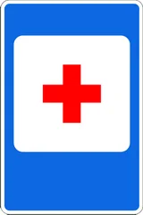
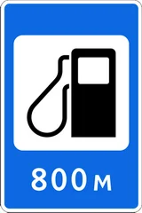
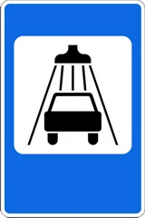
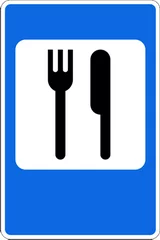
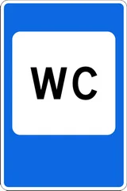
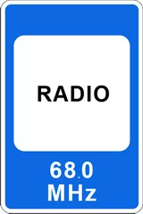
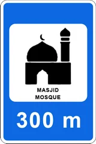
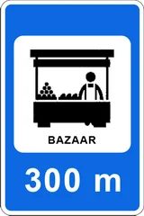
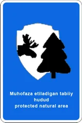

# Хизмат кўрсатиш белгилари

Всего знаков: 30

## 6.1

«Тиббий ёрдам кўрсатиш жойи».

---

## 6.2

«Шифохона».

---

## 6.3.1

«Автомобилларга ёнилғи қуйиш шохобчаси».

---

## 6.3.2

«Автомобилларга кўп тармоқли ёнилғи қуйиш шохобчаси».

---

## 6.3.3

«Электромобилларни қувватлаш шахобчаси».

---

## 6.4

«Автомобилларга техник хизмат кўрсатиш жойи».

---

## 6.5

«Автомобилларни ювиш жойи».

---

## 6.6

«Телефон».

---

## 6.7

«Ошхона».

---

## 6.8

«Ичимлик суви».

---

## 6.9

«Меҳмонхона ёки мотель».

---

## 6.10

«Кемпинг».

---

## 6.11

«Дам олиш жойи».

---

## 6.12

«ЙПХ маскани».

---

## 6.13

«Автоташувчиларнинг назорат пункти».

---

## 6.14

«Ҳожатхона».

---

## 6.15

«Чиқинди йиғиш жойи».

---

## 6.16

«Чўмилиш ҳавзаси».

---

## 6.17

«Ички ишлар бўлими».

---

## 6.18

«Радио алоқаси».

---

## 6.19

«Жомеъ масжиди».

---

## 6.20

«Черков».

---

## 6.21

«Ибодатхона».

---

## 6.22

«Темир йўл вокзали».

---

## 6.23

«Аэропорт».

---

## 6.24

«Бозор».

---

## 6.25

«Туристик ахборот маркази».

---

## 6.26

«Қўриқхона».

---

## 6.27

«Манзарали жой».

---

## 6.28

«Меъморчилик ёдгорлиги».

---

