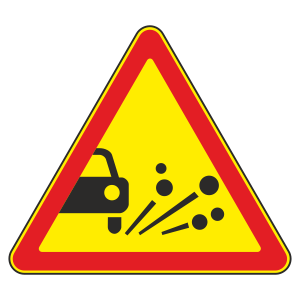
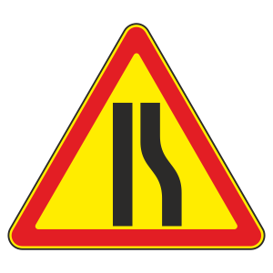
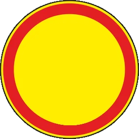
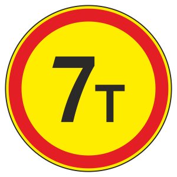
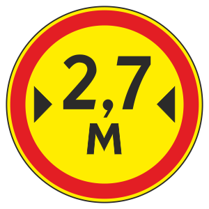
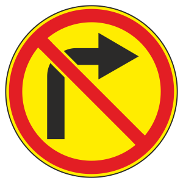
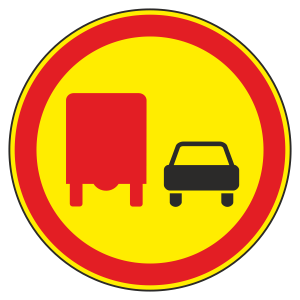

# Вақтинчалик белгилар

Всего знаков: 25

## 1.8

«Светофор билан тартибга солиш»

---

## 1.15

«Сирпанчиқ йўл»

---

## 1.16

«Нотекис йўл»

---

## 1.17

«Тош отилиши хавфи»

---

## 1.18.1

«Йўлнинг торайиши»

---

## 1.18.2

«Йўлнинг торайиши»

---

## 1.18.3

«Йўлнинг торайиши»

---

## 1.23

«Таъмирлаш ишлари»

---

## 1.30

«Бошқа хавф-хатарлар»

---

## 2.6

«Рўпара ҳаракатланишнинг устунлиги»

---

## 2.7

«Рўпарадаги ҳаракатланишга нисбатан имтиёз»

---

## 3.1

«Кириш тақиқланган»

---

## 3.2

«Ҳаракатланиш тақиқланган»

---

## 3.11

«Вазн чекланган»

---

## 3.12

«Ўққа тушадиган оғирлик чекланган»

---

## 3.13

«Чекланган баландлик»

---

## 3.14

«Чекланган кенглик»

---

## 3.15

«Чекланган узунлик»

---

## 3.16

«Энг кам оралиқ»

---

## 3.18.1

«Ўнгга бурилиш тақиқланган»

---

## 3.18.2

«Чапга бурилиш тақиқланади»

---

## 3.19

«Қайрилиш тақиқланган»

---

## 3.20

«Қувиб ўтиш тақиқланган»

---

## 3.22

«Юк автомобилларида қувиб ўтиш тақиқланган»

---

## 3.24

«Юқори тезлик чекланган»

---

