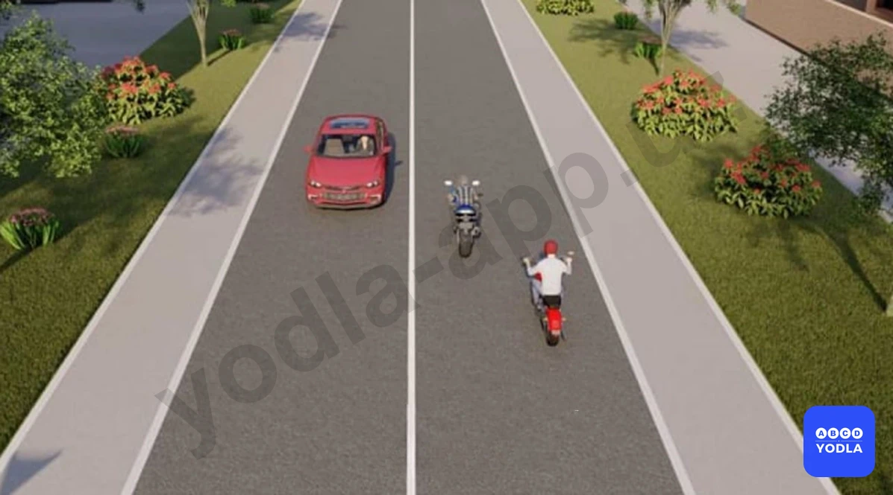
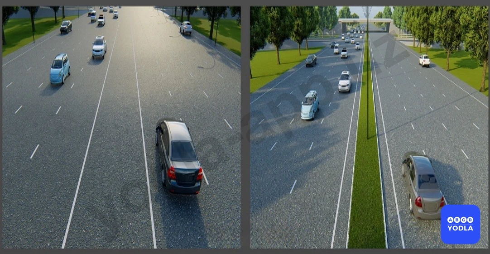

# Bilet 1

Всего вопросов: 20

## Вопрос 1

**Если на грунтовой дороге непосредственно перед перекрестком имеется участок с покрытием, то делает ли это ее равной по значению с пересекаемой?**

✅ A. Нет
⬜ B. Да

> 💡 Согласно определению 12 пункта 6 главы 1 ПДД, главная дорога – дорога с твердым покрытием (асфальт, цементно-бетон и тому подобное) по отношению к грунтовой дороге или дорога, обозначенная знаками 2.1, 2.3.1 – 2.3.3 или 5.1, по отношению к пересекаемой (примыкающей), либо любая дорога по отношению к выездам с прилегающих территорий. Наличие покрытия на второстепенной дороге непосредственно перед перекрестком не делает ее равной по значению с пересекаемой.

---

## Вопрос 2

**Кто является «Участником дорожного движения»?**

✅ A. Лицо, принимающее непосредственное участие в процессе движения как пешеход, водитель, пассажир транспортного средства
⬜ B. Любое лицо, находящееся на дороге и не выполняющее на ней работы
⬜ C. Лицо, управляющее каким-либо транспортным средством

> 💡 Согласно определению 58 пункта 6 главы 1 ПДД, участник дорожного движения – лицо, принимающее непосредственное участие в процессе дорожного движения в качестве водителя, пассажира транспортного средства или пешехода.

---

## Вопрос 3

**Что должен предпринять водитель при вынужденной остановке?**

⬜ A. Включить ближний свет фар или противотуманные фары
⬜ B. Поднять капот двигателя
✅ C. Знаки аварийной остановки должны быть включены, а при их отсутствии или неисправностях должен быть установлен знак аварийной остановки на расстоянии не менее 15 метров от транспортного средства в населенных пунктах и не менее 30 метров вне их.

> 💡 Согласно пунктов 50 и 51 главы главы 8 ПДД, при вынужденной остановке в местах, где остановка запрещена должна быть включена аварийная световая сигнализация, а также при ее неисправности надо незамедлительно выставить знак (мигающий красный фонарь) аварийной остановки.

---

## Вопрос 4

**К маршрутным транспортным средствам относятся:**

⬜ A. Автобусы и маршрутные такси
⬜ B. Трамваи и троллейбусы
✅ C. Автобусы, троллейбусы, трамваи и маршрутные такси, движущиеся по установленным маршрутам

> 💡 Согласно определению 18 пункта 6 главы 1 ПДД, маршрутное транспортное средство – транспортное средство общего пользования (троллейбус, автобус, трамвай, маршрутное такси), предназначенное для перевозки пассажиров и имеющее установленный маршрут с остановочными пунктами (остановками).

---

## Вопрос 5

**Что такое «Разрешенная максимальная масса»?**

⬜ A. Грузоподъемность транспортного средства
⬜ B. Фактическая масса транспортного средства
✅ C. . Масса снаряженного транспортного средства с грузом, водителем и пассажирами, установленная предприятием-изготовителем в качестве максимально допустимой
⬜ D. Масса груза перевозимого транспортным средством которая устанавливается в качестве допустимой технической характеристики завода-изготовителя

> 💡 Согласно определению 43 пункта 6 главы 1 ПДД, разрешенная максимальная масса – максимальная масса (величина) снаряженного транспортного средства с грузом, водителем и пассажирами, установленная предприятием–изготовителем.

---

## Вопрос 6

**Считается ли перекрестком выезд на дорогу с автозаправочной станции?**

✅ A. Не считается
⬜ B. Считается

> 💡 Согласно определений 36 и 51, данному в пункте 6 главы 1 ПДД, не считаются перекрестками выезды с прилегающих территорий. Прилегающая территория – территория, непосредственно прилегающая к дороге и не предназначенная для сквозного движения транспортных средств (дворы, жилые массивы, автостоянки, автозаправочные станции, предприятия и т. п).

---

## Вопрос 7

**Какую дорогу считать главной?**

✅ A. Дорогу с твёрдым покрытием по отношению к грунтовой или обозначенную соответствующими знаками
⬜ B. Дорогу с продолжением в обе стороны по отношению к примыкающей на трехстороннем перекрестке
⬜ C. Дорогу с многополосной проезжей частью по отношению к дороге с одной полосой для движения в каждом направлении

---

## Вопрос 8

**Что понимается под «Недостаточной видимостью»?**

⬜ A. Промежуток времени от конца вечерних сумерек до начала утренних сумерек
⬜ B. Видимость менее 150 м
✅ C. Видимость менее 300 м в условиях тумана, дождя, снегопада и т.п., а также в сумерки
⬜ D. Дождь, снегопад, сумерки

> 💡 Согласно определению 23, пункта 6 главы 1 ПДД, недостаточная видимость – видимость дороги менее 300 м в условиях дождя, снегопада, тумана и в других подобных условиях, а также в сумерки.

---

## Вопрос 9

**Сколько полос движений имеет данная дорога?**

⬜ A. Одну полосу для движения
✅ B. Две полосы для движения
⬜ C. Три полосы для движения

> 💡 Знак 5.5 раздела 5 приложения № 1 к ПДД, 5.5. «Дорога с односторонним движением». Дорога или проезжая часть, по всей ширине которой движение транспортных средств осуществляется в одном направлении.

---

## Вопрос 10

**Что означает термин "обгон"?**

⬜ A. Опережение одного или нескольких транспортных средств
✅ B. Опережение одного или нескольких транспортных средств, связанное с выездом на полосу (сторону проезжей части), предназначенную для встречного движения, и последующим возвращением на ранее занимаемую полосу (сторону проезжей части)
⬜ C. Опережение движущегося впереди транспортного средства, связанное с выездом из занимаемой полосы

> 💡 Согласно знаку 3.17.2 раздела 3 приложения № 1 к ПДД, «Опасность». Запрещается дальнейшее движение всех транспортных средств в связи с дорожно-транспортным происшествием или другой опасностью.

---

## Вопрос 11

**Пешеходный переход - это...**

✅ A. Часть участка дороги, предназначенная для пешеходного перехода с дорожными знаками 5.16.1, 5.16.2 и дорожными полосами 1.14.1-1.14.3.
⬜ B. Часть дороги, предназначенная для пешеходного движения и запрещенная для движения транспортных средств.
⬜ C. Часть дороги, примыкающая к проезжей части или отделенная от нее газоном, бордюром, специальными ограждениями и предназначенная для движения пешеходов.

> 💡 Согласно пункту 38 Правил дорожного движения, Сигналы регулировщика имеют следующие значения: руки вытянуты в стороны или опущены: со стороны левого и правого бока — разрешено движение трамваю прямо, безрельсовым транспортным средствам — прямо и направо, пешеходам разрешено переходить проезжую часть; со стороны груди и спины — движение всех транспортных средств и пешеходов запрещено.
В этой ситуации движение разрешено красной и желтой машине.

---

## Вопрос 12

**Дорожно-транспортное происшествие-**

✅ A. Событие, произошедшее во время движения транспортного средства по дороге и повлекшее гибель или вред здоровью граждан, повреждение транспортных средств, сооружений, груза или иной материальный ущерб
⬜ B. Дорожная ситуация, отражающая уровень защищенности участников дорожного движения от дорожно-транспортных происшествий и их последствий

---

## Вопрос 13

**На каком рисунке изображена дорога с двумя проезжими частями?**

⬜ A. На первой рисунке
✅ B. На второй рисунке
⬜ C. На обеих рисунках

> 💡 Согласно предмету Первой помощи при дорожно-транспортных происшествиях, травма головного мозга характеризуется следующими основными признаками:
- Потеря сознания может длиться от нескольких секунд до нескольких часов;
- Рвота - два-три раза, в тяжёлых случаях больше;
- Амнезия - потеря памяти, связана с полученной травмой и некоторые события; жизни стираются из памяти.

---

## Вопрос 14

**Пешеходная дорожка – это...**

⬜ A. Часть участка дороги, предназначенная для движения пешеходов, отделенная знаками 5.16.1, 5.16.2 и дорожной разметкой 1.14.1-1.14.3.
✅ B. Участок дороги, предназначенный для пешеходов и движения транспортных средств, запрещен.
⬜ C. Часть дороги, примыкающая к проезжей части или отделенная от нее газоном, арыком, специальными ограждениями и предназначенная для движения пешеходов.

> 💡 Согласно знаку 3.31 раздела 3 приложения № 1 к ПДД, «Конец зоны всех ограничений»,  обозначение конца зоны действия одновременно нескольких запрещающих знаков из следующих: 3.16, 3.20, 3.22, 3.24, 3.26 — 3.30.

---

## Вопрос 15

**Перекресток это...**

⬜ A. Территория непосредственно прилегающая к дороге и не предназначенная для сквозного движения транспортных средств.
✅ B. Место пересечения, примыкания или разветвление дорог на одном уровне.
⬜ C. Часть дороги, предназначенная для движения безрельсовых транспортных средств

> 💡 Согласно пункту 42 главы 7 ПДД, водителям, которые при включении жёлтого сигнала светофора не могут остановиться, не прибегая к экстренному торможению, перед стоп-линией, а в случае её отсутствия на перекрестке — перед пересекаемой проезжей частью, разрешается дальнейшее движение.

---

## Вопрос 16

**Обеспечение безопасности дорожного движения -**

✅ A. Деятельность, направленная на предупреждение причин дорожно -транспортных происшествий и уменьшение их тяжелых последствий
⬜ B. Комплекс правовых, организационно-технических мероприятий и распорядительных действий по управлению движения на дорогах

> 💡 Согласно статьи 6 Правил дорожного движения, Перекресток — место пересечения, примыкания или разветвления дорог на одном уровне. Границы перекрестка определяются воображаемыми линиями, соединяющими соответственно противоположные, наиболее удаленные от центра перекрестка начала закруглений проезжих частей.
Не считаются перекрестками выезды с прилегающих территорий.

---

## Вопрос 17

**Как называется любая из продольных полос проезжей части, обозначенная или не обозначенная дорожной разметкой и имеющая ширину, достаточную для движения в один раз?**

⬜ A. Проезжная часть
✅ B. Полоса движения
⬜ C. Обочина дороги
⬜ D. Прилегающая территория

> 💡 Более низкая передача на крутом спуске обеспечит большую эффективность торможения двигателем, поэтому выбирать передачу следует исходя из условия: чем круче спуск, тем ниже передача.

---

## Вопрос 18

**К какому термину относится следующее пояснения? Остановка движения транспортного средства из-за технической неисправности, перевозимого груза, состояния водителя и пассажиров, наличия препятствия на дороге или погодных условий.**

⬜ A. Дорожно-транспортное происшествие
⬜ B. Обеспечение безопасности дорожного движения
✅ C. Вынужденная остановка

> 💡 Согласно статьи 6 Правил дорожного движения, вынужденная остановка — прекращение движения транспортного средства по причине технической неисправности или опасности, создаваемой перевозимым грузом, состоянием водителя, пассажира, препятствием на дороге или метеорологическими условиями. Такое поведение водителя является последней необходимой мерой и нарушением не признается.

---

## Вопрос 19

**В какой формулеровке указан правильный ответ термину «Приоритет»**

⬜ A. Требование о том, что они не могут продолжать или начинать движение, совершать какие-либо маневры, в случаях, когда они могут вынудить другого участника дорожного движения, имеющего преимущественное право проезда, изменить направление или скорость движения
✅ B. Право на первоочередное движение в намеченном направлении по отношению к другим участникам движения

> 💡 Во время сильного дождя вода сохраняется в зоне контакта колес с покрытием, в результате чего может (особенно при изношенном протекторе) образоваться «водяной клин», а колеса начинают скользить по покрытию. В этом случае водителю следует плавно снизить скорость, применяя торможение двигателем, так как любое резкое изменение скорости движения может привести к заносу автомобиля.

---

## Вопрос 20

**По правилам дорожного движения дорожные знаки делятся на сколько групп?**

⬜ A. 5
⬜ B. 6
✅ C. 7

> 💡 Дорожные знаки подразделяются на 7 групп. К ним относятся: предупреждающие знаки, знаки приоритета, запрещающие знаки, предписывающие знаки, информационно-указательные знаки, знаки сервиса и знаки дополнительной информации (таблички).

---

