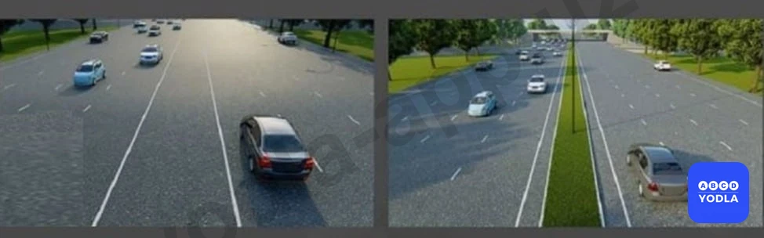

# Bilet 2

Всего вопросов: 20

## Вопрос 1

**Механическое транспортное средство...**

⬜ A. Устройство, предназначнное для перевозки людей, грузов или выполнения специальных задач.
⬜ B. Транспортное средство, не оборудованное двигателем, предназначенное для движения в составе механического транспортного средства. Этот термин также применяется к полуприцепам и раздвижным прицепам
✅ C. Транспортное средство (кроме мопеда) приводимое в движение двигателем. Термин распространяется на любые трактора и самоходные механизмы

> 💡 Под механическим транспортным средством понимаются все транспортные средства, приводимые в движение двигателем. К ним относятся автомобили, мотоциклы, тракторы и другая самоходная техника.

---

## Вопрос 2

**Прилегающая территория-...**

✅ A. Территория, непосредственно прилегающая к дороге и не предназначенная для сквозного движения транспортных средств.
⬜ B. Место, где дороги пересекаются и разветвляются на одном уровне
⬜ C. Участок дороги, предназначенный для движения безрельсовых транспортных средств

> 💡 Прилегающая территория — это территория, примыкающая к дороге, но не предназначенная для движения транспортных средств. К ней относятся дворы, автостоянки, автозаправочные станции и другие подобные места.

---

## Вопрос 3

**Какое описание подходит под понятие «Населённый пункт»?**

✅ A. Территория въезда и выезда, с которых обозначены знаками 5.22 - 5.25.
⬜ B. Территория места жительства людей.
⬜ C. Территория города и посёлка.

> 💡 Прилегающая территория — это территория, примыкающая к дороге, но не предназначенная для движения транспортных средств. К ней относятся дворы, автостоянки, автозаправочные станции и другие подобные места.

---

## Вопрос 4

**Обеспечение безопасности дорожного движения –**

✅ A. Мероприятия, направленные на предупреждение причин дорожно-транспортных происшествий и уменьшение их тяжких последствий
⬜ B. Комплекс правовых, конструктивных и технических мероприятий и управленческих мероприятий по организации дорожного движения
⬜ C. Дорожная ситуация, отражающая уровень защищенности участников дорожного движения от дорожно-транспортных происшествий и их последствий

> 💡 Безопасность дорожного движения — это комплекс мер, направленных на предотвращение дорожно-транспортных происшествий и снижение тяжести их последствий в случае возникновения. Проще говоря, это совокупность действий, обеспечивающих безопасное движение людей на дорогах.

---

## Вопрос 5

**Разделительная зона - …**

⬜ A. Часть дороги, предназначенная для движения нерельсового транспорта
⬜ B. Любой продольный участок проезжей части, обозначенный или не обозначенный дорожными линиями, достаточно широкий для движения транспортных средств в один ряд
✅ C. Высокий участок дороги, разделяющий расположенные рядом участки движения, не предназначенный для движения или остановки транспортных средств, приподнятый над уровнем дороги или отделенный газоном, канавой, специальным бордюром

> 💡 Разделительная полоса — это конструктивно выделенная или специально обозначенная часть дороги, разделяющая проезжие части встречных направлений движения. Движение и остановка транспортных средств на ней запрещены.

---

## Вопрос 6

**На каком рисунке изображена дорога с разделительная зона?**

✅ A. На правом рисунке
⬜ B. На левом рисунке
⬜ C. На обоих рисунках

> 💡 На правом изображении хорошо видна широкая разделительная полоса, покрытая зелёной растительностью, которая полностью отделяет встречные направления движения. На левом изображении имеются только белые линии разметки, а разделительная полоса отсутствует.

---

## Вопрос 7

**Дайте определение термину «Приоритет»**

⬜ A. Требование о том, что они не могут продолжать или начинать движение, совершать какие-либо маневры, в случаях, когда они могут вынудить другого участника дорожного движения, имеющего преимущественное право проезда, изменить направление или скорость движения
✅ B. Право на первоочередное движение в намеченном направлении по отношению к другим участникам движения

> 💡 Преимущество означает право одного водителя проехать или продолжить движение первым по отношению к другим участникам дорожного движения. Например, транспортное средство, движущееся по главной дороге, имеет преимущество перед транспортным средством, выезжающим со второстепенной дороги.

---

## Вопрос 8

**На каком рисунке изображена дорога двумя проезжими частями?**

⬜ A. На рисунке “А”
⬜ B. На рисунке “Б”
✅ C. Ни на одном рисунке

> 💡 На обоих изображениях отсутствует разделительная полоса. Поэтому каждая из дорог состоит из одной проезжей части. Следовательно, ни в одном из случаев нет двух проезжих частей.

---

## Вопрос 9

**Сколько проезжих частей имеет эта дорога?**

✅ A. 1
⬜ B. 2
⬜ C. 4

> 💡 На данном изображении в середине дороги отсутствует разделительная полоса. Поэтому эта дорога состоит из одной проезжей части.

---

## Вопрос 10

**На каком рисунков показано разделительная зона?**

⬜ A. А
⬜ B. Б
⬜ C. А и Б
✅ D. Ни на одном рисунке

> 💡 На обоих изображениях отсутствует возвышенная или ограждённая часть, разделяющая встречные направления движения. Поэтому на обоих изображениях разделительная полоса отсутствует.

---

## Вопрос 11

**Проезжая часть дороги:**

✅ A. Часть дороги, предназначенная для движения безрельсовых транспортных средств
⬜ B. Часть дороги, предназначенная для движения транспортных средств
⬜ C. Часть дороги, предназначенная для движения автомобилей

> 💡 Под проезжей частью понимается часть дороги, предназначенная для движения транспортных средств. Обычно это асфальтированная часть дороги, по которой осуществляется движение. Под безрельсовыми транспортными средствами понимаются транспортные средства, не движущиеся по рельсам, то есть автомобили, мототранспортные средства и велосипеды.

---

## Вопрос 12

**Полоса движения:**

⬜ A. Часть дороги, предназначенная для движения безрельсовых транспортных средств
⬜ B. Элемент дороги, разделяющий смежные проезжие части и не предназначенный для движения и остановки транспортных средств, расположенный выше уровня дороги и (или) обозначенный дорожной разметкой 1.1
✅ C. Любая из продольных полос проезжей части, обозначенная или необозначенная дорожной разметкой и имеющая ширину, достаточную для движения автомобилей в один ряд

> 💡 Полоса движения — это часть проезжей части, предназначенная для движения транспортных средств в один ряд и обозначенная дорожной разметкой либо имеющая ширину, достаточную для безопасного движения одного автомобиля.

---

## Вопрос 13

**Что называется разрешённой максимальной массой транспортного средства?**

✅ A. Максимальная масса (величина) снаряженного транспортного средства с грузом, водителем и пассажирами, установленная предприятием-изготовителем
⬜ B. Масса транспортного средства с грузом, водителем и пассажирами
⬜ C. Максимальная масса (величина) снаряженного транспортного средства без груза, без водителя и без пассажирами, установленная предприятием-изготовителем

> 💡 Разрешённая максимальная масса — это наибольшая масса транспортного средства, установленная заводом-изготовителем, включая массу самого транспортного средства, водителя, пассажиров и груза. Это предельное значение установлено в целях безопасности, и превышение этой массы является опасным и запрещённым.

---

## Вопрос 14

**Какие транспортные средства относятся к маршрутным транспортным средствам?**

✅ A. Транспортное средство общего пользования (троллейбус, автобус, трамвай, маршрутное такси), предназначенное для перевозки пассажиров и имеющее установленный маршрут с остановочными пунктами (остановками)
⬜ B. Автобусы
⬜ C. Любые транспортные средства, перевозящие пассажиров

> 💡 Знак 2.5 раздела 2 приложения № 1 к ПДД, «Движение без остановки запрещено». Запрещается движение без остановки перед стоп-линией, а если ее нет — перед краем пересекаемой проезжей части. Водитель должен уступить дорогу транспортным средствам, движущимся по пересекаемой, а при наличии дополнительного дорожного знака 7.13 — по главной дороге.
Этот дорожный знак может быть установлен перед железнодорожным переездом или карантинным постом. В этих случаях водитель должен остановиться перед стоп-линией, а при ее отсутствии — перед знаком.

---

## Вопрос 15

**Главная дорога:**

⬜ A. Дорога с асфальтобетонным покрытием по отношению к дороге, покрытой брусчаткой
⬜ B. Дорога с тремя или более полосами движения по отношению к дороге с двумя полосами
✅ C. Дорога с твердым покрытием по отношению к грунтовой дороге
⬜ D. Все ответы правильные

> 💡 ПДД общие положения: Маршрутное транспортное средство - транспортное средство общего пользования (троллейбус, автобус, трамвай, маршрутное такси), предназначенное для перевозки пассажиров и имеющее установленный маршрут с остановочными пунктами (остановками)

---

## Вопрос 16

**Какой из нижеперечисленных ответов даетправильное определение термина «пассажир»?**

⬜ A. Все лица находящиеся втранспортном средстве
✅ B. Лицо, кроме водителя, находящеесяв транспортном средстве (кромеводителя), а также лицо, котороевходит в транспортное средство(садится на него) или выходит изтранспортного средства (сходит снего)
⬜ C. Оба определения верны

> 💡 ПДД общие положения: «Пассажир» - это лицо, находящееся в транспортном средстве, а также лицо, которое входит в транспортное средство или выходит из транспортного средства.

---

## Вопрос 17

**Что называется опережение?**

✅ A. Движение транспортного средства со скоростью, большей скорости попутного транспортного средства
⬜ B. Выезд на полосу, предназначенной для движения в противоположном направлении, с последующим возвращением на ранее занимаемую полосу
⬜ C. Обгон одного или нескольких транспортных средств, движущихся по соседней полосе на малой скорости

> 💡 Пункта 6 главы 1 ПДД гласит: Опережение – движение транспортного средства со скоростью, большей скорости попутного транспортного средства.

---

## Вопрос 18

**Что такое препятствие?**

✅ A. Неподвижный объект на проезжейчасти
⬜ B. Автомобиль, остановившиеся напроезжей части из-за затора
⬜ C. Любой фактор угрожающий безопасности дорожного движения

> 💡 ПДД Общие положения: Препятствие - неподвижный объект на полосе движения (неисправное или поврежденное транспортное средство, дефект проезжей части, посторонние предметы и т.п.), не позволяющий продолжить движение по этой полосе.

---

## Вопрос 19

**Что такое перестроение ?**

✅ A. Перестроение - с одной полосына другую, сохраняя исходное направление движения
⬜ B. Перестроение - изменение направления движения в обратном направлении на специально выделенной полосе проезжей части, обозначенными дорожными знаками 5.35 - 5.37, линией 1.9и оборудованным реверсивным светофором
⬜ C. Перестроение - действие (маневр),совершаемое водителями с цельюне препятствовать движению другихучастников дорожного движения вслучае опасности

> 💡 ПДД Общие положения: Перестроение - выезд из занимаемой полосы или занимаемого ряда с сохранением первоначального направления движения.

---

## Вопрос 20

**Какой из ниже перечисленных ответов дает правильное определение термина «опасность»?**

✅ A. F1 Любой фактор, угрожающий безопасности дорожного движения
⬜ B. F2 Любое препятствие, вынуждающее участников дорожного движения менять направление движения
⬜ C. Ситуация, возникшая в процессе дорожного движения, при которой продолжение движения в том же направлении и с той же скоростью создает угрозу возникновения дорожно-транспортного происшествия

> 💡 ПДД Общие положения: Опасность - это любой фактор, который ставит под угрозу безопасность дорожного движения.

---

