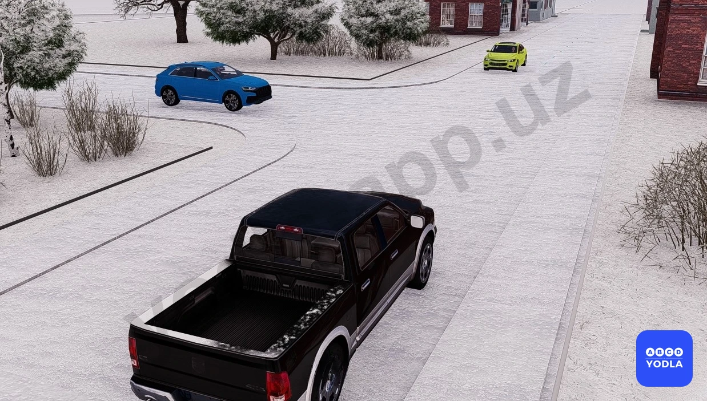
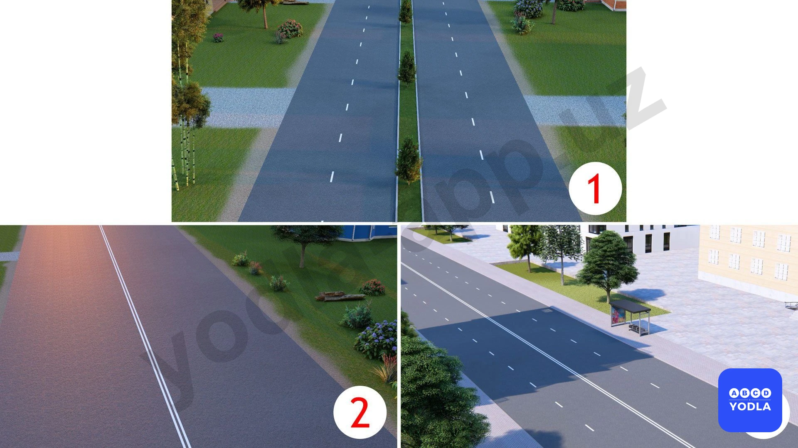
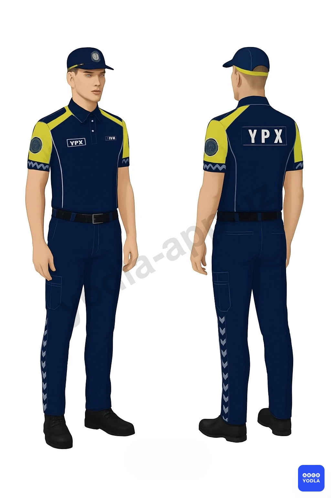

# Bilet 3

Всего вопросов: 20

## Вопрос 1

**Что делать, если водитель не может определить, заасфальтирована ли дорога, по которой он едет (темнота, грязь, снег), и нет знаков приоритета движения?**

⬜ A. Должен считать себя на главной дороге
✅ B. Должен выделяться на второстепенной дороге
⬜ C. Везде

> 💡 Если водитель не может определить наличие или отсутствие покрытия на дороге, по которой он движется (в тёмное время суток, при наличии грязи, снега и в других подобных условиях), и при этом отсутствуют знаки приоритета, он должен считать, что движется по второстепенной дороге. Основание: пункт 108 ПДД.

---

## Вопрос 2

**Сколько основные понятий и терминов используется в Правилах?**

⬜ A. 65
⬜ B. 56
⬜ C. 77
✅ D. 78

> 💡 Общие положения ПДД, пункт 6: аварийная ситуация, автомагистраль, автопоезд и другие — всего 78 основных понятий и терминов. Ранее их было 77.

В 2026 году был добавлен ещё один новый термин. В перечень основных понятий и терминов Правил дорожного движения включено понятие «малогабаритные мототранспортные средства».

Данное понятие введено на основании Постановления Кабинета Министров Республики Узбекистан №125 от 30 марта 2026 года и вступило в силу с 1 апреля 2026 года.

В Правилах этому термину дано следующее определение:

Малогабаритные мототранспортные средства — это двух-, трёх- или четырёхколёсные транспортные средства с максимальной конструктивной скоростью не более 25 км/ч, оснащённые двигателем внутреннего сгорания рабочим объёмом до 25 см³ либо электродвигателем с номинальной мощностью до 0,25 кВт.

К данному понятию не относятся средства индивидуальной мобильности (самокаты, электросамокаты и т.п.).

---

## Вопрос 3

**Следующее определение: «прекращение движения транспортного средства на время до 10 минут (приведение в неподвижное состояние)» относится к какому термину?**

✅ A. Остановка
⬜ B. Вынужденная остановка
⬜ C. Уступить дорогу
⬜ D. Стоянка

> 💡 Приведение транспортного средства в неподвижное состояние на срок до 10 минут называется остановкой.

---

## Вопрос 4

**Какое направление разрешено для движения этому транспортному средству через перекресток?**

⬜ A. Только прямо и направо
⬜ B. Только налево и разворот
⬜ C. Только направо
⬜ D. Только прямо
✅ E. Во всех направлениях

> 💡 На изображении синий круглый знак означает «Движение прямо». Однако этот знак установлен с правой стороны дороги, предназначенной для встречного направления движения. Перед микроавтобусом отсутствуют какие-либо запрещающие знаки или дорожная разметка, ограничивающие направление движения. Поэтому ему разрешается движение во всех направлениях: прямо, направо, налево и разворот.

---

## Вопрос 5

**Сколько глав и пунктов содержится в правилах дорожного движения?**

⬜ A. Глава 50 - параграф 300
⬜ B. Глава 37 - параграф 286
✅ C. Глава  29 - параграф 186

> 💡 Правила дорожного движения состоят из 29 глав и 186 пунктов.

---

## Вопрос 6

**В каком ответе правильно указано определение термина «создание аварийной обстановки»?**

⬜ A. Деятельность, направленная на предотвращение причин дорожно-транспортных происшествий и уменьшение их тяжёлых последствий
✅ B. Вынуждение других участников дорожного движения резко изменить направление движения или скорость, а также принять иные меры для обеспечения собственной безопасности или безопасности других граждан

> 💡 Создание аварийной ситуации означает вынуждение других участников дорожного движения внезапно изменить направление движения или скорость. Это является крайне опасным действием и может привести к дорожно-транспортному происшествию.

---

## Вопрос 7

**Согласно постановлению Кабинета Министров №172, из скольких пунктов состоят Правила дорожного движения?**

⬜ A. Из 184
✅ B. Из 186
⬜ C. Из 216
⬜ D. Из 220

> 💡 Правила дорожного движения состоят из 29 глав и 186 пунктов.

---

## Вопрос 8

**На каком рисунке показана четырёхполосная дорога?**

⬜ A. На первом
⬜ B. На первом и втором
⬜ C. На втором и третьем
✅ D. На всех

> 💡 На всех трёх изображениях показана дорога с четырьмя полосами движения. Независимо от того, обозначены полосы дорожной разметкой или нет, если ширина проезжей части позволяет разместить четыре полосы движения, такая дорога считается четырёхполосной. Кроме того, две параллельные сплошные линии посередине дороги указывают на наличие четырёх и более полос движения.

---

## Вопрос 9

**Каков порядок, установленный законом о регулировании взаимодействия сотрудников дорожной полиции с участниками дорожного движения и использовании специальных средств?**

⬜ A. Предотвращение дорожно-транспортных происшествий и обеспечение безопасности дорожного движения.
⬜ B. Организация специальных мероприятий
⬜ C. Преследование
⬜ D. Наблюдение
✅ E. Все ответы показаны.

> 💡 Сотрудники дорожно-патрульной службы могут использовать специальные средства во всех указанных случаях: для предотвращения происшествий, проведения специальных мероприятий, а также при преследовании и наблюдении за транспортными средствами.

---

## Вопрос 10

**Кому водитель должен предоставить свое транспортное средство независимо от направления движения?**

⬜ A. Сотрудникам дорожной службы
✅ B. Медицинским служащим, для транспортировки больного в случаях угрожающих его жизни

> 💡 Согласно абзацу з пункта 11 главы 2 ПДД водитель транспортного средства обязан предоставлять транспортное средство медицинским работникам, следующим в попутном направлении для оказания медицинской помощи, а также для транспортировки граждан, нуждающихся в безотлагательной медицинской помощи, в лечебно-профилактическое учреждение.

---

## Вопрос 11

**В каком из перечисленных случаев Правила обязывают водителя предоставить свое транспортное средство в распоряжение работника органов внутренних дел?**

⬜ A. В любом случае
✅ B. Для выполнения неотложных служебных заданий
⬜ C. В любом случае для следования к месту работы

> 💡 Согласно абзацу з пункта 11 главы 2 ПДД водитель транспортного средства обязан предоставлять транспортное средство сотрудникам ОВД, Национальной гвардии, Службы государственной безопасности и  Государственной службы безопасности Президента Республики Узбекистан для выполнения неотложных служебных заданй в случаях, предусмотренных законодательством.

---

## Вопрос 12

**Что должен сделать в первую очередь водитель; причастный к дорожно-транспортному происшествию?**

⬜ A. Остановиться на месте происшествия, записать фамилии и адреса очевидцев, сообщить о случившемся в милицию, принять меры для оказания доврачебной медицинской помощи пострадавшим
✅ B. Немедленно остановиться и оставаться на месте происшествия, включить аварийную световую сигнализацию и выставить знак аварийной остановки
⬜ C. Остановиться и принять все возможные меры к сохранению следов происшествия, ограждению их и организации объезда места происшествия, сообщить о случившемся в милицию и принять меры для оказания доврачебной медицинской помощи пострадавшим

> 💡 Пункта 13 главы З ПДД гласит: При дорожно-транспортном происшествии водители, причастные к нему, обязаны: немедленно остановить транспортное средство, включить аварийную световую сигнализацию или выставить знак аварийной остановки (мигающий красный фонарь), не перемещать транспортное средство и предметы, имеющие отношение к происшествию.

---

## Вопрос 13

**Может ли лицо; имеющее доверенность на право распоряжения транспортным средством; передавать управление транспортным средством в своем присутствии другому лицу?**

⬜ A. Разрешена
⬜ B. Нельзя
✅ C. Может; при наличии у этого лица водительского удостоверения на право управления транспортным средством данной категории; и оно указано в страховом полисе обязательного страхования гражданской ответственности владельца транспортного средства

> 💡 Пункта 8 главы 2 ПДД гласит: Лицо, имеющее удостоверение на право управления транспортным средством соответствующей категории, талон к нему или временное разрешение, имеет право управлять не принадлежающим ему транспортным средством в присутствии владельца или лица, имеющего документ, подтверждающий право на распоряжение, владение и пользование транспортным средством (по их согласию), а также при условии, что договор обязательного страхования гражданской ответственности владельца транспортного средства заключен в отношении неограниченного числа лиц, допущенных к управлению данным транспортным средством, либо если лицо, управляющее транспортным средством, указано в страховом полисе.

---

## Вопрос 14

**В каком случае водитель должен предоставить грузовой автомобиль работнику органов внутренних дел для буксировки транспортного средства поврежденного при дорожно транспортном происшествии?**

⬜ A. Только в случае, если буксировка будет осуществляться в попутном направлении
✅ B. В любом случае, кроме транспортных средств принадлежащих гражданам
⬜ C. По усмотрению водителя

> 💡 Пункта 91 главы 13 ПДД, гласит: на пересечениях проезжих частей и на расстоянии менее 30 метров от края пересекаюшей проезжей части (за исключением противоположной стороны примыкающей дороги, отделенной разделительной линией или разделительной полосой на трехсторонних перекрестках).

---

## Вопрос 15

**Разрешается ли водителю управлять транспортным средством под воздействием лекарственных препаратов; снижающих скорость реакции и внимание?**

✅ A. Запрещается
⬜ B. Разрешается
⬜ C. Разрешается, если стаж водителя более 2-х лет

> 💡 Пункту 12 главы 2 ПДД, гласит: Водителю запрещается: - управлять транспортным средством в состоянии любого опьянения (алкогольного, наркотического и др.), под воздействием лекарственных препаратов, снижающих скорость реакции и внимание, в болезненном или утомленном состоянии, способным создать угрозу безопасности движения.

---

## Вопрос 16

**Если в результате дорожно-транспортного происшествия нет пострадавших, а материальный ущерб несущественен, могут ли водители сами покинуть место происшествия и прибыть на ближайший пост ГСБДД или в органы внутренних дел для оформления происшествия?**

⬜ A. Не могут
⬜ B. Могут
✅ C. Могут; предварительно составив схему происшествия и подписав ее

> 💡 Пункта 14 главы 3 ПДД, гласит: Если в результате дорожно-транспортного происшествия нет пострадавших, то водители, при взаимном согласии в оценке обстоятельств случившегося, могут прибыть на ближайший пост ГСБДД или в орган милиции для оформления происшествия, предварительно составив схему происшествия и подписав ее.

---

## Вопрос 17

**Разрешается ли водителю пользоваться телефоном во время движения?**

⬜ A. Разрешается
✅ B. Разрешается только при использовании технического устройства, позволяющего вести переговоры без использования рук
⬜ C. Разрешается только при движении со скоростью менее 20 км/ч

> 💡 Знак 1.6 раздела 1 приложения № 1 к ПДД, «Пересечение равнозначных дорог». Устанавливаются в населенных пунктах на расстоянии 50 — 100 м до начала опасного участка. Согласно пункту 105 главы 16 ПДД, на перекрестке равнозначных дорог водитель безрельсового транспортного средства обязан уступить дорогу транспортным средствам, приближающимся справа.

---

## Вопрос 18

**Что обязаны сделать в первую очередь водители, причастные к дорожно-транспортному происшествию?**

⬜ A. Освободить проезжую часть
✅ B. Немедленно остановиться, включить аварийную сигнализацию и выставить знак аварийной остановки
⬜ C. Сообщить о случившемся в СБДД

> 💡 Согласно пункту 67 Правил дорожного движения, вне населенных пунктов, а также в населенных пунктах на участках дорог, где разрешено движение с большей скоростью для отдельных видов транспортных средств, чем предписано настоящими Правилами, водители транспортных средств должны двигаться по возможности ближе к правому краю проезжей части. Запрещается занимать левые полосы движения при свободных правых.

---

## Вопрос 19

**Следующим лицам разрешается не пристегиваться ремнями безопасности в транспортных средствах, предусмотренных конструкцией ремней безопасности?**

⬜ A. Детям до 12 лет на заднем сиденье автомобиля
⬜ B. Беременным женщинам
⬜ C. Водителям, едущим задним ходом
✅ D. 1 и 2 ответы верны
⬜ E. Во всех перечисленных случаях

> 💡 Пункта 32 главы 7 ПДД, гласит: Сигналы светофора, выполненные в виде стрелок красного, желтого и зеленого цветов тоже имеют то же значение, что и круглые соответствующего цвета. Их действие распространяется только на направление, указываемое стрелками.
Стрелка, разрешающая поворот налево, разрешает и разворот, если это не запрещено соответствующим дорожным знаком.
Также это значение имеет зелёная стрелка в дополнительной секции.
Выключенный сигнал дополнительной секции означает запрещение движения в направлении, регулируемом этой секцией.
ПДД приложение № 1: Поворот налево запрещен.

---

## Вопрос 20

**Какой документ разрешает владельцу механического транспортного средства управлять транспортным средством, если у него нет водительских прав?**

⬜ A. Биометрик паспорт
⬜ B. ID карта
⬜ C. Право собственности
⬜ D. Все ответы верны
✅ E. Первый и второй ответы верны

> 💡 Пункт 91 главы 13 ПДД гласит:
что остановка запрещается в местах, где расстояние между сплошной линией разметки (кроме обозначающей край проезжей части) и остановившимся транспортным средством менее 3 м.

---

