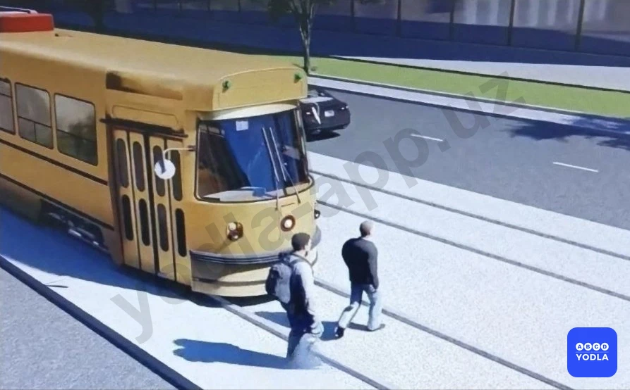
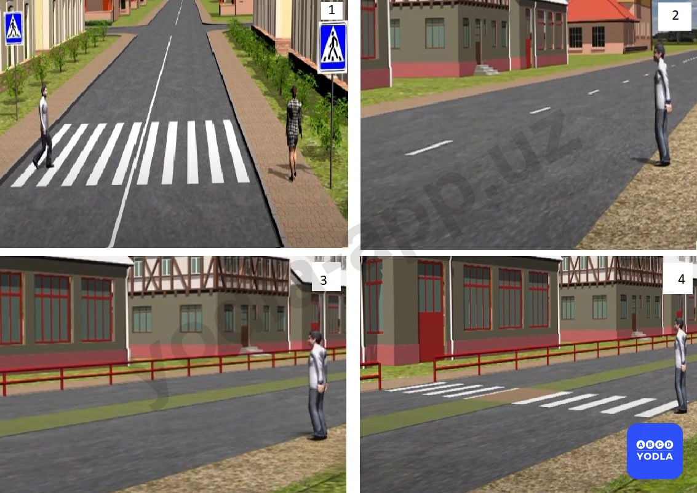
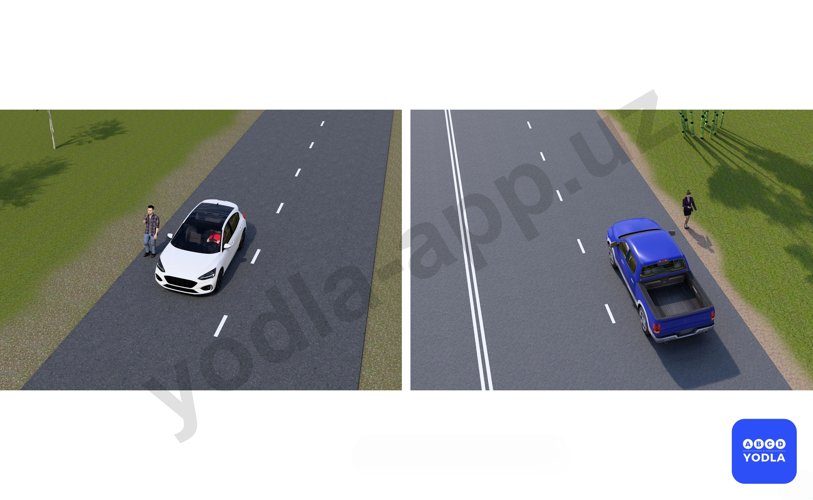
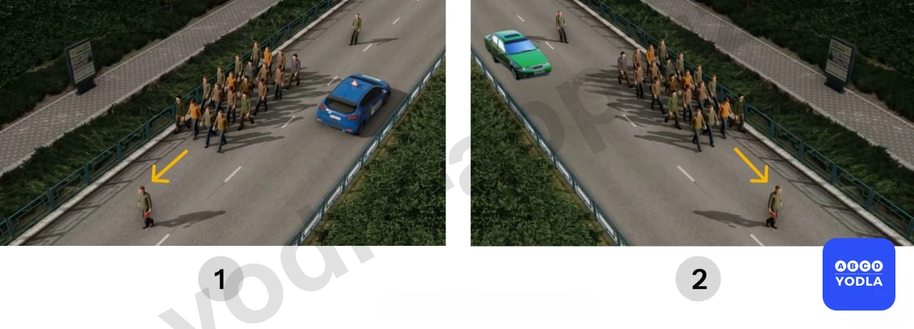
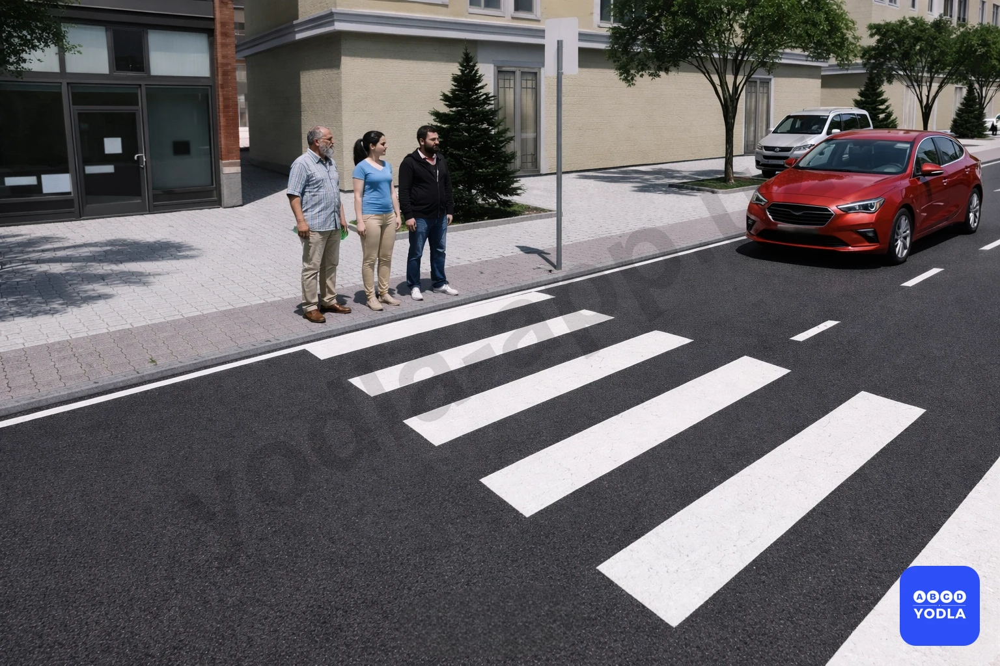

# Bilet 4

Всего вопросов: 20

## Вопрос 1

**В случаях, когда концентрация паров этанола, выделяемых водителем транспортного средства, указывает на это, сотрудник DYHXX составит административный отчет о факте употребления водителем алкогольного напитка**

⬜ A. В случае концентрации 0,105 миллиграмма на литр подаваемого воздуха и выше 
✅ B. При концентрации 0,135 миллиграмма или более на литр выдыхаемого воздуха
⬜ C. При концентрации 0,255 миллиграмма или более на литр выдыхаемого воздуха

> 💡 Если содержание этанола в выдыхаемом водителем воздухе составляет 0,135 миллиграмма и выше, водитель считается находящимся в состоянии опьянения, и в установленном порядке оформляется административный протокол.

---

## Вопрос 2

**Где безопаснее всего разместить детское удерживающее устройство в автомобиле?**

✅ A. Заднее среднее сиденье
⬜ B. Переднее сиденье
⬜ C. Место за водителем

> 💡 Самым безопасным местом для установки детского удерживающего устройства считается среднее сиденье заднего ряда. При столкновении оно подвергается наименьшему риску, поскольку расположено на наибольшем удалении от всех сторон автомобиля.

---

## Вопрос 3

**Разрешается ли пешеходам переходить дорогу вне пешеходного перехода?**

⬜ A. Разрешается
✅ B. Разрешается переходить проезжую часть под прямым углом к её краю, на участках дороги с хорошей видимостью в обе стороны, при отсутствии в пределах видимости пешеходного перехода или перекрёстка, на дорогах без разделительной полосы и без ограждений.
⬜ C. Запрещается

> 💡 Согласно пункту 17 главы 4 ПДД, при отсутствии в зоне видимости перехода или перекрестка разрешается переходить дорогу под прямым углом к краю проезжей части на участках без разделительной полосы и ограждений там, где она хорошо просматривается в обе стороны.

---

## Вопрос 4

**В каком ответе наиболее полно указаны места; посадки и высадки пассажиров при отсутствии посадочной площадки?**

⬜ A. На проезжей части или тротуаре
⬜ B. На тротуаре
⬜ C. На обочине или на проезжей части
✅ D. Со стороны тротуара или обочины

> 💡 Согласно абзацу 1 пункта 23 главы 5 ПДД, пассажиры обязаны производить посадку и высадку со стороны тротуара или обочины и только после полной остановки транспортного средства.

---

## Вопрос 5

**На каком рисунке пешеходы двигаются без нарушения правил?**

⬜ A. На левом рисунке
⬜ B. На правом рисунке
✅ C. На обоих рисунках

> 💡 Согласно абзацу 1 и 3 пункта 15 главы 4 ПДД, пешеходы должны двигаться по тротуарам или пешеходным дорожкам, а при их отсутствии – по обочинам. При движении по краю проезжей части пешеходы должны идти навстречу движению транспортных средств.

---

## Вопрос 6

**В каком месте разрешается пешеходам пересекать проезжую часть при отсутствии пешеходного перехода?**

⬜ A. На перекрестках по линии тротуаров или обочин
⬜ B. На участках; где она хорошо просматривается в обе стороны под прямым углом к краю проезжей части
✅ C. Во всех перечисленных местах

> 💡 Согласно абзацу 2 пункта 17 главы 4 ПДД, при отсутствии в зоне видимости перехода или перекрестка разрешается переходить дорогу под прямым углом к краю проезжей части на участках без разделительной полосы и ограждений там, где она хорошо просматривается в обе стороны.

---

## Вопрос 7

**Разрешается ли пассажирам отвлекать водителя при управлении транспортным средством?**

⬜ A. Разрешается
⬜ B. Разрешается только для покупки разовых талонов в маршрутных транспортных средствах
✅ C. Запрещается

> 💡 Согласно абзацу 1 пункта 24 главы 5 ПДД, пассажирам запрещается отвлекать водителя (или мешать ему) от управления транспортным средством во время движения транспортного средства.

---

## Вопрос 8

**В каком случае разрешается посадка и высадка пассажиров со стороны проезжей части?**

⬜ A. При вынужденной остановке транспортного средства
⬜ B. По усмотрению водителя при условии, что это будет безопасно и не создает помех другим участникам движения
✅ C. Если это невозможно сделать со стороны тротуара или обочины и при условии, что это будет безопасно и не создает помех другим участникам движения

> 💡 Согласно абзацу 2 пункта 23 главы 5 ПДД, если посадка и высадка невозможна со стороны тротуара или обочины, она может осуществляться со стороны проезжей части при условии, что это будет безопасно и не создаст помех другим участникам движения.

---

## Вопрос 9

**Разрешается ли пешеходам переходить проезжую часть вне пешеходного перехода при наличии разделительной полосы?**

⬜ A. Разрешается в местах где дорога просматривается в обе стороны
⬜ B. Разрешается только вне населенных пунктов
⬜ C. Разрешается только в населенных пунктах
✅ D. Запрещается

> 💡 Согласно абзацу 2 пункта 17 главы 4 ПДД, при отсутствии в зоне видимости перехода или перекрестка разрешается переходить дорогу под прямым углом к краю проезжей части на участках без разделительной полосы и ограждений там, где она хорошо просматривается в обе стороны. Запрещается при наличии разделительной полосы.

---

## Вопрос 10

**Могут ли пешеходы двигаться по велосипедным дорожкам при отсутствии тротуара или пешеходной дорожки?**

✅ A. Могут
⬜ B. Могут, если это не затрудняет движение велосипедов
⬜ C. Не могут

> 💡 Согласно абзацу 1  пункта 15 главы 4 ПДД, пешеходы должны двигаться по тротуарам, пешеходным дорожкам, пешеходным и велосипедным дорожкам, а при их отсутствии – по обочинам.

---

## Вопрос 11

**Как должны двигаться пешеходы по проезжей части при отсутствии тротуара**

✅ A. По краю проезжей части навстречу движению транспортных средств
⬜ B. По обочине или краю проезжей части по ходу движения транспортных средств
⬜ C. В любом направлении

---

## Вопрос 12

**Пешеходы при пересечении дороги с какой стороны обязаны обходить стоящий автобус и троллейбус?**

⬜ A. Спереди
✅ B. Сзади
⬜ C. С любой стороны

> 💡 Пешеходы должны обходить автобус или троллейбус сзади. В этом случае они могут заранее увидеть транспортные средства, движущиеся по дороге, и принять необходимые меры предосторожности.

---

## Вопрос 13

**Пешеходы при пересечении дороги с какой стороныобязаны обходить стоя��ий автобус и троллейбус?**

⬜ A. Спереди
✅ B. Сзади
⬜ C. С любой стороны

> 💡 Пешеходы должны обходить автобус или троллейбус сзади. В этом случае они могут заранее увидеть транспортные средства, движущиеся по дороге, и принять необходимые меры предосторожности.

---

## Вопрос 14

**Как водить группы детей при отсутствии пешеходных дорожек и тротуара?**

⬜ A. С краю проезжей части в сопровождении взрослых
✅ B. По обочинам, только в светлое время суток и в сопровождении взрослых

> 💡 Знак 7.12 раздела 7 приложения № 1 к ПДД, «Опасная обочина». Предупреждает, что съезд на обочину опасен в связи с проведением на ней ремонтных работ. Применяется со знаком 1.23.

---

## Вопрос 15

**Пассажирам запрещается?**

⬜ A. Отвлекать водителя или мешать ему во время движения транспортного средства
⬜ B. Стоять на движущихся платформах грузовиков, сидеть на бортах или на грузах над ними.
⬜ C. Запрещено открывать двери движущегося транспортного средства.
✅ D. Все выше указанные ответы верны

> 💡 Пассажирам запрещается совершать опасные действия. Запрещается открывать двери во время движения транспортного средства, стоять в кузове грузового автомобиля и отвлекать водителя. Поэтому правильным является ответ: все перечисленные варианты.

---

## Вопрос 16

**Разрешается ли переходить дорогу перед трамваем, как показано на рисунке?**

✅ A. Разрешается
⬜ B. Запрещается
⬜ C. Разрешено с любой стороны

> 💡 Если трамвай остановился для посадки или высадки пассажиров, водитель может осторожно объехать его спереди. Это связано с тем, что при обходе сзади можно не заметить трамвай, движущийся во встречном направлении. Для пешеходов обход стоящего трамвая сзади приравнивается к выходу на проезжую часть из-за препятствия, что является опасным и запрещается.

---

## Вопрос 17

**В какой картинке пешеход переходит дорогу с нарушением правил?**

⬜ A. На рисунке 1-2
✅ B. На рисунке 3
⬜ C. На рисунке 4
⬜ D. На всех картинах

> 💡 На третьем изображении пешеход пересекает дорогу в месте, где отсутствует пешеходный переход. Следует обратить внимание на то, что на дороге имеется разделительная полоса. Такая ситуация считается нарушением Правил дорожного движения. На остальных изображениях пешеходы пользуются специально обозначенным пешеходным переходом («зеброй») либо переходят дорогу в разрешённом месте в соответствии с правилами.

---

## Вопрос 18

**На каком снимке пешеходы движутся без нарушения правил?**

⬜ A. На картинке слева
✅ B. На картинке справа
⬜ C. На обеих картинках

> 💡 На изображении слева пешеходы движутся по проезжей части в направлении движения транспортных средств, что является нарушением Правил дорожного движения. На изображении справа пешеходы безопасно передвигаются по краю дороги, по специально отведённой для них зоне или по пешеходной дорожке.

---

## Вопрос 19

**На каком изображении организованная группа пешеходов движется по проезжей части, не нарушая правила?**

✅ A. 1
⬜ B. 2
⬜ C. 1,2

> 💡 Группа пешеходов движется по правой стороне дороги в направлении движения транспортных средств, что является правильным. На втором изображении пешеходы идут по левой стороне дороги, что противоречит Правилам дорожного движения.

---

## Вопрос 20

**Разрешено ли пешеходам переходить проезжую часть?**

⬜ A. Допустимый
✅ B. Запрещенный
⬜ C. Разрешено во всех случаях

> 💡 На изображении к пешеходному переходу приближаются транспортные средства, и у пешехода отсутствует возможность безопасно перейти дорогу. Пешеход может выйти на проезжую часть только после того, как убедится в безопасности перехода.

---

