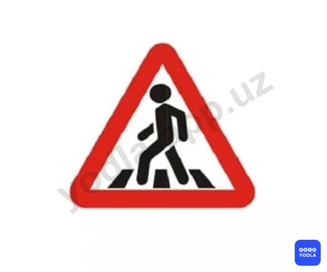
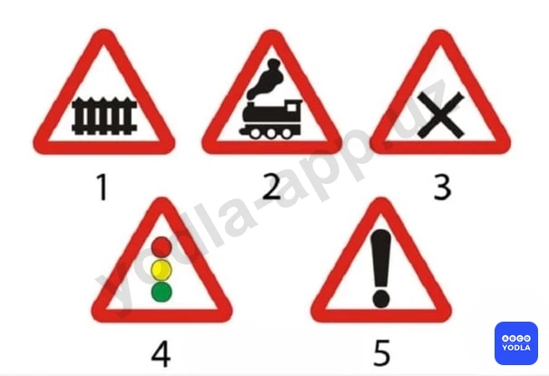
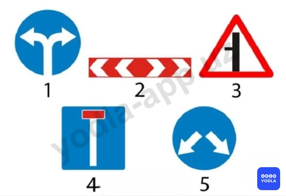
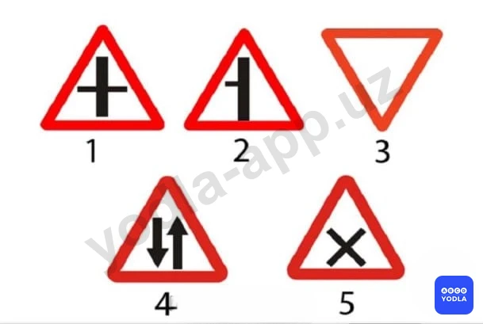
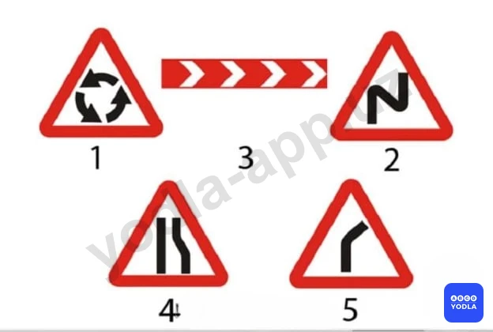
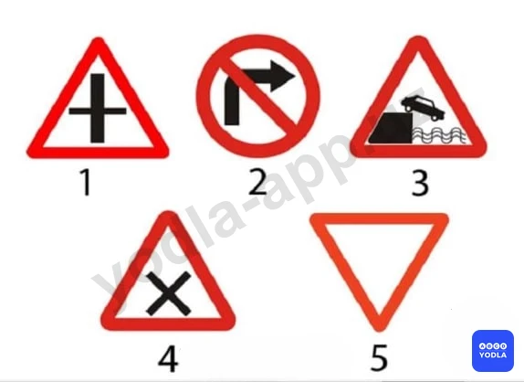
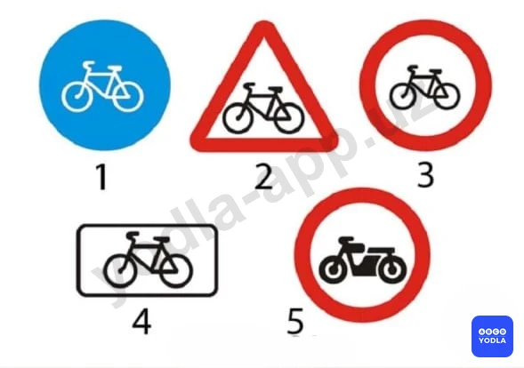
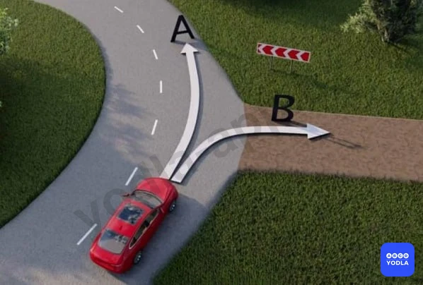

# Bilet 5

Всего вопросов: 20

## Вопрос 1

**Даёт ли проблесковый маячок жёлтого цвета  право проезда, когда он включен?**

⬜ A. Дает
✅ B. Не дает

> 💡 Согласно пункту 28 главы 6 ПДД, проблесковый маячок жёлтого или оранжевого цвета не дает приоритета в движении и служит исключительно для предупреждения других участников движения об опасности.

---

## Вопрос 2

**Как должен поступить водитель красного автомобиля при приближении транспортного средства с включенными проблесковым маячком и специальным звуковым сигналом?**

⬜ A. Не изменяя направление движения; зажечь сигнал экстренной остановки и остановится на месте
⬜ B. Снизить скорость и без резких маневров перейти на другой ряд; продолжить движение
✅ C. Уступить дорогу

> 💡 Согласно термину 26 пункта главы 6 ПДД, при приближении транспортных средств с включенными проблесковым маячком синего цвета или синего и красного цветов и специальным звуковым сигналом, а также сопровождаемых ими транспортных средств с включенным ближним светом фар водители обязаны уступить им дорогу для обеспечения их беспрепятственного проезда. Запрещается выполнять обгон таких транспортных средств.

---

## Вопрос 3

**К Вам приближается транспортное средство; на котором включен проблесковый маячок синего цвета и специальный звуковой сигнал. Как Вы должны поступить; если движетесь навстречу такому транспортному средству?**

⬜ A. Остановиться на обочине или у тротуара
✅ B. Продолжать движение; не создавая помех транспортному средству с включёнными специальными сигналами

> 💡 Пункта 26 главы 6 ПДД гласит: При приближении транспортных средств оперативных и специальных служб с включенными проблесковым маячком синего или красного или синего и красного цветов и специальным звуковым сигналом, а также сопровождаемого ими транспортного средства (транспортных средств) с включенным ближним светом фар водители обязаны уступить им дорогу для обеспечения их беспрепятственного проезда.

---

## Вопрос 4

**Водитель какого транспортного средства должен уступить дорогу?**

⬜ A. Водитель автомобиля скорой помощи
✅ B. Водитель легкового автомобиля

> 💡 Согласно термину 26 пункта главы 6 ПДД, при приближении транспортных средств с включенными проблесковым маячком синего цвета или синего и красного цветов и специальным звуковым сигналом, а также сопровождаемых ими транспортных средств с включенным ближним светом фар водители обязаны уступить им дорогу для обеспечения их беспрепятственного проезда.

---

## Вопрос 5

**Как должен поступить пешеход при приближении транспортного средства с включенным проблесковым маячком и специальным звуковым сигналом?**

⬜ A. Как можно скорее перейти проезжую часть
✅ B. Воздержаться от перехода проезжей части
⬜ C. Перейти проезжую часть, если он находится на пешеходном переходе

> 💡 Согласно пункту 21 главы 4 ПДД, при приближении транспортных средств с включёнными синими или синими и красными проблесковыми маячками и специальным звуковым сигналом пешеходы обязаны воздержаться от перехода проезжей части, а находящиеся на ней — должны уступить дорогу этим транспортным средствам и незамедлительно освободить проезжую часть.

---

## Вопрос 6

**Как должен поступить водитель встречного автомобиля в данной ситуации?**

⬜ A. Остановиться на обочине
✅ B. Продолжить движение; не создавая помех автомобилю с включенными проблесковыми маячками

> 💡 Согласно термина 26 пункта главы 6 ПДД, при приближении транспортных средств с включенными проблесковым маячком синего цвета или синего и красного цветов и специальным звуковым сигналом, а также сопровождаемых ими транспортных средств с включенным ближним светом фар водители обязаны уступить им дорогу (не создавать помех) для обеспечения их беспрепятственного проезда.

---

## Вопрос 7

**Черный автомобиль проедет перекресток:**

⬜ A. Первым
✅ B. Вторым
⬜ C. Последним

> 💡 Согласно пункту 26 главы 6 ПДД, 26. При приближении транспортных средств с включенными проблесковым маячком синего цвета или синего и красного цветов и специальным звуковым сигналом, водители обязаны уступить дорогу для обеспечения беспрепятственного проезда. Согласно пункту 107 главы 16 ПДД, при повороте налево или развороте водитель безрельсового транспортного средства обязан уступить дорогу транспортным средствам, движущимся по равнозначной дороге со встречного направления прямо или направо.

---

## Вопрос 8

**Что должен сделать водитель грузового автомобиля в случае; когда он слышит специальный звуковой сигнал и видит проблесковый маячок?**

⬜ A. Продолжать свое движение по полосе
✅ B. Водитель при приближении специального транспортного средства с включенными проблесковым маячком и специальным звуковым сигналом, обязан уступить им дорогу, при необходимости остановиться у правого края проезжей части

> 💡 Согласно термину 26 пункта главы 6 ПДД, при приближении транспортных средств с включенными проблесковым маячком синего цвета или синего и красного цветов и специальным звуковым сигналом, а также сопровождаемых ими транспортных средств с включенным ближним светом фар водители обязаны уступить им дорогу для обеспечения их беспрепятственного проезда. Запрещается выполнять обгон таких транспортных средств.

---

## Вопрос 9

**Для того чтобы транспортные средства оперативных и специальных служб имели преимущество перед другими участниками дорожного движения:**

⬜ A. Должны быть включены проблесковые маячки синего или красного цвета, либо синего и красного цветов одновременно
⬜ B. Должна быть включена специальная звуковая сигнализация
✅ C. Должны быть включены оба (и проблесковые маячки, и звуковая сигнализация)

> 💡 Для получения преимущества в движении у автомобилей скорой помощи или полиции одновременно должны быть включены синий или красный проблесковый маячок и специальный звуковой сигнал. Включения только одного из них недостаточно — оба сигнала должны быть включены одновременно.

---

## Вопрос 10

**Специальное транспортное средство с включенными синими проблесковыми маячками и специальным звуковым сигналом, проедет перекресток:**

⬜ A. Последним
✅ B. Первым
⬜ C. Вторым

> 💡 Автомобиль скорой помощи движется с включёнными специальными сигналами. Поэтому он считается выполняющим неотложное задание, и все остальные транспортные средства обязаны уступить ему дорогу.

---

## Вопрос 11

**Этот дорожный знак обозначает:**

⬜ A. Участок дороги, на котором имеется тротуар или пешеходная дорожка
✅ B. Участок дороги, на котором имеется пешеходный переход

> 💡 Знак 1.20 «Пешеходный переход» раздела 1 приложения № 1 к ПДД, пешеходный переход, обозначенный знаками 5.16.1, 5.16.2 и (или) разметкой 1.14.1-1. 14.3.

---

## Вопрос 12

**Этот дорожный знак предупреждает:**

⬜ A. О приближение к железнодорожному переезду с одним путем
✅ B. Необорудованный шлагбаумом железнодорожный переезд с одним путем
⬜ C. Необорудованный шлагбаумом Железнодорожный переезд с двумя путями

> 💡 Согласно знаку 1.3.1 раздела 1 приложения № 1 к ПДД, «Однопутная железная дорога» обозначение необорудованного шлагбаумом переезда с одним путем.

---

## Вопрос 13

**На каком расстоянии до начала опасного участка устанавливаются эти знаки в населенных пунктах?**

⬜ A. 15-25 м
⬜ B. 25-50 м
✅ C. 50-100 м
⬜ D. 100-150 м
⬜ E. 150-300 м

> 💡 Согласно абзацу 1 раздела 1 приложения № 1 к ПДД, перечисленные предупреждающие знаки 1.1, 1.2, 1.6, 1.8 и 1.30 устанавливаются в населенных пунктах – на расстоянии 50-100 метр до начала опасного участка.

---

## Вопрос 14

**Какой знак указывает направление движения на Т-образном перекрестке?**

⬜ A. 1
✅ B. 2
⬜ C. 3
⬜ D. 4
⬜ E. 5

> 💡 Знак 1.31.3 «Направление поворота»  раздела 1 приложения № 1 к ПДД, направление движения на Т–образном перекрестке или разветвлении дорог. Направление объезда ремонтируемого участка дороги.

---

## Вопрос 15

**Какой знак предупреждает о приближении к перекрестку равнозначных дорог?**

⬜ A. 1
⬜ B. 2
⬜ C. 3
⬜ D. 4
✅ E. 5

> 💡 Согласно знаку 1.6 раздела 1 приложения № 1 к ПДД, «Пересечение равнозначных дорог» информирует водителей о приближении к перекрестку равных по значению дорог.

---

## Вопрос 16

**Какие из указанных знаков относятся к предупреждающим?**

⬜ A. Все кроме второго
⬜ B. Все кроме третьего
✅ C. Все

> 💡 Знак 1.11.1 раздела 1 приложения № 1 к ПДД, «Опасный поворот». Закругление дороги малого радиуса или с ограниченной видимостью: 1.11.1 — направо.

---

## Вопрос 17

**Какие знаки обязательно повторяются при установке вне населенных пунктов?**

⬜ A. 1
⬜ B. 2
✅ C. 3
⬜ D. 4
⬜ E. 5

> 💡 Знак 1.10 «Выезд на набережную»  раздела 1 приложения № 1 к ПДД, вне населенных пунктов повторяются. Второй знак устанавливается на расстоянии не менее 50 м до начала опасного участка.

---

## Вопрос 18

**Какой знак называется “Пересечение с велосипедной дорожкой”?**

⬜ A. 1
✅ B. 2
⬜ C. 3
⬜ D. 4
⬜ E. 5

> 💡 Согласно знаку 1.22 раздела 1 приложения № 1 к ПДД, «Пересечение с велосипедной дорожкой».

---

## Вопрос 19

**Какой знак предупреждает о приближении к опасному повороту дороги?**

⬜ A. 1
✅ B. 2
⬜ C. 3
⬜ D. 4
⬜ E. 5

> 💡 Знак 1.11.2 раздела 1 приложения № 1 к ПДД, «Опасный поворот» предупреждает о приближении к закруглению дороги малого радиуса или с ограниченной видимостью, 1.11.2 – налево.

---

## Вопрос 20

**По какому пути разрешено движение?**

⬜ A. «А»
⬜ B. «B»
✅ C. «А» и «B»

> 💡 Знак 1.11.2 раздела 1 приложения № 1 к ПДД, «Опасный поворот», закругление дороги малого радиуса или с ограниченной видимостью – налево и знак 1.31.2. «Направление поворота», направление движения на закруглении дороги малого радиуса с ограниченной видимостью и направление объезда ремонтируемого участка дороги. Не запрещается движение прямо влево или вправо.

---

