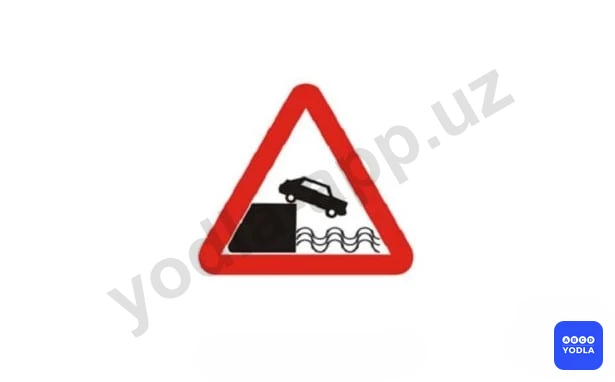
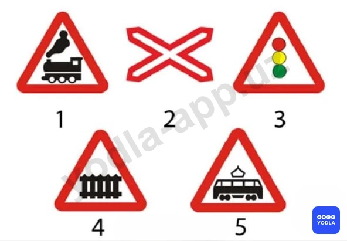
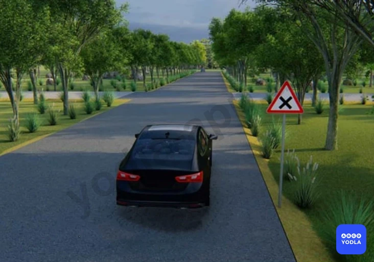
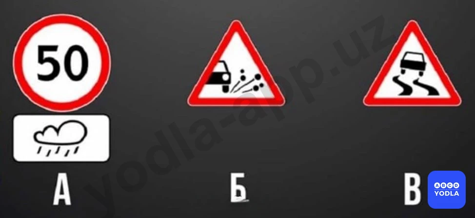
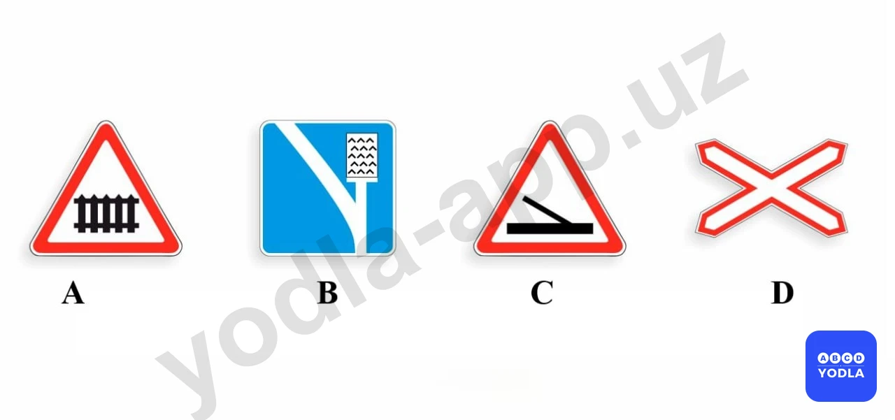
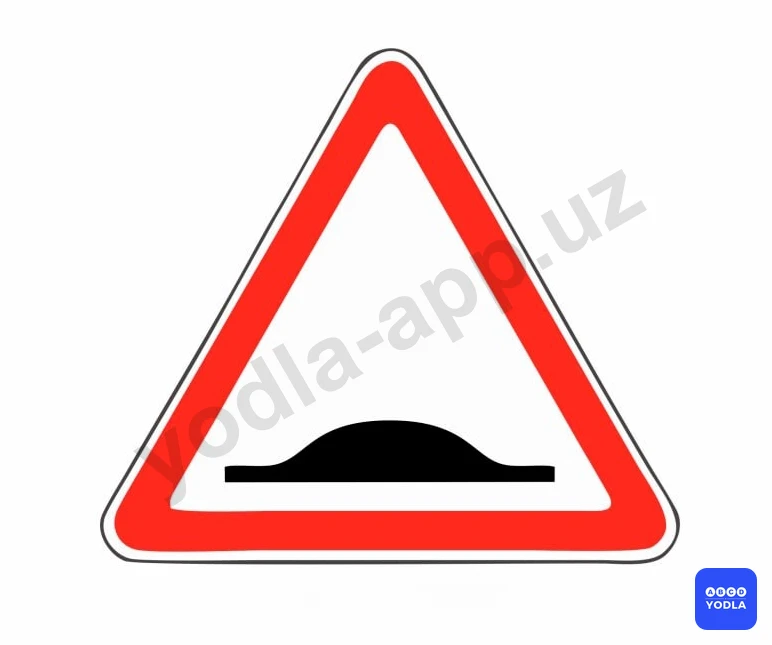
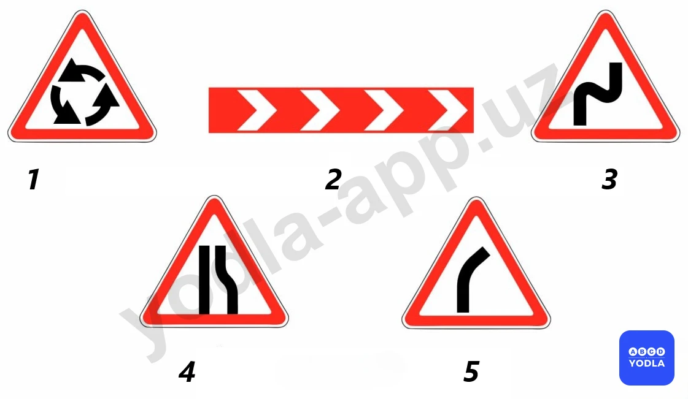
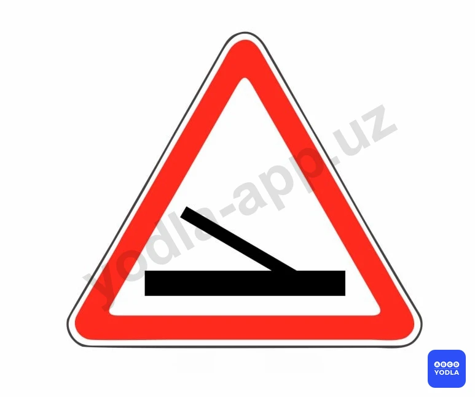
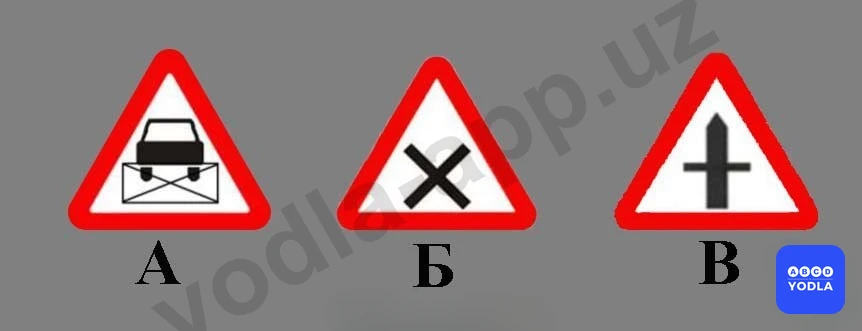
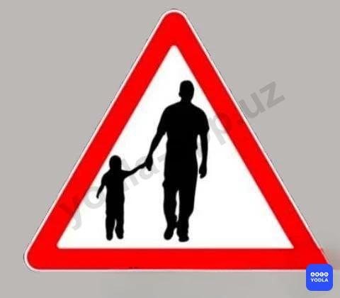

# Bilet 6

Всего вопросов: 20

## Вопрос 1

**Этот дорожный знак предупреждает, что впереди:**

⬜ A. Участок дороги с водной преградой; не имеющий моста или паромной переправы
⬜ B. Участок дороги с водной преградой; на котором имеется разводной мост
✅ C. Место; где дорога выходит на набережную или берег какого-либо водоема

> 💡 Знак 1.10 «Выезд на набережную» раздела 1 приложения № 1 к ПДД, предупреждает о выезде на набережную реки или берег водоема.

---

## Вопрос 2

**Этот дорожный знак обозначает:**

⬜ A. Не оборудованный шлагбаумом железнодорожный переезд через железную дорогу с одним путем
⬜ B. Оборудованный шлагбаумом железнодорожный переезд с одним путем
✅ C. Не оборудованный шлагбаумом железнодорожный переезд с двумя и более путями

> 💡 Знак 1.3.2 «Многопутная железная дорога» раздела 1 приложения № 1 к ПДД, для обозначение необорудованного шлагбаумом переезда через железную дорогу с двумя и более путями.

---

## Вопрос 3

**Какой из знаков устанавливается непосредственно перед опасным участком дороги?**

⬜ A. 1
⬜ B. 2
⬜ C. 3
⬜ D. 4
✅ E. 5

> 💡 Согласно разделу 1 приложения № 1 к ПДД, 1.3.1 «Однопутная железная дорога» знак устанавливается непосредственно перед однопутным железнодорожным переездом, не оборудованным шлагбаумом.

---

## Вопрос 4

**Какой знак предупреждает о приближении к железнодорожному переезду со шлагбаумом?**

⬜ A. 1
⬜ B. 2
⬜ C. 3
✅ D. 4
⬜ E. 5

> 💡 Знак 1.1 раздела 1 приложения № 1 к ПДД, «Железнодорожный переезд со шлагбаумом». Предупреждает водителей о приближении к железнодорожному переезду, оборудованному шлагбаумом.

---

## Вопрос 5

**Этот знак предупреждает о приближении к перекрестку, на котором Вы:**

⬜ A. Имеете право преимущественного проезда
⬜ B. Должны уступить дорогу всем транспортным средствам, движущимся по пересекаемой дороге
✅ C. Должны уступить дорогу только транспортным средствам, приближающимся справа

> 💡 Дорожный знак, показанный на рисунке, предупреждает о приближении к перекрёстку равнозначных дорог. На таких перекрёстках вы обязаны уступить дорогу транспортным средствам, приближающимся справа.

---

## Вопрос 6

**Этот знак...**

⬜ A. Предупреждает об интенсивном движении транспортных средств.
✅ B. Предупреждает о заторах впереди.
⬜ C. Предупреждает о необходимости обеспечения безопасной дистанции между впереди идущими автомобилями

> 💡 Знак 1.32 раздела 1 приложения № 1 к ПДД, «Затор». Знак применяется в качестве временного или в знаках с изменяемым изображением перед перекрёстком, откуда возможен объезд участка дороги, на котором образовался затор.

---

## Вопрос 7

**Какой из указанных знаков предупреждает водителя о других опасностях?**

⬜ A. А
⬜ B. Б
✅ C. В

> 💡 Дорожный знак 1.30 «Прочие опасности» предупреждает водителя о наличии на данном участке дороги опасности, не предусмотренной другими предупреждающими знаками. Правильный ответ — рисунок 3.

---

## Вопрос 8

**Какой из показанных знаков указывает на очень с��ользкий участок дороги?**

⬜ A. А
⬜ B. А и Б
✅ C. В

> 💡 1.15. «Скользкая дорога». Этот знак предупреждает об участке дороги с повышенной скользкостью проезжей части.

---

## Вопрос 9

**Какой знак предупреждает водителя об оборудования заградительным устройством  железнодорожного переезда?**

⬜ A. A
⬜ B. B
✅ C. C
⬜ D. D

> 💡 1.34. «Внимание, управляемое заграждение». Этот дорожный знак устанавливается перед управляемым заграждением и предупреждает водителей транспортных средств о наличии впереди заграждающего устройства.

---

## Вопрос 10

**О чём предупреждает этот знак?**

⬜ A. Впереди крутой подъём
⬜ B. Что впереди разводной мост
✅ C. Искусственная неровность дороги

> 💡 ПДД, Знак 1.31. “Искусственная неровность дороги”.

---

## Вопрос 11

**Какой из этих знаков называется «Неровная дорога»?**

⬜ A. A
⬜ B. B
✅ C. C

> 💡 1.16. «Неровная дорога». Этот знак обозначает участок дороги с неровной проезжей частью. На таких участках могут встречаться выбоины, бугры, впадины, неровные стыки мостов с дорогой и другие подобные неровности.

---

## Вопрос 12

**Какой из этих знаков предупреждает о наличии впереди искусственной неровности дорожного покрытия?**

⬜ A. А
✅ B. В
⬜ C. С
⬜ D. А и С

> 💡 1.31. «Искусственная неровность». Этот дорожный знак предупреждает водителя о приближении к участку дороги, на котором установлена искусственная неровность («лежачий полицейский»). Он применяется для принудительного снижения скорости движения транспортных средств.

---

## Вопрос 13

**С какой целью применяется этот дорожный знак?**

✅ A. Для принудительного снижения скорости движения
⬜ B. Для резкого торможения
⬜ C. Для принятия меры предосторожности

> 💡 Согласно пункту 78 главы 11 ПДД: В населенных пунктах разрешается движение транспортных средств со скоростью не более 70 км/ч, не более 30 км/ч (при установке соответствующих дорожных знаков) на расстоянии не менее 300 метров перед школами и дошкольными учреждениями и проехав их, а в жилых зонах и прилегающих территориях (участок земли между домовыми постройками) не более 20 км/ч.

---

## Вопрос 14

**Какой знак предупреждают что впереди имеется закругление дороги малого радиуса?**

⬜ A. 1
⬜ B. 2
⬜ C. 3
⬜ D. 4
✅ E. 5

> 💡 1.12.1, 1.12.2. «Опасные повороты». Знак 1.12.1 указывает, что первый поворот будет направо. Данный дорожный знак обозначает участок дороги с опасными поворотами. Он предупреждает водителя о наличии впереди опасного поворота малого радиуса и необходимости снизить скорость движения.

---

## Вопрос 15

**Этот дорожный знак:**

⬜ A. Означает, что впереди находится управляемое блокирующее устройство
✅ B. Обозначает что, на проезжей части имеется заградительное устройство 
⬜ C. Обозначает что, перед перекрестком заградительное устройство

> 💡 Согласно пункту 63 Правил дорожного движения, при движении транспортного средства задним ходом водитель должен обеспечить безопасность движения и не создавать помех другим участникам движения. При необходимости водитель должен прибегнуть к помощи других лиц.
Движение задним ходом запрещается на перекрестках и в местах, где запрещен разворот согласно пункту 62 настоящих Правил.
Согласно пункту 62 Правил дорожного движения, разворот запрещается: на пешеходных переходах; в тоннелях; на мостах, путепроводах, эстакадах и под ними (за исключением участков дорог, где соответствующие дорожные знаки разрешают такой маневр); на железнодорожных переездах; в местах с видимостью дороги хотя бы в одном направлении менее 100 м.

---

## Вопрос 16

**Какой знак предупреждает о приближении к нерегулируемому пешеходному переходу?**

✅ A. Только А
⬜ B. А ва В
⬜ C. Все

> 💡 Знак 1.20 раздела 1 приложения № 1 к ПДД, «Пешеходный переход». Пешеходный переход, обозначенный знаками 5.16.1, 5.16.2 и (или) разметкой 1.14.1 – 1.14.4.

---

## Вопрос 17

**Как называется этот дорожный знак:**

⬜ A. Однопутный железнодорожный переезд
✅ B. Приближение к железнодорожному переезду
⬜ C. Железнодорожный переезд со шлагбаумом

> 💡 Знаки 1.4.1 — 1.4.6. «Приближение к железнодорожному переезду» предупреждают водителя о приближении к железнодорожному переезду.

---

## Вопрос 18

**Перед какими местами установлен этот знак?**

⬜ A. Перед рынка
✅ B. Перед школами и детскими развлекательными центрами
⬜ C. Перед вокзалом

> 💡 ЙҲҚ 2 илова: 1.14.4 — оқ-қизил рангли йўл чизиғи мактаб ва мактабгача таълим муассасалари олдида пиёдаларнинг ўтиш жойини белгилайди.

---

## Вопрос 19

**Какой из указанных знаков обозначает зону пересечения проезжей части?**

✅ A. «A»
⬜ B. «Б»
⬜ C. «В»

> 💡 Знак под буквой А обозначает 1.33 «Зона пересечения проезжих частей». Этот знак предупреждает водителя о наличии впереди участка пересечения проезжих частей.

---

## Вопрос 20

**Как называется этот дорожный знак?**

✅ A. Зона, где пешеходы могут ходить по обочине
⬜ B. Зона, где пешеходы могут ходить по проезжей части
⬜ C. Зона, где пешеходы могут ходить по тротуарам

> 💡 ПДД приложение № 1: 4.1.6 Движение направо или налево. Разрешается движение только в направлениях, указанных на знаках стрелками. Знаки, разрешающие поворот налево, разрешают и разворот (могут быть применены знаки 4.1.1-4.1.6 с конфигурацией стрелок, соответствующей требуемым направлениям движения на конкретном пересечении). Действие знаков 4.1.1–4.1.6 не распространяется на маршрутные транспортные средства. Действие знаков 4.1.1–4.1.6 распространяется на пересечение проезжих частей, перед которыми установлен знак. Действие знака 4.1.1, установленного в начале участка дороги, распространяется до ближайшего перекрестка. Знак не запрещает поворот направо на прилегающие к дороге территории.

---

