# Bilet 7

Всего вопросов: 20

## Вопрос 1

**Какой из указанных знаков называется «Дети»?**

⬜ A. 1
✅ B. 2
⬜ C. 3

> 💡 ПДД Общие положения пункт 6: Остановка – прекращение движения транспортного средства на время до 10 минут (приведение в неподвижное состояние).

---

## Вопрос 2

**Покажите знак диких животных:**

⬜ A. 1
✅ B. 2
⬜ C. 3
⬜ D. 4
⬜ E. 2 и 4

> 💡 Согласно абзацу 3 пункта 15 главы 4 ПДД, пешеходы должны идти навстречу движению транспортных средств.

---

## Вопрос 3

**В каком ответе показаны грызуны и рептилии?**

⬜ A. 1
⬜ B. 2
✅ C. 3
⬜ D. 4
⬜ E. 1 и 3

> 💡 ПДД приложение № 1: 7.23 Поочередный проезд

---

## Вопрос 4

**На каком расстоянии до начала опасного участка устанавливаются это знак в населенных пунктах?**

⬜ A. 150-300 м
✅ B. 50-100 м
⬜ C. Устанавливаются перед опасного участка

> 💡 Пункта 165 главы 28 ПДД, гласит: Управлять велосипедом, индивидуальные транспортные средства, гужевой повозкой, быть погонщиком вьючных или верховых животных при движении по дорогам разрешается лицам не моложе 14 лет, а мопедом — не моложе 16 лет. Пункта 9 главы 2 ПДД, гласит: Водители и пассажиры мотоциклов, электромотоциклов, мопедов и скутеров должны носить специальный мотоциклетный шлем и пристегивать его. Пункта 138 главы 23 ПДД, гласит: В светлое время суток ближний свет фар должен быть включен в следующих случаях:
— на мотоциклах, электромотоциклах, скутерах и мопедах.

---

## Вопрос 5

**Кто должен уступить дорогу при пересечении автомобильных дорог с велосипедистом во время движения?**

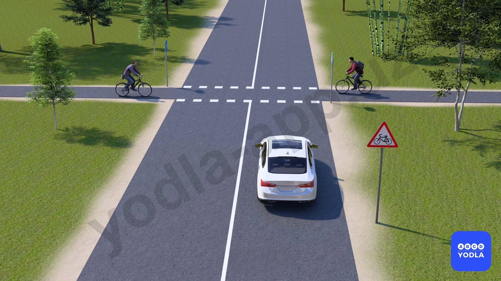

⬜ A. Автомобиль
✅ B. Велосипедисты
⬜ C. По взаимному согласованию

> 💡 На основании пункта 146 главы 25 ПДД: 146. Первоначальное обучение вождению транспортных средств должно проводиться на закрытых площадках или автодромах.

---

## Вопрос 6

**Что обозначает данный знак?**

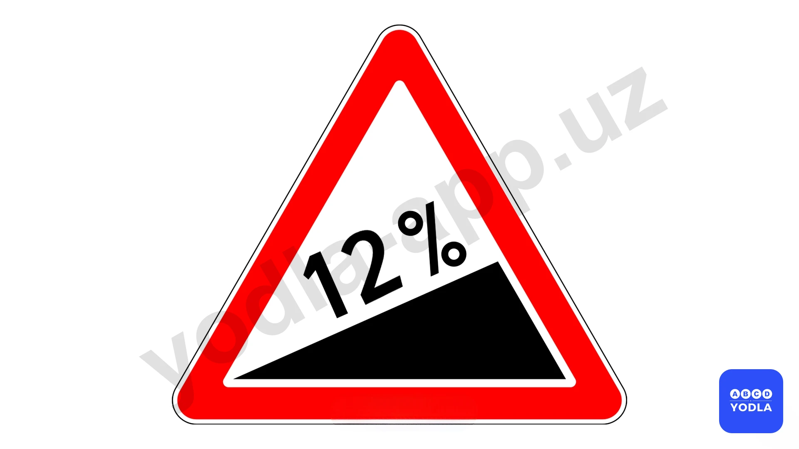

✅ A. Крутой подъём
⬜ B. Крутой спуск

> 💡 На основании абзаца 5 пункта 168 главы 28 ПДД: 168. Велосипедистам и лицам, управляющим средствами индивидуальной мобильности, запрещается: двигаться по проезжей части дороги при наличии велосипедной дорожки.

---

## Вопрос 7

**Какой знак обозначает преимущество встречного движения?**

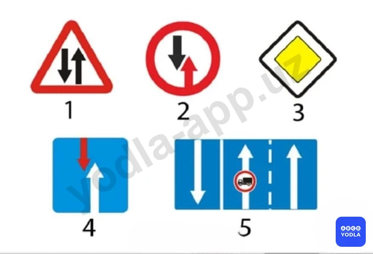

⬜ A. 1
✅ B. 2
⬜ C. 3
⬜ D. 4
⬜ E. 5

> 💡 Согласно знаку 2.6 раздела 2 приложения № 1 к ПДД, «Приоритет встречного движения» запрещает въезд на узкий участок дороги, если это может затруднить встречное движение. Водитель должен уступить дорогу (не создавать помех) встречным транспортным средствам, находящимся на узком участке или противоположном подъезде к нему.

---

## Вопрос 8

**Водитель какого транспортного средства имеет право на первоочередное движение?**

✅ A. Водитель грузового автомобиля

⬜ B. Водитель автобуса

> 💡 Знак 2.6 главы 2 приложения № 1 к ПДД, «Приоритет встречного движения» запрещает въезд на узкий участок дороги, если это может затруднить встречное движение. Водитель должен уступить дорогу встречным транспортным средствам, находящимся на узком участке или противоположном подъезде к нему. А знак 2.7. «Преимущество перед встречным движением». Узкий участок дороги, при движении по которому водитель пользуется приоритетом по отношению к встречным транспортным средствам.

---

## Вопрос 9

**Какой знак обязывает уступить дорогу транспортным средствам; движущимся по пересекаемой дороге?**

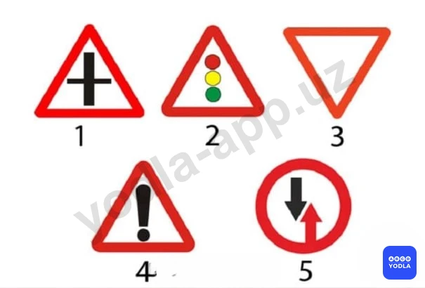

⬜ A. 1
⬜ B. 2
✅ C. 3
⬜ D. 4
⬜ E. 5

> 💡 Согласно знаку 2.4 раздела 2 приложения № 1 к ПДД, «Уступите дорогу». Водитель должен уступить дорогу транспортным средствам, движущимся по пересекаемой дороге, а при наличии дополнительного знака 7.13 — по главной.

---

## Вопрос 10

**Если данный знак установлен у перекрестка то как должен поступить водитель?**

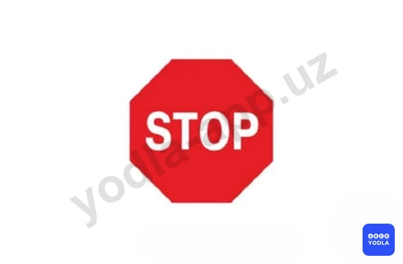

⬜ A. Если на перекрестке на месте пересечения нет транспортных средств должен проехать без остановки
⬜ B. Должен быть осторожным при проезде через перекресток
✅ C. Запрещается движение без остановки перед стоп линией, а если ее нет - перед краем пересекамой проезжей части

> 💡 Согласно пункту 2.5 раздела 2 приложения № 1 к ПДД, «Движение без остановки запрещено» запрещается движение без остановки перед стоп-линией, а если ее нет — перед краем пересекаемой проезжей части. Водитель должен уступить дорогу транспортным средствам, движущимся по пересекаемой, а при наличии дополнительного дорожного знака 7.13 – по главной дороге. Этот дорожный знак может быть установлен перед железнодорожным переездом или карантинным постом. В этих случаях водитель должен остановиться перед стоп-линией, а при ее отсутствии — перед знаком.

---

## Вопрос 11

**Какой знак требует уступить дорогу встречным транспортным средствам?**

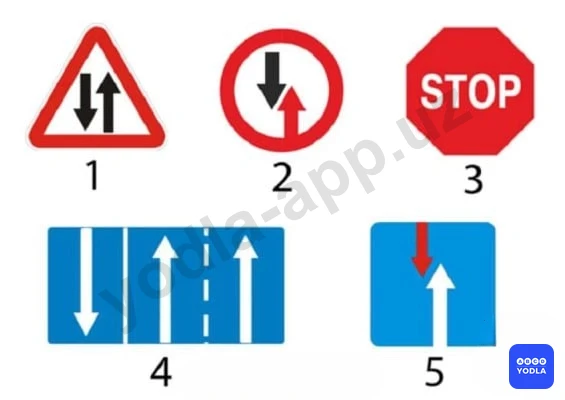

⬜ A. 1
✅ B. 2
⬜ C. 3
⬜ D. 4
⬜ E. 5

> 💡 Знак 2.6 раздела 2 приложения № 1 к ПДД, «Преимущество встречного движения». Запрещается въезд на узкий участок дороги, если это может затруднить встречное движение. Водитель должен уступить дорогу встречным транспортным средствам, находящимся на узком участке или противоположном подъезде к нему.

---

## Вопрос 12

**В каком случае водитель правильно выполнил требования этого знака?**

⬜ A. Уступил дорогу механическим транспортным средствам движущимся по пересекаемой дороге
✅ B. Уступил дорогу транспортным средствам движущимся по пересекаемой дороге

> 💡 Знак 2.4 «Уступите дорогу» раздела 2 приложения № 1 к ПДД, водитель должен уступить дорогу (не создавать помех) транспортным средствам, движущимся по пересекаемой дороге, а при наличии дополнительного знака 7.13 – по главной.

---

## Вопрос 13

**Какой знак обязывает уступить дорогу транспортным средствам движущимся по пересекаемой дороге?**

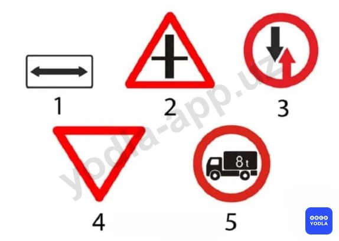

⬜ A. 1
⬜ B. 2
⬜ C. 3
✅ D. 4
⬜ E. 5

> 💡 Знак 2.4 «Уступите дорогу» раздела 2 приложения № 1 к ПДД, водитель должен уступить дорогу транспортным средствам, движущимся по пересекаемой дороге.

---

## Вопрос 14

**Водитель какого транспортного средства должен уступить дорогу?**

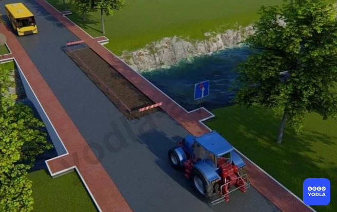

⬜ A. Водитель трактора
✅ B. Водитель автобуса

> 💡 Правильный ответ — знак №4, 2.4 «Уступите дорогу!». Водитель обязан уступить дорогу транспортным средствам, движущимся по пересекаемой главной дороге.

---

## Вопрос 15

**Какие знаки требует, что Вы должны уступить дорогу, если встречный разъезд затруднен?**

⬜ A. Только «В»
✅ B. «А» и «В»
⬜ C. «Б» и «В»
⬜ D. «Б» и «Г»

> 💡 Согласно пункту 49 Правил дорожного движения, вместо звукового сигнала об обгоне или же вместе с ним может подаваться предупредительный сигнал переключением фар.
Согласно пункту 48 Правил дорожного движения, звуковые сигналы могут применяться в следующих случаях: вне населенных пунктов при обгоне, для предупреждения других водителей; в необходимых случаях — для предотвращения дорожно-транспортного происшествия.
Использование звуковых сигналов запрещено, за исключением случаев, указанных выше.

---

## Вопрос 16

**Какой знак указывает на необходимость уступить дорогу встречному транспортному средству на узких участках дороги?**

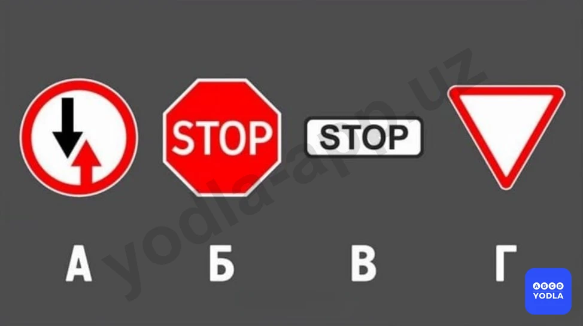

✅ A. А
⬜ B. Б
⬜ C. Б и В
⬜ D. А и Г
⬜ E. Г

> 💡 Знак 2.6 раздела 2 приложения № 1 к ПДД, «Преимущество встречного движения». Запрещается въезд на узкий участок дороги, если это может затруднить встречное движение. Водитель должен уступить дорогу встречным транспортным средствам, находящимся на узком участке или противоположном подъезде к нему.

---

## Вопрос 17

**Какой знак запрещает движение без остановки перед стоп-линией, а при эё отсутствии перед линией пересечения проезжих частей дороги?**

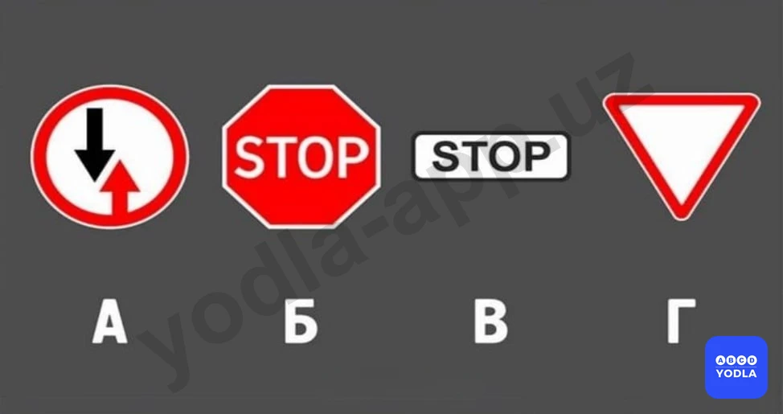

⬜ A. А
✅ B. Б
⬜ C. Б и В
⬜ D. А и Г
⬜ E. Г

> 💡 Согласно статьи 6 Правил дорожного движения, полоса движения — любая из продольных полос проезжей части, обозначенная или необозначенная дорожной разметкой и имеющая ширину, достаточную для движения автомобилей в один ряд.

---

## Вопрос 18

**Какие дорожные знаки дают преимущество водителю на узком участке дороги?**

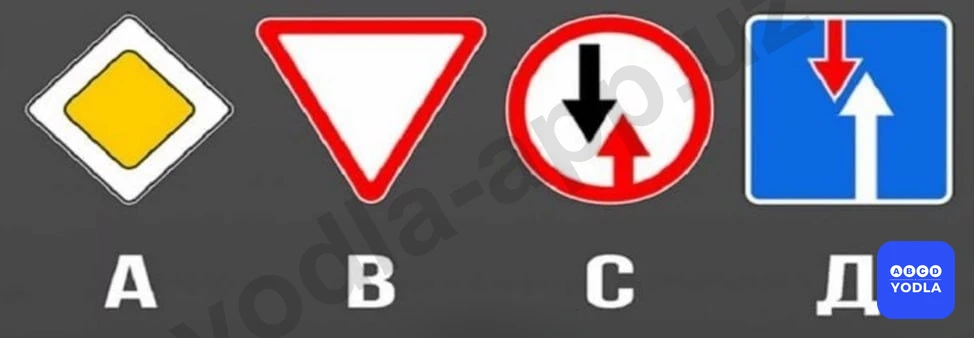

⬜ A. Только B
⬜ B. А и B
✅ C. Только Д
⬜ D. Только C

> 💡 «Преимущество перед встречным движением». Обозначает, что при движении по узкому участку дороги водитель имеет преимущество перед транспортными средствами, движущимися во встречном направлении.

---

## Вопрос 19

**Какой знак предписывает водителю уступить дорогу транспортным средствам, движущимся по пересекаемой дороге?**

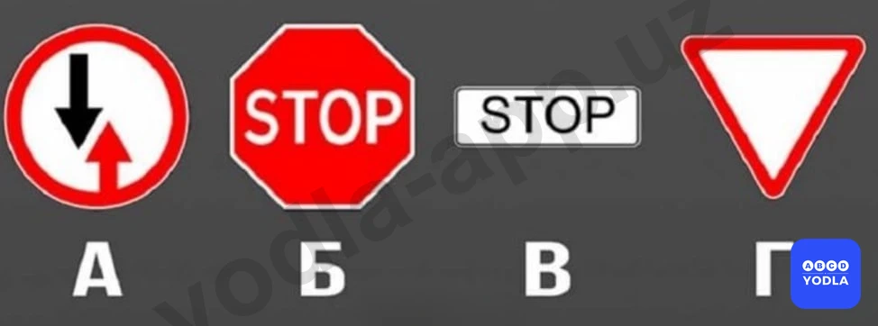

⬜ A. А
⬜ B. Б
⬜ C. В
⬜ D. Г
✅ E. Б и Г

> 💡 Оба дорожных знака 2.4 и 2.5 устанавливаются на второстепенной дороге и обязывают водителя уступить дорогу транспортным средствам, движущимся по главной дороге.

---

## Вопрос 20

**Какой знак обозначает пересечение с второстепенной дорогой?**

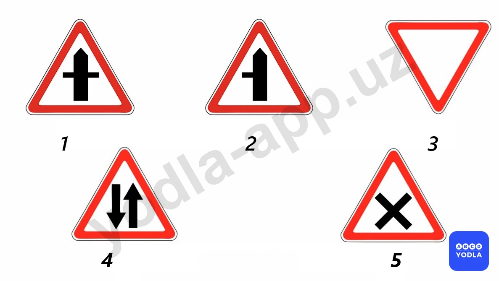

✅ A. 1
⬜ B. 2
⬜ C. 3
⬜ D. 4
⬜ E. 5

> 💡 Обозначает «Пересечение со второстепенной дорогой». Этот знак указывает, что данная дорога является главной, и предупреждает о наличии пересечений со второстепенными дорогами с обеих сторон.

---

