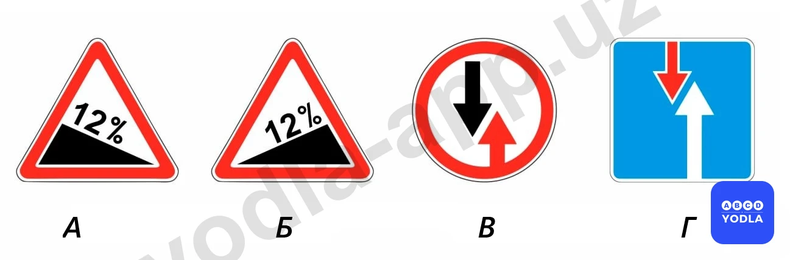
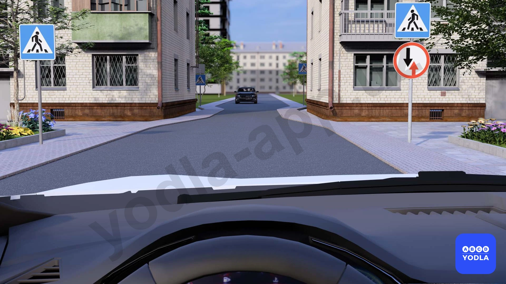
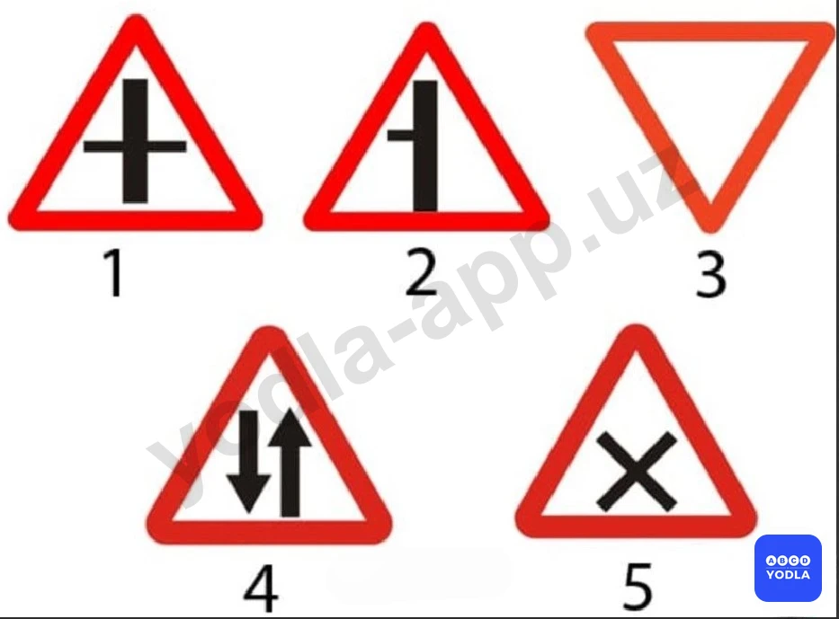
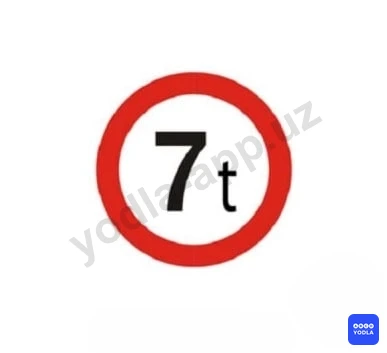
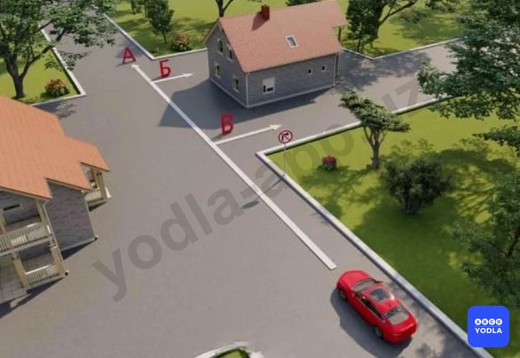
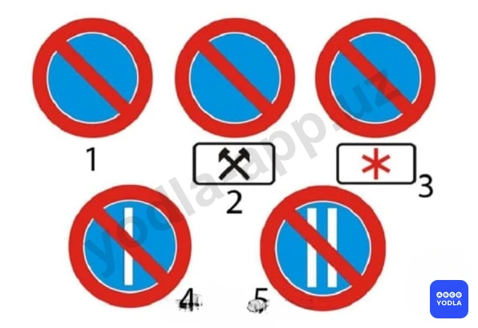
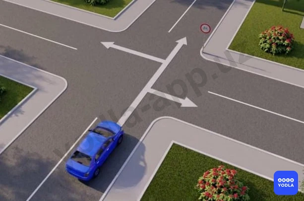
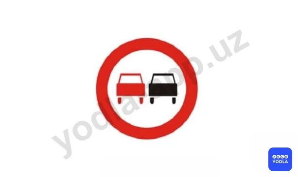
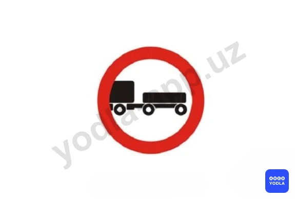

# Bilet 8

Всего вопросов: 20

## Вопрос 1

**Какой знакобозначает примыкание второстепенной дороги?**

⬜ A. 1
✅ B. 2
⬜ C. 3
⬜ D. 4
⬜ E. 5

> 💡 Согласно пункту 98 Правил дорожного движения, перекресток, где очередность движения определяется сигналами светофора или регулировщика, считается регулируемым. 
При желтом мигающем сигнале, неработающих светофорах или отсутствии регулировщика перекресток считается нерегулируемым, и водители обязаны руководствоваться правилами проезда нерегулируемых перекрёстков и установленными на перекрёстке знаками приоритета.

---

## Вопрос 2

**При наличии каких знаков водитель пользуеться преимушеством, если встречный разъезд затруднен припятствием?**

⬜ A. В
⬜ B. А и В
⬜ C. Б и В
✅ D. Б и Г

> 💡 Приложение № 1 ПДД: 1.11.1, 1.11.2. “Опасный поворот”. Закругление дороги малого радиуса или с ограниченной видимостью: 1.11.1 направо, 1.11.2 - налево.

---

## Вопрос 3

**В этой ситуации вы:**

⬜ A. У меня есть право первого прохода
✅ B. Я уступаю дорогу приближающейся машине

> 💡 Линия 1.18 раздела 1 приложения № 2 к ПДД, указывает разрешённые направления движения по полосам на перекрестке. Применяется самостоятельно или в сочетании со знаками 5.8.1, 5.8.2 «Направления движения по полосам», разметка с изображением тупика наносится для указания того, что поворот на ближайшую проезжую часть запрещён; разметка, разрешающая поворот налево из крайней левой полосы, разрешает и разворот.

---

## Вопрос 4

**Найдите предупреждающие знаки**

⬜ A. Все
⬜ B. 1,2 4,5
✅ C. 4,5

> 💡 Пункта 60 главы 9 ПДД, гласит:
В случаях, когда траектории движения транспортных средств пересекаются, а очередность проезда не оговорена Правилами, дорогу должен уступить водитель, к которому транспортное средство приближается справа.

---

## Вопрос 5

**В каких местах знаки приоритета определяют очередность движения?**

⬜ A. Только на перекрестках
⬜ B. Только между узкой частью ствола
✅ C. Оба ответа верны

> 💡 ПДД приложение № 1: 5.15.1 “Платная стоянка”.

---

## Вопрос 6

**Какой знак запрещает движение транспортных средств с дистанцией между ними, меньше указанной на знаке?**

⬜ A. 1
⬜ B. 2
✅ C. 3
⬜ D. 4
⬜ E. 5

> 💡 Согласно знаку 3.16 раздела 3 приложения № 1 к ПДД, «Ограничение минимальной дистанции» запрещается движение транспортных средств с дистанцией между ними меньше чем указанной на знаке.

---

## Вопрос 7

**Этот дорожный знак обозначает:**

⬜ A. Запрещается движение грузовых автомобилей и составов транспортных средств (грузовых автомобилей с прицепами) грузоподъемностью больше указанной на знаке
✅ B. Запрещается движение транспортных средств, в том числе тягачей с прицепами, общая фактическая масса которых (включая массу пассажиров и груза) больше указанной на знаке

> 💡 Согласно знаку 3.11 раздела 3 приложения № 1 к ПДД, «Ограничение массы», запрещается движение транспортных средств, в том числе составов транспортных средств, общая фактическая масса которых больше указанной на знаке.

---

## Вопрос 8

**В каком ответе правильно указаны все разрешенные направления движения?**

⬜ A. « А »
⬜ B. « Б »
⬜ C. « В »
✅ D. « А » и « Б »
⬜ E. « А » и « В »

> 💡 Согласно абзацу 4 раздела 3 приложения № 1 к ПДД, действие знака 3.18.1 «Поворот направо запрещен» распространяется на пересечение проезжих частей, перед которыми установлен знак.

---

## Вопрос 9

**В каком направлении  разрешается движение?**

✅ A. Только налево
⬜ B. Прямо и направо
⬜ C. Только направо и налево
⬜ D. Только прямо

> 💡 Знак 3.1 раздела 3 приложения № 1 к ПДД, «Въезд запрещен». Запрещается въезд всех транспортных средств.

---

## Вопрос 10

**Что обозначает этот знак?**

⬜ A. Предоставляет преимущество перед встречными транспортными средствами
✅ B. Обязывает водителя уступить дорогу встречным транспортным средствам
⬜ C. Обозначает конец участка дороги с односторонним движением

> 💡 Согласно десятому абзацу второго раздела приложения №1 ПДД: 2.6 «Преимущество встречного движения». Запрещается въезд на узкий участок дороги, если это может затруднить встречное движение. Водитель должен уступить дорогу встречным транспортным средствам, находящимся на узком участке или противоположном подъезде к нему.

---

## Вопрос 11

**В каком направлении запрещено движение?**

⬜ A. Направо в первый проезд
✅ B. Направо во второй проезд
⬜ C. Направо в первый и второй проезды

> 💡 Согласно абзацу 4 раздела 3, приложения № 1 к ПДД, действие знака 3.18.1 распространяется на пересечение проезжих частей, перед которыми установлен знак.

---

## Вопрос 12

**Какой знак запрещает движение транспортных средств; габаритная длина которых больше указанной на знаке?**

⬜ A. 1
✅ B. 2
⬜ C. 3
⬜ D. 4
⬜ E. 5

> 💡 Согласно знаку 3.15 раздела 3 приложения № 1 к ПДД, «Ограничение длины», запрещается движение транспортных средств (составов транспортных средств), габаритная длина которых (с грузом или без груза) больше указанной на знаке.

---

## Вопрос 13

**На каком рисунке показаны разрешенные направления движения?**

⬜ A. На левом рисунке
⬜ B. На среднем рисунке
✅ C. На правом рисунке
⬜ D. На среднем и правом рисунке

> 💡 Знак 3.19 раздела 3, приложения № 1 к ПДД, «Разворот запрещен» - запрещается только разворот.

---

## Вопрос 14

**Какой знак запрещает стоянку по четным числам?**

⬜ A. 1
⬜ B. 2
⬜ C. 3
⬜ D. 4
✅ E. 5

> 💡 Согласно тридцать четвертому абзацу третьего раздела приложения №1 ПДД: Запрещающий знак 3.30 “Стоянка запрещена по четным числам месяца”.

---

## Вопрос 15

**В каком ответе правильно указаны все разрешенные направления движения автомобиля?**

⬜ A. Только налево
⬜ B. Только прямо
⬜ C. Только направо
⬜ D. Налево и направо
✅ E. Во всех направлениях

> 💡 Согласно знаку 3.5 раздела 3 приложения № 1 к ПДД, «Движение мотоциклов запрещено», запрещается движение только мотоциклам.

---

## Вопрос 16

**Можно ли водителю автобуса обгонять в зоне действия этого знака?**

✅ A. Можно во всех случаях с соблюдением правил обгона
⬜ B. Нельзя
⬜ C. Можно при условии; если обгоняемое транспортное средство движется со скоростью менее 40 км/ч

> 💡 Согласно двадцать шестому абзацу третьего раздела приложения №1 ПДД: Запрещающий знак 3.22 "Обгон грузовым автомобилям запрещен". Запрещается грузовым автомобилям с разрешенной максимальной массой более 3,5 т обгон всех транспортных средств (за исключением транспортного средства, трактора, гужевой повозки, велосипеда, движущегося со скоростью менее 40 км/ч). 
Знак запрещает обгон грузовым автомобилям, соответственно, автобусам в зоне действия этого знака обгон разрешен во всех случаях.

---

## Вопрос 17

**Разрешается ли буксировка автомобиля; если на дороге установлен этот знак?**

⬜ A. Разрешается только легковым автомобилям

⬜ B. Разрешается на жесткой сцепке
✅ C. Запрещается
⬜ D. Разрешается на любой сцепке

> 💡 Согласно требованию знака 3.7 раздела 3 приложения № 1 к ПДД, «Движение с прицепом запрещено» запрещается движение грузовых автомобилей и тракторов с прицепами любого типа, а также всякая буксировка механических транспортных средств.

---

## Вопрос 18

**Какие транспортные средства запрещается обгонять при этом знаке?**

⬜ A. Все
✅ B. Все, кроме одиночных, движущихся со скоростью менее 40 км/ч
⬜ C. Легковые автомобили, мотоциклы и грузовые автомобили с полной массой менее 3,5 т
⬜ D. Грузовые автомобили с полной массой более 3,5 т

> 💡 Согласно требованию знаку 3.20 раздела 3 приложения № 1 к ПДД, «Обгон запрещен» запрещается обгон всех транспортных средств, кроме одиночных, движущихся со скоростью менее 40 км/ч.

---

## Вопрос 19

**На какие транспортные средства действие этого знака не распространяется?**

⬜ A. Маршрутное такси
⬜ B. Такси с включенным таксометром
⬜ C. Автомобиль, которым управляет инвалид, с установленной табличкой «инвалид».
⬜ D. Маршрутные транспортные средства
✅ E. варианты на которых показаны во втором и третьем ответах

> 💡 Согласно требованию знака 3.28 раздела 3 приложения № 1 к ПДД, «Стоянка запрещена» запрещается стоянка транспортных средств(за исключением транспортных средств, оборудованных проблесковым маячком синего или синего и красного цветов, прикрепленным к сотруднику выполнившую неотложное служебное задание и маркированным специальными цветовыми схемами и надписями). Действие знака не распространяется на транспортные средства управляемые инвалидами, а так же на такси с включенным таксометром.

---

## Вопрос 20

**Разрешается ли буксировка мотоцикла с боковым прицепом по дороге на которой установлен этот знак?**

⬜ A. Разрешается не более одной единицы
⬜ B. Разрешается при использовании жесткой сцепки для буксировки
✅ C. Запрещается
⬜ D. Запрещается при гололеде

> 💡 Запрещающий знак 3.7 "Движение с прицепом запрещено". Запрещается движение грузовых автомобилей и тракторов с прицепами любого типа, а также всякая буксировка механических транспортных средств. Соответственно, буксировка мотоцикла с боковым прицепом по дороге, на которой установлен этот знак, запрещена.

---

