# Bilet 9

Всего вопросов: 20

## Вопрос 1

**Каким грузовым автомобилям из перечисленных этот знак не запрещает дальнейшее движение?**

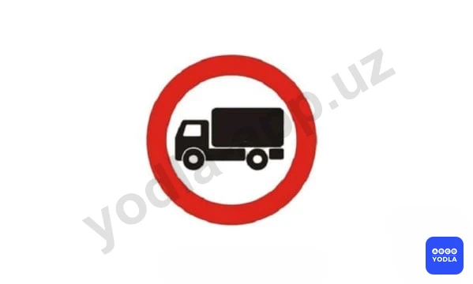

⬜ A. Данный дорожный знак 3.4 не запрещает движение грузовых автомобилей с нанесённой на борта наклонной белой полосой, а также грузовых автомобилей, предназначенных для перевозки людей.
⬜ B. Автомобилям с разрешенной максимальной массой более 3,5 т
⬜ C. Автомобилям, перевозящим опасные грузы
✅ D. Грузовым автомобилям с белой наклонной полосой на бортах

> 💡 Знак 3.4 раздела 3 приложения № 1 к ПДД, «Движение грузовых автомобилей запрещено». Запрещается движение грузовых автомобилей и составов транспортных средств с разрешенной максимальной массой более 3,5 т (если на знаке не указана масса) или с разрешенной максимальной массой более указанной на знаке, а также тракторов и самоходных машин. Этот знак не запрещает движение грузовых автомобилей с наклонной белой полосой на бортах или предназначенных для перевозки людей.

---

## Вопрос 2

**Какой из указанных знаков отменяет все ранее введенные ограничения?**

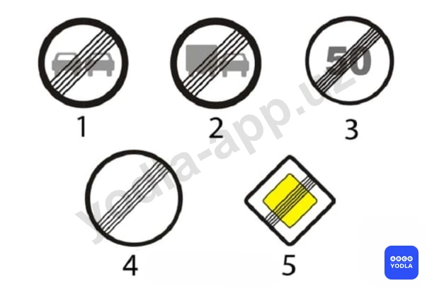

⬜ A. 1
⬜ B. 2
⬜ C. 3
✅ D. 4
⬜ E. 5

> 💡 Среди этих знаков правильным ответом является знак №4. Дорожный знак 3.31 «Конец всех ограничений» обозначает конец зоны действия одного или нескольких знаков 3.16, 3.20, 3.22, 3.24, 3.26–3.30, действующих одновременно.

---

## Вопрос 3

**Какому грузовому автомобилю можно продолжать движение при этом знаке?**

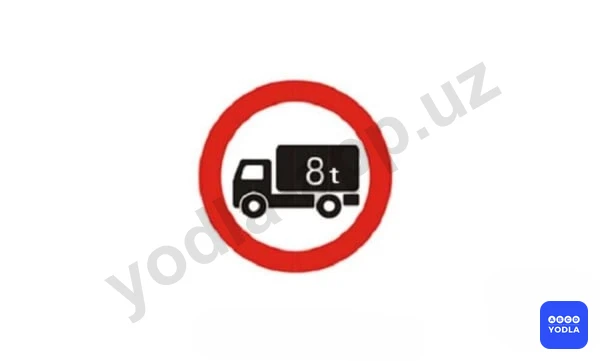

⬜ A. Автомобилю загруженному до 8 т
⬜ B. Порожнему автомобилю грузоподъемностью 8 т
✅ C. Автомобилю разрешенная максимальная масса которого не более 8 т

> 💡 Согласно знаку 3.4 раздела 3 приложения № 1 к ПДД, «Движение грузовых автомобилей запрещено», запрещается движение грузовых автомобилей и составов транспортных средств с разрешенной максимальной массой более 3,5 т (если на знаке не указана масса) или с разрешенной максимальной массой более указанной на знаке, а также тракторов и самоходных машин.

---

## Вопрос 4

**Какой знак запрещает проезд без остановки?**

⬜ A. 1
⬜ B. 2
⬜ C. 3
✅ D. 4
⬜ E. 5

> 💡 Знак 3.17.1 раздела 3 приложения № 1 к ПДД, «Таможня» запрещается проезд без остановки у таможенного (контрольного) пункта.

---

## Вопрос 5

**На какие транспортные средства не распространяется действие данного знака?**

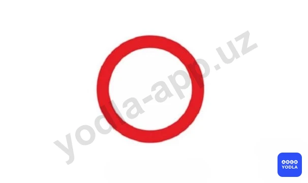

⬜ A. На тракторы и самоходные машины
⬜ B. На автобусы и микроавтобусы
✅ C. На транспортные средства которые обслуживают предприятия находящиеся в зоне действия знака

> 💡 Запрещающий знак 3.2 “Движение запрещено”. Запрещается движение всех транспортных средств. Действие знаков 3.1, 3.2, 3.3, 3.18.1, 3.18.2, 3.19, 3.27 не распространяется - на маршрутные транспортные средства, знаков 3.2-3.8 - на транспортные средства, которые обслуживают предприятия, находящиеся в обозначенной зоне, а также обслуживают или принадлежат гражданам, проживающим или работающим в обозначенной зоне. В этих случаях транспортные средства должны въезжать в обозначенную зону и выезжать из нее на ближайшем к месту назначения перекрестке.

---

## Вопрос 6

**Какой знак запрещает движение грузового автомобиля с прицепом, если суммарная разрешенная максимальная масса автомобиля и ��рицепа равна 7 т?**

⬜ A. 1
⬜ B. 2
⬜ C. 3
✅ D. 4
⬜ E. 5

> 💡 Запрещающий знак 3.7 “Движение с прицепом запрещено”. Запрещается движение грузовых автомобилей и тракторов с прицепами любого типа, а также всякая буксировка механических транспортных средств.

---

## Вопрос 7

**Какой знак разрешат левый поворот?**

⬜ A. 1
⬜ B. 2
✅ C. 3
⬜ D. 4
⬜ E. 5

> 💡 Запрещающий знак 3.19 “Разворот запрещен”. Все знаки, кроме запрещающего разворот 3.19, запрещают поворот налево.

---

## Вопрос 8

**Разрешается ли буксировка легкового автомобиля на участке дороги; обозначенном этим дорожным знаком?**

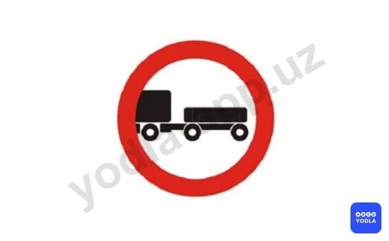

⬜ A. Разрешается
✅ B. Запрещается

> 💡 Запрещающий знак 3.7 “Движение с прицепом запрещено”. Запрещается движение грузовых автомобилей и тракторов с прицепами любого типа, а также всякая буксировка механических транспортных средств.

---

## Вопрос 9

**Каким грузовым автомобилям разрешается продолжать движение при этом знаке?**

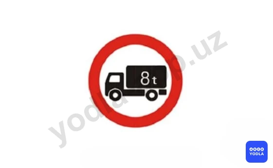

✅ A. Автомобилям с пассажирами в специально оборудованном кузове
⬜ B. Автомобилям перевозящим продукты в кузове-фургоне
⬜ C. Автомобилям с надписью «Связь»

> 💡 Согласно требованию знака 3.4. раздела 3 приложения № 1 к ПДД, «Движение грузовых автомобилей запрещено» запрещается движение грузовых автомобилей и составов транспортных средств с разрешенной максимальной массой более 3,5 т (если на знаке не указана масса) или с разрешенной максимальной массой, более указанной на знаке, а также тракторов и самоходных машин.

---

## Вопрос 10

**Этот дорожный знак:**

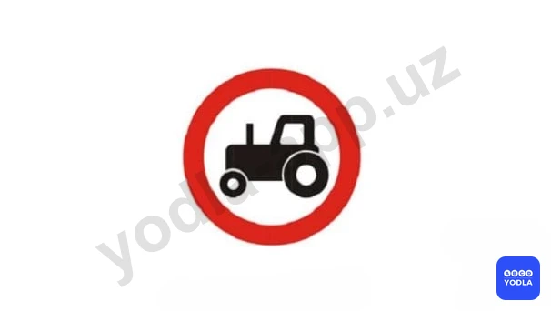

⬜ A. Запрещает движение всех видов механических транспортных средств кроме двухколесного мотоцикла без коляски
⬜ B. Запрещает движение всех транспортных средств кроме колесных тракторов
✅ C. Запрещает движение тракторов и самоходных машин

> 💡 Согласно требованию знака 3.6 раздела 3 приложения № 1 к ПДД, «Движение тракторов запрещено» запрещается движение тракторов и самоходных машин.

---

## Вопрос 11

**По какому пути из числа обозначенных стрелками разрешено движение?**

⬜ A. «А» и «Б»
⬜ B. «Б» и «В»
✅ C. «А» и «В»

> 💡 Знак 3.18.2 «Поворот налево запрещен» раздела 3 приложения № 1 к ПДД. Действие знака распространяется на пересечение проезжих частей, перед которыми установлен знак. Знак запрещает только поворот налево.

---

## Вопрос 12

**Какому автомобилю разрешено движение при этом знаке?**

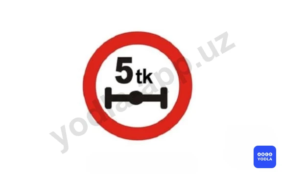

⬜ A. Двухосному грузовому автомобилю, фактическая масса которого 12 т
✅ B. Трехосному грузовому автомобилю, фактическая масса которого 12 т

> 💡 Согласно знаку 3.12 раздела 3 приложения № 1 к ПДД, «Ограничение нагрузки на ось», запрещается движение транспортных средств, у которых фактическая нагрузка на какую-либо ось больше указанной на знаке.

---

## Вопрос 13

**Какой знак разрешает разворот?**

⬜ A. 1
✅ B. 2
⬜ C. 3
⬜ D. 4
⬜ E. 5

> 💡 Запрещающий знак 3.18.2 “Поворот налево запрещен”.

---

## Вопрос 14

**Для предотвращения опасных последствий заноса автомобиля водитель должен:**

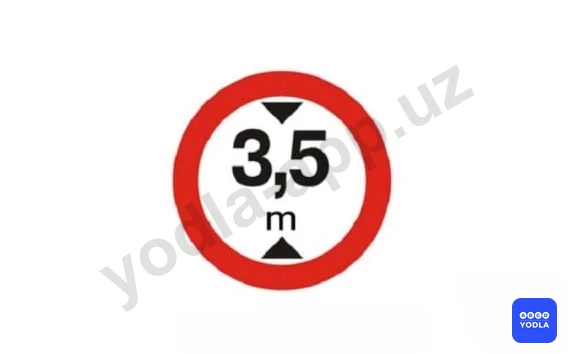

⬜ A. Резко нажать на педаль тормоза
⬜ B. Нажать на педаль сцепления
✅ C. Прекратить начатое торможение

> 💡 Согласно знаку 3.13 раздела 3 приложения № 1 к ПДД, «Ограничение высоты», запрещается движение транспортных средств, габаритная высота которых (с грузом или без груза) больше указанной на знаке.

---

## Вопрос 15

**Действие; какого из знаков не распространяется на маршрутные транспортные средства?**

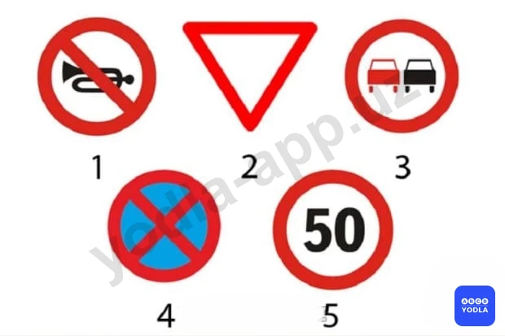

⬜ A. 1
⬜ B. 2
⬜ C. 3
✅ D. 4
⬜ E. 5

> 💡 Запрещающий знак 3.27 “Остановка запрещена”. Запрещается остановка и стоянка транспортных средств.

---

## Вопрос 16

**Этот дорожный знак означает, что:**

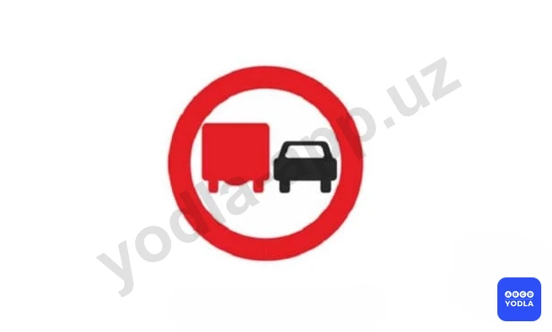

⬜ A. Запрещается обгонять все механические транспортные средства, кроме одиночных, движущихся со скоростью менее 40 км/ч, двухколесных мотоциклов без бокового прицепа и велосипедов
✅ B. Грузовым автомобилям, разрешенная максимальная масса которых превышает 3,5 т, запрещается обгонять все транспортные средства, кроме одиночных, движущихся со скоростью менее 40 км/ч

> 💡 Согласно требованию знака 3.22 раздела 3 приложения № 1 к ПДД, «Обгон грузовым автомобилям запрещен» запрещается грузовым автомобилям с разрешенной максимальной массой более 3,5 т обгон всех транспортных средств (за исключением транспортного средства, трактора, гужевой повозки, велосипеда, движущегося со скоростью менее 40 км/ч).

---

## Вопрос 17

**Разрешается ли такому автопоезду проехать по мосту?**

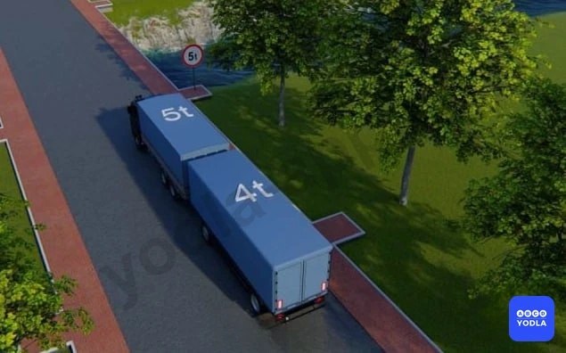

⬜ A. Разрешается
✅ B. Запрещается

> 💡 Знак 3.11 раздела 3 приложения № 1 к ПДД, «Ограничение массы», запрещается движение транспортных средств, в том числе составов транспортных средств, общая фактическая масса которых больше указанной на знаке.

---

## Вопрос 18

**Каким транспортным средствам запрещено движение по указанному знаку?**

✅ A. Всем механическим транспортным средствам
⬜ B. Только грузовых автомобилей
⬜ C. Всех автомобилей

> 💡 Этот знак обозначает 3.3 «Движение механических транспортных средств запрещено».

---

## Вопрос 19

**Какие знаки разрешают Вам проезд на автомобиле к месту проживания?**

⬜ A. Только «А»
⬜ B. Только «Б»
✅ C. Только «А» и «B»
⬜ D. Все

> 💡 Знаки «Движение запрещено» и 3.3 «Движение механических транспортных средств запрещено» не распространяются на транспортные средства, обслуживающие граждан, проживающих или работающих в зоне действия знака, а также принадлежащие им. В таких случаях транспортные средства должны въезжать или выезжать через ближайший к месту назначения перекрёсток. Следовательно, правильным ответом будет А и В.

---

## Вопрос 20

**Продолжить буксировку можно:**

✅ A. Только в направлении «А»
⬜ B. Только в направлении «Б»
⬜ C. В любом из указанных направлений

> 💡 «Движение с прицепом запрещено». Запрещается движение грузовых автомобилей и тракторов с любыми видами прицепов, а также буксировка механических транспортных средств. Поэтому разрешено движение только в направлении А.

---

