# Bilet 10

Всего вопросов: 20

## Вопрос 1

**Какой знак запрещает дальнейшее движение всех без исключения транспортных средств?**

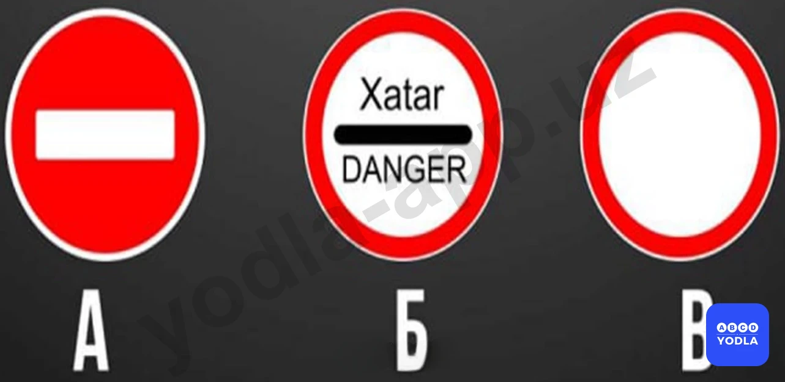

⬜ A. «А»
✅ B. «Б»
⬜ C. «В»

> 💡 «Опасность» без исключения запрещает движение всех транспортных средств, то есть ни одно транспортное средство не имеет права продолжать движение. Этот знак устанавливается при возникновении опасной ситуации на дороге или в случае пожара.

---

## Вопрос 2

**Разрешается ли Вам осуществить посадку (высадку) пассажиров либо загрузку (разгрузку) транспортного средства в зоне действия этого знака?**

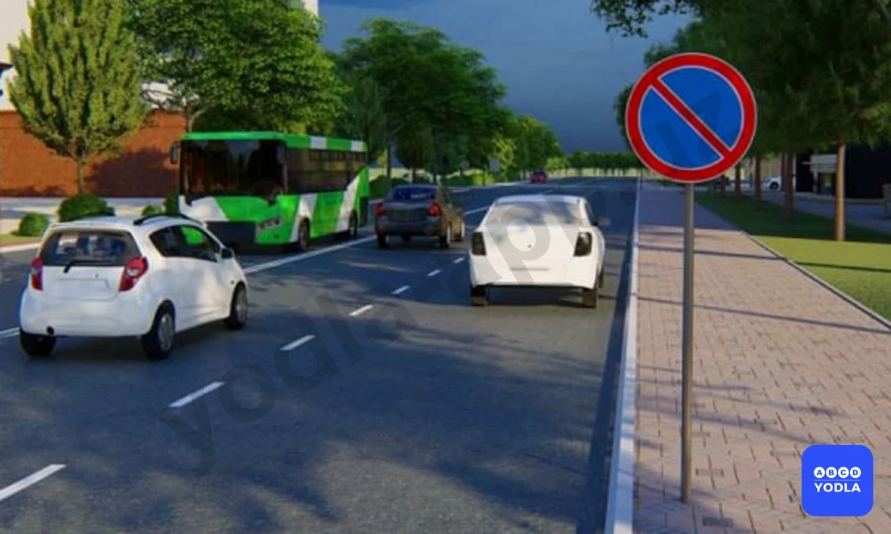

✅ A. Да
⬜ B. Нет

> 💡 В зоне действия данного знака разрешается посадка и высадка пассажиров, поскольку знак «Стоянка запрещена» запрещает только длительное прекращение движения транспортного средства. Кратковременная остановка, в том числе для посадки или высадки пассажиров, допускается.

---

## Вопрос 3

**Какой из перечисленных дорожных знаков отменяет все ограничения, ранее введенные запрещающими знаками?**

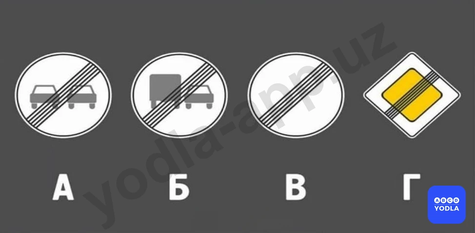

✅ A. В
⬜ B. А и Б
⬜ C. В и Г
⬜ D. Все

> 💡 Дорожный знак 3.31 «Конец всех ограничений». Данный знак, обозначенный буквой В, отменяет действие всех ранее введённых ограничений.

---

## Вопрос 4

**Какой из этих знаков не запрещает проезд до места жительства или работы?**

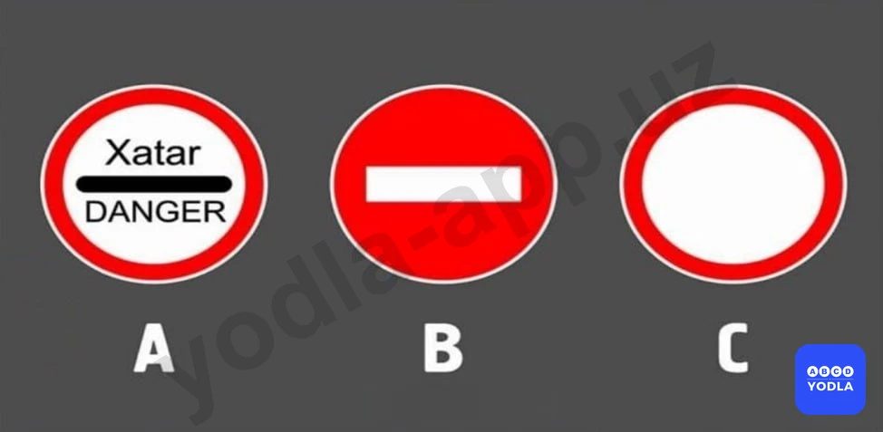

⬜ A. А
⬜ B. В
✅ C. С
⬜ D. В и С

> 💡 Действие данного знака не распространяется на транспортные средства, принадлежащие гражданам, проживающим или работающим в данной зоне. Кроме того, въезд разрешается транспортным средствам, обслуживающим этих граждан.

---

## Вопрос 5

**Какой знак называется «Движение транспортных средств, перевозящих опасные грузы, запрещено»?**

⬜ A. А
⬜ B. В
✅ C. С

> 💡 Знак в варианте С обозначает, что движение транспортных средств, перевозящих опасные грузы, запрещено.

---

## Вопрос 6

**Проезд каких транспортных средств без остановки запрещается данным знаком?**

⬜ A. Грузовые автомобили
⬜ B. Легковые автомобили
✅ C. Все виды транспортных средств

> 💡 Дорожный знак «Таможня» запрещает проезд транспортных средств без остановки на таможенном пункте. Водители обязаны остановиться по требованию сотрудника таможенной службы.

---

## Вопрос 7

**Укажите знаки связанные с обгоном?**

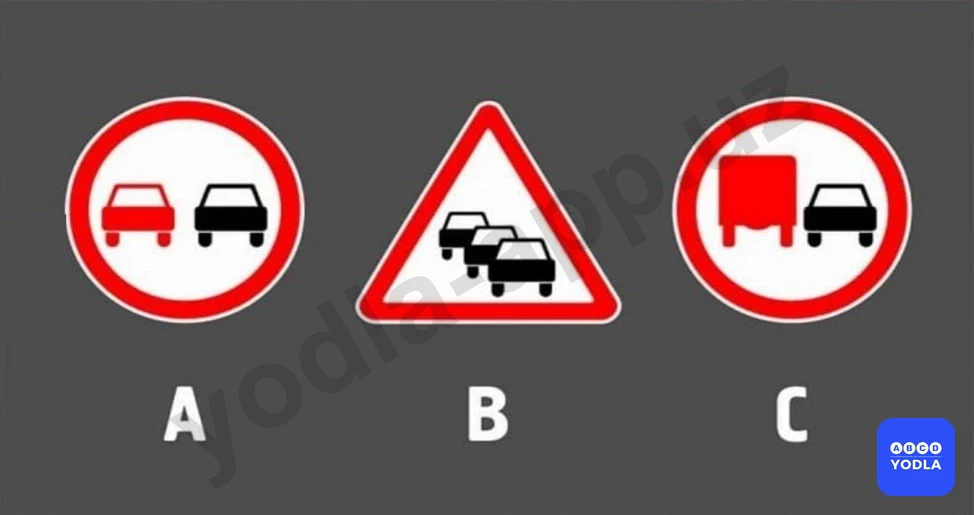

⬜ A. А ва Б
⬜ B. Б и С
✅ C. А и С

> 💡 Знак Б обозначает затор (дорожную пробку). Знаки А и C относятся к дорожным знакам, связанным с обгоном.

---

## Вопрос 8

**Какие знаки обозначают конец зоны запрещения обгона грузовых автомобилей?**

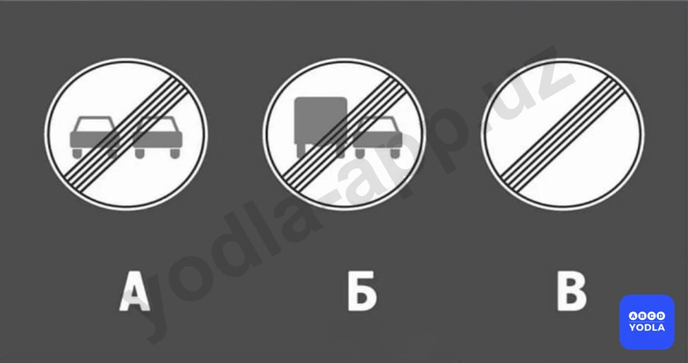

⬜ A. А
⬜ B. Б
⬜ C. А и Б
✅ D. А, Б, В

> 💡 Знак А распространяется на все транспортные средства. Знак Б относится к грузовым автомобилям. Знак В отменяет действие всех ранее введённых запрещающих ограничений.

---

## Вопрос 9

**С какой целью применяется этот дорожный знак?**

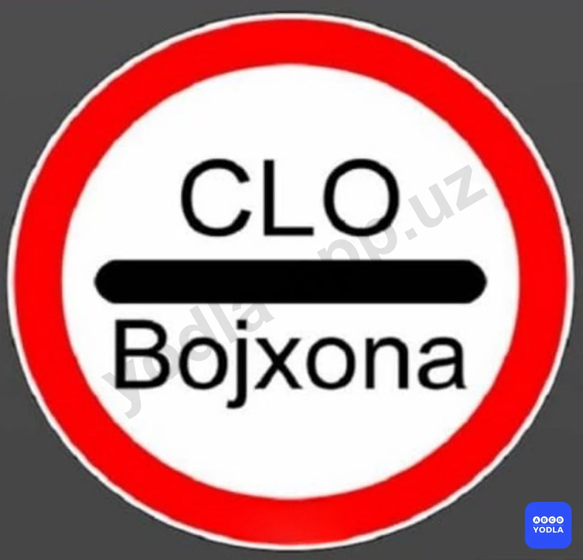

⬜ A. Для принудительного снижения с��орости движения.
✅ B. Движение без остановки запрещается
⬜ C. Для принятия мер предосторожности

> 💡 Данный дорожный знак запрещает проезд без остановки и устанавливается перед таможенными пунктами. Водители обязаны остановиться на таможенном посту.

---

## Вопрос 10

**Что означает этот дорожный знак?**

✅ A. Запрещает движение транспортных средств, перевозящих опасные грузы.
⬜ B. Запрещает движение транспортных средств, перевозящих тяжелые грузы
⬜ C. Запрещает движение транспортных средств, перевозящих взрывоопасные и легковоспламеняющиеся грузы

> 💡 Данный дорожный знак устанавливается для запрещения движения транспортных средств, перевозящих опасные грузы.

---

## Вопрос 11

**Движение каких транспортных средств запрещает этот дорожный знак?**

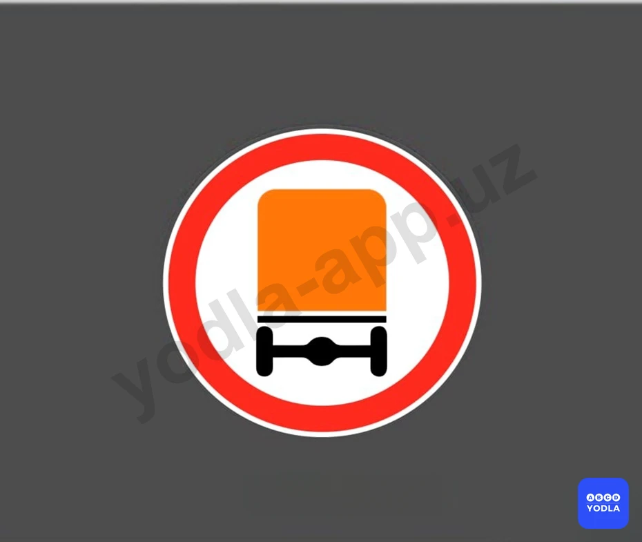

⬜ A. Автомобили с разрешённой полной массой более 3,5 тонн
✅ B. Движение транспортных средств, перевозящих опасные грузы
⬜ C. Все ответы верны

> 💡 При наличии данного дорожного знака движение грузовых автомобилей, перевозящих опасные грузы, запрещается.

---

## Вопрос 12

**В каких направлениях разрешено движение водителю грузового автомобиля?**

✅ A. Направо и прямо
⬜ B. Направо и налево
⬜ C. Только направо
⬜ D. На все направления

> 💡 Дорожный знак 3.14 «Движение грузовых автомобилей с разрешённой максимальной массой более 3,5 т запрещено» распространяется на грузовые автомобили с разрешённой максимальной массой свыше 3,5 тонн. Поскольку разрешённая максимальная масса нашего автомобиля составляет 3 тонны, действие данного знака на него не распространяется, и движение разрешено.

---

## Вопрос 13

**Как называется этот дорожный знак?**

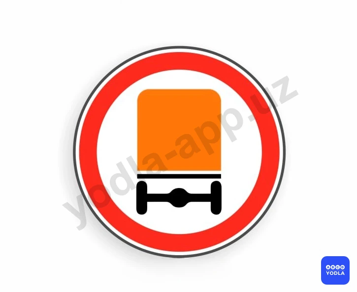

✅ A. Движение транспортного средства, перевозящего опасные грузы, запрещено
⬜ B. Перевозка крупногабаритных грузов запрещена
⬜ C. Обгон грузовых автомобилей запрещен

> 💡 При наличии данного дорожного знака движение грузовых автомобилей, перевозящих опасные грузы, запрещается.

---

## Вопрос 14

**Какие из этих указанных знаков не действует на легковые немаршрутные такси при посадке — высадке пассажиров (погрузке — выгрузке грузов)?**

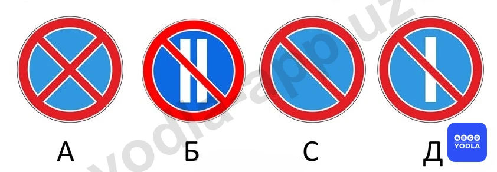

⬜ A. Только A
⬜ B. Только B
⬜ C. Только B,C,D
✅ D. Все

> 💡 В зоне действия всех этих знаков такси разрешается производить посадку и высадку пассажиров. Поскольку кратковременная остановка для посадки или высадки пассажиров не считается стоянкой.

---

## Вопрос 15

**Какой из указанных знаков требует обязательной остановки на нерегулируемых перекрестках?**

⬜ A. Только A
✅ B. Только B
⬜ C. B и C
⬜ D. Все

> 💡 На нерегулируемом перекрёстке данный знак требует от водителя обязательной остановки. Водитель должен остановиться перед стоп-линией, а при её отсутствии — перед краем пересекаемой проезжей части.

---

## Вопрос 16

**Требования каких знаков из указанных вступают в силу непосредственно в том месте, где они установлены?**

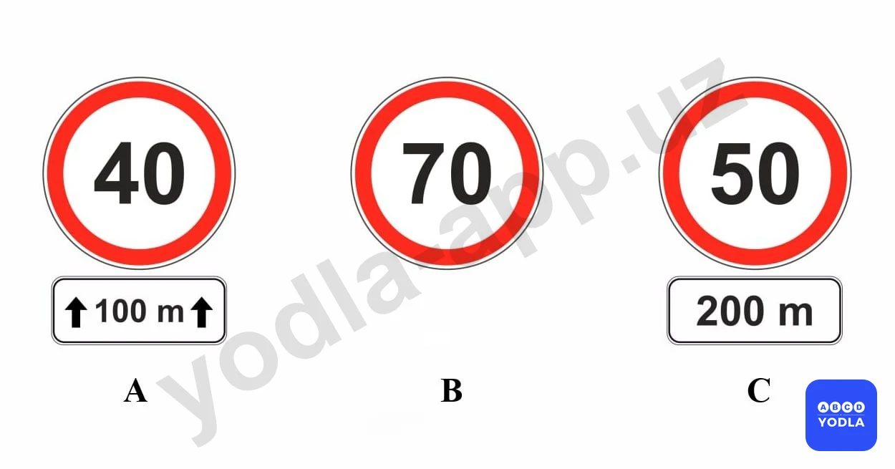

⬜ A. Только B
✅ B. А и В
⬜ C. Все

> 💡 Итак, в вопросе спрашивается, требования каких из указанных знаков вступают в силу непосредственно с места их установки. Знак А действует с места установки на протяжении следующих 100 метров, следовательно, он начинает действовать сразу. Знак Б также действует с места установки до ближайшего перекрёстка, то есть его требование тоже вступает в силу немедленно. Знак С начинает действовать только через 200 метров, поэтому он не относится к знакам, действие которых начинается непосредственно с места установки. Следовательно, правильный ответ — А и Б.

---

## Вопрос 17

**Этот дорожный знак:**

⬜ A. Постоянный знак
✅ B. Временный знак
⬜ C. Сезонный знак

> 💡 Данный дорожный знак является временным дорожным знаком. Если фон внутри знака имеет жёлтый цвет, это означает, что знак является временным. Такие знаки обычно устанавливаются в местах проведения дорожных работ или в случаях, когда необходимо временно изменить организацию дорожного движения.

---

## Вопрос 18

**Этот дорожный знак:**

⬜ A. Является постоянным знаком
✅ B. Является временным знаком
⬜ C. Является сезонным знаком

> 💡 Данный дорожный знак также является временным дорожным знаком, поскольку его фон имеет жёлтый цвет.

---

## Вопрос 19

**Разрешено ли движение легкового автомобиля с прицепом в месте, где установлен этот знак?**

⬜ A. Разрешается, если масса прицепа не более 750 кг
✅ B. Разрешается
⬜ C. Запрещается

> 💡 Данный дорожный знак означает «Движение с прицепом запрещено». Он запрещает движение грузовых автомобилей с прицепами, а также буксировку механических транспортных средств. Однако это ограничение не распространяется на легковые автомобили, движущиеся с прицепом. Поэтому, если в вопросе спрашивается, разрешено ли движение легкового автомобиля с прицепом, правильный ответ — разрешено.

---

## Вопрос 20

**На каком знаки можно остановиться в четные дни месяца?**

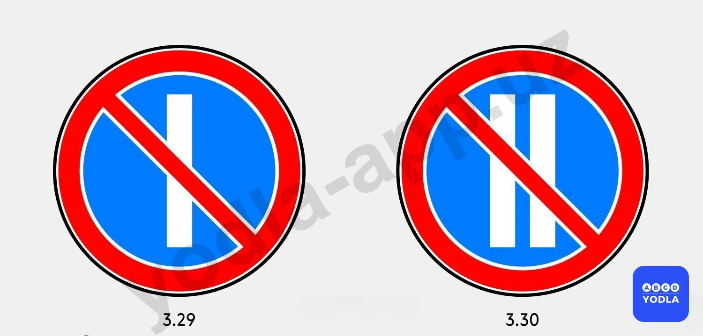

⬜ A. На левом рисунке
⬜ B. На правом рисунке
✅ C. На обеих рисунке можно

> 💡 Итак, в вопросе спрашивается, при каком знаке разрешена остановка в чётные дни месяца. Обратите внимание: речь идёт именно об остановке, а не о стоянке. Не следует путать эти понятия. Поэтому в данном случае остановка разрешена при обоих знаках.

---

