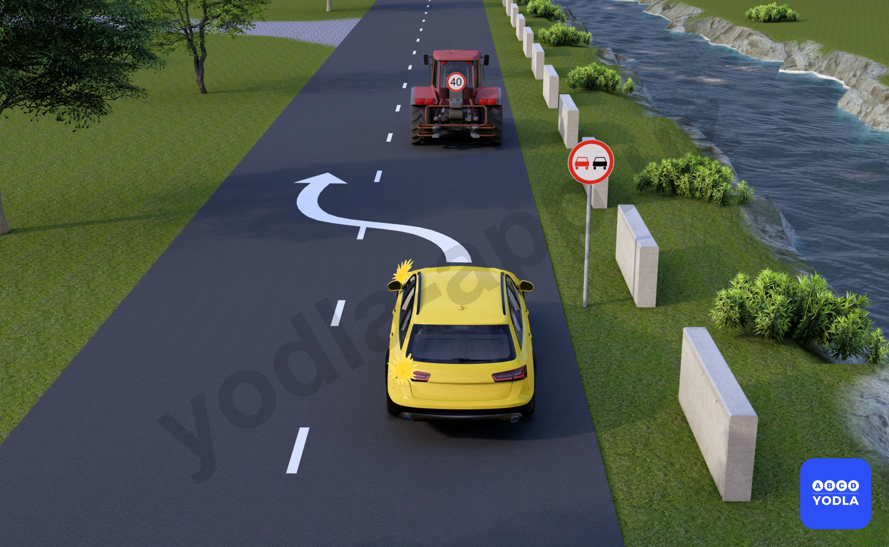
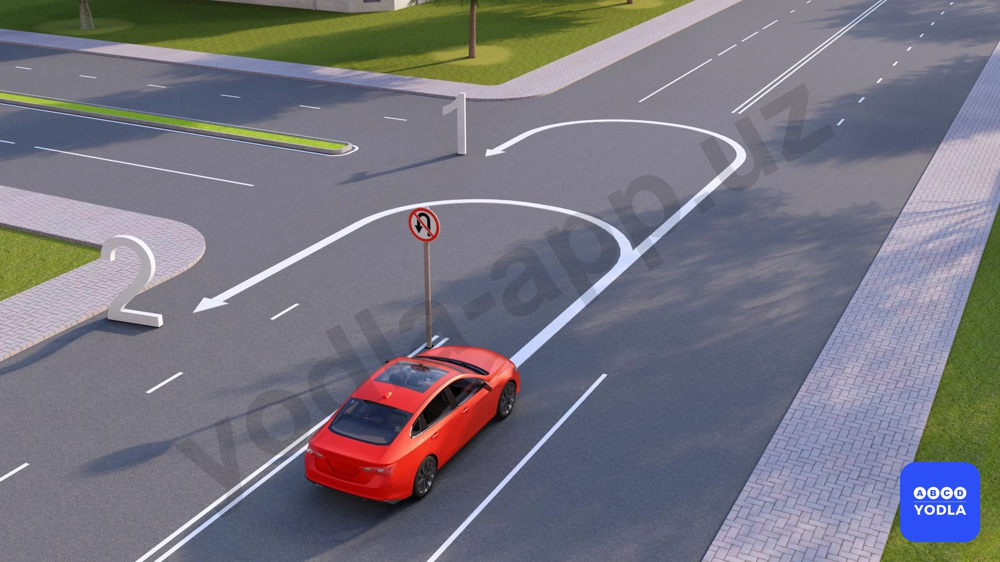
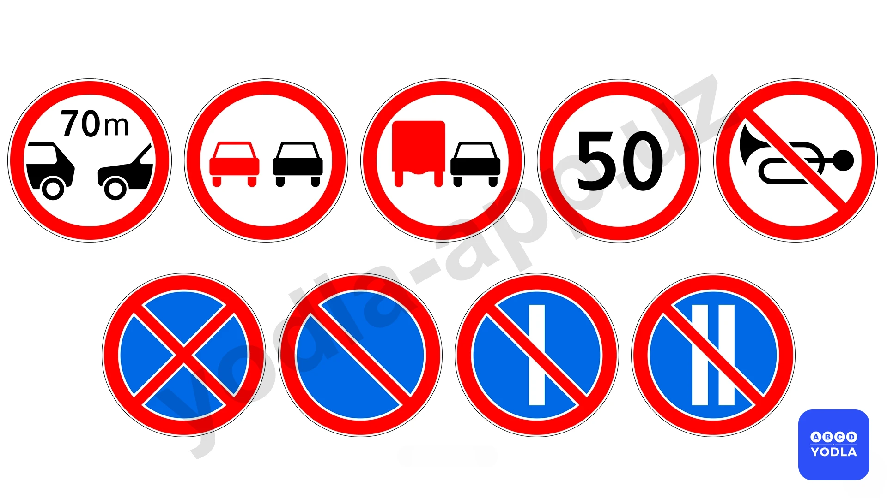
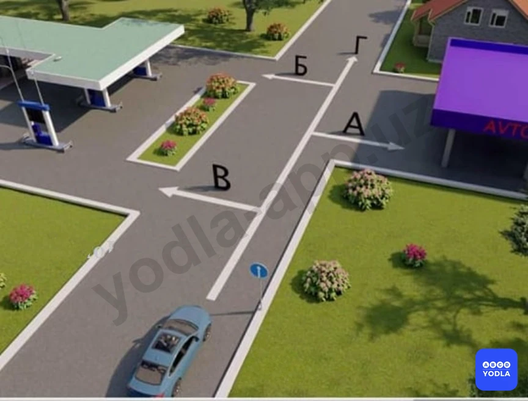
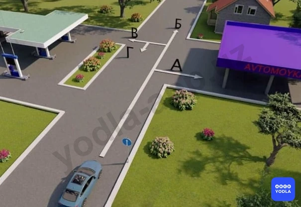
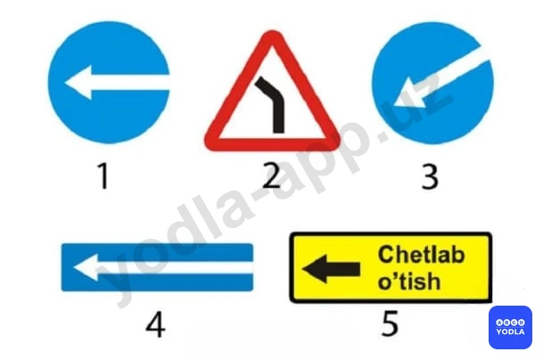
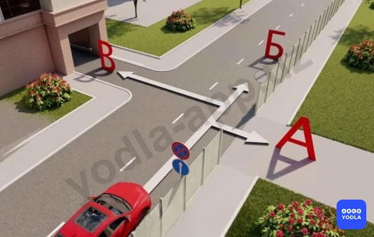
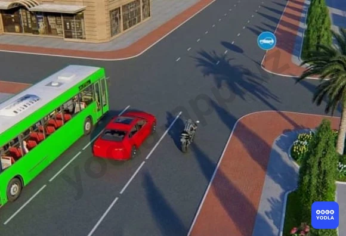

# Bilet 11

Всего вопросов: 20

## Вопрос 1

**Как называется этот знак?**

⬜ A. Движение пешеходов запрещено
✅ B. Движение индивидуальным транспортным средствам запрещено
⬜ C. Пребывание детей запрещено
⬜ D. Все указанные ответы являются правильными.

> 💡 Данный знак называется «Движение средств индивидуальной мобильности запрещено». Он запрещает движение средств индивидуальной мобильности, то есть электросамокатов и других аналогичных средств передвижения.

---

## Вопрос 2

**Какой дорожный знак разрешает разворот?**

✅ A. 1 и 2
⬜ B. 2 и 3
⬜ C. все

> 💡 В вопросе спрашивается, какие дорожные знаки разрешают разворот. Третий знак означает «Разворот запрещён». Следовательно, в зоне его действия разворот выполнять нельзя. Поэтому правильный ответ — 1 и 2.

---

## Вопрос 3

**Разрешено ли жёлтому автомобилю выполнять обгон в указанном месте?**

✅ A. Разрешено
⬜ B. Запрещено

> 💡 В данной ситуации водителю жёлтого автомобиля разрешается выполнить обгон. Несмотря на действие дорожного знака «Обгон запрещён», разрешается обгон одиночного транспортного средства, движущегося со скоростью менее 40 км/ч.

---

## Вопрос 4

**На каких направлениях разрешается разворот красному автомобилю?**

⬜ A. На первом направлении
⬜ B. На втором направлении
✅ C. На обоих направлениях разворот запрещён

> 💡 В данной ситуации разворот запрещён в обоих направлениях. Наличие разделительной полосы не влияет на действие знака 3.19 «Разворот запрещён». То есть независимо от того, есть разделительная полоса или нет, выполнять разворот запрещается.
Однако в случае со знаком 3.18.2 «Поворот налево запрещён» наличие разделительной полосы может иметь значение. Если на дороге имеется разделительная полоса, этот знак запрещает поворот налево только на первую проезжую часть. Поэтому въезд на вторую проезжую часть может быть разрешён.
Следовательно, при наличии знака 3.19 «Разворот запрещён» разворот запрещается независимо от наличия или отсутствия разделительной полосы.

---

## Вопрос 5

**На выезда с прилегающих территорий или в местах пересечения (примыкания) дороги с полевыми, лесными и другими дорогами, не предназначенными для постоянного движения и проезда, если перед ними не установлены соответствующие знаки, утрачивается ли действие этих знаков?**

⬜ A. Утрачивается
✅ B. Не утрачивается

> 💡 Как видно, вопрос сформулирован очень длинно. В таких случаях важно выделить ключевые слова. Например, достаточно обратить внимание на фразу «в местах выезда с прилегающих территорий».
Суть вопроса заключается в следующем: прекращается ли действие запрещающих знаков в местах выезда с прилегающих территорий, а также в местах пересечения с полевыми, лесными и другими дорогами, не предназначенными для сквозного движения, если перед ними не установлены соответствующие знаки?
Ответ: нет, не прекращается. Такие места не считаются перекрёстками. Если не указано иное, зона действия запрещающих знаков продолжается до ближайшего перекрёстка.
Следовательно, в местах выезда с прилегающих территорий, а также на пересечениях с полевыми и лесными дорогами действие этих знаков не прекращается.

---

## Вопрос 6

**По каким направлениям водителю синего автомобиля запрещено движение?**

⬜ A. Только по направлению 1
⬜ B. Только по направлению 2
✅ C. По направлениям 1, 3 и 4
⬜ D. По всем направлениям

> 💡 Внимательно прочитайте вопрос. В нём спрашивается, в каком направлении водителю синего автомобиля движение не разрешается. Многие ошибочно читают вопрос как «в каком направлении разрешается движение».
В данной ситуации движение прямо разрешено. Однако поворот направо запрещён, поскольку действует временный дорожный знак. Кроме того, автомобиль движется по правой полосе, поэтому движение по третьему и четвёртому направлениям также не разрешается.
Следовательно, правильный ответ — первое и третье направления, то есть движение в этих направлениях запрещено.

---

## Вопрос 7

**По каким направлениям из числа обозначенных стрелками разрешается движение?**

⬜ A. Только по направлению « А »
⬜ B. Только по направлению « Б »
⬜ C. Только по направлению « В »
✅ D. Только по направлению « А » и « Г »
⬜ E. Только по направлению « Г »

> 💡 Итак, в вопросе спрашивается, в каких направлениях разрешено движение. В данной ситуации действует знак 4.1.1 «Движение прямо».
Этот знак предписывает водителю на перекрёстке двигаться только прямо. Однако он не запрещает поворот направо на прилегающие территории, такие как автозаправочные станции, жилые кварталы, парковки и другие подобные объекты.
Следовательно, на перекрёстке поворот направо запрещён, но въезд на прилегающие территории разрешается. Поэтому правильный ответ — А и Г.

---

## Вопрос 8

**В каких направлениях разрешено движение?**

⬜ A. Только « Б »
⬜ B. Только « А »
✅ C. « А » и « Б »
⬜ D. « А », « Б », « В » и « Г »
⬜ E. « А », « Б » и « В »

> 💡 В данном случае также установлен знак «Движение прямо». Этот знак предписывает движение прямо на перекрёстке, однако не запрещает поворот направо на прилегающую территорию. Поэтому водителю разрешается двигаться прямо и поворачивать направо на прилегающую территорию. Следовательно, правильный ответ — А и Б.

---

## Вопрос 9

**Какой знак называется « Объезд препятствия слева »?**

⬜ A. 1
⬜ B. 2
✅ C. 3
⬜ D. 4
⬜ E. 5

> 💡 В вопросе о знаке «Объезд препятствия слева» многие ошибочно выбирают пятый вариант ответа. Однако правильным является третий вариант.
Такой знак обычно устанавливается на разделительных островках, бордюрах или других участках дороги, где имеется препятствие. В зависимости от знака водитель обязан объехать препятствие с указанной стороны. Чаще всего используется знак «Объезд препятствия справа», но при проведении дорожных работ или в других ситуациях может быть установлен знак «Объезд препятствия слева».
Следовательно, знаки, предписывающие объезд препятствия с определённой стороны, относятся к предписывающим знакам, и в данном вопросе правильным является третий вариант ответа.

---

## Вопрос 10

**Укажите разрешенные направления движения:**

⬜ A. Только « А »
⬜ B. Только « Б »
⬜ C. Только « В »
✅ D. « А и « Б »
⬜ E. « Б и « В »

> 💡 В данной ситуации предписывающий знак «Движение прямо» требует от водителя двигаться только прямо на перекрёстке. Однако, как уже отмечалось ранее, этот знак не запрещает поворот направо на прилегающую территорию. Поэтому движение в направлениях А и Б разрешено.
Кроме того, здесь установлен знак 3.31 «Конец всех ограничений». Обратите внимание, что знак 3.31 отменяет действие только запрещающих знаков, но не распространяется на предписывающие знаки.
Следовательно, знак 3.31 не отменяет требование знака «Движение прямо». Поэтому движение в направлении В запрещено, а в направлениях А и Б движение разрешается.
Вывод: знак 3.31 «Конец всех ограничений» отменяет действие только запрещающих знаков, но не влияет на действие предписывающих знаков.

---

## Вопрос 11

**Этот дорожный знак:**

✅ A. Разрешает движение только с указанной или большей скоростью
⬜ B. Запрещает движение со скоростью; превышающей указанную на знаке
⬜ C. Указывает скорость; с которой рекомендуется движение на данном участке дороги

> 💡 Данный дорожный знак означает, что транспортным средствам разрешается движение с указанной на знаке скоростью или выше. Следовательно, движение со скоростью ниже указанной запрещается.

---

## Вопрос 12

**Какой знак запрещает движение со скоростью менее 50 км/час?**

⬜ A. 1
⬜ B. 2
✅ C. 3
⬜ D. 4
⬜ E. 5

> 💡 Итак, в вопросе спрашивается, какой знак запрещает движение со скоростью менее 50 км/ч. Это означает, что транспортное средство не может двигаться со скоростью ниже 50 км/ч, то есть должно двигаться со скоростью 50 км/ч или выше.
Такое требование устанавливает предписывающий знак «Минимальная скорость движения». Этот знак имеет форму синего круга.
Следовательно, правильный ответ — третий знак.

---

## Вопрос 13

**Какой знак указывает обязательное направление движения на перекрестке?**

⬜ A. 1
⬜ B. 2
⬜ C. 3
✅ D. 4
⬜ E. 5

> 💡 Итак, в вопросе требуется указать знак, обозначающий обязательное направление движения на перекрёстке. Такой знак указывает водителю, в каком направлении он обязан двигаться на перекрёстке. Поэтому правильный ответ — четвёртый вариант.

---

## Вопрос 14

**При этом знаке разрешено движение:**

⬜ A. Только водителю автомобиля
⬜ B. Только водителям автомобиля и мотоцикла
✅ C. Водителям всех транспортных средств
⬜ D. Только водителям автомобиля и автобуса

> 💡 Данный знак называется «Движение легковых автомобилей». Однако он распространяется не только на легковые автомобили, но и разрешает движение некоторых других транспортных средств.
В зоне действия этого знака разрешается движение:
Легковых автомобилей;
Мотоциклов;
Автобусов;
Грузовых автомобилей с разрешённой максимальной массой не более 3,5 тонн;
Маршрутных транспортных средств.
Следовательно, ошибочно считать, что данный знак относится только к легковым автомобилям. Он разрешает движение всем перечисленным категориям транспортных средств.

---

## Вопрос 15

**На каком рисунке показано правильное направление движения?**

⬜ A. На первом
✅ B. На втором
⬜ C. На обоих

> 💡 В вопросе спрашивается, на каком изображении показано правильное направление движения. В данной ситуации водитель должен объехать препятствие слева. Как видно, данный предписывающий знак требует объезда препятствия именно с левой стороны. Поэтому правильный ответ — второе изображение.

---

## Вопрос 16

**Разрешается ли на этом перекрестке повернуть налево?**

✅ A. Разрешается
⬜ B. Запрещается

> 💡 Знак 4.1.1. «Движение прямо» раздела 4, приложения № 1 ПДД, разрешается движение только прямо. Действие знака распространяется на пересечение проезжих частей, перед которым установлен знак.

---

## Вопрос 17

**В каких направлениях Вам можно продолжить движение?**

⬜ A. Только направо
⬜ B. Налево и в обратном направлении
✅ C. Направо, налево и в обратном направлении

> 💡 Итак, в вопросе спрашивается, в каких направлениях разрешено продолжить движение. Как видно, дорожный знак указывает на возможность движения направо и налево.
Этот предписывающий знак разрешает водителю поворот направо, поворот налево и разворот. При этом движение прямо запрещается.
Следовательно, правильный ответ — разрешено движение направо, налево и разворот.

---

## Вопрос 18

**Кто из водителей, совершающих поворот, нарушает Правила?**

⬜ A. Только водитель легкового автомобиля
⬜ B. Только мотоциклист
✅ C. Оба нарушают

> 💡 Как видно из ситуации, водитель мотоцикла собирается повернуть направо, а водитель легкового автомобиля — повернуть налево.
Легковому автомобилю поворот налево запрещён, поскольку установленный дорожный знак не разрешает такой манёвр.
Водителю мотоцикла может показаться, что дополнительная секция светофора разрешает поворот. Однако он также не имеет права выполнять манёвр, так как для него действует знак «Движение прямо».
Следовательно, оба водителя выполняют поворот с нарушением Правил дорожного движения.
Вывод: правильный ответ — оба водителя нарушают правила.

---

## Вопрос 19

**Какой из знаков обозначает пешеходную дорожку?**

✅ A. Только «Б»
⬜ B. Только «Б» и «В»
⬜ C. Все знаки

> 💡 Знак «Пешеходная дорожка» имеет форму синего круга. Он обозначает дорожку, предназначенную для движения пешеходов.
Синий прямоугольный знак обозначает «Пешеходный переход».
Если знак с изображением пешехода выполнен в виде круга с красной каймой, это означает «Движение пешеходов запрещено».
Таким образом, знак «Пешеходная дорожка» представляет собой синий круглый знак.

---

## Вопрос 20

**Какие знаки обязывают водителя грузового автомобиля с разрешенной максимальной массой до 3,5 т. повернуть направо?**

⬜ A. Только «А»
✅ B. Только «Б»
⬜ C. «А» и «Б»
⬜ D. «Б» и «В»

> 💡 Внимательно прочитайте вопрос. В конце вопроса используется слово «предписывает». Это означает, что речь идёт именно о предписывающих дорожных знаках.
Знаки А и В относятся к информационно-указательным знакам. Они информируют водителя, указывают направление движения или организуют движение, но не предписывают обязательные действия.
Некоторые знаки могут сообщать о запрете поворота налево или указывать направление, однако они не являются предписывающими.
Поэтому, если в вопросе спрашивается, какой знак предписывает определённое действие, то правильный ответ — знак Б, так как именно он относится к предписывающим дорожным знакам.

---

