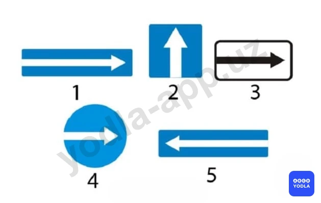
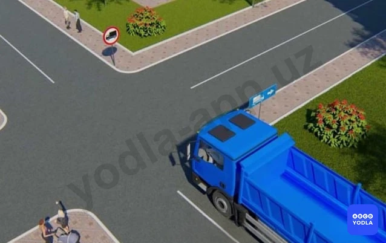
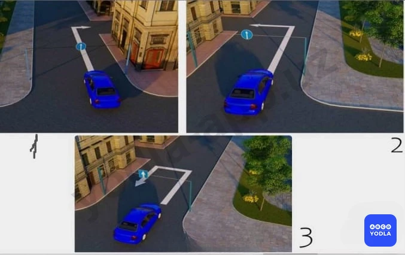
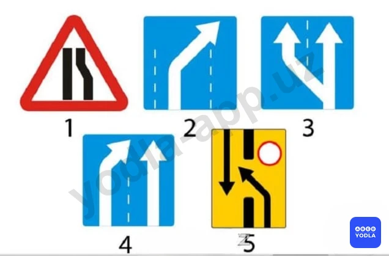
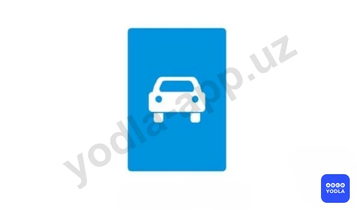
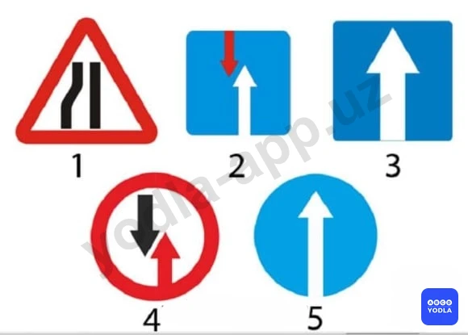
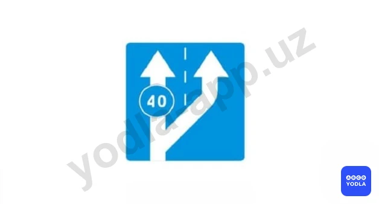
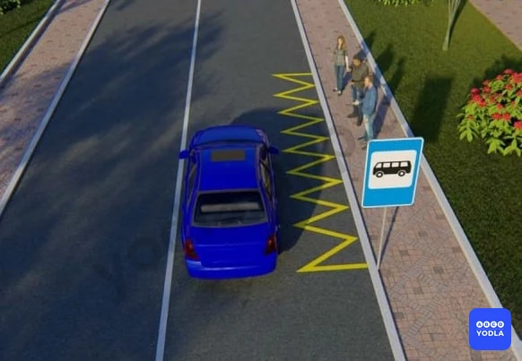
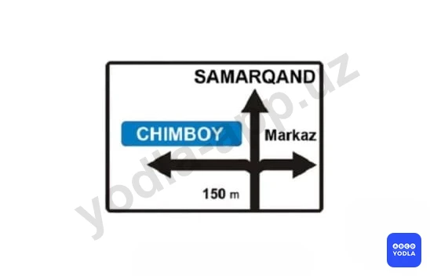

# Bilet 13

Всего вопросов: 20

## Вопрос 1

**Какие из этих знаков называются «Выезд на дорогу с односторонним движением»?**

✅ A. Первый и пятый
⬜ B. Третий и пятый
⬜ C. Второй и четвертый

> 💡 Знаки, обозначающие выезд на дорогу с односторонним движением, — это первый и пятый дорожные знаки. Они информируют водителя о выезде на дорогу, где организовано одностороннее движение.
Второй дорожный знак является знаком «Дорога с односторонним движением» и указывает, что движение транспортных средств осуществляется только в одном направлении.

---

## Вопрос 2

**Что обозначает этот знак?**

⬜ A. Предварительный указатель объезда препятствий
✅ B. Предварительный указатель перестроения на другую проезжую часть
⬜ C. Предварительный указатель выезда на полосу встречного движения

> 💡 Данный дорожный знак называется «Предварительный указатель перестроения на другую проезжую часть».
Обратите внимание, что толстая линия в центре знака указывает на наличие разделительной полосы. Если на дороге имеется разделительная полоса, это означает, что дорога состоит из двух отдельных проезжих частей.
Следовательно, этот знак заранее информирует водителей о необходимости перестроения на другую проезжую часть.
Таким образом, правильный ответ — «Предварительный указатель перестроения на другую проезжую часть».

---

## Вопрос 3

**Этот знак разрешает движение автомобиля:**

⬜ A. Во всех направлениях
⬜ B. «Б» и «В»
✅ C. «А» и «В»

> 💡 Этот знак обозначает «Место для разворота». Он разрешает выполнение разворота, однако запрещает поворот налево.
Следовательно, водитель может двигаться в направлениях А и В, но не может двигаться в направлении Б, то есть поворачивать налево.
Таким образом, правильный ответ — направления А и В.

---

## Вопрос 4

**Что обозначает этот знак?**

⬜ A. . Обязательное направление движения грузовых автомобилей, полная масса которых более 3,5т
⬜ B. Направление движения только для грузовых автомобилей
✅ C. Рекомендуемое направление движения для грузовых автомобилей, тракторов и самоходных машин, если на перекрестке их движение в одном из направлений запрещено
⬜ D. Направление движения грузовых автомобилей; осуществляющих междугородние перевозки

> 💡 Этот знак обозначает рекомендуемое направление движения для грузовых автомобилей на перекрёстке. Он рекомендует грузовым автомобилям двигаться направо, однако не является обязательным, а носит рекомендательный характер. Если водителю необходимо двигаться налево или он хорошо знает местность, он может повернуть налево или выполнить разворот, поскольку этот знак не запрещает такие манёвры. Обычно этот знак применяется в случаях, когда на прямом направлении для грузовых автомобилей имеется ограничение или препятствие, и водителям предлагается альтернативный маршрут. Он рекомендует, с какой стороны лучше объехать препятствие. Ключевым словом в вопросе является выражение рекомендуемое направление движения. Следовательно, данный знак обозначает рекомендуемое направление движения. Правильный ответ — третий вариант.

---

## Вопрос 5

**В каких направлениях разрешено продолжить движение на перекрестке?**

✅ A. Только «Г» и «Е»
⬜ B. «А», «Б», «Г», «Д»
⬜ C. «Б», «В», «Г», «Д»

> 💡 На перекрёстке установлен дорожный знак 5.8.1, который показывает, из какой полосы движения разрешено двигаться в определённых направлениях. Первая полоса предназначена только для поворота направо, а вторая полоса — только для движения прямо. Следовательно, движение разрешено в направлениях Г и Е.

---

## Вопрос 6

**В каком направлении разрешается движение грузовому автомобилю?**

⬜ A. Только направо
✅ B. Направо, налево и в обратном направлении
⬜ C. 3.Только налево

> 💡 Таким образом, для грузовых автомобилей движение прямо невозможно. Направо указано рекомендуемое направление движения. Поскольку дорога в прямом направлении закрыта, если мы едем по этому маршруту впервые и не знаем объездного пути, нам рекомендуется двигаться направо и воспользоваться объездом. Однако, если мы хорошо знаем эту местность или проживаем здесь, данный знак не запрещает поворот налево. Следовательно, в данной ситуации движение прямо запрещено, а поворот направо, поворот налево и разворот разрешаются.

---

## Вопрос 7

**На каком рисунке водитель совершил маневр не нарушая требований правил?**

✅ A. 1
⬜ B. 2
⬜ C. 3

> 💡 Рассмотрим каждое изображение отдельно. На первом изображении, несмотря на наличие знака "Движение прямо", разрешается поворот направо на прилегающую территорию, например во двор или жилой квартал. Нарушения правил здесь нет. На втором изображении водитель поворачивает налево, что противоречит требованиям дорожного знака и является нарушением. На третьем изображении установлен прямоугольный знак, обозначающий дорогу с односторонним движением. Водитель выполняет разворот и начинает движение во встречном направлении. На дороге с односторонним движением движение во встречном направлении запрещено. Следовательно, в данном случае также имеет место нарушение правил.

---

## Вопрос 8

**Что обозначает этот дорожный знак?**

✅ A. Указывает номер (маршрут) дороги
⬜ B. Указывает расстояние до ближайшего
⬜ C. Указывает расстояние до ближайшего
⬜ D. Дублирует «Километровый знак»

> 💡 Этот дорожный знак указывает номер маршрута дороги.

---

## Вопрос 9

**В каких направлениях; обозначенных стрелками разрешено движение?**

✅ A. «А»
⬜ B. «Б»
⬜ C. «А» и «Б»

> 💡 При наличии знака места для разворота разрешается только разворот. Данный дорожный знак запрещает поворот налево.

---

## Вопрос 10

**Какие из указанных знаков устанавливаются на автомагистралях?**

⬜ A. 1
⬜ B. 2
✅ C. 3
⬜ D. 4
⬜ E. 5

> 💡 Дорожные знаки, устанавливаемые на автомагистралях, всегда имеют зелёный фон. Следовательно, в данном случае правильным ответом является знак Е-30.

---

## Вопрос 11

**Какой из знаков указывает знак направление объезда закрытого для движения участка проезжей части на дороге с разделительной полосой?**

⬜ A. 1
⬜ B. 2
⬜ C. 3
⬜ D. 4
✅ E. 5

> 💡 Таким образом, знак, указывающий путь объезда закрытой проезжей части на дороге с разделительной полосой, является пятым знаком. Следовательно, правильный ответ — пятый вариант.

---

## Вопрос 12

**Разрешается ли автобусу движение по дороге, на которой установлен этот знак?**

⬜ A. Разрешается только автомобилю, разрешенная максимальная масса которого не более 3,5т
⬜ B. Запрещается
✅ C. Разрешается

> 💡 Этот дорожный знак обозначает дорогу для автомобилей. В зоне действия данного знака разрешается движение автобусов, мотоциклов и автомобилей. Следовательно, если в вопросе спрашивается, разрешено ли движение автобуса в месте установки этого знака, правильный ответ — разрешено.

---

## Вопрос 13

**Какой знак указывает участок дороги с односторонним движением?**

⬜ A. 1
⬜ B. 2
✅ C. 3
⬜ D. 4
⬜ E. 5

> 💡 В данном случае знак, обозначающий дорогу с односторонним движением, является третьим знаком. Следовательно, правильный ответ — третий знак.

---

## Вопрос 14

**Как должен поступить водитель, если его транспортное средство не может продолжить движении на подъем со скоростью равной или большей 40 км/ч?**

⬜ A. Продолжать движение по основной полосе, если за ним нет других транспортных средств
✅ B. Перестроиться на дополнительную полосу
⬜ C. Продолжать движение по основной полосе, если длина подъема не превышает 30 м

> 💡 Как видно, основная полоса движения предназначена для транспортных средств, движущихся со скоростью 40 км/ч и выше. Если транспортное средство не может развивать скорость 40 км/ч или движется с меньшей скоростью, водитель обязан перестроиться на дополнительную полосу движения. Данный дорожный знак указывает на необходимость перестроения на дополнительную полосу.

---

## Вопрос 15

**О чем вас информирует данный знак?**

✅ A. О месте остановки автобуса и троллейбуса
⬜ B. О запрете движения по правой полосе всем транспортным средствам кроме маршрутных

> 💡 Вопрос заключается в том, какую информацию предоставляет данный знак. Этот знак информирует о наличии остановочного пункта маршрутных транспортных средств. То есть он обозначает место остановки автобуса или троллейбуса.

---

## Вопрос 16

**Этот дорожный знак обозначает:**

✅ A. Дорога ведет в тупик
⬜ B. Направление движения к объекту в населенном пункте
⬜ C. Конец дополнительной полосы на подъеме или полосы разгона

> 💡 Этот дорожный знак обозначает дорогу, ведущую в тупик.

---

## Вопрос 17

**В каком направлении разрешено движение?**

⬜ A. Только прямо
⬜ B. Прямо и направо
✅ C. Прямо, направо и налево
⬜ D. Во всех направлениях

> 💡 Если в вопросе спрашивается, в каких направлениях разрешено движение, необходимо учитывать указанные направления на дорожном знаке. Знак показывает, куда можно двигаться прямо, направо и налево. Поскольку на дороге с односторонним движением данные направления не запрещены, разрешается движение направо, налево и прямо. Следовательно, правильный ответ — направо, налево и прямо.

---

## Вопрос 18

**Какой знак указывает расстояние до начала или конца дороги?**

✅ A. 1
⬜ B. 2
⬜ C. 3
⬜ D. 4
⬜ E. 5

> 💡 Дорожный знак, указывающий расстояние от начала дороги или до её конца, является знаком 6.13. Этот знак называется километровым указателем и показывает расстояние от начала дороги или до её окончания. Обычно он устанавливается через каждый километр.

---

## Вопрос 19

**Что означает вставка на синем фоне с наименованием населенного пункта на этом знаке?**

✅ A. Данный объект находится вне этого населенного пункта и движение к нему осуществляется не по автомагистрали
⬜ B. К указанному населенному пункту будет осуществляться движение по автомагистрали
⬜ C. Указанный объект находится в данном населенном пункте

> 💡 Если данный дорожный знак выполнен на синем фоне, это означает, что он указывает направление по дороге, не являющейся автомагистралью. Иными словами, знак показывает маршрут по обычной трассе. Следовательно, правильный ответ заключается в том, что указанный объект находится вне населённого пункта, а добраться до него можно по дороге, не относящейся к автомагистрали.

---

## Вопрос 20

**Какой знак называется "Конец дороги с односторонним движением"?**

⬜ A. 1
⬜ B. 2
⬜ C. 3
✅ D. 4
⬜ E. 5

> 💡 Знак, обозначающий конец дороги с односторонним движением, в данном случае является четвёртым знаком. Следовательно, правильный ответ — четвёртый знак.

---

