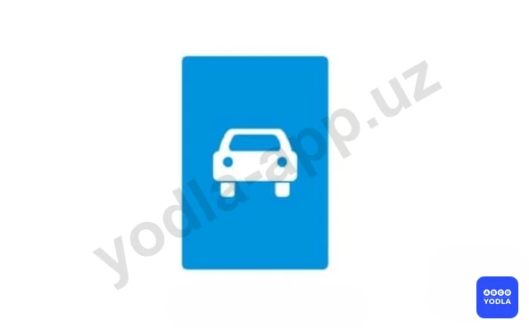
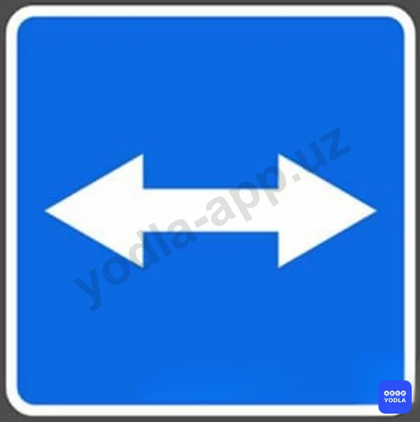
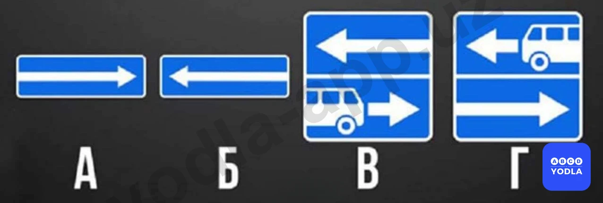
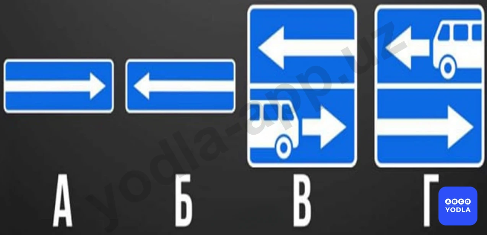
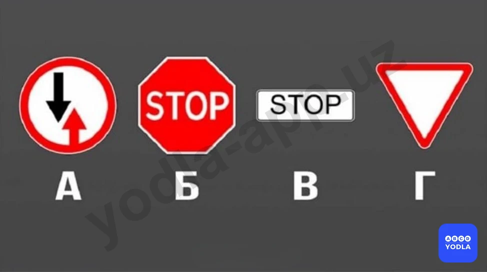
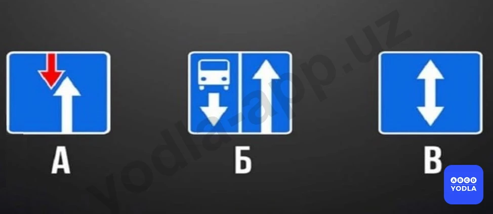
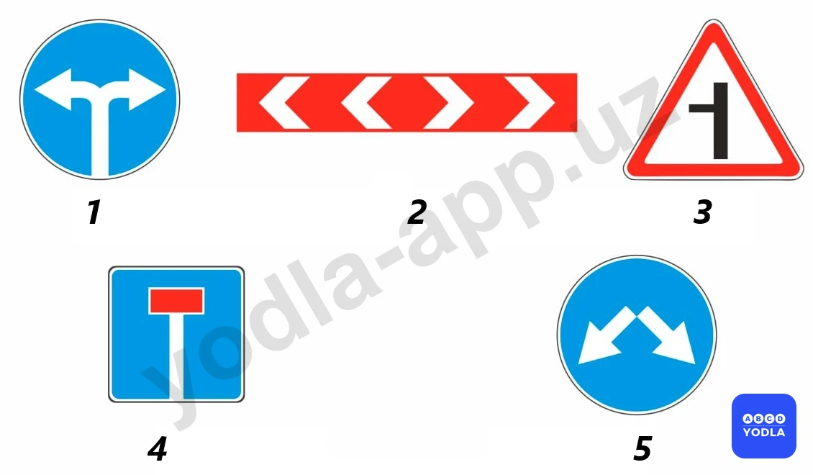
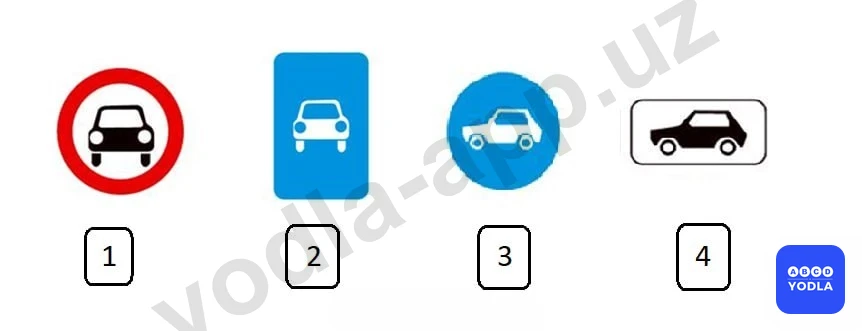

# Bilet 14

Всего вопросов: 20

## Вопрос 1

**Каким транспортным средствам разрешено движение по дороге; на которой установлен этот знак?**

⬜ A. Механическим транспортным средствам
⬜ B. Всем транспортным средствам
✅ C. Автомобилям, автобусам и мотоциклам
⬜ D. Транспортным средствам; максимальная скорость которых не менее 40 км/ч

> 💡 Знак, обозначающий конец дороги с односторонним движением, в данном случае является четвёртым знаком. Следовательно, правильный ответ — четвёртый знак.

---

## Вопрос 2

**Какие из этих знаков устанавливают в начале дороги с односторонним движением?**

⬜ A. Только «А»
✅ B. Только «Б»
⬜ C. «Б» и «Г»
⬜ D. «Б» и «Г»

> 💡 Вопрос заключается в том, какой из данных знаков устанавливается в начале дороги с односторонним движением. В данном случае правильным ответом является знак Б. Этот знак обозначает начало дороги с односторонним движением.

---

## Вопрос 3

**Какой из указанных знаков информирует о начале дороги с реверсивным движением?**

⬜ A. «А»
⬜ B. «Б»
✅ C. «В»

> 💡 Знак В является знаком, информирующим о начале реверсивного движения. Он сообщает водителям о начале участка дороги с реверсивным движением.

---

## Вопрос 4

**Этот знак указывает, что:**

⬜ A. Вы должны повернуть направо или налево
✅ B. На пересекаемой дороге организовано реверсивное движение
⬜ C. Вправо и влево от перекрестка организовано одностороннее движение

> 💡 Этот дорожный знак информирует о выезде на дорогу с реверсивным движением.

---

## Вопрос 5

**Какие знаки запрещают поворот налево?**

⬜ A. Только «А»
⬜ B. Только «А» и «Б»
✅ C. Только «А» и «Г»
⬜ D. Все

> 💡 Вопрос заключается в том, какие дорожные знаки запрещают поворот налево. Среди представленных знаков знак А запрещает поворот налево. Знак Г также запрещает поворот налево. В случае со знаком А движение разрешено только направо, поэтому поворот налево невозможен. При знаке Г поворот налево приводит к выезду на полосу, предназначенную для маршрутных транспортных средств, поэтому такой манёвр также запрещён. Следовательно, правильный ответ — А и Г.

---

## Вопрос 6

**Какие знаки разрешают выполнить разворот?**

⬜ A. Только  «Б»
⬜ B. Только «Б» и «Г»
⬜ C. Только «А», «Б» и «В»
✅ D. Все

> 💡 Во всех представленных случаях разворот разрешён. Ни один из указанных дорожных знаков не запрещает выполнение разворота.

---

## Вопрос 7

**Где начинают действовать требования Правил, относящиеся к населённым пунктам?**

✅ A. Только с места установки дорожного знака с названием населённого пункта на белом фоне 5.22
⬜ B. С места установки дорожного знака с названием населённого пункта на белом 5.22 или синем фоне 5.24
⬜ C. В начале застроенной территории, непосредственно прилегающей к дороге

> 💡 Правила дорожного движения, действующие в населённых пунктах, начинают применяться с места установки дорожного знака 5.22 с названием населённого пункта на белом фоне. Следовательно, именно с этого знака вступают в силу правила, установленные для населённых пунктов.

---

## Вопрос 8

**Какой знак указывает на дорогу для въезда в аварийных случаях?**

⬜ A. А и D
✅ B. В
⬜ C. С

> 💡 Если в вопросе спрашивается, какой знак обозначает въезд для аварийных ситуаций, то правильным ответом является знак В. Этот знак указывает путь въезда, предназначенный для использования в чрезвычайных и аварийных ситуациях.

---

## Вопрос 9

**Какой знак указывает место остановки транспортных средств при запрещающем сигнале светофора (регулировщика)?**

⬜ A. А
⬜ B. Б
✅ C. В
⬜ D. Г

> 💡 Вопрос заключается в том, какой знак обозначает место остановки транспортных средств при запрещающем сигнале светофора. Таким местом является стоп-линия. В данном случае знак, обозначающий стоп-линию, соответствует варианту В. Следовательно, правильный ответ — В. Многие путают варианты Б и В, однако если варианты указаны кириллическими буквами А, Б, В, Г, то следует выбирать именно вариант В.

---

## Вопрос 10

**Какой из этих знаков указывает на начало участка дороги, на котором возможно изменение направления движения в противоположную сторону?**

⬜ A. А
⬜ B. Б
✅ C. В

> 💡 Вопрос заключается в том, какой знак обозначает начало участка дороги, на котором направление движения по одной или нескольким полосам может изменяться на противоположное. Такая ситуация возникает при реверсивном движении. На реверсивной дороге направление движения по отдельным полосам может изменяться в зависимости от дорожной обстановки. Движение на таких участках регулируется реверсивными светофорами. Следовательно, правильным ответом является знак, обозначающий начало реверсивного движения. Правильный ответ — вариант В.

---

## Вопрос 11

**Какой знак указывает на закрытую улицу в конце дороги в указанном направлении?**

⬜ A. 1
⬜ B. 2
⬜ C. 3
✅ D. 4
⬜ E. 5

> 💡 Среди представленных дорожных знаков знак, обозначающий тупиковую дорогу, является четвёртым знаком. Следовательно, правильный ответ — четвёртый знак.

---

## Вопрос 12

**Какиезнаки являются информационно-указательным?**

⬜ A. 1 и 2
⬜ B. 3 и 4
✅ C. 2 и 3
⬜ D. 1 и 4

> 💡 Вопрос заключается в том, какие из представленных знаков относятся к информационно-указательным знакам. В данном случае второй и третий дорожные знаки являются информационно-указательными. Первый и четвёртый дорожные знаки относятся к знакам сервиса. Следовательно, правильный ответ — второй и третий знаки.

---

## Вопрос 13

**Какие из указанных знаков запрещают поворот налево?**

⬜ A. Только А
⬜ B. А и Б
✅ C. А и С
⬜ D. Все

> 💡 Вопрос заключается в том, какие из представленных знаков запрещают поворот налево. В случае со знаком А поворот налево невозможен, поскольку такой манёвр приводит к выезду на полосу, предназначенную для маршрутных транспортных средств. Знак С также запрещает поворот налево. Следовательно, правильный ответ — А и С.

---

## Вопрос 14

**Какие из указанных знаков запрещают движение транспортных средств, скорость которых по технической характеристике или их состоянию менее 40 км/ч?**

✅ A. Только A
⬜ B. Только C
⬜ C. A  и  B

> 💡 Вопрос заключается в том, какой знак запрещает движение транспортных средств, скорость которых не может превышать 40 км/ч. Правильным ответом является знак А. Этот знак запрещает движение по автомагистрали транспортным средствам, не способным двигаться со скоростью более 40 км/ч. Знак Б такого запрета не устанавливает.

---

## Вопрос 15

**Какие из указанных знаков разрешают движение грузовым автомобилям с разрешенной максимальной массой не более 3,5 т?**

✅ A. Только a и c
⬜ B. Только c
⬜ C. a и b

> 💡 Необходимо определить, какие из представленных знаков разрешают движение грузовых автомобилей с разрешённой максимальной массой не более 3,5 тонн. Знак С разрешает движение таких транспортных средств. Кроме того, знак А обозначает дорогу для автомобилей, по которой также разрешено движение грузовых автомобилей с разрешённой максимальной массой не более 3,5 тонн. Следовательно, правильный ответ — А и С.

---

## Вопрос 16

**Какие из этих знаков являются временные дорожными знаки:**

⬜ A. «1»и«4»
✅ B. «2»и«3»
⬜ C. «3»и«4»

> 💡 Вопрос заключается в том, какие из представленных знаков являются временными дорожными знаками. Временные дорожные знаки имеют жёлтый фон. В данном случае временными являются второй и третий дорожные знаки. Следовательно, правильный ответ — второй и третий знаки.

---

## Вопрос 17

**Какой знак называется «Дорога для автомобилей»?**

⬜ A. 1
✅ B. 2
⬜ C. 3
⬜ D. 4
⬜ E. 5

> 💡 Знак, обозначающий дорогу для автомобилей, в данном случае является вторым дорожным знаком. Следовательно, правильный ответ — второй знак.

---

## Вопрос 18

**Какой из знаков обозначает надземную парковку?**

✅ A. 1
⬜ B. 2
⬜ C. 3

> 💡 Вопрос заключается в том, какой из представленных дорожных знаков обозначает наземную парковку. Полутреугольный элемент на знаке символизирует поверхность земли. Первый знак обозначает наземную парковку. Второй знак обозначает подземную парковку. Третий знак указывает на парковку для электромобилей. Следовательно, если требуется определить знак наземной парковки, правильным ответом будет первый знак.

---

## Вопрос 19

**Что означает этот знак?**

⬜ A. От наличия пробок впереди
✅ B. Проезд в порядке очереди 
⬜ C. Едем на парковку

> 💡 Этот знак является новым дорожным знаком. Он обозначает наличие участка, где организован поочерёдный проезд транспортных средств.

---

## Вопрос 20

**Если постоянные и временные дорожные знаки противоречат друг другу по смыслу, какому из них вы должны следовать?**

⬜ A. Постоянному дорожному знаку
✅ B. Временному дорожному знаку

> 💡 Если постоянные и временные дорожные знаки противоречат друг другу, водители должны руководствоваться требованиями временных дорожных знаков.

---

