# Bilet 15

Всего вопросов: 20

## Вопрос 1

**Как называется этот знак?**

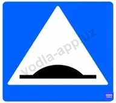

⬜ A. Искусственная неровность
⬜ B. Обязательное снижение скорости
✅ C. Приподнятый пешеходный переход

> 💡 Данный дорожный знак не обозначает искусственную неровность. Он указывает на наличие приподнятого пешеходного перехода.

---

## Вопрос 2

**В каких направлениях можно поворачивать?**

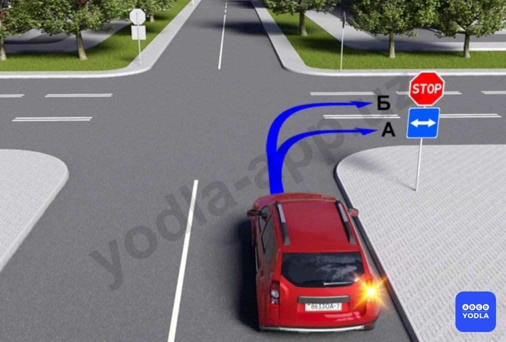

✅ A. Только «А»
⬜ B. Только «Б»
⬜ C. В обоих перечисленных случаях

> 💡 Вопрос заключается в том, в каком направлении разрешено движение. В данной ситуации движение разрешено в направлении А. Если водитель выберет направление Б, он выедет на полосу встречного движения. Следовательно, правильный ответ — направление А.

---

## Вопрос 3

**Какой знак обозначает пешеходный переход?**

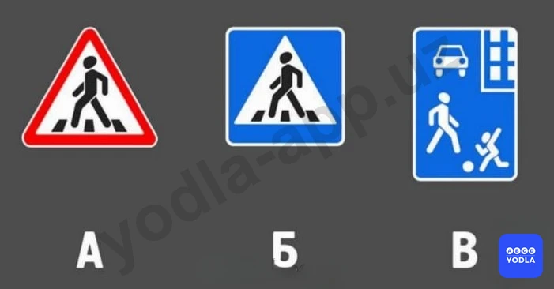

⬜ A. «А»
✅ B. «Б»
⬜ C. «В»

> 💡 Вопрос заключается в том, какой знак обозначает наличие пешеходного перехода. Многие ошибаются именно в этом вопросе. В данном случае правильным ответом является знак Б. Знак А предупреждает о приближении к пешеходному переходу. Знак В обозначает жилую зону. Следовательно, правильный ответ — Б.

---

## Вопрос 4

**Как называется этот знак?**

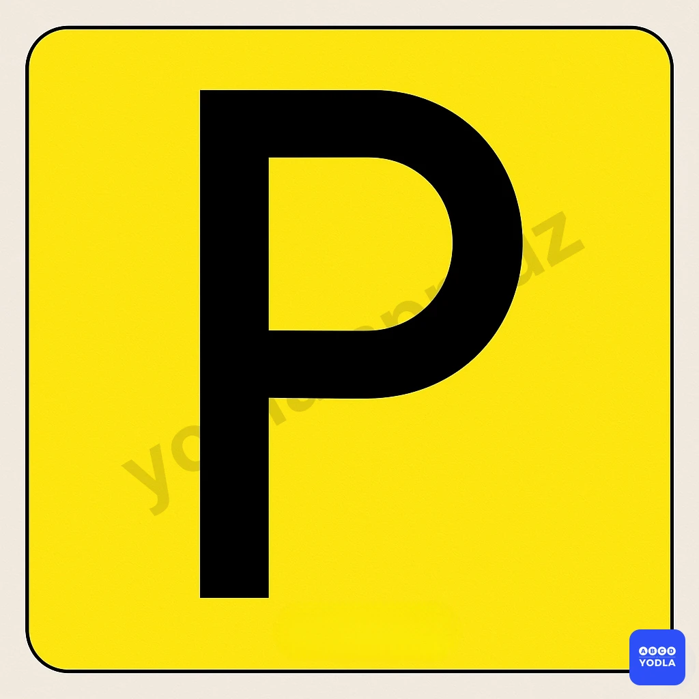

⬜ A. Место стоянки
✅ B. Платная стоянка
⬜ C. Надземная автомобильная стоянка
⬜ D. Подземная автомобильная стоянка

> 💡 Данный дорожный знак информирует о наличии платной стоянки.

---

## Вопрос 5

**Главная дорога показана**

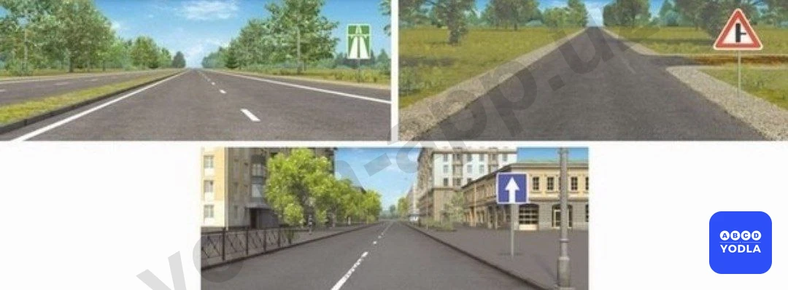

⬜ A. Только на левом верхнем рисунке
⬜ B. Только на правом верхнем рисунке
✅ C. На обоих верхних рисунках
⬜ D. На всех рисунках

> 💡 Вопрос заключается в том, какие из представленных дорог являются главными. Две верхние картинки обозначают главную дорогу. На нижнем изображении показана дорога с односторонним движением. По самому факту наличия одностороннего движения невозможно определить, является ли дорога главной или второстепенной. Автомагистраль считается главной дорогой. Кроме того, знак примыкания второстепенной дороги также указывает на наличие главной дороги. Следовательно, правильный ответ — две верхние картинки.

---

## Вопрос 6

**Какие знаки отменяют действие дорожного знака 3.24 "Ограничение максимальной скорости"?**

⬜ A. Только первый
⬜ B. Только второй
⬜ C. Только третий
⬜ D. Только четвёртый
✅ E. Все ответы верны

> 💡 Вопрос заключается в том, какие знаки отменяют действие ограничения максимальной скорости. В данной ситуации все представленные знаки отменяют действие ранее введённого ограничения скорости.

Знак начала населённого пункта вводит правила движения, действующие в населённых пунктах, поэтому предыдущее ограничение скорости теряет силу.

Знак окончания ограничения скорости отменяет именно это ограничение.

Знак окончания всех ограничений также отменяет ранее введённые ограничения.

Знак конца населённого пункта означает начало действия правил, установленных вне населённых пунктов, вследствие чего прежнее ограничение скорости также прекращает своё действие.

Следовательно, в данном случае все представленные дорожные знаки отменяют действие ограничения максимальной скорости.

---

## Вопрос 7

**Разрешен ли поворот направо на этом перекрестке?**

⬜ A. Запрещается
✅ B. Разрешается

> 💡 Вопрос заключается в том, разрешён ли поворот направо на данном перекрёстке. В данной ситуации отсутствуют какие-либо запрещающие знаки. Дорожный знак лишь информирует о том, что справа находится тупиковая улица. Следовательно, поворот направо разрешён. Правильный ответ — разрешено.

---

## Вопрос 8

**По какой траектории вам разрешается выполнить поворот налево?**

⬜ A. Только по траектории А
⬜ B. По любой из указанных траекторий
✅ C. Только по траектории B

> 💡 Как видно, первый знак информирует об окончании дороги с односторонним движением. Следующий предупреждающий знак сообщает о начале двустороннего движения.

Если водитель намерен двигаться прямо или направо, он должен занять правую полосу движения. Если же он собирается повернуть налево, необходимо занять левую полосу. Движение прямо из левой полосы в данной ситуации не допускается.

Следовательно, поворот налево разрешается только по направлениям А и Б, то есть со второй полосы движения.

---

## Вопрос 9

**В каких направлениях разрешено движение автомобилю?**

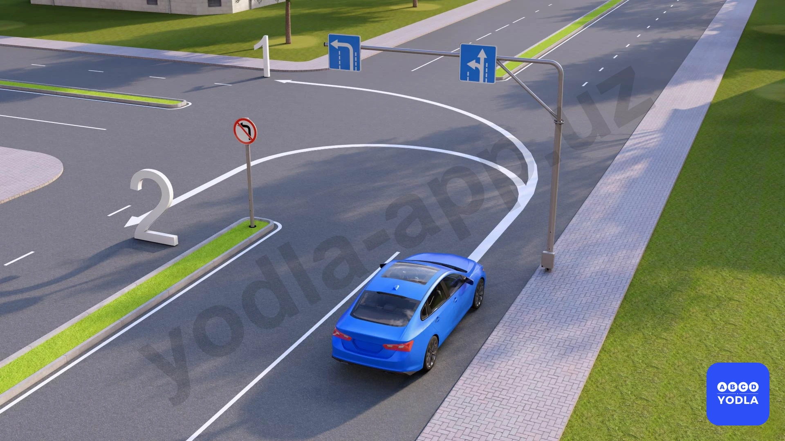

✅ A. В первом направлении
⬜ B. Во втором направлении
⬜ C. Разрешено в обоих направлениях

> 💡 Синий автомобиль находится на первой полосе движения. Для данной полосы разрешено движение прямо и налево. Следовательно, движение по первому направлению разрешается.

Движение по второму направлению с выполнением разворота не допускается, поскольку автомобиль находится не на крайней левой полосе. Разворот должен выполняться только из крайнего левого положения на проезжей части.

Таким образом, в данной ситуации разрешается движение только по первому направлению.

---

## Вопрос 10

**На каком знаке разрешён разворот?**

⬜ A. B
⬜ B. C
⬜ C. A
✅ D. A, B, C

> 💡 Если в вопросе спрашивается, какой знак разрешает разворот, то в данной ситуации ни один из представленных дорожных знаков не запрещает выполнение разворота. Следовательно, все указанные знаки разрешают разворот.

---

## Вопрос 11

**Какое транспортное средство поворачивает направо правильно?**

⬜ A. Белый и жёлтый автомобиль
⬜ B. Красный и белый автомобиль
⬜ C. Жёлтый и зелёный автомобиль
✅ D. Белый автомобиль
⬜ E. Все автомобили

> 💡 Вопрос заключается в том, какое транспортное средство правильно выполняет поворот направо. В данной ситуации правильный ответ — белый автомобиль.

Жёлтый автомобиль поворачивает направо со второй полосы движения. Поворот направо должен выполняться только с крайней правой полосы, поэтому это является нарушением.

Для красного автомобиля дорожный знак предписывает движение только прямо, поэтому поворот направо запрещён.

Зелёный автомобиль также выполняет поворот направо со второй полосы, что не допускается правилами.

Следовательно, правильный ответ — только белый автомобиль выполняет поворот направо правильно.

---

## Вопрос 12

**При коком сигнале светофора разрешается поворачивать направо без рельсовым транспортом средствам**

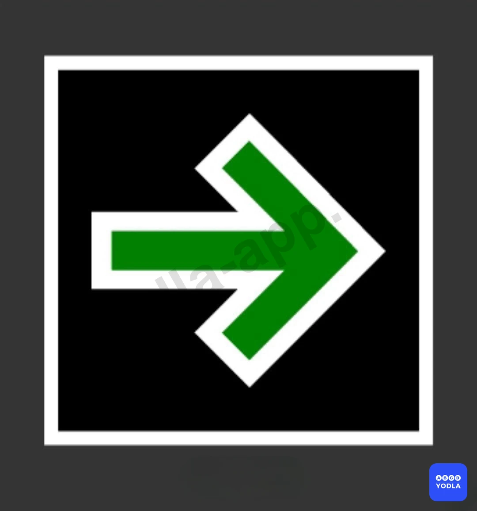

⬜ A. Красный сигнал
⬜ B. Желтый знак
⬜ C. Зеленый знак
✅ D. Все показано

> 💡 Дорожный знак 5.42 указывает, что при красном сигнале светофора разрешается поворот направо. В остальных случаях водитель должен руководствоваться общими правилами дорожного движения. Следовательно, движение разрешается по всем указанным направлениям. Правильный ответ — все указанные направления.

---

## Вопрос 13

**Разрешено ли водителю Синий  автомобиля въезжать на парковку?**

⬜ A. Разрешено
✅ B. Запрещено

> 💡 Данный дорожный знак разрешает разворот, но запрещает поворот налево. Поэтому, если в вопросе спрашивается, разрешён ли въезд в данном направлении, правильный ответ — запрещено.

---

## Вопрос 14

**Какой из следующих дорожных знаков требует соблюдения минимальной скорости?**

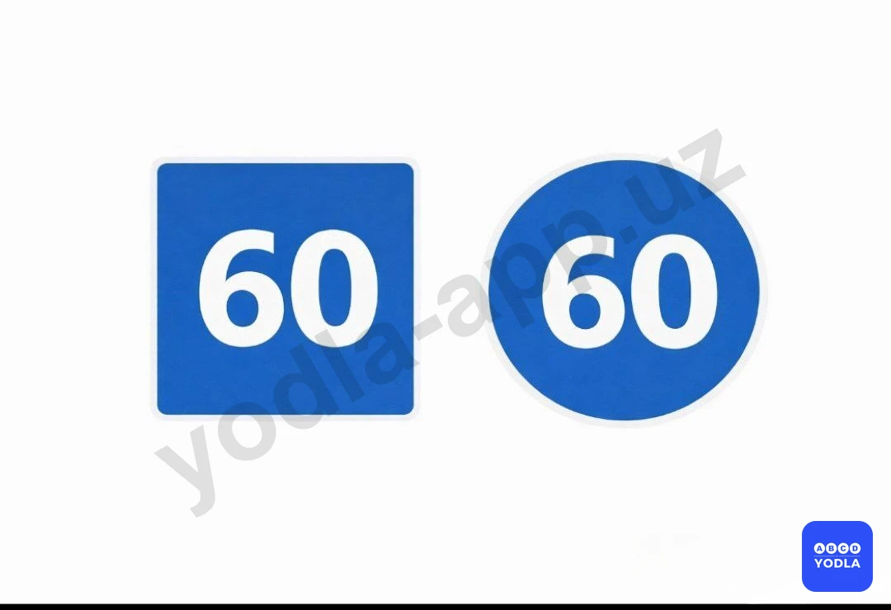

⬜ A. На вывеске слева
✅ B. На вывеске справа
⬜ C. В обоих случаях

> 💡 Вопрос заключается в том, какой из представленных дорожных знаков устанавливает минимальную скорость движения. Правильным ответом является знак, расположенный справа. Этот знак указывает, что транспортные средства должны двигаться со скоростью не менее 60 км/ч или выше.

Первый знак прямоугольной формы обозначает рекомендуемую скорость движения. Он не является обязательным. Водитель может двигаться со скоростью 60 км/ч, ниже или выше этого значения, если это не противоречит правилам дорожного движения.

Следовательно, правильный ответ — только знак, расположенный справа.

---

## Вопрос 15

**В каких направлениях вам разрешено продолжить движение?**

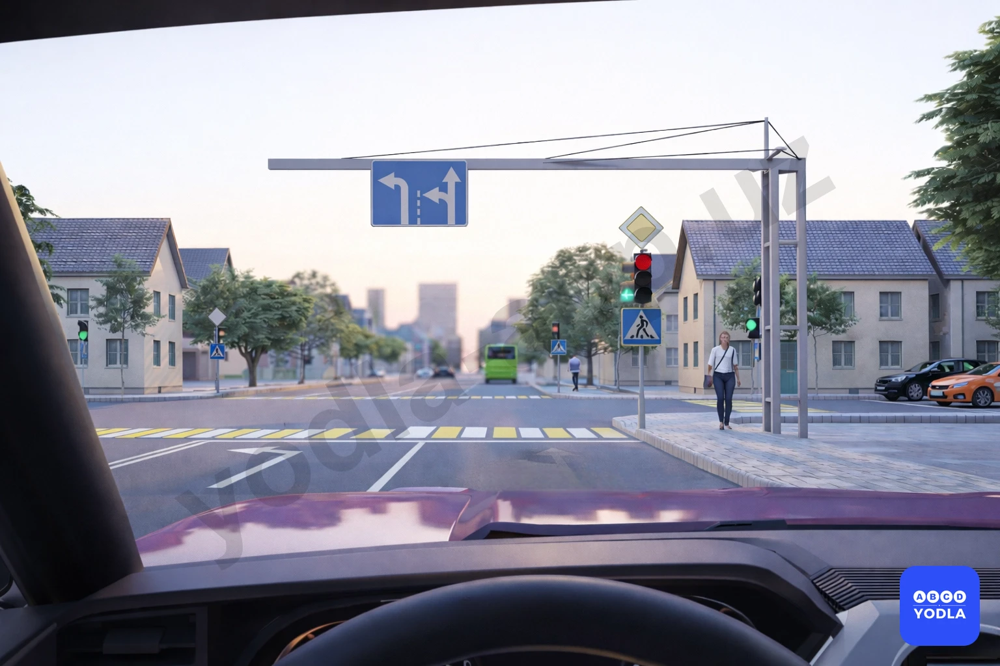

✅ A. Только налево
⬜ B. Прямо и налево
⬜ C. Налево и с разворотом

> 💡 Как видно, дополнительная секция светофора разрешает движение налево. Транспортное средство находится на первой полосе движения. В данной ситуации движение прямо не разрешается, однако разрешён поворот налево. Выполнение разворота также не допускается. Следовательно, движение разрешено только налево. Правильный ответ — только налево.

---

## Вопрос 16

**Какой знак обозначает «Гостиницу» ?**

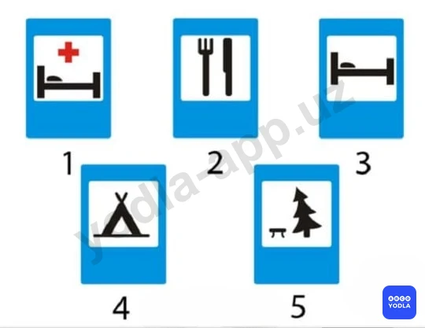

⬜ A. 1
⬜ B. 2
✅ C. 3
⬜ D. 4
⬜ E. 5

> 💡 Вопрос заключается в том, какой знак обозначает гостиницу. Правильным ответом является третий знак. Этот знак информирует о наличии гостиницы.

---

## Вопрос 17

**Какому автомобилю разрешается остановка в зоне действия этих знаков?**

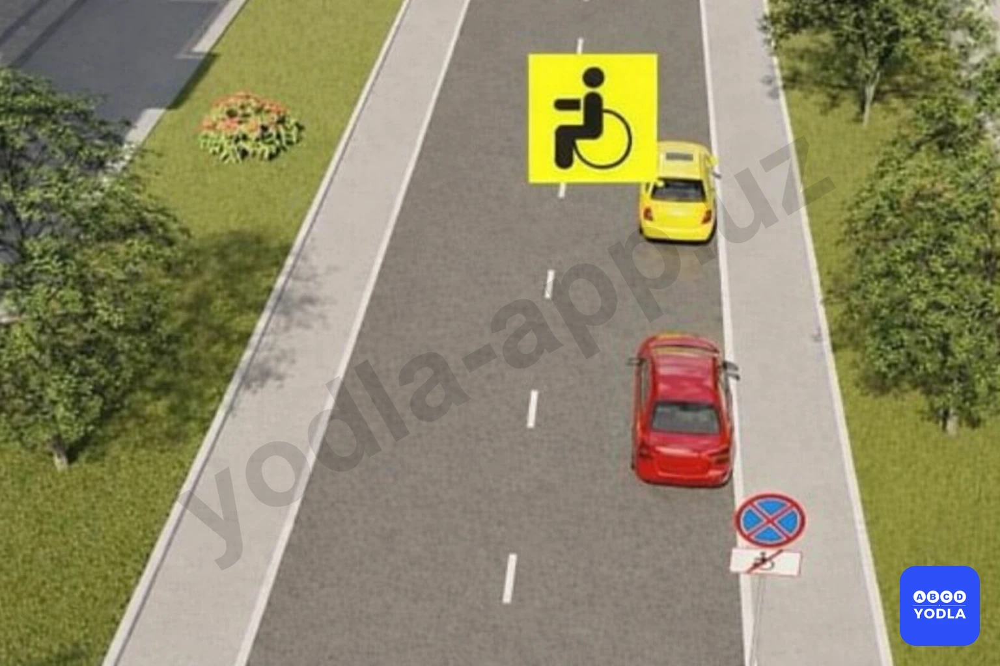

⬜ A. Красному
⬜ B. Обоим автомобилям
⬜ C. Ни одному
✅ D. Желтому автомобилю, обозначенному опознавательным знаком “Инвалид”

> 💡 Этот знак означает, что остановка запрещена, за исключением транспортных средств, управляемых лицами с инвалидностью или перевозящих таких лиц. Следовательно, остановка запрещена для всех транспортных средств, кроме тех, на которых установлен опознавательный знак «Инвалид». Поэтому водителю жёлтого автомобиля с таким опознавательным знаком остановка в данном месте разрешается.

---

## Вопрос 18

**Эти знаки разрешают движение:**

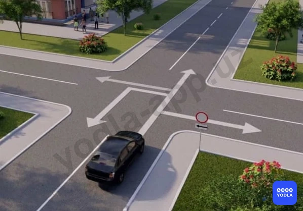

⬜ A. Только налево
⬜ B. Только прямо
⬜ C. Только направо
✅ D. Прямо, направо и в обратном направлении

> 💡 Если дорожный знак запрещает поворот налево, водителю разрешается двигаться прямо, поворачивать направо и выполнять разворот. Следовательно, правильный ответ — разрешено движение прямо, направо и разворот.

---

## Вопрос 19

**Этот дорожный знак вместе с дополнительной информационной табличкой означает:**

⬜ A. Место стоянки транспортных средств с разрешенной максимальной массой более 3,5 т. Табличка указывает, что у края проезжей части высокий бордюрный камень
⬜ B. Место стоянки транспортных средств; способ постановки автомобиля; указанный на табличке запрещается
✅ C. Место и способ постановки легковых автомобилей и мотоциклов на стоянке

> 💡 Если данный дорожный знак запрещает поворот налево, водителю разрешается двигаться прямо, поворачивать направо и выполнять разворот. Следовательно, правильный ответ — разрешено движение прямо, направо и разворот.

---

## Вопрос 20

**Разрешен ли обгон в этом месте?**

✅ A. Разрешается
⬜ B. Запрещается
⬜ C. Разрешается, если скорость обгоняемого меньше 40 км/ч.

> 💡 Вопрос заключается в том, разрешён ли обгон в данной ситуации. Да, обгон разрешён. Знак "Обгон грузовым автомобилям запрещён" установлен с табличкой, указывающей, что его действие начинается через 300 метров.

Кроме того, данный знак распространяется только на грузовые автомобили. На легковые автомобили это ограничение не действует. Поэтому водителю легкового автомобиля обгон разрешается.

Следовательно, правильный ответ — обгон разрешён.

---

