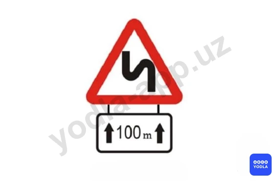
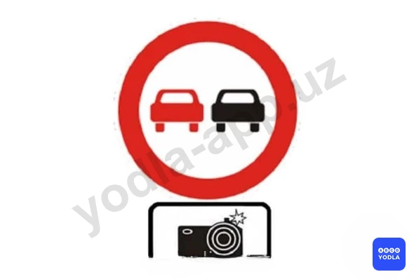
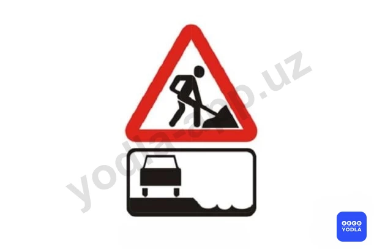
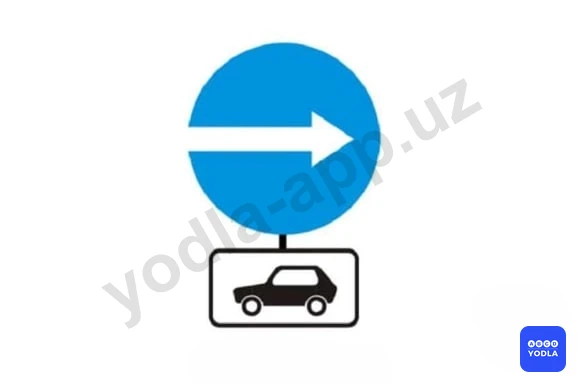
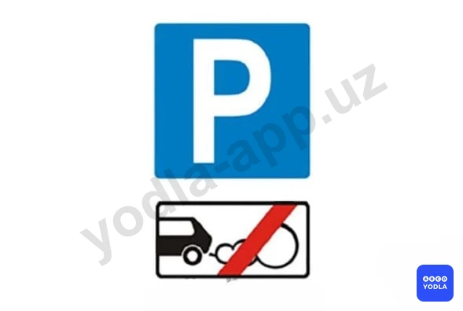
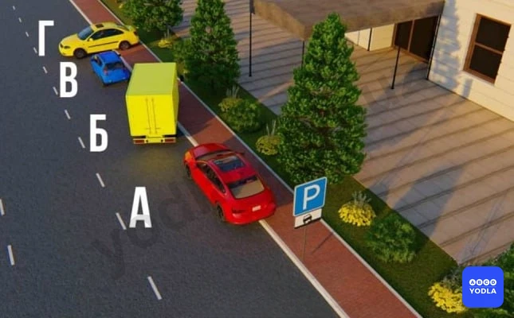
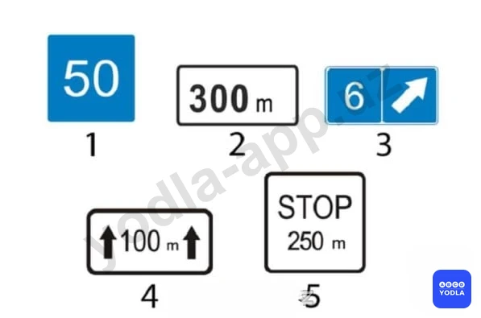
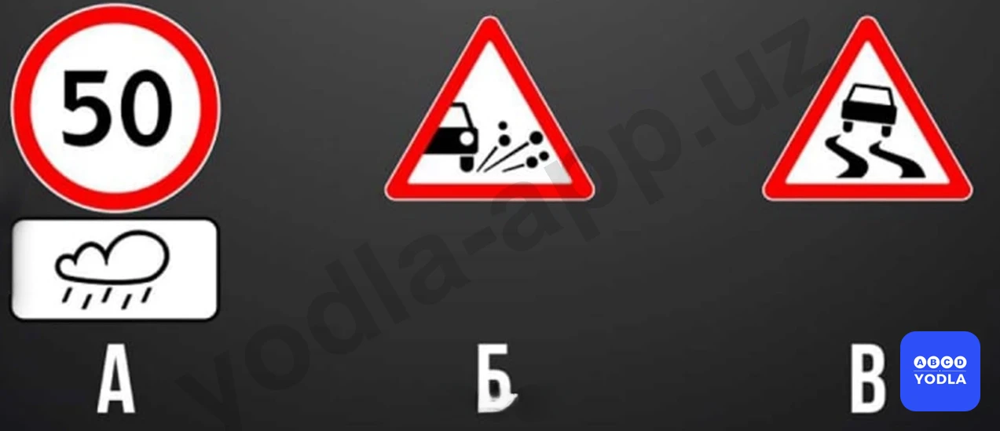
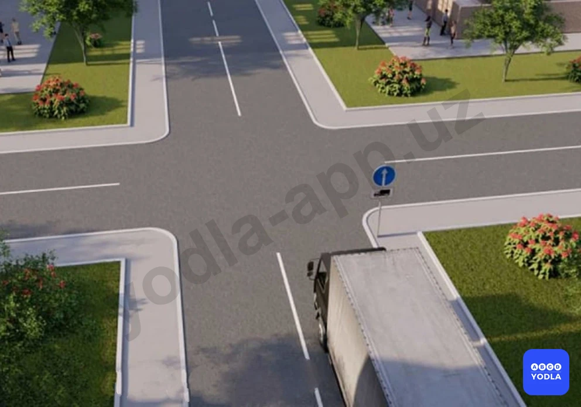
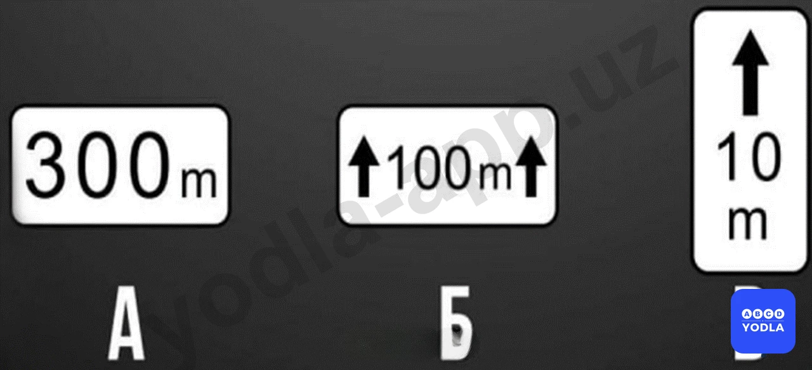

# Bilet 16

Всего вопросов: 20

## Вопрос 1

**В каком направлении запрещено движение?**

✅ A. Налево и направо
⬜ B. Прямо и в обратном направлении
⬜ C. Только прямо
⬜ D. Во всех направлениях

> 💡 Вопрос заключается в том, в каких направлениях движение запрещено. Как видно, дополнительная информационная табличка указывает направления направо и налево. Следовательно, в данной ситуации движение направо и налево запрещено. Правильный ответ — движение направо и налево запрещено.

---

## Вопрос 2

**Что означает табличка под знаком?**

⬜ A. Расстояние от знака до начала первого поворота
⬜ B. Расстояние от первого поворота до начала второго поворота
✅ C. Протяженность участка дороги с опасными поворотами

> 💡 Дополнительная табличка под дорожным знаком указывает протяжённость участка дороги, на котором имеются опасные повороты.

---

## Вопрос 3

**Что означает дополнительной информационной знак под нижеуказанном знаком?**

⬜ A. Обозначает участок дороги; на котором запрещено фото и видео фиксация
✅ B. Обозначает участок дороги; на котором установили фото и видео наблюдение со стороны ГИБДД

> 💡 Этот знак информирует о наличии участка дороги, на котором ведётся фото- и видеофиксация процесса дорожного движения органами безопасности дорожного движения.

---

## Вопрос 4

**С какой целью установлена табличка под данным знаком?**

✅ A. Для уточнения расстояния от знака до начала зоны его действия
⬜ B. Для уточнение зоны действия запрещающего знака

> 💡 Вопрос заключается в том, с какой целью устанавливается дополнительная информационная табличка под запрещающим знаком. Такая табличка указывает расстояние до начала действия дорожного знака. То есть она показывает, через какое расстояние требование знака вступает в силу. Следовательно, правильным является первый вариант ответа. Например, это означает: "Обгон запрещён через 300 метров".

---

## Вопрос 5

**Разрешается ли остановка автомобиля с опознавательным знаком "Инвалид" в зоне действия этих знаков?**

✅ A. Разрешается
⬜ B. Запрещается

> 💡 Вопрос заключается в том, разрешена ли остановка автомобилю, обозначенному опознавательным знаком «Инвалид». Дополнительная табличка означает «Кроме инвалидов». Поэтому транспортному средству с опознавательным знаком «Инвалид» остановка в данном месте разрешается. Следовательно, правильный ответ — разрешено.

---

## Вопрос 6

**О чем предупреждают знак и табличка под ним**

⬜ A. Остановка на обочине запрещена в связи с работами
✅ B. Съезд на обочину опасен в связи с проведением на ней ремонтных работ
⬜ C. Стоянка на обочине запрещена в связи с ремонтными работами на дороге

> 💡 Дополнительная табличка под данным дорожным знаком означает, что из-за проведения ремонтных работ на обочине выезд на неё является опасным.

---

## Вопрос 7

**Какой из знаков указывает протяженность опасного участка дороги; обозначенного предупреждающими знаками?**

⬜ A. 1
⬜ B. 2
⬜ C. 3
✅ D. 4
⬜ E. 5

> 💡 Вопрос заключается в том, какая дополнительная табличка указывает протяжённость опасного участка дороги, обозначенного предупреждающим знаком. В данном случае правильным ответом является четвёртая табличка. Она указывает длину опасного участка дороги.

---

## Вопрос 8

**Какой автомобиль нарушил правила остановки?**

⬜ A. Зеленый автомобиль
✅ B. Оба нарушили
⬜ C. Оба не нарушали

> 💡 В данной ситуации под знаком "Остановка запрещена" установлена дополнительная табличка "Кроме инвалидов". Это означает, что остановка разрешается только транспортным средствам, на которых установлен опознавательный знак «Инвалид».

Если на транспортном средстве имеется такой знак, водитель может воспользоваться данным исключением. Во многих подобных вопросах правильным ответом выбирают водителя жёлтого автомобиля. Однако в данной ситуации на жёлтом автомобиле отсутствует опознавательный знак «Инвалид».

Следовательно, в данном случае оба водителя нарушили правила дорожного движения.

---

## Вопрос 9

**В каком направлении разрешается движение автомобиля?**

⬜ A. Налево и направо
⬜ B. Только прямо
✅ C. Во всех направлениях

> 💡 Этот вопрос часто вводит в заблуждение. Данный дорожный знак называется "Движение легковых автомобилей". На знаке указаны направления направо и налево.

Если бы на месте красного автомобиля находился грузовой автомобиль с разрешённой максимальной массой более 3,5 тонн, движение направо и налево для него было бы запрещено. В такой ситуации ему было бы разрешено только движение прямо или разворот.

Однако в данном случае транспортное средство является легковым автомобилем, поэтому ему разрешается движение во всех направлениях.

Следовательно, правильный ответ — движение разрешено во всех направлениях.

---

## Вопрос 10

**На какие транспортные средства распространяется действие знаков?**

⬜ A. Только на легковые автомобили
⬜ B. На легковые автомобили и мотоциклы
✅ C. На легковые автомобили и грузовые автомобили с разрешенной максимальной массой менее или равной 3,5 т

> 💡 Этот знак разрешает движение легковым автомобилям, а также грузовым автомобилям с разрешённой максимальной массой не более 3,5 тонн.

В некоторых вопросах вариант ответа о грузовых автомобилях с разрешённой максимальной массой не более 3,5 тонн может отсутствовать. В таких случаях правильным считается ответ "только легковым автомобилям".

Однако в данном вопросе такой вариант присутствует, поэтому правильным ответом является третий вариант.

---

## Вопрос 11

**Какой знак указывает способ постановки транспортного средства на стоянку?**

⬜ A. 1
⬜ B. 2
✅ C. 3
⬜ D. 4
⬜ E. 5

> 💡 Вопрос заключается в том, какая дополнительная информационная табличка указывает способ постановки транспортного средства на стоянку. В данном случае правильным ответом является третий знак. Эта табличка показывает, каким образом необходимо размещать транспортное средство на парковке.

---

## Вопрос 12

**О чем информирует водителя табличка, установленная под данным знаком?**

⬜ A. Во время стоянки запрещено выключать двигатель
✅ B. Стоянка разрешена только с выключенным двигателем

> 💡 Вопрос заключается в том, о чём информирует водителя дополнительная табличка под дорожным знаком. Эта табличка означает, что стоянка разрешается только при выключенном двигателе. Иными словами, стоянка с работающим двигателем не допускается. Следовательно, правильным ответом является второй вариант.

---

## Вопрос 13

**Водители; каких транспортных средств нарушили правила стоянки?**

⬜ A. «А» и «Б»
⬜ B. Только «Г»
⬜ C. «Б» и «Г»
⬜ D. «В» и «Г»
✅ E. «Б», «В» и «Г»

> 💡 Данная дополнительная табличка указывает способ стоянки легковых автомобилей, мотоциклов, мопедов и велосипедов на тротуаре. Согласно указанному способу, транспортное средство должно быть частично расположено на тротуаре.

Красный автомобиль припаркован в соответствии с требованиями знака и не нарушает правила. Жёлтый и синий автомобили нарушают установленный порядок стоянки. Кроме того, жёлтому грузовому автомобилю в данном месте стоянка вообще не разрешается.

Следовательно, правила нарушили транспортные средства Б, В и Г. Только красный автомобиль припаркован правильно.

---

## Вопрос 14

**Какой из знаков указывает протяженность опасного участка дороги?**

⬜ A. 1
⬜ B. 2
⬜ C. 3
✅ D. 4
⬜ E. 5

> 💡 Вопрос заключается в том, какой дорожный знак указывает протяжённость опасного участка дороги. В данном случае правильным ответом является четвёртый знак. Он обозначает длину опасного участка дороги.

---

## Вопрос 15

**Что означают эти знаки?**

⬜ A. Знак «Инвалид» для автомобилей с ограниченными возможностями появится на проезжей части через 30 м
⬜ B. Место стоянки в зоне 30 м для транспортных средств, кроме мотоколясок
✅ C. Место стоянки в зоне 30 м для мотоколясок и автомобилей с опознавательным знаком «Инвалид»

> 💡 Этот знак обозначает место стоянки протяжённостью 30 метров, предназначенное для мотоколясок и автомобилей, обозначенных опознавательным знаком «Инвалид».

---

## Вопрос 16

**Какому транспортному средству запрещено останавливаться?**

⬜ A. Водитель легкового автомобиля
⬜ B. Водитель мотоцикла
✅ C. Водитель грузового автомобиля
⬜ D. Водители всех транспортных средств

> 💡 Вопрос заключается в том, для каких транспортных средств запрещена остановка. Данная дополнительная табличка указывает, что запрет распространяется только на грузовые автомобили. Следовательно, в этом месте остановка запрещена только грузовым автомобилям.

---

## Вопрос 17

**Что указывает табличка под знаком?**

⬜ A. Протяженность узкого участка дороги
✅ B. Расстояние от знака до узкого участка дороги
⬜ C. Расстояние до объезда узкого участка дороги

> 💡 Дополнительная табличка под дорожным знаком указывает расстояние от знака до сужения дороги. Иными словами, она показывает расстояние от места установки знака до указанного объекта. Следовательно, правильный ответ — расстояние до участка сужения дороги.

---

## Вопрос 18

**Каки�� знаки распространяют свое действие только на период времени, когда покрытие проезжей части влажное?**

✅ A. Только «А»
⬜ B. Только «А» и «Б»
⬜ C. Все

> 💡 Вопрос заключается в том, какой из представленных дорожных знаков действует только при влажном дорожном покрытии. В данном случае правильным ответом является знак А. Эта дополнительная табличка указывает, что требования основного дорожного знака распространяются только на период, когда дорожное покрытие является влажным.

---

## Вопрос 19

**Вам разрешено продолжить движение на грузовом автомобиле с разрешенной максимальной массой  более 3,5 т:**

✅ A. Только прямо
⬜ B. Прямо и направо
⬜ C. Во всех направлениях

> 💡 Для грузовых автомобилей с разрешённой максимальной массой более 3,5 тонн указано направление движения. В данной ситуации дорожный знак разрешает таким грузовым автомобилям движение только прямо. Следовательно, правильный ответ — разрешено движение только прямо.

---

## Вопрос 20

**Какие знаки дополнительной информации указывают протяженность зоны действия знаков, с которыми они применяются?**

⬜ A. Только «А»
⬜ B. Только «Б»
✅ C. «Б» и «В»

> 💡 Вопрос заключается в том, какие дополнительные таблички при совместном применении указывают зону действия дорожного знака. В данном случае правильным ответом являются таблички Б и В. Они обозначают участок дороги, на котором действует основной дорожный знак.

Табличка А показывает расстояние от места установки знака до начала зоны его действия, то есть указывает, через какое расстояние знак начинает действовать.

Следовательно, правильный ответ — Б и В.

---

