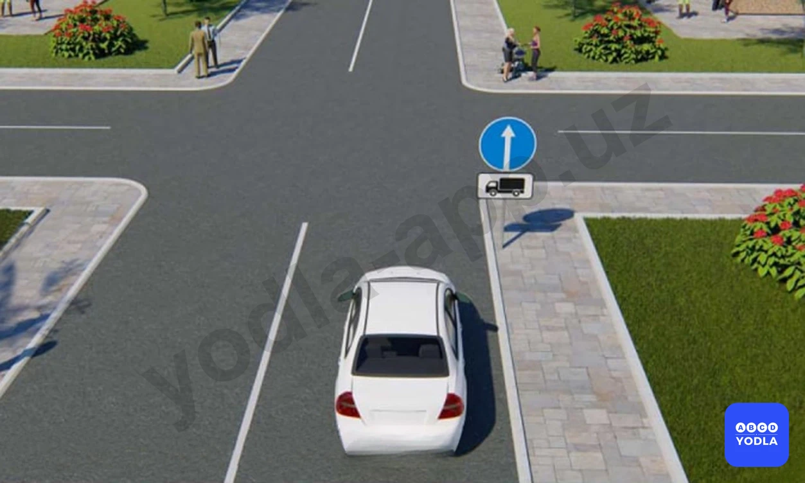
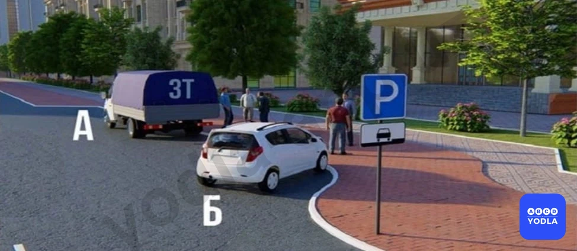
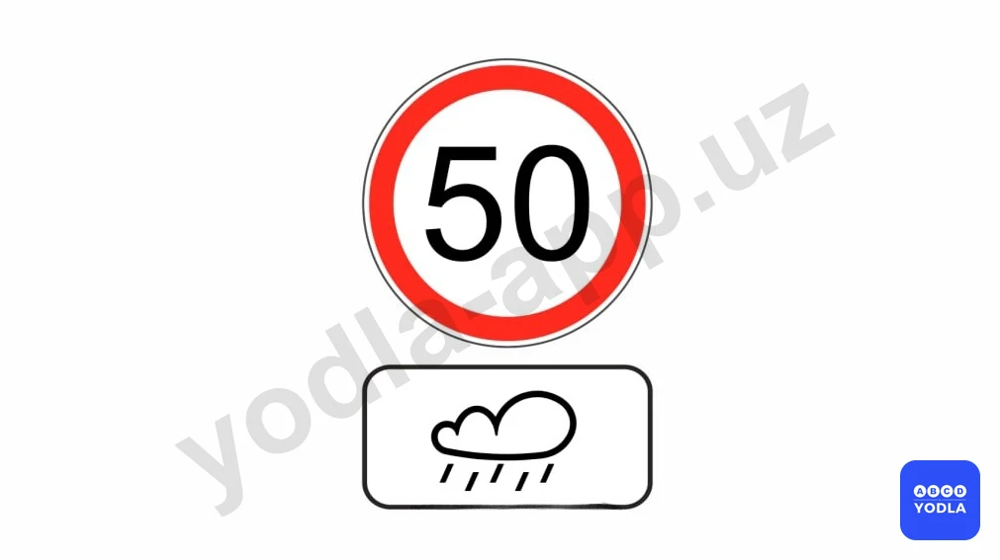
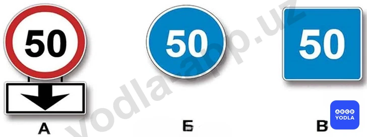
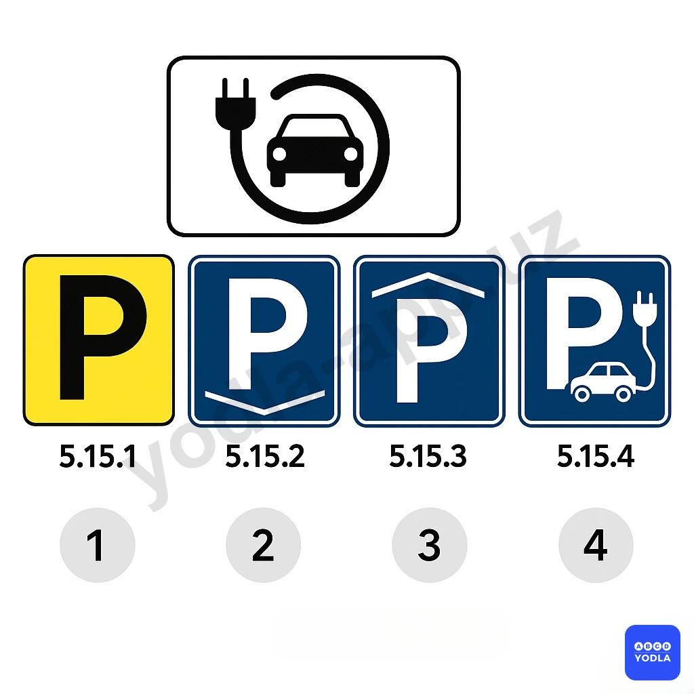
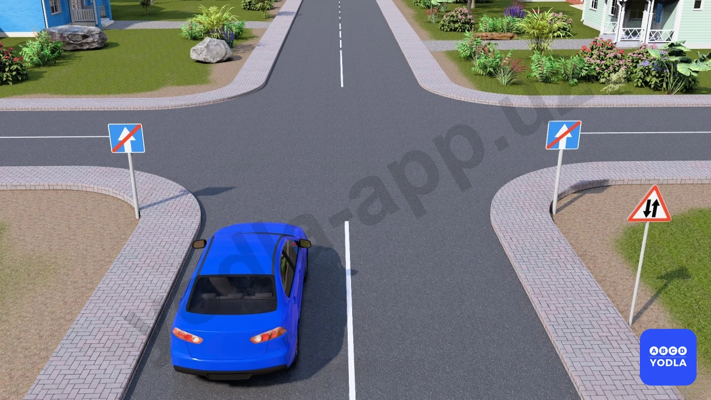
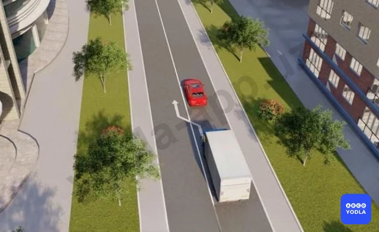
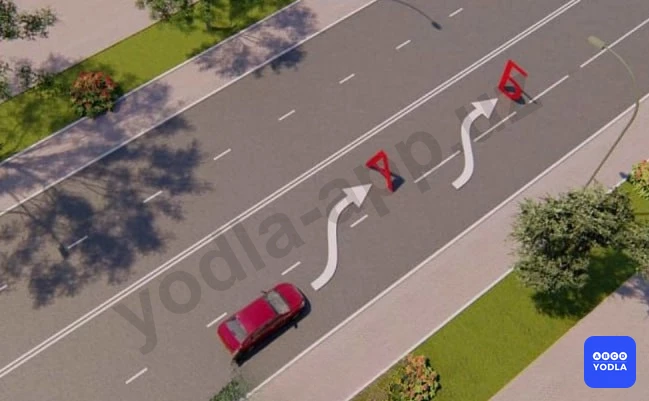
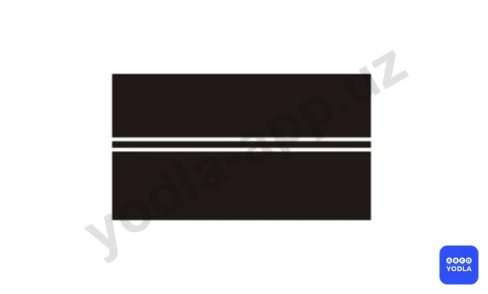
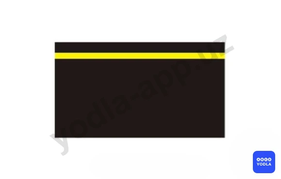

# Bilet 17

Всего вопросов: 20

## Вопрос 1

**В каких направлениях Вам разрешено продолжить движение на легковом автомобиле?**

⬜ A. Только прямо
⬜ B. Только налево или направо
✅ C. В любых

> 💡 Вопрос заключается в том, в каких направлениях разрешено движение легковому автомобилю. В данной ситуации знак 4.1.1 «Движение прямо» применяется вместе с дополнительной табличкой и распространяется только на грузовые автомобили с разрешённой максимальной массой более 3,5 тонн.

Следовательно, на водителя легкового автомобиля действие данного знака не распространяется. Поэтому легковому автомобилю разрешается движение в любом направлении.

Правильный ответ — разрешено движение по всем указанным направлениям.

---

## Вопрос 2

**Эта табличка указывает:**

✅ A. Способ стоянки всех видов транспортных средств на проезжей части, рядом с тротуаром.
⬜ B. Место для стоянки легковых автомобилей
⬜ C. Стоянка механических транспортных средств.

> 💡 Данная дополнительная табличка указывает способ постановки на стоянку и остановки для всех видов транспортных средств. Она показывает порядок размещения транспортных средств у края проезжей части рядом с тротуаром.

Другие аналогичные таблички распространяются только на легковые автомобили, мотоциклы, мопеды и велосипеды. Именно эта табличка применяется ко всем видам транспортных средств.

Следовательно, данный знак обозначает способ остановки и стоянки для всех типов транспортных средств.

---

## Вопрос 3

**В каких случаях запрещается движение со скоростью выше 50 км/с?**

✅ A. Только если дорога мокрая
⬜ B. В любом случае

> 💡 Вопрос заключается в том, в каком случае запрещается движение со скоростью более 50 км/ч. Данное ограничение действует только при влажном дорожном покрытии. Дополнительная табличка указывает, что требования основного дорожного знака распространяются исключительно на период, когда дорожное покрытие является мокрым.

Следовательно, движение со скоростью более 50 км/ч запрещается только при влажном дорожном покрытии.

---

## Вопрос 4

**Этот допольнительная табличка означает:**

✅ A. Расстояние до объекта
⬜ B. Зона действия знака

> 💡 Данная дополнительная табличка указывает расстояние до объекта. То есть она показывает, какое расстояние осталось до объекта, обозначенного основным дорожным знаком.

---

## Вопрос 5

**Эта табличка означает**

✅ A. Указывает на принудительную эвакуацию автомобилей, остановившихся в зоне действие знака
⬜ B. Разрешает эвакуацию остановившихсятранспортных средств в зоне действие знака
⬜ C. Запрещает эвакуацию остановившихся транспортных средств в зоне действие знака

> 💡 Данная дополнительная табличка указывает, что транспортные средства, остановившиеся или находящиеся на стоянке в зоне действия дорожного знака, подлежат принудительной эвакуации.

---

## Вопрос 6

**С каким дорожным знаком применяется эта табличка?**

⬜ A. A
✅ B. B
⬜ C. C

> 💡 Вопрос заключается в том, с каким дорожным знаком применяется данная дополнительная табличка. В данном случае она используется совместно с предупреждающим дорожным знаком. Следовательно, правильный ответ — вариант Б.

---

## Вопрос 7

**Какой из указанных знаков распространяет свое действие только на ту полосу, над которой он установлен?
**

⬜ A. «Б» и «В»
⬜ B. Только «Б»
✅ C. Только «А»

> 💡 Вопрос заключается в том, какой знак действует только на определённую полосу движения. Правильным ответом является знак А. Стрелка, направленная вниз, указывает, что требование знака распространяется только на указанную полосу.

Знак Б синего цвета обозначает минимальную скорость движения. Он запрещает движение со скоростью менее 50 км/ч по данной полосе, но разрешает движение со скоростью выше 50 км/ч.

Знак В прямоугольной формы является информационным знаком рекомендуемой скорости. Он рекомендует движение со скоростью 50 км/ч, однако не устанавливает обязательного ограничения. Водитель может двигаться со скоростью 50 км/ч, ниже или выше этого значения, если это не противоречит другим требованиям правил дорожного движения.

В случае со знаком А ограничение скорости действует только на ту полосу, на которую указывает стрелка. Например, если знак установлен над левой полосой, то транспортным средствам на этой полосе запрещается двигаться со скоростью более 50 км/ч.

---

## Вопрос 8

**Данный дополнительной информации знак с каким дорожным знаком используется?**

⬜ A. 1
⬜ B. 2
⬜ C. 3
✅ D. 4

> 💡 Вопрос заключается в том, с каким дорожным знаком применяется данная дополнительная табличка. В данном случае правильным ответом является четвёртый дорожный знак.

---

## Вопрос 9

**Какие из указанных дорожных знаков являются дополнительными информационными знаками?**

⬜ A. Знаки 1 и 2
✅ B. Знаки 2 и 3
⬜ C. Все знаки

> 💡 Вопрос заключается в том, какие из представленных знаков относятся к дополнительным информационным табличкам. В данном случае правильным ответом являются второй и третий знаки.

Первый знак относится к информационно-указательным и обозначает стоп-линию.

Четвёртый знак также является информационно-указательным и обозначает начало населённого пункта.

Вторая дополнительная табличка указывает расстояние до начала зоны действия основного дорожного знака, например 100 метров.

Третья дополнительная табличка уточняет время действия основного дорожного знака, например с 08:00 до 17:30.

Следовательно, правильный ответ — второй и третий знаки.

---

## Вопрос 10

**В каком направлении разрешено двигаться автоводителю?**

⬜ A. Направо и налево
✅ B. Только налево
⬜ C. По всем направлениям

> 💡 Вопрос заключается в том, в каком направлении водителю разрешено продолжить движение в данной ситуации.

Как видно, дорожный знак указывает на окончание дороги с односторонним движением. Кроме того, предупреждающий знак информирует о начале двустороннего движения.

Поэтому движение прямо не разрешается, так как водитель может выехать на встречную полосу. В данной ситуации разрешён только поворот налево с левой полосы движения.

Следовательно, правильный ответ — разрешено движение только налево.

---

## Вопрос 11

**Какой знак запрещает обгон водителю?**

⬜ A. 1 и 3
⬜ B. 1 и 2
✅ C. 2 и 3
⬜ D. На всех изображениях

> 💡 Вопрос заключается в том, какие знаки указывают водителю на запрет обгона.

Обратим внимание на первый знак. Под знаком «Обгон запрещён» установлена табличка «300 м». Это означает, что действие запрета начнётся через 300 метров. Следовательно, в данном месте обгон ещё разрешён.

Во втором случае знак «Обгон запрещён» уже действует, поэтому обгон выполнять нельзя.

В третьем случае дополнительная табличка указывает, что зона действия запрета продолжается ещё на протяжении 100 метров. Следовательно, обгон здесь также запрещён.

Таким образом, правильный ответ — второй и третий знаки.

---

## Вопрос 12

**В каком ответе правильно указана последовательность групп дорожных знаков?**

⬜ A. Запрещающие, приоритета, предписывающие, информационно-указательные, предупреждающие, сервисные, дополнительные информационные
✅ B. Предупреждающие, приоритета, запрещающие, предписывающие, информационно-указательные, сервисные, дополнительные информационные
⬜ C. Предупреждающие, приоритета, предписывающие, запрещающие, информационно-указательные, сервисные, дополнительные информационные
⬜ D. Все вышеперечисленные ответы правильные

> 💡 Вопрос заключается в том, в каком варианте правильно указана последовательность групп дорожных знаков. Правильная последовательность выглядит следующим образом:

1. Предупреждающие знаки;
2. Знаки приоритета;
3. Запрещающие знаки;
4. Предписывающие знаки;
5. Информационно-указательные знаки;
6. Знаки сервиса;
7. Таблички дополнительной информации.

Для запоминания достаточно сначала выучить последовательность: предупреждающие, знаки приоритета и запрещающие. Остальные группы следуют именно в этом порядке. Следовательно, правильный ответ — предупреждающие, знаки приоритета, запрещающие, предписывающие, информационно-указательные знаки, знаки сервиса и таблички дополнительной информации.

---

## Вопрос 13

**Как называется данный дорожный знак?**

✅ A. Суббота, воскресенье и праздничные дни
⬜ B. Дни недели
⬜ C. Рабочие дни

> 💡 Этот дорожный знак относится к табличкам дополнительной информации и применяется совместно с основными дорожными знаками. Значение данной таблички — «по субботам, воскресеньям и праздничным дням».

---

## Вопрос 14

**О чём предупреждает данная разметка?**

⬜ A. О приближении к месту обязательной остановки транспортных средств
✅ B. О приближении транспортных средств к "СТОП-ЛИНИИ", когда она применяется в сочетании со знаком "Движение без остановки запрещено"
⬜ C. Указывает место, где транспортное средство должно уступить дорогу пешеходам

> 💡 Данная дорожная разметка предупреждает водителя о приближении к стоп-линии. Обычно она применяется совместно со знаком «Движение без остановки запрещено» и информирует водителя о том, что впереди находится стоп-линия. Следовательно, правильный ответ — предупреждает о приближении к стоп-линии.

---

## Вопрос 15

**Разрешается ли повернуть во двор в этом месте?**

✅ A. Разрешается
⬜ B. Запрещается

> 💡 Вопрос заключается в том, разрешён ли поворот во двор в данной ситуации. Да, разрешён. Поскольку здесь нанесена прерывистая линия разметки, водитель может пересечь её для поворота налево или въезда на прилегающую территорию. Следовательно, в данном случае поворот налево во двор разрешён.

---

## Вопрос 16

**Разрешается ли обгон в данной ситуации?**

⬜ A. Разрешается
✅ B. Запрещается
⬜ C. Разрешается; если обгоняемый автомобиль движется со скоростью меньше 40 км/ч

> 💡 В данной ситуации спрашивается, разрешён ли обгон. Правильный ответ — запрещён. Поскольку на проезжей части нанесена разметка 1.1, то есть сплошная линия, пересекать её запрещается. Следовательно, выезжать на встречную полосу для выполнения обгона нельзя. Таким образом, дорожная разметка в данном случае не разрешает выполнение обгона.

---

## Вопрос 17

**Разрешено ли водителю легкового автомобиля совершить маневр, двигаясь по обозначенным траекториям ?**

⬜ A. Разрешено только по «А»
⬜ B. Разрешено только по «Б»
✅ C. Разрешено по обеим

> 💡 В данной ситуации выполнение манёвра разрешено в обоих направлениях.

Поясним. В направлении А нанесена прерывистая линия разметки, пересекать которую разрешается. В направлении Б используется разметка 1.6. Она предупреждает водителя о приближении к сплошной линии и представляет собой удлинённые штрихи.

В обоих случаях пересечение разметки не запрещено. Следовательно, выполнение манёвра разрешается как по направлению А, так и по направлению Б.

Таким образом, правильный ответ — манёвр разрешён в обоих направлениях.

---

## Вопрос 18

**Разрешается ли водителю пересекать сплошную линию разметки; обозначающую границы стояночных мест транспортных средств?**

⬜ A. Разрешается для остановки
✅ B. Запрещается
⬜ C. Разрешается для въезда и выезда
⬜ D. Разрешается в любом случае, если на стоянке нет других транспортных средств

> 💡 Уважаемые учащиеся, необходимо правильно понимать понятие «пересечение разметки». Под пересечением понимается наезд на линию разметки и её пересечение в поперечном направлении.

В данной ситуации транспортное средство не пересекает линию разметки напрямую. Автомобиль заезжает на парковочное место в соответствии с направлением нанесённой разметки.

Следовательно, пересекать данную линию разметки запрещено. Правильный ответ — пересечение запрещено.

---

## Вопрос 19

**Сколько полос для движения имеет дорога; где транспортные потоки противоположных направлений разделяются двойными сплошными линиями?**

⬜ A. Две
⬜ B. Две или три полосы
⬜ C. Три полосы
✅ D. Четыре и более полос

> 💡 Данная дорожная разметка предупреждает водителя о наличии на проезжей части четырёх и более полос движения. Следовательно, правильным ответом является вариант Ф4.

---

## Вопрос 20

**Что обозначает сплошная желтая линия горизонтальной разметки?**

✅ A. Место; где запрещается остановка транспортных средств
⬜ B. Место; где разрешена остановка маршрутных транспортных средств и такси
⬜ C. Место; где запрещена стоянка транспортных средств

> 💡 Сплошная жёлтая линия обозначает место, где остановка транспортных средств запрещена. В зоне действия такой разметки остановка не допускается.

---

