# Bilet 18

Всего вопросов: 20

## Вопрос 1

**Разрешается ли произвести высадку пассажиров в месте; где нанесена по верху бордюра сплошная желтая линия в сочетании со знаком "Остановка запрещена"?**

⬜ A. Разрешается
⬜ B. Запрещается
⬜ C. Разрешается в отсутствии маршрутных транспортных средств.
✅ D. Разрешается только маршрутным транспортным средствам

> 💡 Обратим внимание на вопрос. В нём спрашивается, разрешена ли высадка пассажиров в зоне данной жёлтой линии. Да, разрешена, но только для маршрутных транспортных средств. Следовательно, правильный ответ — разрешено только маршрутным транспортным средствам.

---

## Вопрос 2

**Где заканчивается зона действия знака 3.27 "Остановка запрещена" в данной ситуации?**

⬜ A. У первого перекрёстка
⬜ B. В конце населенного пункта
✅ C. В конце желтой линии дорожной разметки.

> 💡 Вопрос заключается в том, где заканчивается зона действия данного ограничения. Как видно, вдоль края проезжей части нанесена сплошная жёлтая линия. Ограничение действует на всём протяжении этой линии и прекращает своё действие в месте её окончания.

Следовательно, правильный ответ — зона действия заканчивается в конце жёлтой линии.

---

## Вопрос 3

**В каких направлениях разрешается движение?**

⬜ A. По направлению « А »
⬜ B. По направлению « Б »
⬜ C. По направлению « В »
✅ D. По направлениям « А », « Б » и « В »
⬜ E. По направлениям « Б » и « В »

> 💡 В данной ситуации движение разрешено во всех направлениях.

Причина заключается в том, что отсутствуют дорожные знаки или разметка, запрещающие поворот направо. Также нет ограничений для движения прямо.

Поворот налево тоже не запрещён, поскольку на дороге нанесена прерывистая линия разметки, которую разрешается пересекать.

Следовательно, в данной ситуации движение разрешено по всем указанным направлениям.

---

## Вопрос 4

**Данная горизонтальная разметка выполняет следующую функцию:**

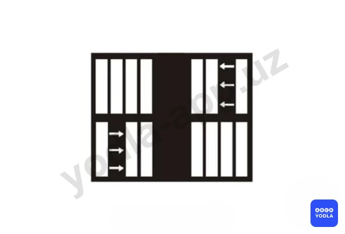

⬜ A. Обозначает специальную дорожку для пешеходов
⬜ B. Обозначает дорожку для велосипедистов, стрелки показывают направление движения
✅ C. Обозначает пешеходный переход, стрелки указыают направление движения пешеходов

> 💡 Согласно шестнадцатому и семнадцатому абзацу раздела 1 приложения 2 ПДД: Горизонтальная разметка 1.14.2 (зебра) обозначает нерегулируемый пешеходный переход. Стрелы разметки 1.14.2 указывают направление движения пешеходов.

---

## Вопрос 5

**По какому пути из числа обозначенных стрелками разрешено движение?**

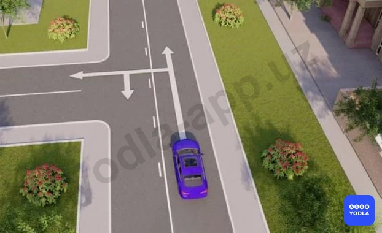

✅ A. Только прямо
⬜ B. Налево и в обратном направлении
⬜ C. Прямо, налево и в обратном направлении

> 💡 Согласно горизонтальной разметке 1.11 раздела 1 приложения № 2 к ПДД, данная разметка разделяет транспортные потоки противоположных или попутных направлений на участках дорог, где перестроение разрешено только из одной полосы; обозначает места, предназначенные для разворота, въезда и выезда со стояночных площадок и т. п., где движение разрешено только в одну сторону. Линию 1.11 разрешается пересекать со стороны прерывистой, а также и со стороны сплошной, но только при завершении обгона или объезда.

---

## Вопрос 6

**Что обозначают такие стрелы на проезжей части?**

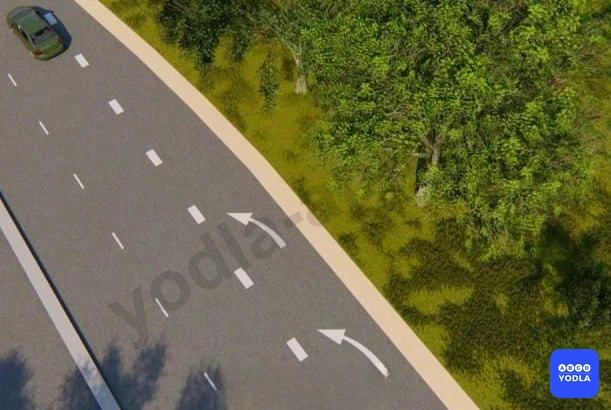

⬜ A. Предупреждают водителя о приближении к опасному участку дороги
✅ B. Предупреждают о приближении к сужению проезжей части
⬜ C. Указывают направление опасного поворота дороги

> 💡 Линия 1.19 раздела 1 приложения № 2 к ПДД, предупреждает о приближении к сужению проезжей части (участку, где уменьшается количество полос движения в данном направлении) или к линии разметки 1.1 или 1.11, разделяющей транспортные потоки противоположных направлений. В первом случае может применяться в сочетании со знаками 1.18.1 – 1.18.3.

---

## Вопрос 7

**Какая из этих линий обозначает остановку маршрутных транспортных средств?**

⬜ A. «А»
✅ B. «Б»
⬜ C. «В»
⬜ D. «А» и «Б»
⬜ E. «А» и «В»

> 💡 Линия 1.17 раздела 1 приложения № 2 к ПДД, обозначает остановки маршрутных транспортных средств и стоянки такси.

---

## Вопрос 8

**Какая из этих линий разметки используется для обозначения границ полос движения; на которых осуществляется реверсивное движение?**

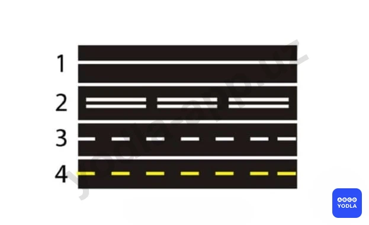

⬜ A. Линия 1
✅ B. Линия 2
⬜ C. Линия 3
⬜ D. Линия 2 и 3
⬜ E. Линия 3 и 4

> 💡 Разметка 1.9 раздела 1 приложения № 2 к ПДД, обозначает границы полос движения, на которых осуществляется реверсивное движение; разделяет транспортные потоки противоположных направлений (при выключенных реверсивных светофорах) на дорогах, где осуществляется реверсивное движение.

---

## Вопрос 9

**С каким дорожным знаком применяется «стоп - линия»?**

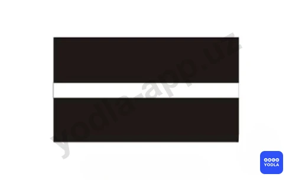

⬜ A. Со знаком «Уступите дорогу»
✅ B. Со знаком «Движение без остановки запрещено»
⬜ C. Со знаком «Уступите дорогу» и со знаком «Движение без остановки запрещено»

> 💡 Линия 1.12 раздела 1 приложения № 2 к ПДД (стоп-линия) – указывает на место, где водитель должен остановиться при наличии знака 2.5 «Движение без остановки запрещено»  или при запрещающем сигнале светофора (регулировщика).

---

## Вопрос 10

**С каким дорожным знаком применяется эта разметка?**

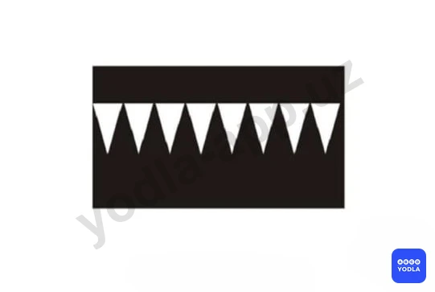

✅ A. Со знаком «Уступите дорогу»
⬜ B. Со знаком «Движение без остановки запрещено»
⬜ C. С предупреждающим знаком «Пересечение равнозначных дорог»
⬜ D. Со всеми перечисленными знаками

> 💡 Линия 1.13 раздела 1 приложения № 2 к ПДД, указывает место, где водитель должен при необходимости остановиться, уступая дорогу транспортным средствам, движущимся по пересекаемой дороге. При знаке 2.4. «Уступите дорогу» водитель должен уступить дорогу транспортным средствам, движущимся по пересекаемой дороге.

---

## Вопрос 11

**Где наносится сплошная желтая линия; запрещающая остановку?**

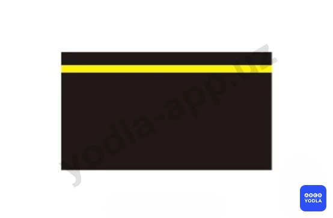

⬜ A. На проезжей части
⬜ B. У края проезжей части
✅ C. У края проезжей части или по верху бордюров
⬜ D. Только по верху бордюра

> 💡 Горизонтальная разметка 1.4 (сплошная желтая линия) - обозначает места, где запрещена остановка. Применяется самостоятельно или в сочетании со знаком 3.27 и наносится у края проезжей части или по верху бордюра.

---

## Вопрос 12

**Эта дорожная разметка обозначает?**

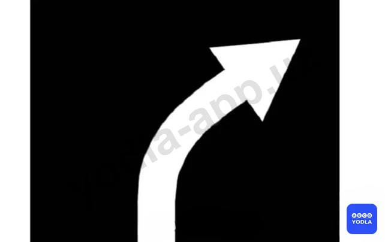

⬜ A. Зону, в которой запрещается обгонять все транспортные средства, кроме одиночных, движущихся со скоростью менее 30 км/ч двухколесных мотоциклов, велосипедистов
✅ B. . Приближение к сужению проезжей части или к линии разметки; разделяющей транспортные потоки противоположных направлений
⬜ C. Приближение к полосе проезжей части; предназначенной для движения только маршрутных транспортных средств

> 💡 Линия 1.19 раздела 1 приложения № 2 к ПДД, предупреждает о приближении к сужению проезжей части (участку, где уменьшается количество полос движения в данном направлении) или к линии разметки 1.1 или 1.11, разделяющей транспортные потоки противоположных направлений. В первом случае может применяться в сочетании со знаками 1.18.1 – 1.18.3.

---

## Вопрос 13

**Что обозначает прерывистая широкая линия?**

⬜ A. Границу между проезжей частью дороги и обочиной
✅ B. Границу между основной проезжей частью и полосой разгона или торможения
⬜ C. Площадки для остановки и стоянки транспортных средств

> 💡 1.8 широкая прерывистая линия раздела 1 приложения № 2 к ПДД, – обозначает границу между полосой разгона или торможения и основной полосой проезжей части (на перекрестках, пересечениях дорог на разных уровнях, в зоне автобусных остановок и т. п.). Линию 1.8 пересекать разрешается с любой стороны.

---

## Вопрос 14

**Что означает эта разметка?**

✅ A. Направляющий островок в местах слияния транспортных потоков
⬜ B. Островок для пешеходов на опасных участках движения
⬜ C. Границу места стоянки транспортных средств
⬜ D. Островок; обозначающий в местах разделения транспортных потоков

> 💡 Линия 16.3 раздела 1 приложения № 2 к ПДД, обозначает направляющие островки в местах разделения или слияния транспортных потоков.

---

## Вопрос 15

**Прерывистая линия; у которой длина штрихов в три раза превышает промежутки между ними, обозначает:**

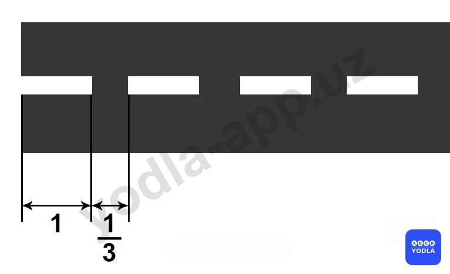

⬜ A. Границы между полосой разгона или торможения и основной полосой проезжей части
⬜ B. Края проезжей части на автомагистралях
✅ C. Приближение к сплошной линии разметки; которая разделяет транспортные потоки противоположных или попутных направлений

> 💡 Согласно горизонтальной разметке 1.6, раздела 1 приложения № 2 к ПДД, линия 1.6 (линия приближения – прерывистая линия, у которой длина штрихов в три раза превышает промежутки между ними) – предупреждает о приближении к разметке 1.1 или 1.11, которая разделяет транспортные потоки противоположных или попутных направлений. Линию 1.6 пересекать разрешается с любой стороны.

---

## Вопрос 16

**Эта дорожная разметка:**

⬜ A. Обозначает стояночные места; где указаны способы постановки механических транспортных средств на около тротуарной стоянке
⬜ B. Обозначает места; где запрещена остановка механических транспортных средств
✅ C. Обозначает остановку маршрутных транспортных средств и стоянки такси

> 💡 Линия 1.17 (зигзагообразная желтая) раздела 1 приложения № 2 к ПДД, обозначает остановку маршрутных транспортных средств и стоянки такси.

---

## Вопрос 17

**Эта горизонтальная дорожная разметка обозначает:**

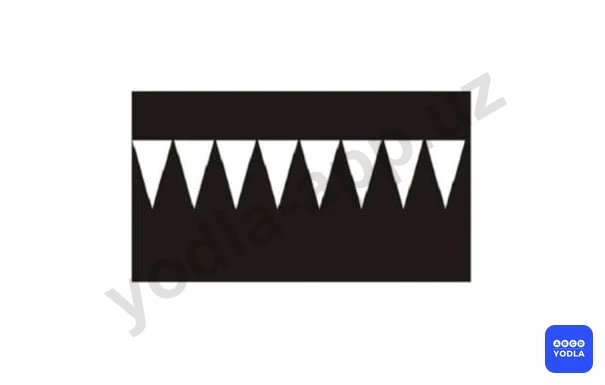

⬜ A. Сужение проезжей части, где уменьшается количество полос движения в данном направлении
✅ B. Место, где водитель должен при необходимости остановиться, уступая дорогу транспортным средствам движущимся по пересекаемой дороге
⬜ C. Приближение к месту где запрещена остановка

> 💡 Данная дорожная разметка применяется совместно со знаком «Уступите дорогу». Она указывает водителю на необходимость уступить дорогу транспортным средствам, движущимся по пересекаемой дороге.

Кроме того, эта разметка показывает место, где водитель должен остановиться при необходимости. Следовательно, она обозначает границу, перед которой следует уступить дорогу и при необходимости остановиться.

---

## Вопрос 18

**Разрешается ли стоянка транспортных средств на правой полосе дороги отделенной сплошной белой линией разметки и обозначенной дорожным знаком «Полоса для маршрутных транспортных средств»?**

⬜ A. Разрешается если нет знака запрещающего стоянку
✅ B. Запрещается
⬜ C. Разрешается только автомобилям которые обслуживают предприятия находящиеся в этой зоне или принадлежат гражданам проживающим в ближайших дома

> 💡 Вопрос заключается в том, разрешена ли стоянка на правой полосе дороги, выделенной для маршрутных транспортных средств и отделённой сплошной белой линией.

В данной ситуации полоса А предназначена для маршрутных транспортных средств и отделена сплошной линией разметки. Обычным транспортным средствам движение и стоянка на этой полосе не разрешаются.

Следовательно, стоянка в данном месте запрещена.

Правильный ответ — стоянка не разрешается.

---

## Вопрос 19

**Эта горизонтальная дорожная разметка обозначает:**

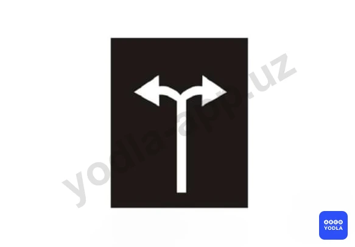

⬜ A. Запрещается движение в указанных направлениях
✅ B. Указывает разрешенные на перекрестке направления движения по полосам
⬜ C. Приближение к пересечению дорог на котором движение разрешается во всех направлениях

> 💡 Данная дорожная разметка обычно наносится на дорогах, чаще всего перед перекрёстками. Она показывает водителям, в каких направлениях разрешено движение с каждой полосы.

То есть эта разметка указывает разрешённые направления движения по полосам на перекрёстке.

Следовательно, правильный ответ — обозначает разрешённые направления движения по полосам на перекрёстке.

---

## Вопрос 20

**Разрешается ли пересекать прерывистую двойную линию разметки при отсутствии реверсивных светофоров или когда они отключены?**

⬜ A. Разрешается если она расположена слева от водителя
✅ B. Разрешается если она расположена справа от водителя
⬜ C. Разрешается с любой стороны
⬜ D. Запрещается

> 💡 Вопрос заключается в том, разрешается ли пересекать двойную прерывистую линию при отсутствии или отключении реверсивных светофоров.

Такая разметка применяется на дорогах с реверсивным движением. Направление движения по реверсивной полосе регулируется специальными светофорами, и в определ��нные моменты эта полоса может использоваться встречным потоком.

Если реверсивные светофоры не работают или отключены, водитель не должен выезжать на реверсивную полосу. Пересечение двойной прерывистой линии допускается только для возвращения в свою полосу движения, если водитель находится справа от этой разметки.

Следовательно, правильный ответ — пересечение разрешается только водителю, находящемуся справа от линии разметки.

---

