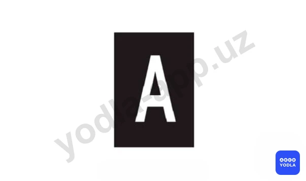
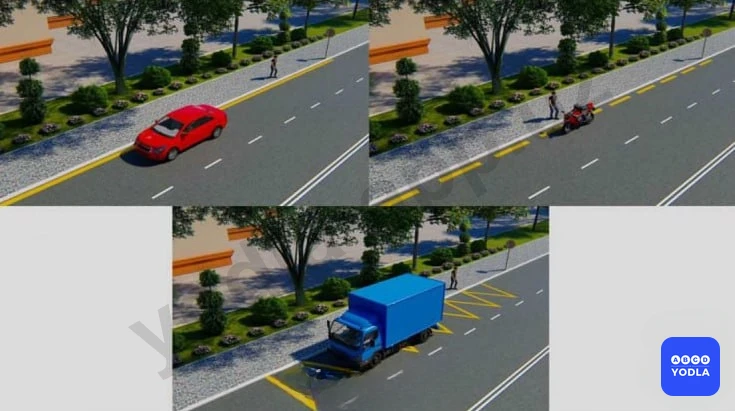
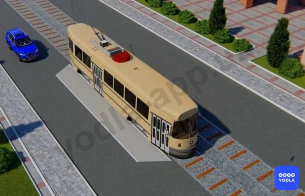
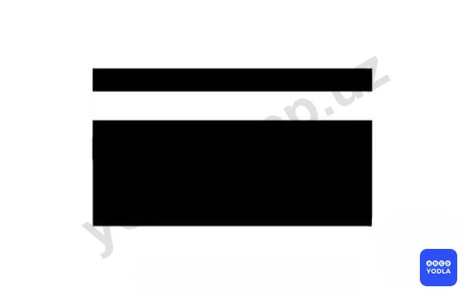
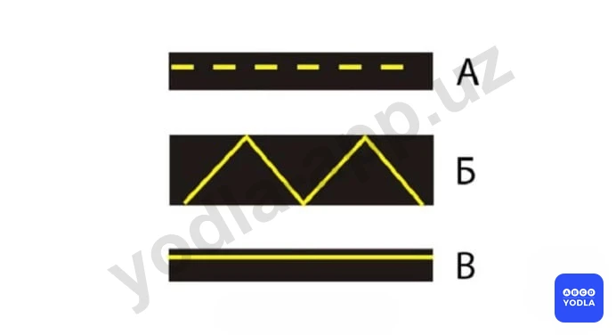
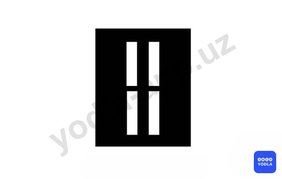

# Bilet 19

Всего вопросов: 20

## Вопрос 1

**Разрешается ли пересекать сплошную линию горизонтальной разметки?**

⬜ A. Разрешается если она расположена справа от водителя
✅ B. Разрешается только в случае, если линия обозначает край проезжей части дороги
⬜ C. Разрешается только при маневрировании; когда линия обозначает границы полос движения одного направления

> 💡 Вопрос заключается в том, разрешается ли наезжать на сплошную линию дорожной разметки.

В большинстве случаев пересекать или наезжать на сплошную линию запрещается. Однако существуют исключения.

Если сплошная линия обозначает край проезжей части, например в местах въезда во двор, жилую зону, на территорию предприятия или другую прилегающую территорию, её пересечение допускается.

Следовательно, правильный ответ — разрешается пересекать сплошную линию, обозначающую край проезжей части.

---

## Вопрос 2

**Разрешается ли заезжать на островок размеченный белыми линиями?**

⬜ A. Разрешается только для остановки
⬜ B. Разрешается при движении задним ходом
✅ C. Запрещается

> 💡 Вопрос заключается в том, разрешается ли пересекать или наезжать на сплошную линию горизонтальной дорожной разметки.

В большинстве случаев пересечение сплошной линии запрещено. Однако существуют исключения.

Если сплошная линия обозначает край проезжей части, например в местах въезда во двор, жилую зону, на прилегающую территорию или выезда из неё, пересекать такую линию разрешается.

Следовательно, правильный ответ — разрешается пересекать сплошную линию, обозначающую край проезжей части.

---

## Вопрос 3

**Что обязан выполнить водитель транспортного средства приблизившись к перекрестку перед которым нанесена «cтоп-линия» и включен зеленый сигнал светофора?**

⬜ A. Остановиться у «cтоп-линий», а затем возобновить движение
✅ B. Продолжить движение через перекресток без остановки

> 💡 Ситуация следующая: водитель приближается к светофору, перед которым нанесена стоп-линия. При этом на светофоре горит зелёный сигнал.

В варианте А указано, что водитель должен остановиться перед стоп-линией, а затем продолжить движение.

В варианте Б указано, что водитель должен продолжить движение без остановки.

Правильный ответ — вариант Б. Несмотря на наличие стоп-линии, если светофор разрешает движение зелёным сигналом, водитель может продолжать движение без остановки.

Останавливаться перед стоп-линией необходимо только при запрещающих сигналах светофора — красном или жёлтом. При зелёном сигнале остановка не требуется.

---

## Вопрос 4

**Что означает эта разметка?**

⬜ A. Пешеходный переход
✅ B. Место где велосипедная дорожка пересекает проезжую часть
⬜ C. Место перегона скота

> 💡 Данная квадратная горизонтальная дорожная разметка обозначает пешеходную дорожку. То есть она указывает место, где пешеходная дорожка пересекает проезжую часть, и предназначена для движения пешеходов.

---

## Вопрос 5

**Что означает эта разметка?**

⬜ A. Обозначает полосу предназначенную только для движения автобусов
✅ B. Обозначает полосу предназначенную только для движения маршрутных транспортных средств
⬜ C. Обозначает полосу предназначенную для движения автобусов и троллейбусов
⬜ D. Обозначает полосу предназначенную для движения автобусов и маршрутных такси (особо малых автобусов)

> 💡 Буква «А», нанесённая на проезжую часть, обозначает полосу, предназначенную для движения маршрутных транспортных средств.

Следует помнить, что к маршрутным транспортным средствам относятся автобусы, троллейбусы и маршрутные такси. Поэтому, даже если в вариантах ответа перечислены отдельные виды транспорта, наиболее правильным и полным ответом будет — маршрутные транспортные средства.

Следовательно, данная разметка обозначает полосу для движения маршрутных транспортных средств.

---

## Вопрос 6

**Водители каких транспортных средств неправильно произвели остановки для высадки пассажиров?**

✅ A. Водитель красного автомобиля
⬜ B. Синий автомобиль
⬜ C. Водитель мотоцикла
⬜ D. Водители обоих автомобилей
⬜ E. Все водители

> 💡 Обратим внимание на рисунок. Красный автомобиль остановился у сплошной жёлтой линии, синий автомобиль — у жёлтой зигзагообразной разметки, а мотоцикл находится возле прерывистой жёлтой линии.

Начнём анализ снизу. Жёлтая зигзагообразная разметка обозначает остановку автобусов и троллейбусов. В этом месте другие транспортные средства могут кратковременно останавливаться для посадки или высадки пассажиров, если они не создают помех маршрутному транспорту. Поэтому водитель синего автомобиля правила не нарушил.

Водитель мотоцикла также не нарушил правила. При необходимости он может кратковременно остановиться для высадки пассажира.

Красный автомобиль находится в зоне сплошной жёлтой линии. Такая разметка запрещает остановку транспортных средств. Следовательно, водитель красного автомобиля нарушил правила.

Таким образом, неправильно остановился только водитель красного автомобиля.

---

## Вопрос 7

**Разрешается ли использовать для движения посадочную площадку обозначенную разметкой?**

⬜ A. Разрешается
✅ B. Запрещается
⬜ C. Разрешается при отсутствии трамвая на остановке

> 💡 Вопрос заключается в том, разрешается ли использовать для движения площадку остановки, обозначенную разметкой 1.17.

Нет, не разрешается. Эта площадка предназначена для остановки автобусов и троллейбусов. Использование её для движения обычными транспортными средствами будет нарушением требований дорожной разметки.

Следовательно, использовать данную остановочную площадку для движения нельзя.

Правильный ответ — не разрешается.

---

## Вопрос 8

**Разрешено ли пересекать сплошную белую линию разметки; обозначающую край проезжей части на автомагистрали?**

✅ A. Разрешается
⬜ B. Запрещается
⬜ C. Запрещается, если на автомагистрали очень интенсивное движение

> 💡 Многие ошибаются именно в этом вопросе и выбирают ответ «запрещено». Однако правильный ответ — разрешается.

Данная линия разметки обозначает край проезжей части на автомагистрали. Если транспортное средство вынуждено остановиться или произошло техническое повреждение, водитель имеет право пересечь эту линию и выехать на обочину.

Следовательно, в данной ситуации пересекать линию разметки разрешается.

---

## Вопрос 9

**Разрешена ли остановка в этом месте?**

⬜ A. Разрешен
✅ B. Запрещена

> 💡 В данном месте остановка не разрешается, поскольку транспортное средство находится в зоне действия сплошной жёлтой линии. Такая разметка запрещает остановку транспортных средств.

Если автомобиль остановится после окончания жёлтой линии, остановка будет разрешена.

Следовательно, в данной ситуации остановка запрещена, а разрешается только после окончания жёлтой линии.

---

## Вопрос 10

**Какие из этих линий разрешают остановку маршрутным транспортным средствам?**

⬜ A. «А»
⬜ B. «Б»
⬜ C. «В»
✅ D. «А», «Б», «В»

> 💡 Вопрос заключается в том, на каких из указанных видов разметки маршрутным транспортным средствам разрешается остановка. Правильный ответ — А, Б и В, то есть все варианты.

В варианте А жёлтая прерывистая линия запрещает стоянку, но остановка разрешается.

Вариант Б обозначает остановочный пункт маршрутных транспортных средств, поэтому они имеют право останавливаться в этом месте.

В варианте В действует запрет остановки для обычных транспортных средств, однако для маршрутных транспортных средств предусмотрено исключение, и им остановка разрешена.

Поэтому многие ошибочно выбирают только вариант Б, однако правильный ответ — А, Б и В.

---

## Вопрос 11

**Сплошная желтая линия горизонтальной разметки в сочетании со знаком «Остановка запрещена» разрешает остановку:**

⬜ A. Всем транспортным средствам производящим высадку пассажиров
⬜ B. Автобусам и троллейбусам
✅ C. Только маршрутным транспортным средствам и немаршрутных легких такси

---

## Вопрос 12

**Что обозначает данная разметка?**

⬜ A. Полосу для движения маршрутных транспортных средств
⬜ B. Полосу движения специальных автомобилей
✅ C. Обозначает границу полосы реверсивного движения

---

## Вопрос 13

**С каким дорожным знаком может быть применена разметка в виде желтой прерывистой линии?**

⬜ A. «Остановка запрещена»
✅ B. «Стоянка запрещена»
⬜ C. «Стоянка по нечетным числам запрещена»

> 💡 Разметка 1.10 (желтая прерывистая) раздела 1 приложения № 2 к ПДД, обозначает места, где запрещена стоянка. Применяется самостоятельно или в сочетании со знаком 3.28 «Стоянка запрещена»  и наносится у края проезжей части или по верху бордюра.

---

## Вопрос 14

**Чем должен руководствоваться водитель; когда значение дорожных знаков и линий разметки противоречат друг другу?**

⬜ A. Линиями разметки
✅ B. Дорожными знаками

> 💡 Если значения дорожных знаков и дорожной разметки противоречат друг другу, водитель обязан руководствоваться требованиями дорожных знаков. Следовательно, в такой ситуации дорожный знак имеет преимущество перед дорожной разметкой.

---

## Вопрос 15

**Разрешается ли в этом месте произвести разворот?**

⬜ A. Разрешается
✅ B. Запрещается

> 💡 Согласно пункту 1.3 раздела 1 приложения № 2 к ПДД, линия 1.3 – разделяет транспортные потоки противоположных направлений на дорогах, имеющих четыре полосы движения и более; Линию 1.3 пересекать запрещается.

---

## Вопрос 16

**Что обозначает данная разметка?**

⬜ A. Место; где необходимо остановиться; чтобы пропустить пешеходов; переходящих проезжую часть
✅ B. Место; где велосипедная дорожка пересекает проезжую часть
⬜ C. Нерегулируемый пешеходный переход

> 💡 Линия 1.15 раздела 1 приложения №2 к ПДД, обозначает место, где велосипедная дорожка пересекает проезжую часть.

---

## Вопрос 17

**Что обозначает данная разметка?**

⬜ A. Пешеходный переход; где движение регулируется светофором
✅ B. Место; где велосипедная дорожка пересекает проезжую часть
⬜ C. Место; где пешеходная дорожка пересекает проезжую часть

> 💡 Горизонтальная разметка 1.15 обозначает место, где велосипедная дорожка пересекает проезжую часть.

---

## Вопрос 18

**Разрешается ли обгон на этом участке дороги?**

⬜ A. Разрешается
✅ B. Запрещается

> 💡 Линия 1.9 раздела 1 приложения № 2 к ПДД, обозначает границы полос движения, на которых осуществляется реверсивное движение; разделяет транспортные потоки противоположных направлений (при выключенных реверсивных светофорах) на дорогах, где осуществляется реверсивное движение. При отсутствии реверсивных светофоров или когда они отключены, линию 1.9 разрешается пересекать, если она расположена справа от водителя.

---

## Вопрос 19

**В каких случаях Вы можете наезжать на прерывистые линии разметки, разделяющие проезжую часть на полосы движения?**

✅ A. Только при перестроении
⬜ B. Только если на дороге нет других транспортных средств
⬜ C. Во всех перечисленных случаях

> 💡 ПДД Общие положения: Полоса движения любая из продольных полос проезжей части, обозначенная или необозначенная дорожной разметкой и имеющая ширину, достаточную для движения автомобилей в один ряд.

---

## Вопрос 20

**Что означает разметка в виде надписи «СТОП» на проезжей части?**

⬜ A. Предупреждает о приближении к стоп-линии перед регулируемым перекрестком
✅ B. Предупреждает о приближении к стоп-линии и знаку «Движение без остановки запрещено»
⬜ C. Предупреждает о приближении к знаку «Уступите дорогу»

> 💡 Bu "STOP" yozuvi ko‘rinishidagi yo‘l chizig‘i haydovchini to‘xtash chizig‘i hamda "To‘xtamasdan harakatlanish taqiqlanadi" yo‘l belgisi o‘rnatilgan joyga yaqinlashayotganligi haqida ogohlantiradi.

---

