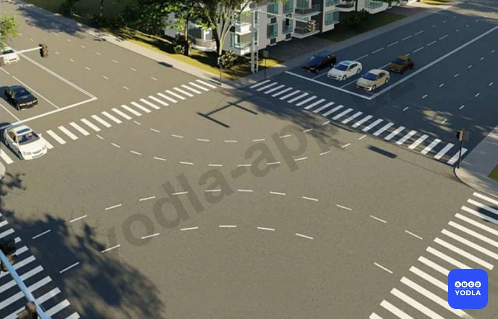
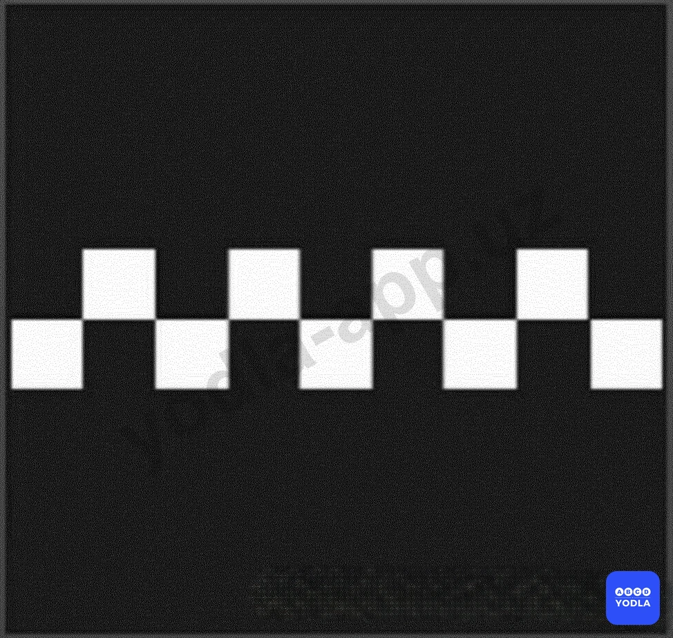
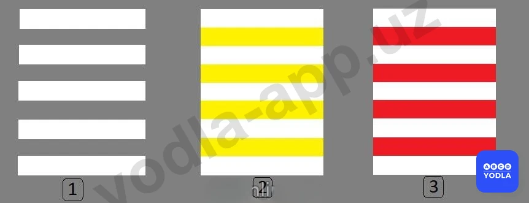
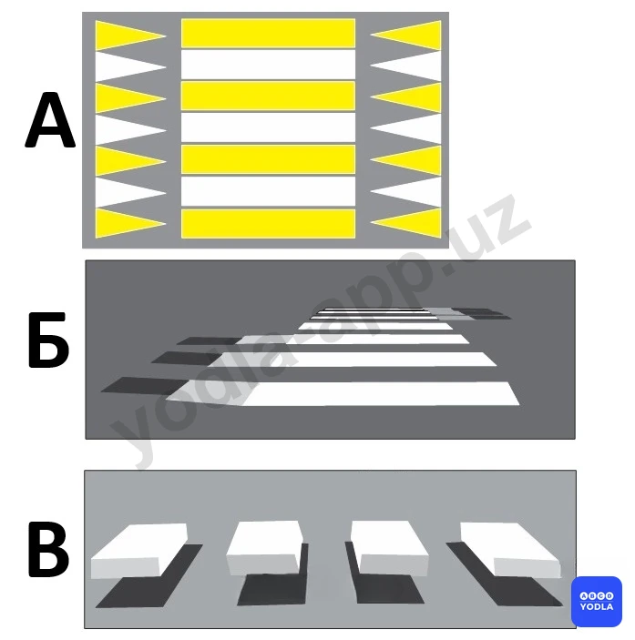
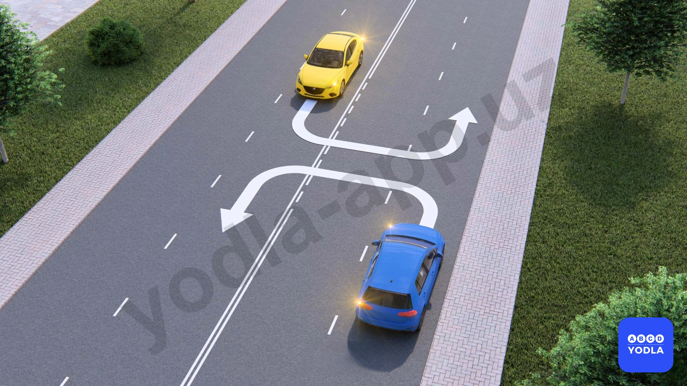

# Bilet 20

Всего вопросов: 20

## Вопрос 1

**По какой траектории водитель автомобиля нарушил правила при повороте налево?**

⬜ A. Только по траектории «А»
⬜ B. Только по траектории «Б»
✅ C. По любой траектории из указанных

> 💡 Вопрос заключается в том, по какому направлению водитель нарушает правила при повороте налево.

Поворот по направлению Б запрещён, поскольку для данной полосы установлен знак, разрешающий движение только прямо.

Поворот по направлению А также запрещён, так как водитель должен был заранее занять соответствующую полосу для поворота. Кроме того, он пересёк сплошную линию разметки.

Следовательно, водитель нарушает правила при движении по всем указанным направлениям.

Правильный ответ — нарушение допускается по всем указанным направлениям.

---

## Вопрос 2

**Какой маневр Вам запрещается выполнить при наличии данной линии разметки?**

⬜ A. Обгон
⬜ B. Объезд
⬜ C. Разворот
✅ D. Разрешает все перечисленные маневры

> 💡 Вопрос заключается в том, какие манёвры запрещает данная дорожная разметка.

Эта разметка не запрещает обгон, объезд, разворот или другие перечисленные манёвры. Она не устанавливает для водителя ограничений на выполнение данных действий.

Следовательно, выполнение всех перечисленных манёвров разрешается.

Правильный ответ — ни один из перечисленных манёвров не запрещён.

---

## Вопрос 3

**Что обозначают прерывистые линии разметки на перекрестке?**

⬜ A. Обязательное направлениедвижения на перекрестке
✅ B. Границы полос движения в пределах перекрестка

> 💡 Прерывистые линии разметки на перекрёстке обозначают границы полос движения. Они помогают водителям сохранять свою полосу при проезде перекрёстка.

Следовательно, правильный ответ — обозначают границы полос движения на перекрёстке.

---

## Вопрос 4

**В данной ситуации Вы должны:**

⬜ A. Остановиться у знака
✅ B. Остановиться у стоп-линии
⬜ C. При отсутствии других транспортных средств проехать перекресток без остановки

> 💡 В данной ситуации водитель должен остановиться перед стоп-линией. Как видно на рисунке, водитель остановился раньше, не доехав до стоп-линии.

Такая остановка считается неправильной. Если требуется остановка, транспортное средство должно остановиться непосредственно перед стоп-линией.

Следовательно, правильный ответ — необходимо остановиться перед стоп-линией.

---

## Вопрос 5

**Что означает эта горизонтальная линия?**

⬜ A. Велосипедная дорожка
✅ B. Искусственная неровность дороги
⬜ C. Место, где останавливаются такси

> 💡 Данная горизонтальная дорожная разметка обозначает искусственную неровность дороги. Она предупреждает водителя о наличии впереди искусственной неровности, предназначенной для снижения скорости движения.

---

## Вопрос 6

**Разметка в виде треугольника на полосе движения:
**

⬜ A. Обозначает опасный участок дороги
✅ B. Предупреждает Вас о приближении к месту, где нужно уступить дорогу
⬜ C. Указывает место, где Вам необходимо остановиться

> 💡 Данная дорожная разметка предупреждает водителя о приближении к месту, где необходимо уступить дорогу. Обычно она применяется вместе со знаком «Уступите дорогу» и соответствующей линией разметки.

Эта разметка информирует водителя о том, что впереди находится участок, где он обязан уступить дорогу другим транспортным средствам.

Следовательно, правильный ответ — Ф2.

---

## Вопрос 7

**Что обозначает эта разметка с надписью “50”?**

✅ A. Разрешенную максимальную скорость на данном участке дороги
⬜ B. Номер дороги или маршрута
⬜ C. Рекомендуемую скорость движения на данном участке дороги

> 💡 Данная дорожная разметка с числом «50» указывает, что максимально разрешённая скорость на данном участке дороги составляет 50 км/ч. Она дублирует значение запрещающего дорожного знака, ограничивающего скорость, и напоминает водителю о действующем ограничении.

Следовательно, эта разметка обозначает максимально разрешённую скорость и повторяет требования соответствующего дорожного знака.

---

## Вопрос 8

**В каких местах наносится дорожная разметкабело-красного цвета (зебра 1.14.4) для обозначения места пешеходного перехода?**

⬜ A. В местах скопления пешеходов
⬜ B. Перед зданиями коммерческого,культурного и бытового обслуживания
✅ C. Перед школами и дошкольнымиобразовательными
⬜ D. Все ответы верны

> 💡 Данная бело-красная разметка типа «зебра» предназначена для использования возле школ и дошкольных образовательных учреждений.

При внесении изменений в правила дорожного движения предполагалось применять такую разметку для более заметного обозначения пешеходных переходов рядом с детскими учреждениями. На практике сейчас чаще используются приподнятые пешеходные переходы.

Однако в экзаменационных вопросах правильным считается ответ, что данная разметка применяется возле школ и дошкольных образовательных учреждений.

Следовательно, правильный ответ — возле школ и дошкольных образовательных учреждений.

---

## Вопрос 9

**Эта дорожная разметка обозначает:**

⬜ A. Запрещается движение в указанных направлениях
✅ B. Указывает разрешение на перекрестке направления движения по полосам
⬜ C. Приближение к пересечению дорог на котором движение разрешается во всех направлениях

> 💡 Данная горизонтальная дорожная разметка обычно наносится перед перекрёстками и показывает водителям, в каких направлениях разрешено движение с каждой полосы.

Следовательно, эта разметка обозначает разрешённые направления движения по полосам на перекрёстке.

Правильный ответ — показывает разрешённые направления движения по полосам на перекрёстке.

---

## Вопрос 10

**В каком направлении вам разрешено проезжать перекресток?**

✅ A. Только прямо
⬜ B. Прямо и направо
⬜ C. Только направо

> 💡 Вопрос заключается в том, в каком направлении разрешено движение через перекрёсток.

В данной ситуации дорожная разметка и дорожный знак противоречат друг другу. В таких случаях водитель обязан руководствоваться требованиями дорожного знака.

Поскольку знак разрешает движение только прямо, движение в других направлениях не допускается.

Следовательно, правильный ответ — разрешено движение только прямо.

---

## Вопрос 11

**Какие из этих линий используются для пешеходных переходов перед школами?**

⬜ A. Линия 1
⬜ B. Линия 2
✅ C. Линия 3

> 💡 Пешеходный переход возле школ и дошкольных образовательных учреждений обозначается третьим видом разметки — бело-красной разметкой типа «зебра».

Следовательно, правильный ответ — третья разметка, бело-красный пешеходный переход.

---

## Вопрос 12

**На каком снимке водитель остановился без нарушения правил?**

⬜ A. На рисунке слева
⬜ B. На рисунке справа
✅ C. На обоих изображениях

> 💡 Вопрос заключается в том, на каком рисунке водитель остановился без нарушения правил.

На первом рисунке водитель остановился перед стоп-линией, что полностью соответствует требованиям правил.

На втором рисунке стоп-линия отсутствует. В такой ситуации водитель имеет право остановиться в месте, откуда обеспечивается видимость пересекаемой дороги и возможность уступить дорогу другим участникам движения.

Следовательно, в обоих случаях водитель действовал правильно и не нарушил правила.

Правильный ответ — на обоих рисунках нарушение отсутствует.

---

## Вопрос 13

**Какой водитель нарушил правило остановки?**

⬜ A. Легковой автомобиль
⬜ B. Грузовой автомобиль
⬜ C. Оба не сломались
✅ D. Оба сломались

> 💡 Вопрос заключается в том, на каком рисунке водитель нарушил правила.

На первом рисунке водитель остановился, не доехав до стоп-линии. В ситуации, когда требуется остановка, транспортное средство должно остановиться непосредственно перед стоп-линией. Поэтому это считается нарушением.

На втором рисунке водитель проехал стоп-линию и остановился за ней. Это также является нарушением правил.

Следовательно, на обоих рисунках водитель нарушил правила.

Правильный ответ — нарушение имеется на обоих рисунках.

---

## Вопрос 14

**Какая горизонтальная разметка обозначает пешеходный переход в «3D» виде?**

⬜ A. «А»
⬜ B. «Б»
✅ C. «В»

> 💡 Вопрос заключается в том, какая дорожная разметка обозначает пешеходный переход с 3D-эффектом.

Если в вопросе указано именно «3D-пешеходный переход», правильным ответом будет вариант В. Эта разметка выполнена таким образом, что создаёт визуальный объёмный эффект.

Если бы речь шла о приподнятом пешеходном переходе, правильным мог бы быть другой вариант. Однако здесь ключевым словом является «3D».

Следовательно, правильный ответ — вариант В.

---

## Вопрос 15

**Какая горизонтальная разметка обозначает «D»-приподнятый пешеходный переход?**

⬜ A. «А»
✅ B. «Б»
⬜ C. «В»

> 💡 В данном вопросе речь идёт о «3D-приподнятом пешеходном переходе».

Обратите внимание, что здесь присутствуют два ключевых слова: «3D» и «приподнятый». Если бы речь шла только о 3D-пешеходном переходе, правильным мог бы быть вариант В. Однако в вопросе также указано, что переход является приподнятым.

Поэтому правильный ответ — вариант Б.

---

## Вопрос 16

**Какая горизонтальная разметка обозначает приподнятый пешеходный переход?**

✅ A. «А»
⬜ B. «Б»
⬜ C. «В»

> 💡 Вопрос заключается в том, какая дорожная разметка обозначает приподнятый пешеходный переход.

Слово «3D» в вопросе отсутствует. Поскольку речь идёт только о приподнятом пешеходном переходе, правильным ответом является вариант А.

Следовательно, разметка А обозначает п��иподнятый пешеходный переход.

---

## Вопрос 17

**Какая группа дорожных знаков повторяется этой горизонтальной дорожной разметкой?**

⬜ A. Знаки приоритета
✅ B. Предупреждающие знаки
⬜ C. Запрещающие знаки
⬜ D. Информационно-указательные знаки

> 💡 Данная дорожная разметка дублирует значение предупреждающих дорожных знаков.

Для запоминания: предупреждающие дорожные знаки обычно имеют форму треугольника с красной каймой. Поэтому разметка в виде треугольника на проезжей части также повторяет информацию предупреждающих знаков.

Следовательно, правильный ответ — дублирует предупреждающие дорожные знаки.

---

## Вопрос 18

**в каких направлениях разрешено движение водителю красного автомобиля?**

⬜ A. Только налево
✅ B. Налево и в разворот
⬜ C. Прямо и налево

> 💡 Вопрос заключается в том, какой водитель правильно остановился при запрещающем сигнале светофора.

На первом рисунке водитель проехал стоп-линию. Обратите внимание, что здесь установлен знак «STOP», который указывает на наличие стоп-линии. Поскольку водитель остановился уже за стоп-линией, его действия являются неправильными.

На втором рисунке водитель остановился непосредственно перед стоп-линией, как того требуют правила.

Следовательно, правильный ответ — второй рисунок.

---

## Вопрос 19

**Какой водитель автомобиля правильно остановился на запрещающий сигнал светофора**

⬜ A. На 1-рисунке
✅ B. На 2-рисунке
⬜ C. На обоих рисунках

> 💡 "На основании пункта 4.1.4 Приложения 1 к ПДД и абзаца 1 пункта 56 главы 9 ПДД: 4.1.4. «Движение прямо или направо».
56. Перед поворотом направо, налево или разворотом водитель обязан заблаговременно занять соответствующее крайнее положение на проезжей части, предназначенной для движения в данном направлении, кроме случаев, когда совершается поворот при въезде на перекресток с круговым движением."

---

## Вопрос 20

**Какому автомобилю разрешено выполнить разворот?**

⬜ A. Обоим
⬜ B. Желтому автомобилю
⬜ C. Синему автомобилю
✅ D. Обоим автомобилям запрещено

> 💡 Вопрос заключается в том, какому автомобилю разрешён разворот.

В данной ситуации разворот не разрешён ни одному из автомобилей.

Жёлтый автомобиль движется со стороны сплошной линии разметки. Поскольку пересекать сплошную линию запрещено, выполнить разворот он не может.

Синий автомобиль находится в правой полосе движения. Разворот должен выполняться из крайней левой полосы, поэтому водитель синего автомобиля также не имеет права выполнять данный манёвр.

Следовательно, правильный ответ — разворот не разрешён ни одному из автомобилей.

---

