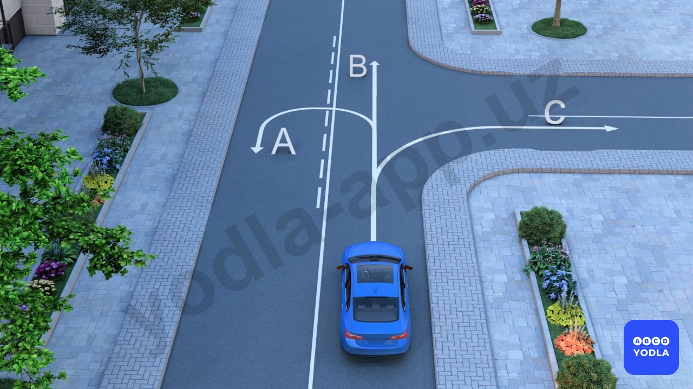
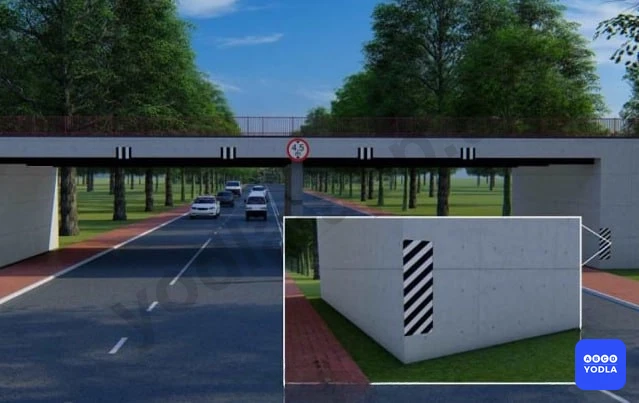
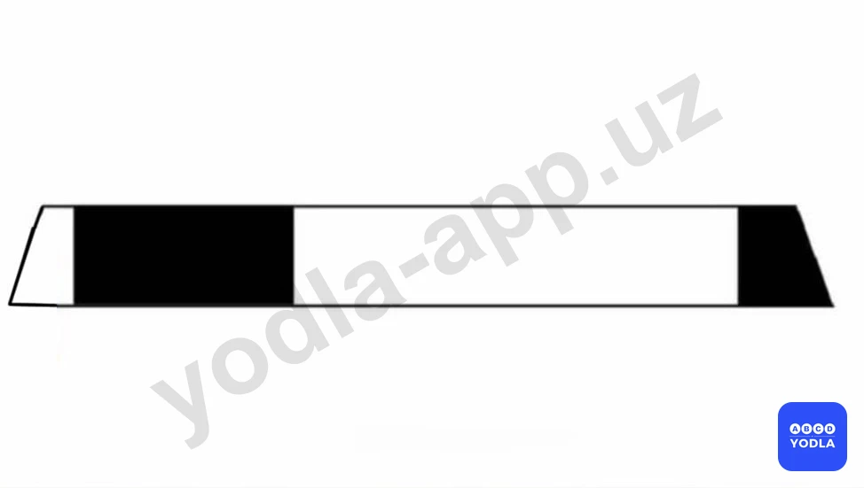
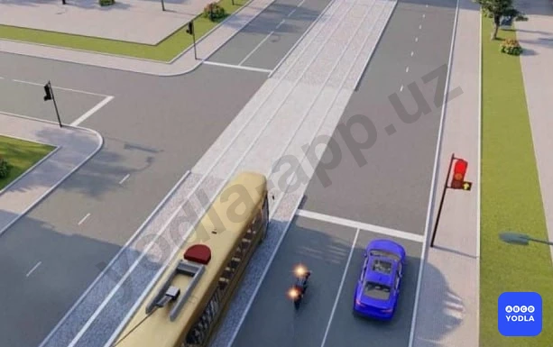
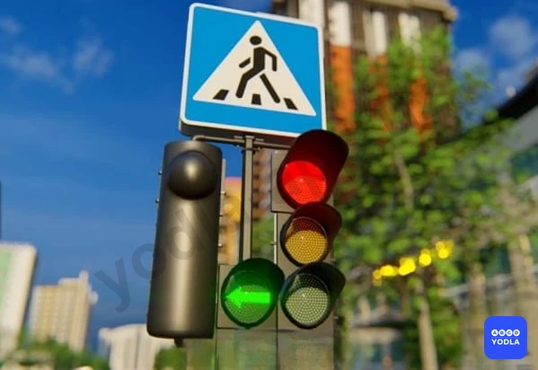
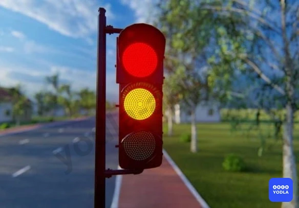
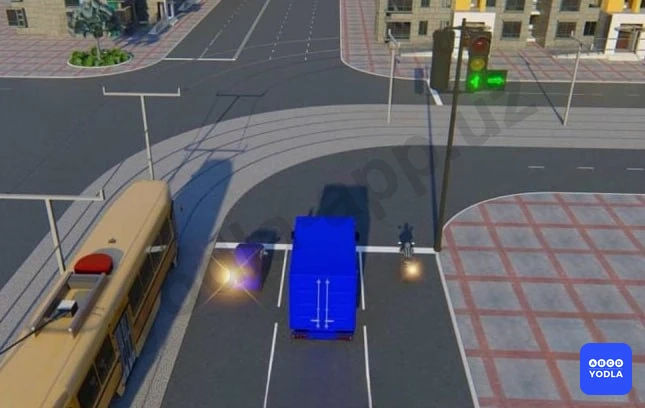

# Bilet 21

Всего вопросов: 20

## Вопрос 1

**Какое транспортное средство нарушает правила?**

⬜ A. Оба не нарушили
⬜ B. Нарушил зелёный
✅ C. Оба нарушили
⬜ D. Нарушил белый

> 💡 Вопрос заключается в том, какому автомобилю разрешён разворот.

В данной ситуации разворот не разрешён ни одному из автомобилей.

Жёлтый автомобиль движется со стороны сплошной линии разметки. Поскольку пересечение сплошной линии запрещено, выполнить разворот он не может.

Синий автомобиль находится в правой полосе движения. Разворот должен выполняться из крайней левой полосы, поэтому водитель синего автомобиля также не имеет права выполнять этот манёвр.

Следовательно, правильный ответ — разворот не разрешён ни одному из автомобилей.

---

## Вопрос 2

**По какому направлению разрешено движение?**

⬜ A. A и B
✅ B. B и C
⬜ C. По всем направлениям

> 💡 Как видно на рисунке, здесь нанесена сплошная линия разметки. Поэтому выполнить разворот водитель не может, так как пересечение сплошной линии запрещено.

Однако движение прямо и поворот направо разрешены.

Следовательно, правильный ответ — разрешено движение по направлениям Б и С.

---

## Вопрос 3

**Водитель жёлтого автомобиля, если он остановился позади проезжающей машины, должен ли он также остановиться у знака «STOP»?**

✅ A. Да
⬜ B. Нет

> 💡 Знак «Движение без остановки запрещено» распространяется на все транспортные средства.

Поэтому, если белый автомобиль остановился в соответствии с требованиями этого знака, то следующий за ним жёлтый автомобиль также обязан остановиться. Остановка одного транспортного средства не освобождает другие транспортные средства от выполнения требований знака.

Следовательно, каждое транспортное средство должно самостоятельно остановиться и только после этого продолжить движение.

---

## Вопрос 4

**Из скольких групп состоят дорожные разметки?**

✅ A. Из 2
⬜ B. Из 3
⬜ C. Из 4

> 💡 Дорожная разметка делится на две группы: горизонтальная и вертикальная.

Горизонтальная разметка наносится на проезжую часть и служит для организации дорожного движения. Вертикальная разметка наносится на дорожные сооружения, ограждения и другие объекты для предупреждения водителей и повышения безопасности движения.

Следовательно, дорожная разметка состоит из двух групп: горизонтальной и вертикальной.

---

## Вопрос 5

**Какая дорожная разметка повышает бдительность водителя?**

✅ A. A
⬜ B. B
⬜ C. C
⬜ D. D

> 💡 Разметка А относится к горизонтальной дорожной разметке и имеет небольшое возвышение над поверхностью дороги. Такая разметка называется «шумовой полосой».

При проезде по ней колёса автомобиля создают вибрацию и шум, которые привлекают внимание водителя. Это помогает повысить его бдительность и способствует снижению скорости на опасных участках дороги.

Следовательно, данная разметка является шумовой разметкой, предназначенной для предупреждения водителя и повышения его внимательности.

---

## Вопрос 6

**Эта дорожная разметка применяется для обозначения:**

⬜ A. Дорожной развязки на разных уровнях
⬜ B. Участка дороги, на котором скорость движения ограничена до 40 км/ч
✅ C. Вертикальных элементов дорожных сооружений, когда они представляют опасность для движущихся транспортных средств

> 💡 Правильный ответ заключается в том, что данная вертикальная разметка обозначает элементы дорожных сооружений, которые могут представлять опасность для движущихся транспортных средств.

Если объяснить проще, такая разметка показывает границы мостов, путепроводов, опор и других дорожных сооружений. Она помогает водителям заранее заметить опасные элементы и избежать столкновения с ними.

Следовательно, на практике эта разметка обозначает границы мостов и других дорожных сооружений.

---

## Вопрос 7

**Что обозначает эта вертикальная дорожная разметка?**

⬜ A. Обозначает границы полос движения в опасных местах на дорогах
✅ B. Обозначает боковые поверхности ограждений дорог на других участках
⬜ C. Обозначает бордюры на опасных участках
⬜ D. Обозначает направляющие столбики, надолбы, опоры ограждений и т.п

> 💡 В вопросах по вертикальной разметке данная разметка обозначает боковую границу дорожных ограждений, расположенных у края дороги.

Проще говоря, она показывает водителю границу защитного ограждения или другого препятствия, находящегося возле проезжей части.

Следует помнить, что если разметка выполнена в виде чередующихся чёрно-белых полос, она может использоваться для обозначения опасных поворотов или участков с малым радиусом кривой. Однако в данном случае речь идёт не о малом радиусе.

Следовательно, правильный ответ — обозначает боковую границу дорожных ограждений на других участках дороги.

---

## Вопрос 8

**Что обозначает данная вертикальная разметка?**

⬜ A. Боковые поверхности ограждения дорог на закруглениях малого радиуса
✅ B. Обозначает боковые поверхности ограждений дорог на других участках

> 💡 Как видно на рисунке, эта разметка может напоминать обозначение поворота малого радиуса. Однако в данном случае она не относится к таким участкам.

Причина в том, что здесь используется трёхцветная окраска, характерная для вертикальной разметки, обозначающей боковые поверхности препятствий на других участках дороги.

Такая разметка помогает водителям видеть границы препятствий, деревьев, сооружений и других объектов возле дороги. Её назначение — предотвратить съезд автомобиля с дороги и столкновение с препятствием.

Следовательно, правильный ответ — обозначает боковые поверхности препятствий на других участках дороги.

---

## Вопрос 9

**Что означает эта вертикальная разметка?**

⬜ A. О приближении к железнодорожному переезду
⬜ B. О приближении к опасному перекрестку
✅ C. Обозначает боковые поверхности ограждения дорог на закруглениях малого радиуса крутых спусках и на других опасных участках

> 💡 Если вертикальная разметка выполнена в виде «зебры», то есть в виде чередующихся чёрно-белых полос, она обычно обозначает боковые поверхности дорожных ограждений на участках с малыми радиусами поворота, крутыми изгибами дороги и в других опасных местах.

Такая разметка привлекает внимание водителей и помогает лучше ориентироваться на опасных участках дороги.

Следовательно, правильный ответ — обозначает боковые поверхности дорожных ограждений на участках с малыми радиусами поворота и в других опасных местах.

---

## Вопрос 10

**О чем обозначает Вас вертикальная разметка, нанесенная на ограждение дороги?**

⬜ A. Обозначает приближении к железнодорожному переезду
⬜ B. Обозначает приближении к опасному перекрестку
✅ C. Обозначает боковые поверхности ограждений дорог на закруглениях малого радиуса, крутых спусках, других опасных участках

> 💡 Здесь речь идёт об участке с малым радиусом поворота. Это можно определить по разметке в виде «зебры», то есть по чередующимся чёрно-белым полосам.

Такая вертикальная разметка обозначает боковые поверхности дорожных ограждений на участках с малыми радиусами поворота, крутыми изгибами дороги и в других опасных местах.

Следовательно, правильный ответ — обозначает боковые поверхности дорожных ограждений на участках с малыми радиусами поворота, крутыми поворотами и в других опасных местах.

---

## Вопрос 11

**Каким транспортным средствам разрешается движение в указанных направлениях?**

⬜ A. Водителю автомобиля
⬜ B. Водителям автомобиля и мотоцикла
✅ C. Водителям трамвая и автомобиля

> 💡 Горит красный, то есть запрещающий сигнал светофора. Однако дополнительная зелёная секция разрешает движение прямо.

Дополнительная секция действует только в направлении, указанном стрелкой. Поэтому в данной ситуации разрешено движение только прямо.

Синий автомобиль и трамвай намерены двигаться прямо, поэтому после уступки дороги транспортным средствам с других направлений они имеют право продолжить движение. В данной ситуации помех для них нет.

Мотоциклист собирается повернуть налево. Поскольку дополнительная секция не разрешает движение налево, он не может продолжать движение и должен дождаться разрешающего сигнала основного светофора.

Следовательно, правильный ответ — движение разрешено синему автомобилю и трамваю.

---

## Вопрос 12

**Данный светофор используется для регулирования движения:**

⬜ A. По всей ширине проезжей части дороги
✅ B. По полосам проезжей части; где движение меняется в противоположную сторону
⬜ C. Только на тех участках дороги; которые предназначены для маршрутных транспортных средств

> 💡 Данный светофор называется реверсивным светофором.

Реверсивные светофоры используются на полосах движения, направление движения по которым может изменяться на противоположное в зависимости от времени суток или дорожной ситуации. Они показывают водителям, какими полосами можно пользоваться, а на какие выезд запрещён.

Следовательно, это реверсивный светофор, применяемый на полосах с изменяемым направлением движения.

---

## Вопрос 13

**Данный светофор запрещает движение:**

✅ A. Только налево
⬜ B. Прямо и налево
⬜ C. Прямо и направо
⬜ D. Только направо

> 💡 Данный светофор применяется для трамваев и других маршрутных транспортных средств.

Погашенный сигнал означает, что движение в соответствующем направлении запрещено. Как видно на рисунке, не горит сигнал, разрешающий движение налево.

Следовательно, поворот налево запрещён. Если сигналы для движения прямо и направо включены, движение в этих направлениях разрешается.

Если в вопросе спрашивается, какое направление запрещено, правильный ответ — движение налево запрещено.

---

## Вопрос 14

**Два попеременно мигающих красных сигнала имеют следующее значение:**

✅ A. Запрещают движение
⬜ B. Информируют других водителей о выезде на проезжую часть специальных транспортных средств
⬜ C. Разрешают движение с особой осторожностью

> 💡 Два попеременно мигающих красных сигнала устанавливаются перед железнодорожными переездами.

Они предупреждают о приближении поезда или об опасности проезда через железнодорожный переезд и запрещают дальнейшее движение транспортных средств.

Следовательно, два попеременно мигающих красных сигнала устанавливаются перед железнодорожным переездом и означают запрет движения.

---

## Вопрос 15

**Должен ли водитель трамвая при движении на данный сигнал светофора уступить дорогу транспортным средствам движущимся с других направлений?**

✅ A. Должен
⬜ B. Не должен

> 💡 Если для трамвая горит данный сигнал светофора, трамвай может продолжить движение. Однако перед началом движения он обязан уступить дорогу транспортным средствам, движущимся с других направлений.

Следовательно, в данной ситуации трамвай может двигаться только после того, как уступит дорогу транспортным средствам с других направлений.

---

## Вопрос 16

**Каким транспортным средствам разрешено движение при этом сигнале светофора?**

⬜ A. Трамваю, желтому и красному автомобилям
✅ B. Желтому и красному автомобилям
⬜ C. Всем транспортным средствам

> 💡 Как видно на рисунке, дополнительная секция, разрешающая движение налево, выключена. При этом секции для движения прямо и направо включены.

Это означает, что движение прямо и направо разрешено, а поворот налево запрещён.

В данной ситуации трамвай и синий автомобиль собираются повернуть налево, поэтому им движение не разрешается.

Жёлтый и красный автомобили движутся в разрешённых направлениях, поэтому они могут продолжить движение.

Следовательно, правильный ответ — движение разрешено только жёлтому и красному автомобилям.

---

## Вопрос 17

**Что обозначают одновременно включенные красный и желтый сигналы светофора?**

⬜ A. Можно начинать движение
✅ B. Запрещает движение и информирует о скором включении зеленого света
⬜ C. Приближение к перекрестку транспортного средства подающего звуковой или световой сигнал

> 💡 Одновременное включение красного и жёлтого сигналов светофора означает, что движение по-прежнему запрещено.

Этот сигнал предупреждает водителя о том, что вскоре включится зелёный сигнал и движение будет разрешено. Однако начинать движение при красном и жёлтом сигналах нельзя.

Следовательно, одновременное включение красного и жёлтого сигналов запрещает движение и предупреждает о скором включении зелёного сигнала.

---

## Вопрос 18

**В каком ответе названы все транспортные средства которым разрешено движение?**

⬜ A. Трамвай и мотоцикл
⬜ B. Автомобили и мотоцикл
✅ C. Все транспортные средства
⬜ D. Трамвай, грузовой автомобиль и мотоцикл

> 💡 Основные сигналы светофора и дополнительные секции включены и разрешают движение во всех направлениях.

Обратите внимание на формулировку вопроса: здесь не спрашивается «кто проедет первым?». Вопрос заключается в том, кому разрешено движение.

Поэтому определять очерёдность проезда не требуется. В данной ситуации движение разрешено всем транспортным средствам. Далее они будут двигаться в соответствии с правилами дорожного движения, уступая друг другу при необходимости.

Следовательно, правильный ответ — движение разрешено всем транспортным средствам.

---

## Вопрос 19

**На каком рисунке водитель правильно поворачивает направо?**

✅ A. 1
⬜ B. 2

> 💡 Внимательно рассмотрим оба рисунка. На первом изображён обычный светофор, а на втором — светофор с дополнительной секцией.

На втором рисунке дополнительная секция, разрешающая поворот направо, выключена. Это означает, что поворот направо запрещён.

Если в вопросе спрашивается, на каком рисунке водитель правильно выполняет поворот направо, то правильным является первый рисунок.

Следовательно, правильный ответ — первый рисунок.

---

## Вопрос 20

**В каком направлении разрешено движение?**

⬜ A. Прямо и направо в первый проезд
✅ B. Направо в первый проезд
⬜ C. Направо во второй проезд
⬜ D. Направо в первый и второй проезды

> 💡 Горит красный сигнал светофора. Одновременно дополнительная секция разрешает движение направо.

В такой ситуации транспортному средству разрешается двигаться только в направлении, указанном дополнительной секцией. Из-за красного сигнала движение в других направлениях запрещено.

Следовательно, правильный ответ — разрешено движение только направо, то есть по первому направлению.

---

