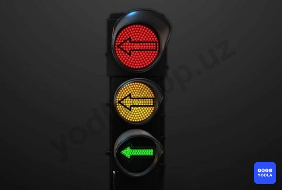
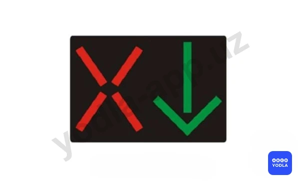
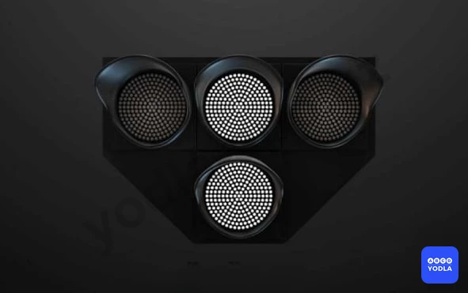
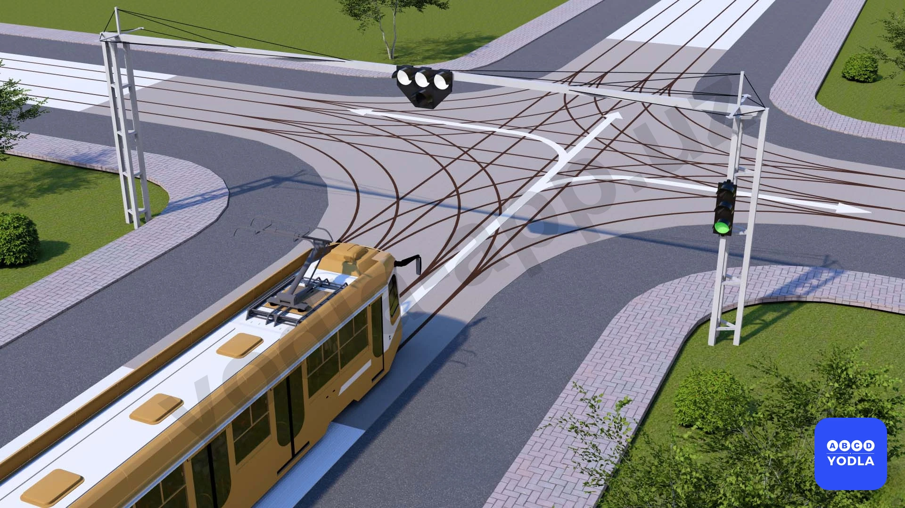
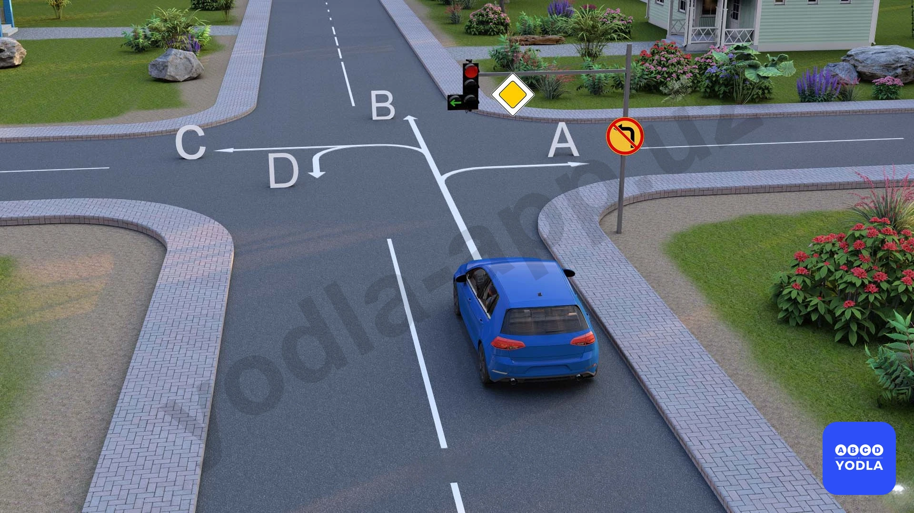
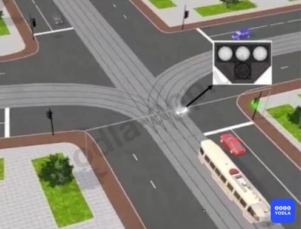
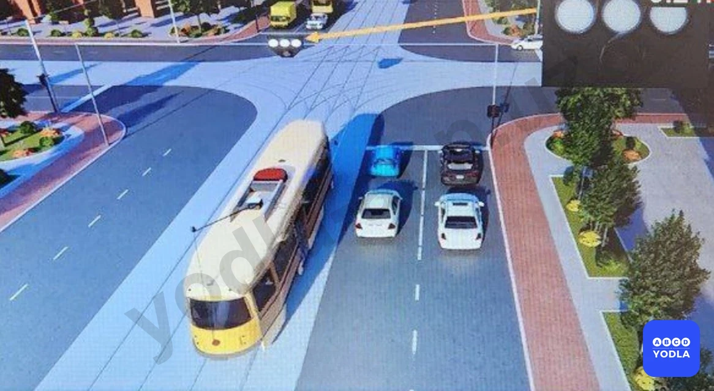

# Bilet 22

Всего вопросов: 20

## Вопрос 1

**Каким транспортным средствам разрешено движение при этом сигнале светофора?**

⬜ A. Трамваю и мотоциклу
⬜ B. Мотоциклу, легковому и грузовому автомобилям
✅ C. Легковому и грузовому автомобилям
⬜ D. Всем транспортным средствам

> 💡 На рисунке изображён светофор с дополнительной секцией. Дополнительная секция предназначена для движения направо, но в данный момент она выключена.

Это означает, что поворот направо запрещён.

Трамвай и мотоцикл собираются повернуть направо, поэтому движение для них запрещено.

Синий легковой автомобиль и зелёный грузовой автомобиль движутся в разрешённых направлениях, поэтому им движение разрешается.

Следовательно, правильный ответ — движение разрешено грузовому и легковому автомобилям.

---

## Вопрос 2

**О чем информируют черные стрелки на красном и желтом сигналах светофора?**

✅ A. О разрешенных направлениях движения при включении зеленого сигнала светофора
⬜ B. О разрешенных направлениях движения при красном и желтом сигналах светофора

> 💡 Красный и жёлтый сигналы, включённые одновременно, запрещают движение и предупреждают о скором включении зелёного сигнала.

Однако в данном вопросе внутри секции горит зелёный указатель направления. Он информирует водителя о том, в каком направлении будет разрешено движение при включении зелёного сигнала светофора.

Следовательно, правильный ответ — этот сигнал показывает направления, в которых будет разрешено движение при включении зелёного сигнала светофора.

---

## Вопрос 3

**При красном сигнале данного светофора движение запрещается:**

⬜ A. Только в один ряд
⬜ B. По всей ширине проезжей части
⬜ C. С обгоном
✅ D. По полосе, над которой он расположен

> 💡 Это реверсивный светофор.

Реверсивные светофоры устанавливаются над полосами движения, направление которых может изменяться на противоположное. Каждый такой светофор относится только к той полосе, над которой он расположен.

Если на реверсивном светофоре горит запрещающий сигнал (красный крест), движение по полосе, над которой установлен этот светофор, запрещается.

Следовательно, правильный ответ — движение запрещено по той полосе, над которой расположен данный светофор.

---

## Вопрос 4

**Данный светофор применяется для регулирования движения:**

⬜ A. Трамваев и троллейбусов
⬜ B. Только трамваев
✅ C. Трамваев, а также других маршрутных транспортных средств, следующих по обособленной полосе

> 💡 Данный светофор предназначен не только для трамваев.

Он регулирует движение трамваев, а также других маршрутных транспортных средств, движущихся по специально выделенной полосе.

Следовательно, этот светофор регулирует движение трамваев и других маршрутных транспортных средств, движущихся по обособленной полосе.

---

## Вопрос 5

**Что означает мигание зеленого сигнала светофора?**

⬜ A. Предупреждает о неисправности светофора
✅ B. Разрешает движение и информирует о том, что вскоре будет включен запрещающий сигнал
⬜ C. Запрещает дальнейшее движение

> 💡 Мигающий зелёный сигнал разрешает движение.

Одновременно он предупреждает водителя о том, что время действия зелёного сигнала заканчивается и вскоре включится жёлтый или красный, то есть запрещающий сигнал.

Следовательно, мигающий зелёный сигнал разрешает движение и информирует о скором включении запрещающего сигнала.

---

## Вопрос 6

**Значения каких дорожных знаков отменяются сигналами светофора?**

✅ A. Знаков приоритета
⬜ B. Запрещающих знаков
⬜ C. Предписывающих знаков
⬜ D. Всех перечисленных

> 💡 Многие ошибаются в этом вопросе и считают, что сигналы светофора отменяют действие всех дорожных знаков. Это неверно.

Сигналы светофора отменяют не все дорожные знаки, а только знаки приоритета.

Например, на регулируемом перекрёстке водитель должен руководствоваться сигналами светофора, а не знаками приоритета, такими как «Главная дорога», «Уступите дорогу» или «Движение без остановки запрещено».

При этом запрещающие, предписывающие, предупреждающие и другие дорожные знаки продолжают действовать.

Следовательно, правильный ответ — сигналы светофора отменяют действие только знаков приоритета.

---

## Вопрос 7

**Эсли водитель не может прекратить движение без резкого торможения, разрешается ли продолжать движение на жёлтый сигнала светофора?**

✅ A. Разрешается
⬜ B. Запрещено

> 💡 Знак 4.5 раздела 4 приложения № 1 к ПДД, «Велосипедная дорожка». Разрешается движение только на велосипедах и мопедах. При отсутствии тротуара или пешеходной дорожки по велосипедной дорожке могут двигаться также пешеходы.

---

## Вопрос 8

**О чем предупреждает мигающий желтый сигнал светофора?**

⬜ A. Разрешает движение
⬜ B. О том, что перекресток не регулируемый
✅ C. Все ответы правильные

> 💡 Мигающий жёлтый сигнал может иметь несколько значений.

1. Он разрешает движение, но требует от водителя повышенной осторожности.
2. Информирует о том, что перекрёсток или пешеходный переход не регулируется.
3. Предупреждает о наличии опасного участка дороги.

Поэтому, если в вариантах ответа указаны все эти значения, правильный ответ — все ответы верны.

---

## Вопрос 9

**В каком направлени разрешено движение?**

✅ A. Движение запрешено
⬜ B. Толькo прямо
⬜ C. Толькo прямо и направо
⬜ D. Разрешено во все направления

> 💡 Как видно на рисунке, на специальном светофоре для трамваев отсутствует разрешающий сигнал.

Если на трамвайном светофоре не горит ни один разрешающий белый сигнал, движение трамвая запрещено во всех направлениях.

Водитель трамвая должен руководствоваться не общим светофором, а специальным светофором, предназначенным именно для трамваев.

Следовательно, в данной ситуации движение трамвая запрещено во всех направлениях.

---

## Вопрос 10

**Мигающий жёлтый сигнал светафора:**

✅ A. Информирует о наличии нерегулируемого перекрестка или пешеходного перехода
⬜ B. Информирует о наличии нерегулируемого перекрестка
⬜ C. Сигнал светафора уведомляет вас об изменении цвета

> 💡 Мигающий жёлтый сигнал светофора предупреждает водителей о наличии нерегулируемого перекрёстка или нерегулируемого пешеходного перехода.

В такой ситуации водитель должен двигаться с повышенной осторожностью, оценивать дорожную обстановку и при необходимости уступать дорогу другим участникам движения.

Следовательно, мигающий жёлтый сигнал информирует о наличии нерегулируемого перекрёстка или нерегулируемого пешеходного перехода.

---

## Вопрос 11

**В каком направлении этот светафор позволяет вам двигаться?**

⬜ A. Только налево
✅ B. Прямо и направо
⬜ C. Только направо
⬜ D. Прямо и налево

> 💡 Как видно на рисунке, сигнал, разрешающий движение налево, выключен. Это означает, что поворот налево запрещён.

Однако обратите внимание на вопрос: спрашивается, в каких направлениях движение разрешено.

Если движение налево запрещено, то разрешёнными остаются направления прямо и направо.

Следовательно, правильный ответ — разрешено движение прямо и направо.

---

## Вопрос 12

**В случае, если значение сигналов светофора противоречат требованиям дорожных знаков приоритета?
**

✅ A. Водители должны руководствоваться сигналами светофора
⬜ B. Водители должны руководствоваться требованиям знаков приоритета

> 💡 Согласно Правилам дорожного движения, если сигналы светофора противоречат требованиям знаков приоритета, водители обязаны руководствоваться сигналами светофора.

В такой ситуации сигналы светофора имеют преимущество, а требования знаков приоритета временно не применяются.

Следовательно, правильное правило заключается в том, что при противоречии между сигналами светофора и знаками приоритета водитель должен выполнять требования светофора.

---

## Вопрос 13

**В каком направлении разрешено движение?**

✅ A. Движение запрещено
⬜ B. Только прямо
⬜ C. Только прямо и направо
⬜ D. Разрешено во все направления

> 💡 Если нижний сигнал трамвайного светофора не горит, движение трамвая запрещается.

Следовательно, правильный ответ — движение трамвая запрещено.

---

## Вопрос 14

**В каком направлении разрешено движение?**

⬜ A. «A» «B» «C»
⬜ B. «A» «B» «D»
✅ C. «D»

> 💡 Как видно на рисунке, горит красный сигнал светофора, то есть общее движение запрещено.

Однако дополнительная секция разрешает движение налево. При этом временный дорожный знак запрещает поворот налево, поэтому выполнить левый поворот нельзя.

Но данный запрет не распространяется на разворот. Следовательно, водитель может выполнить разворот.

Правильный ответ — разрешено движение в направлении D, то есть разворот.

---

## Вопрос 15

**В каком направлении запрещено движение?**

⬜ A. Только прямо и направо
⬜ B. Только налево
⬜ C. Только налево и разворот
✅ D. Только разворот
⬜ E. Во все направления

> 💡 В данной ситуации водителю красного автомобиля запрещён только разворот.

Ответы о движении направо или налево неверны, так как дороги в этих направлениях нет.

Автомобиль уже выехал на середину перекрёстка для выполнения разворота и оказался перед вторым светофором. На этом светофоре горит красный сигнал.

Поэтому водитель не может завершить разворот и должен дождаться включения зелёного сигнала.

Следовательно, правильный ответ — запрещён только разворот.

---

## Вопрос 16

**В каком направлении этот светофор разрешает движение трамвая?**

⬜ A. Только прямо
⬜ B. Во всех направлениях
✅ C. Во всех направлениях запрещает движение

> 💡 На данном трамвайном светофоре нижний белый сигнал выключен.

Если на трамвайном светофоре не горит нижний белый сигнал, движение трамвая не разрешается. В такой ситуации движение трамвая запрещено во всех направлениях.

Следовательно, правильный ответ — трамваю запрещено движение во всех направлениях.

---

## Вопрос 17

**В каком направлении этот светофор разрешает движение трамвая?**

⬜ A. Только прямо
⬜ B. Во всех направлениях
✅ C. Во всех направлениях запрещает движение

> 💡 На трамвайном светофоре нижний белый сигнал выключен.

Если нижний белый сигнал не горит, движение трамвая не разрешается.

Следовательно, в данной ситуации движение трамвая запрещено.

---

## Вопрос 18

**в каком направлении разрешено движение этого транспортного средства?**

⬜ A. Только прямо
⬜ B. Прямо и направо
✅ C. Только прямо и в разворот
⬜ D. Во всех направлениях

> 💡 На пересекаемой дороге отсутствует разделительная полоса, поэтому поворот налево запрещён.

Если бы разделительная полоса была, знак действовал бы только до первого пересечения проезжих частей, и поворот налево был бы разрешён.

Светофор разрешает движение, и обычно можно было бы ехать прямо или поворачивать налево. Однако здесь установлен знак «Поворот налево запрещён».

Следовательно, водителю разрешено движение только прямо и на разворот.

---

## Вопрос 19

**Какому водителю автомобиля разрешено повернуть?**

⬜ A. Разрешено обоим
⬜ B. Водителю белого автомобиля
✅ C. Запрещено обоим
⬜ D. Водителю красного автомобиля

> 💡 В этом вопросе многие ошибаются и считают, что красному автомобилю движение разрешено, потому что это разрешает светофор.

Но нужно помнить: сигналы светофора отменяют только действие знаков приоритета. Они не отменяют действие предписывающих знаков.

Здесь установлен временный предписывающий знак, который распространяется на все транспортные средства и предписывает движение только прямо.

Поэтому ни один из автомобилей не может выполнить поворот.

Следовательно, правильный ответ — поворот запрещён обоим автомобилям.

---

## Вопрос 20

**Если на основной зелёный сигнал светофора нанесены стрелки (стрелка), о чём это информирует водителей?**

⬜ A. Информирует о том, что скоро загорится зелёный сигнал
✅ B. Информирует о наличии дополнительной секции светофора
⬜ C. Информирует о том, что светофор не работает

> 💡 Если на основном зелёном сигнале светофора изображена стрелка, это информирует водителя о наличии у данного светофора дополнительной секции.

Такая стрелка заранее предупреждает водителя о том, что дополнительная секция регулирует движение в определённых направлениях отдельно.

Следовательно, правильный ответ — она информирует о наличии дополнительной секции светофора.

---

