# Bilet 23

Всего вопросов: 20

## Вопрос 1

**По каким направлениям разрешается движение?**

⬜ A. Разрешается движение во всех направлениях
⬜ B. Налево и разворот
✅ C. Налево
⬜ D. Прямо и налево
⬜ E. Движение во всех направлениях запрещается

> 💡 Как видно на рисунке, горит красный сигнал светофора, но дополнительная секция разрешает движение только налево.

Из-за расположения автомобиля и требований дорожных знаков разворот запрещён. Поэтому водитель не может выполнить разворот.

Следовательно, в данной ситуации разрешён только поворот налево.

Правильный ответ — можно двигаться только налево.

---

## Вопрос 2

**Этому автомобилю разрешено двигаться в каком направлении?**

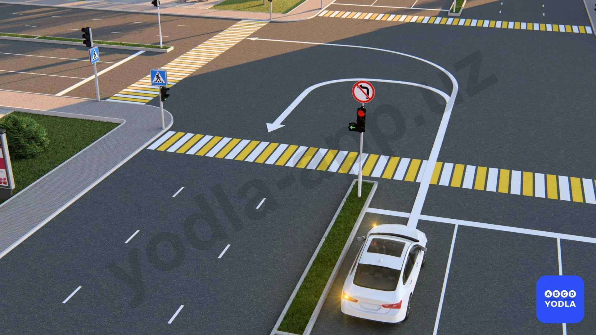

⬜ A. Только для разворота
⬜ B. Только налево
⬜ C. Движение в обоих направлениях запрещено
✅ D. Движение в обоих направлениях разрешено

> 💡 В данной ситуации на дороге имеется разделительная полоса.

Поэтому знак «Поворот налево запрещён» действует только до первого пересечения проезжих частей и не распространяется на второе пересечение.

Следовательно, на втором пересечении поворот налево разрешён.

Кроме того, знак «Поворот налево запрещён» не запрещает разворот. Поэтому водитель может как повернуть налево, так и выполнить разворот.

Правильный ответ — движение разрешено в обоих направлениях.

---

## Вопрос 3

**Каким транспортным средствам разрешено движение направо?**

⬜ A. Обоим
⬜ B. Трамваю
✅ C. Легковому автомобилю

> 💡 В данной ситуации трамвайный светофор разрешает трамваю движение только прямо. Движение в других направлениях для трамвая не разрешено.

Для красного легкового автомобиля горит основной зелёный сигнал светофора. Основной зелёный сигнал разрешает движение во всех направлениях, которые не запрещены дорожными знаками или разметкой.

Поэтому, если вопрос заключается в том, какому транспортному средству разрешено движение, правильный ответ — легковому автомобилю.

Следовательно, движение разрешено только легковому автомобилю.

---

## Вопрос 4

**Мигающий красный сигнал?**

✅ A. Запрещает движение
⬜ B. Разрешает продолжить движение водителям, которые без резкого торможения не успевают остановиться
⬜ C. Разрешает движение

> 💡 Мигающий красный сигнал запрещает движение.

Такой сигнал указывает водителю на необходимость остановиться и действовать с повышенной осторожностью. Особенно на железнодорожных переездах мигающий красный сигнал запрещает дальнейшее движение транспортных средств.

Следовательно, мигающий красный сигнал является запрещающим сигналом.

---

## Вопрос 5

**Разрешен ли водителям синих и черных автомобилей совершать правый поворот?**

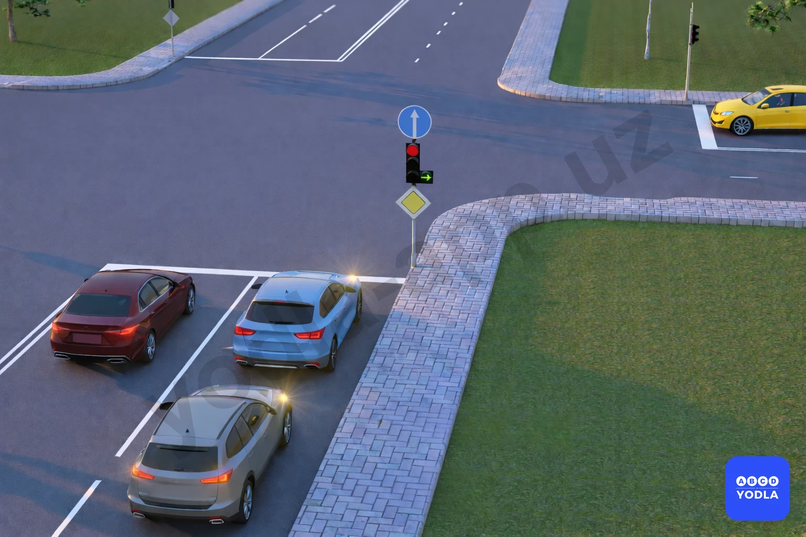

⬜ A. Разрешён
✅ B. Запрещён

> 💡 В данной ситуации водители синего и чёрного автомобилей хотят повернуть направо.

Однако на перекрёстке установлен знак «Движение прямо» (4.1.1), который разрешает движение только прямо и запрещает поворот направо.

Следовательно, правиль��ый ответ — поворот направо для синего и чёрного автомобилей запрещён.

---

## Вопрос 6

**Движение запрещено:**

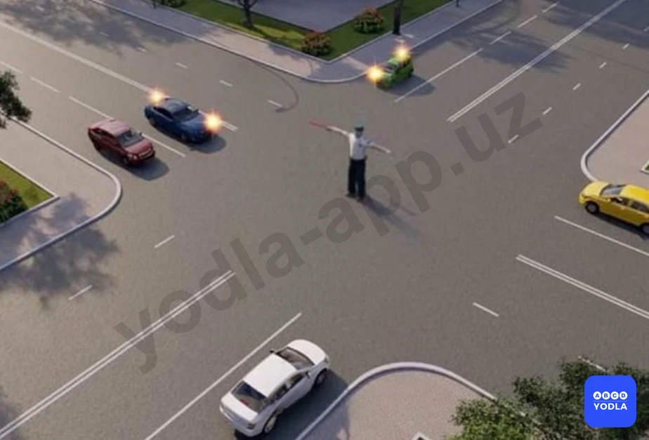

⬜ A. Красному и белому автомобилям
✅ B. Синему, зеленому и белому автомобилям
⬜ C. Белому, синему и желтому автомобилям

> 💡 Здесь необходимо обратить внимание на сигналы регулировщика.

Транспортным средствам, находящимся сбоку от регулировщика, разрешается движение прямо и направо.

В данной ситуации сбоку находятся синий, красный и жёлтый автомобили. Однако направление движения синего автомобиля не соответствует разрешённым направлениям, поэтому ему движение запрещено.

Транспортным средствам, находящимся перед грудью и за спиной регулировщика, движение запрещено во всех направлениях. В таком положении находятся белый и зелёный автомобили.

Следовательно:
- красному и жёлтому автомобилям движение разрешено;
- синему, белому и зелёному автомобилям движение запрещено.

Правильный ответ — движение запрещено синему, белому и зелёному автомобилям (F2).

---

## Вопрос 7

**Кто из водителей имеет право двигаться в прямом направлении?**

⬜ A. Водители автобуса и мотоцикла
⬜ B. Водители легкового и грузового автомобилей
✅ C. Водитель легкового автомобиля

> 💡 Вопрос заключается в том, водитель какого транспортного средства имеет право двигаться прямо.

Сначала определяем положение регулировщика. За спиной регулировщика находится автобус. Транспортным средствам, находящимся перед грудью и за спиной регулировщика, движение запрещено во всех направлениях. Поэтому автобусу движение запрещено.

Синий автомобиль также находится в запрещённом положении, поэтому ему движение не разрешается.

Мотоциклу разрешён только поворот направо, поэтому он не может двигаться прямо.

Легковой автомобиль имеет право двигаться прямо. Поэтому, если вопрос касается именно движения прямо, правильный ответ — легковой автомобиль.

Следовательно, только водитель легкового автомобиля имеет право двигаться прямо.

---

## Вопрос 8

**Каким транспортным средствам разрешено движение?**

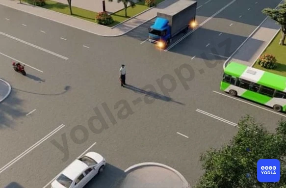

⬜ A. Мотоциклу
⬜ B. Грузовому автомобилю
⬜ C. Автобусу
✅ D. Легковому автомобилю
⬜ E. Легковому и и грузовому автомобилям

> 💡 Согласно пункту 38 главы 7 ПДД, руки регулировщика вытянуты в стороны или опущены означают что: со стороны левого и правого бока — разрешено движение трамваю прямо, безрельсовым транспортным средствам — прямо и направо, пешеходам разрешено переходить проезжую часть; со стороны груди и спины — движение всех транспортных средств и пешеходов запрещено.

---

## Вопрос 9

**Этот сигнал регулировщика означает,что:**

⬜ A. Разрешено движение синемлоу, зеленому автомобилям. Запрещено красному, желтому, бему
✅ B. Разрешено движение синему, красному, зеленому автомобилям. Запрещено желтому, белому

> 💡 В этом вопросе необходимо определить, что означает данный сигнал регулировщика для каждого транспортного средства.

Позади регулировщика находится белый автомобиль. Транспортным средствам, находящимся за спиной регулировщика, движение запрещено во всех направлениях.

Жёлтый автомобиль также находится в запрещённом направлении, поэтому ему движение не разрешается.

Зелёному автомобилю разрешено движение только направо.

Транспортным средствам, находящимся сбоку от регулировщика, разрешено движение во всех допустимых направлениях.

Следовательно, правильный ответ — белому и жёлтому автомобилям движение запрещено, а зелёному автомобилю разрешено движение только направо.

---

## Вопрос 10

**Каким транспортным средствам разрешено движение?**

⬜ A. Только красному автомобилю
⬜ B. Всем транспортным средствам
✅ C. Красному, синему и зелёным автомобилям.

> 💡 В данной ситуации анализируем сигналы регулировщика.

- Транспортным средствам, находящимся за спиной регулировщика, движение запрещено во всех направлениях. Поэтому белому автомобилю движение запрещено.
- Жёлтому автомобилю также движение не разрешается.
- Зелёному автомобилю разрешено движение только направо.
- Синий и красный автомобили находятся сбоку от регулировщика, поэтому им разрешено движение в допустимых направлениях.

Следовательно:
- белому и жёлтому автомобилям движение запрещено;
- зелёному, синему и красному автомобилям движение разрешено.

Правильный ответ — красный, зелёный и синий автомобили.

---

## Вопрос 11

**Движение разрешено:**

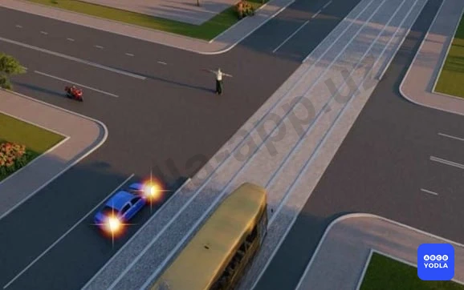

⬜ A. Всем транспортным средствам
✅ B. Мотоциклу
⬜ C. Автомобилю и мотоциклу

> 💡 В данной ситуации регулировщик обращён к трамваю и синему автомобилю.

Транспортным средствам, находящимся перед грудью или за спиной регулировщика, движение запрещено во всех направлениях.

Поэтому:
- трамваю движение запрещено;
- синему автомобилю также движение запрещено.

Транспортным средствам, находящимся сбоку от регулировщика, разрешено движение прямо и направо.

Мотоцикл не подаёт сигнал поворота и собирается двигаться прямо из первой полосы, что соответствует правилам.

Следовательно, движение мотоциклу разрешено.

---

## Вопрос 12

**Каким транспортным средствам движение разрешено?**

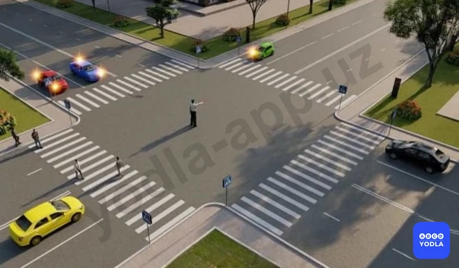

⬜ A. Зеленому, синему и черному автомобилям
⬜ B. Красному, желтому и зеленому автомобилям
✅ C. Зеленому, синему и красному автомобилям

> 💡 В данной ситуации необходимо правильно определить сигналы регулировщика.

- Жёлтому и чёрному автомобилям, находящимся за спиной регулировщика, движение запрещено во всех направлениях.
- Зелёному автомобилю разрешено движение только направо.
- Красный и синий автомобили находятся сбоку от регулировщика, поэтому им разрешено движение в допустимых направлениях.

Следовательно:
- жёлтому и чёрному автомобилям движение запрещено;
- зелёному, синему и красному автомобилям движение разрешено.

Правильный ответ — движение разрешено зелёному, синему и красному автомобилям.

---

## Вопрос 13

**В каких направлениях может двигаться автомобиль?**

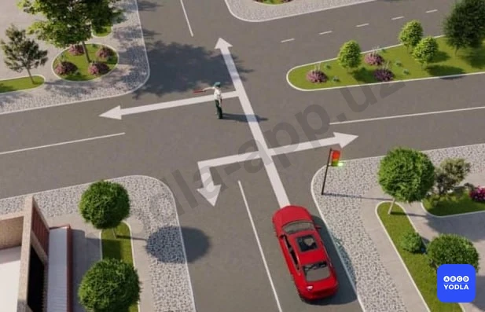

⬜ A. Только направо
⬜ B. Остановиться и ждать зеленого сигнала светофора
⬜ C. Только прямо
✅ D. Во всех направлениях

> 💡 В данной ситуации сигналы регулировщика и светофора противоречат друг другу.

Согласно Правилам дорожного движения, если сигналы регулировщика противоречат сигналам светофора или требованиям дорожных знаков, водители обязаны руководствоваться сигналами регулировщика.

Поэтому в данной ситуации приоритет имеют именно сигналы регулировщика, а не светофора.

Если положение регулировщика разрешает движение во всех направлениях, то транспортные средства могут двигаться во всех разрешённых направлениях.

Следовательно, правильный ответ — необходимо руководствоваться сигналами регулировщика, и в данной ситуации движение разрешено во всех направлениях.

---

## Вопрос 14

**Каким транспортным средствам разрешено движение?**

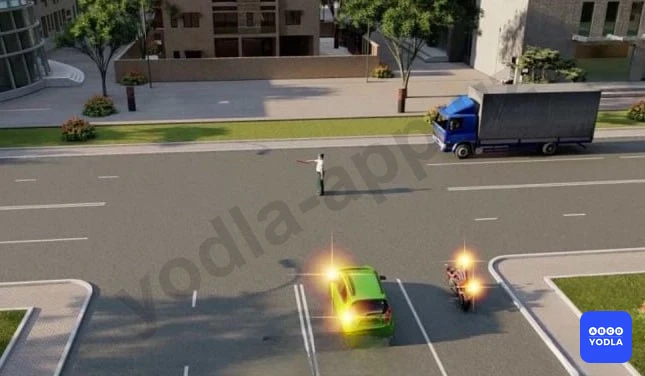

⬜ A. Легковому и грузовому автомобилям
⬜ B. Мотоциклу, легковому и грузовому автомобилям
✅ C. Легковому автомобилю и мотоциклу

> 💡 Вопрос заключается в том, каким транспортным средствам разрешено движение.

Любому транспортному средству, находящемуся за спиной регулировщика, движение запрещено во всех направлениях. В данной ситуации за спиной регулировщика транспортных средств нет.

Зелёный легковой автомобиль и мотоцикл находятся сбоку от регулировщика. Транспортным средствам, находящимся сбоку от регулировщика, разрешено движение в разрешённых направлениях.

Следовательно:
- легковому автомобилю движение разрешено;
- мотоциклу также движение разрешено.

Правильный ответ — движение разрешено легковому автомобилю и мотоциклу.

---

## Вопрос 15

**Движение разрешено:**

⬜ A. Прямо
✅ B. Направо в первый проезд
⬜ C. Направо во второй проезд
⬜ D. Направо в первый и второй проезды

> 💡 Если рука регулировщика направлена в вашу сторону, то транспортным средствам, движущимся с этой стороны, разрешается движение только направо.

Движение в других направлениях запрещено.

Следовательно, в данной ситуации разрешено движение только направо, то есть по первому направлению.

---

## Вопрос 16

**Движение разрешено:**

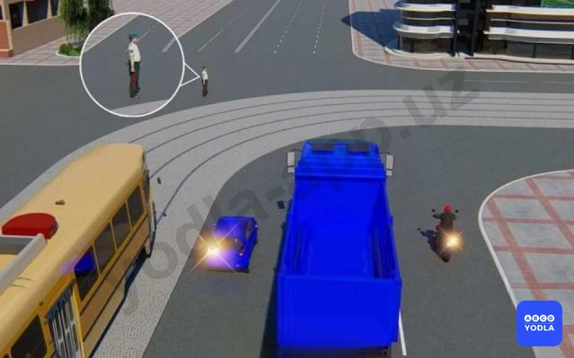

✅ A. Грузовому автомобилю и мотоциклу
⬜ B. Всем транспортным средствам
⬜ C. Трамваю и легковому автомобилю
⬜ D. Легковому и грузовому автомобилям, мотоциклу

> 💡 В данной ситуации руки регулировщика вытянуты в стороны.

Перед регулировщиком и за его спиной транспортных средств нет. Транспортным средствам, приближающимся сбоку, разрешается движение прямо и направо.

Поэтому:
- поворот налево запрещён;
- трамваю не разрешается поворот направо, для него разрешено только движение прямо;
- синему автомобилю движение запрещено, так как он собирается повернуть налево.

Следовательно, движение разрешено только грузовому автомобилю и мотоциклу.

---

## Вопрос 17

**В каком случае водитель мотоцикла повернул налево правильно?**

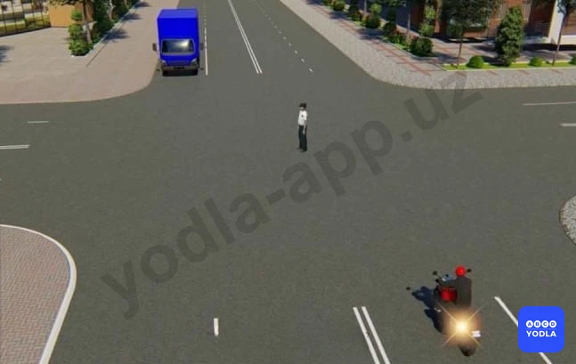

⬜ A. Выехал на перекресток, пропустил грузовой автомобиль, закончил поворот
⬜ B. Выехал на перекресток и, дождавшись разрешающего жеста регулировщика, закончил поворот
✅ C. Остановится и при разрешающем жесте регулировщика повернёт налево

> 💡 В данной ситуации поворот налево для мотоциклиста временно запрещён.

Поэтому водитель мотоцикла должен остановиться, не выезжая на середину перекрёстка, и дождаться разрешающего сигнала регулировщика.

После того как регулировщик разрешит движение налево, водитель может без дополнительной остановки выполнить поворот налево.

Следовательно, правильный ответ — водитель мотоцикла остановился и после разрешающего сигнала регулировщика повернул налево.

---

## Вопрос 18

**В каком ответе правильно названы все транспортные средства; которым разрешено движение?**

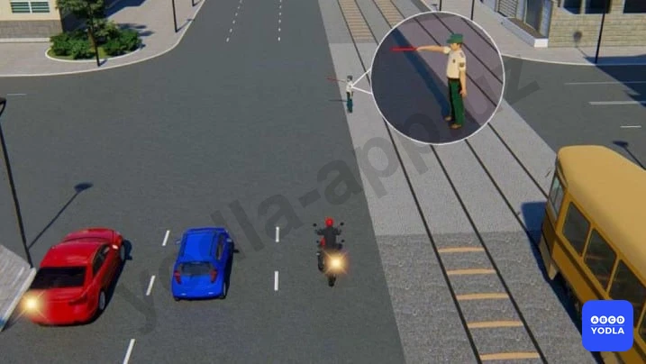

✅ A. Автомобили и мотоцикл
⬜ B. Все транспортные средства
⬜ C. Автомобили и трамвай

> 💡 В данной ситуации регулировщик держит руку, направленную влево.

Безрельсовым транспортным средствам, находящимся с этой стороны, то есть автомобилям и мотоциклу, движение разрешено.

Для трамвая данный сигнал разрешает движение только налево. Однако трамвай собирается двигаться прямо, поэтому движение для него запрещено.

Следовательно:
- автомобилям и мотоциклу движение разрешено;
- трамваю движение запрещено.

Правильный ответ — автомобили и мотоцикл.

---

## Вопрос 19

**На каком рисунке водитель поворачивает правильно?**

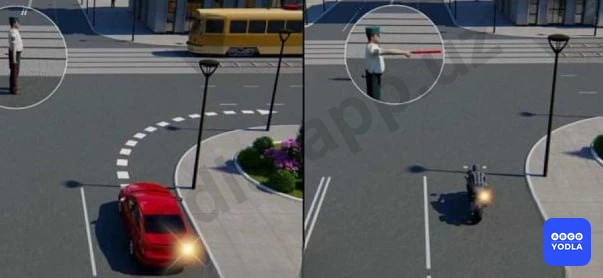

✅ A. На левом рисунке
⬜ B. На правом рисунке

> 💡 В данной ситуации рука регулировщика выполняет функцию шлагбаума.

Легковому автомобилю разрешено движение, поскольку он поворачивает направо.

Мотоциклу движение запрещено, так как он движется в запрещённом направлении.

Запомните:
- если рука регулировщика, с вашей стороны, направлена влево — движение разрешено;
- если рука направлена вправо — движение запрещено.

Если в вопросе спрашивается: «На каком рисунке водитель правильно выполняет поворот?», правильный ответ — на левом рисунке.

---

## Вопрос 20

**Движение запрещено:**

✅ A. Сине-желтому автомобилю - налево
⬜ B. Сине-желтому автомобилю - прямо, красному автомобилю — прямо и направо
⬜ C. Красному автомобилю — прямо и направо

> 💡 Согласно пункту 38 главы 7 ПДД, руки регулировщика вытянуты в стороны или опущены означают что: со стороны левого и правого бока — разрешено движение трамваю прямо, безрельсовым транспортным средствам — прямо и направо, пешеходам разрешено переходить проезжую часть; со стороны груди и спины — движение всех транспортных средств и пешеходов запрещено.

---

