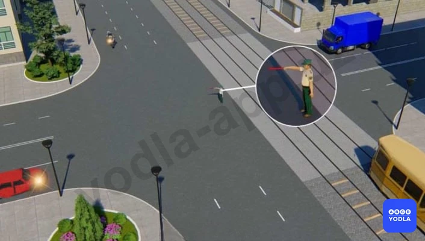
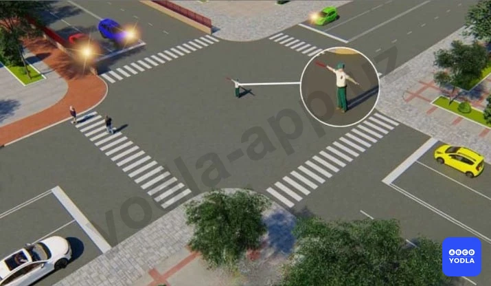
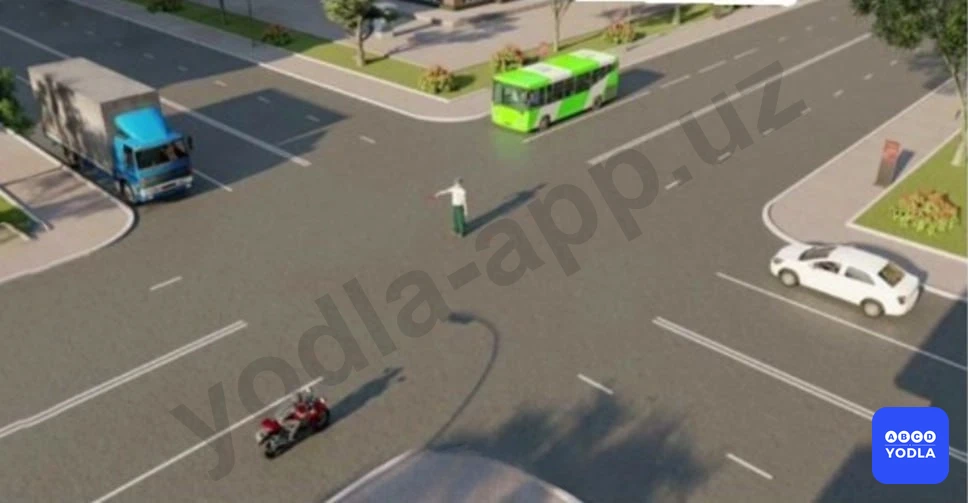
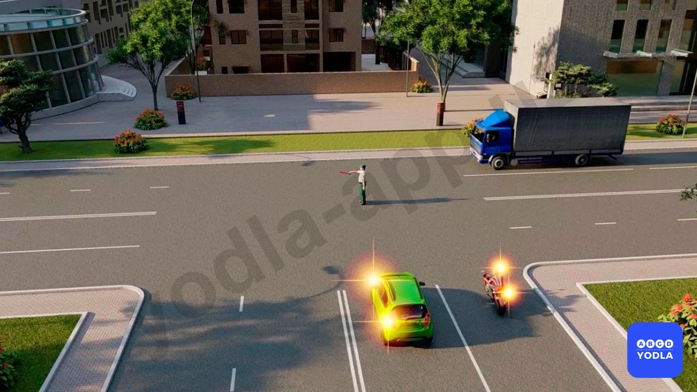
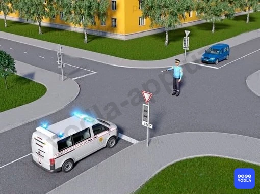

# Bilet 24

Всего вопросов: 20

## Вопрос 1

**Движение разрешено:**

✅ A. Красному автомобилю
⬜ B. Мотоциклу
⬜ C. Трамваю и красному автомобилю
⬜ D. Трамваю
⬜ E. Синему автомобилю

> 💡 Согласно пункту 38 главы 7 ПДД, правая рука регулировщика вытянута вперед: со стороны левого бока — разрешено движение трамваю налево, безрельсовым транспортным средствам — во всех направлениях; со стороны груди — всем транспортным средствам разрешено движение только направо; со стороны правого бока и спины — движение всех транспортных средств запрещено; пешеходам разрешено переходить проезжую часть за спиной регулировщика.

---

## Вопрос 2

**Каким транспортным средствам разрешено движение?**

✅ A. Желтому и красному автомобилям
⬜ B. Зеленому, красному и белому автомобилям
⬜ C. Белому и зеленому автомобилю

> 💡 В данной ситуации прежде всего необходимо правильно определить положение регулировщика.

Если регулировщик обращён к транспортному средству грудью или спиной, движение для этого транспортного средства запрещено во всех направлениях.

Поэтому движение мотоциклу и автобусу запрещено.

Транспортным средствам, находящимся сбоку от регулировщика, разрешается движение прямо и направо.

В данной ситуации сбоку находятся белый и синий автомобили. Синий автомобиль собирается повернуть налево, поэтому движение для него запрещено.

Следовательно, движение разрешено только белому легковому автомобилю.

---

## Вопрос 3

**По каким направлениям разрешено движение транспортных средств?**

⬜ A. Трамваю налево или прямо
⬜ B. Только автомобилю налево
⬜ C. Трамваю и автомобилю налево
⬜ D. Трамваю налево или прямо, автомобилю после трамвая
✅ E. Трамваю налево, автомобилю налево и в обратном направлении

> 💡 Согласно пункту 38 главы 7 ПДД, правая рука регулировщика вытянута вперед: со стороны левого бока — разрешено движение трамваю налево, безрельсовым транспортным средствам — во всех направлениях; со стороны груди — всем транспортным средствам разрешено движение только направо; со стороны правого бока и спины — движение всех транспортных средств запрещено; пешеходам разрешено переходить проезжую часть за спиной регулировщика.

---

## Вопрос 4

**Лица; уполномоченные регулировать дорожное движение; должны иметь при себе:**

⬜ A. Соответствующее удостоверение и отличительный знак- нарукавную повязку
⬜ B. Жезл
⬜ C. Диск с красным сигналом (светоотражателем) или флажок
✅ D. Все перечисленные отличительные знаки

> 💡 Согласно определению 44 пункта 6 главы 1 ПДД, Регулировщик - сотрудник ГСБДД МВД РУ, военной автомобильной инспекции, работник дорожно-эксплуатационных служб, дежурный на железнодорожных переездах и паромных переправах при исполнении ими своих должностных обязанностей, наделенный в установленном порядке полномочиями по регулированию дорожного движения с помощью сигналов, установленных настоящими Правилами, и не посредственно осуществляющий указанное регулирование. Регулировщик должен быть в форменной одежде и (или) иметь отличительный знаки и экипировку (нарукавную повязку, жезл, диск с красным отражателем, красный фонарь или флажок).

---

## Вопрос 5

**Сигнал регулировщика свистком служит:**

✅ A. Для привлечения внимания участников движения
⬜ B. Для замены в необходимых случаях сигнала «рука поднята вверх»
⬜ C. Разрешающим сигналом для пешеходов

> 💡 Согласно пункту 40 главы 7 ПДД, для привлечения внимания участников движения может подаваться дополнительный сигнал при помощи свистка.

---

## Вопрос 6

**Разрешается ли Вам продолжить движение, если регулировщик поднял руку вверх после того, как Вы въехали на перекресток?**

⬜ A. Не разрешается
⬜ B. Разрешается, только если Вы поворачиваете направо
✅ C. Разрешается

> 💡 Согласно пункту 124 Правил дорожного движения, в жилой зоне запрещается: учебная езда на механических транспортных средствах; стоянка с работающим двигателем; стоянка грузовых автомобилей с разрешенной максимальной массой более 3,5 т вне специально выделенных и обозначенных дорожными знаками и (или) дорожной разметкой мест.

---

## Вопрос 7

**Разрешается движение:**

⬜ A. Красному, синему, зеленому и желтому автомобилям
✅ B. Красному и желтому автомобилям
⬜ C. Красному, желтому и зеленому автомобилям

> 💡 :  Согласно статьи 6 Правил дорожного движения, пешеходный переход — участок проезжей части дороги, предназначенный для пересечения пешеходами, обозначенный дорожными знаками 5.16.1, 5.16.2 и дорожной разметкой 1.14.1 — 1.14.4.
При отсутствии дорожной разметки ширина пешеходного перехода определяется расстоянием между дорожными знаками 5.16.1 и 5.16.2.

---

## Вопрос 8

**Каким транспортным средством разрешено движение?**

⬜ A. Мотоциклу направо, легковому автомобилю на все направления
⬜ B. Легковому автомобилю на право и прямо
✅ C. Мотоциклу направо, легковому автомобилю прямо и направо

> 💡 Знак 5.42 раздела 5 приложения № 1 к ПДД, «Движение направо при красном сигнале». Если с правой стороны красного сигнала транспортного светофора установлен знак 5.42, водители транспортных средств, находящиеся непосредственно перед перекрестком, при включённом запрещающем сигнале светофора могут поворачивать направо, соблюдая все меры безопасности. При этом они обязаны уступить дорогу всем транспортным средствам, а также пешеходам, переходящим проезжую часть дороги в направлении движения и дороги, на которую транспортные средства поворачивают.

---

## Вопрос 9

**Какому транспортному средству движение запрещено?**

⬜ A. Мотоциклу
⬜ B. Никому незапрещено
✅ C. Грузовому автомобилю

> 💡 Согласно пункту 38 Правил дорожного движения, Сигналы регулировщика имеют следующие значения: правая рука вытянута вперед: со стороны левого бока — разрешено движение трамваю налево, безрельсовым транспортным средствам — во всех направлениях; со стороны груди — всем транспортным средствам разрешено движение только направо; со стороны правого бока и спины — движение всех транспортных средств запрещено; пешеходам разрешено переходить проезжую часть за спиной регулировщика.
В этой ситуации движение запрещено грузовому автомобилю.

---

## Вопрос 10

**Водитель автомобиля намерен развернуться:**

⬜ A. Проедет перекресток первым
✅ B. Выпольняет разворот, уступив дорогу трамваю

> 💡 При прохождении поворота на транспортное средство действует центробежная сила, которая возрастает с увеличением скорости и стремится сместить транспортное средство к внешней стороне закругления дороги. Занос или снос транспортного средства может возникнуть при проезде поворота из-за большой скорости движения, торможения или низкого коэффициента сцепления. Антиблокировочная тормозная система, предназначенная для предотвращения блокировки колес транспортного средства, может снизить вероятность возникновения заноса или сноса при торможении, но не может исключить возможность их возникновения.

---

## Вопрос 11

**Разрешается ли транспортному средству с включенным маячком двигаться прямо?**

⬜ A. Разрешается
✅ B. Запрещается

> 💡 Согласно пункту 60 главы 9 ПДД, в случаях, когда траектории движения транспортных средств пересекаются, а очерёдность проезда не оговорена настоящими Правилами, дорогу должен уступить водитель, к которому транспортное средство приближается справа.

---

## Вопрос 12

**В каких направлениях разрешено движение автомобилям?**

⬜ A. Красному — налево, синему — запрещено
⬜ B. Синему — прямо, красному — налево
✅ C. Обоим разрешено движение по указанным направлениям
⬜ D. Красному разрешено, синему направо запрещено

> 💡 "На основании пункта 5.8.2 Приложения 1 к ПДД и абзаца 11 раздела 5 «Информационно-указательные знаки», а также пункта 3.18.2 Приложения 1 к ПДД и абзаца 47 раздела 3 «Запрещающие знаки»: 5.8.2. «Направления движения по полосе». Разрешенные направления движения по полосе. Движение по другим направлениям запрещается.
Знаки 5.8.1 и 5.8.2, разрешающие поворот налево из крайней левой полосы, разрешают и разворот с этой полосы. 
3.18.2. «Поворот налево запрещен». Действие знаков 3.18.1 и 3.18.2 распространяется на пересечение проезжих частей, перед которыми установлен знак."

---

## Вопрос 13

**В каком случае правила не требуют подачи предупре­дительного сигнала?**

⬜ A. Перед остановкой у края проезжей части
✅ B. Перед закруглением дороги; обозначенным знаком "Опасный поворот"
⬜ C. Перед перестроением на соседнюю полосу движения

> 💡 В соответствии с пунктом 153 главы 26 ПДД: Высота борта кузова грузового автомобиля, используемого для перевозки людей должна быть не менее 1,3 м. При этом он должен быть оборудован сиденьями, закрепленными в кузове на расстоянии 0,3-0,5 м от пола кузова.

---

## Вопрос 14

**Является ли включение ближнего света фар в дневное время предупредительным сигналом?**

✅ A. Является
⬜ B. Не является

> 💡 Согласно пункту 44 главы 8 ПДД, включение ближнего света фар в дневное время являются предупредительными сигналами.

---

## Вопрос 15

**Какие сигналы считаются предупредительными?**

⬜ A. Сигналы; подаваемые световыми указателями поворота или рукой
⬜ B. Звуковые сигналы
⬜ C. Переключение света фар и включение ближнего света фар дневное время
✅ D. Все вышеперечисленные сигналы

> 💡 Согласно пункту 44 главы 8 ПДД, предупредительными сигналами являются: сигналы, подаваемые мигающими указателями поворотов или рукой; звуковые сигналы; переключение света фар; включение ближнего света фар в дневное время.

---

## Вопрос 16

**Дает ли водителю преимущественное право проезда подача предупредительного сигнала?**

✅ A. Не дает
⬜ B. Дает при завершении маневра
⬜ C. Дает при начале маневра
⬜ D. Дает во всех случаях

> 💡 Согласно пункту 46 главы 8 ПДД, подача предупредительного сигнала указателями поворотов не дает водителю право на первоочередное движение и не освобождает его от принятия необходимых мер предосторожности.

---

## Вопрос 17

**Правильно ли поступил водитель; применив переключение света фар и звуковой сигнал; для привлечения внимания обгоняемого водителя на дороге вне населенного пункта?**

⬜ A. Неправильно
✅ B. Правильно

> 💡 Согласно пунктов 48 и 49 главы 8 ПДД, вне населенных пунктов при обгоне, для предупреждения других водителей могут применяться звуковые сигналы. Вместо звукового сигнала об обгоне или же вместе с ним может подаваться предупредительный сигнал переключением фар.

---

## Вопрос 18

**Можно ли пользоваться дальним светом фар в качестве предупредительного сигнала при обгоне?**

⬜ A. Можно в любом случае
✅ B. Можно, когда это не может вызвать ослепление других водителей, в том числе и через зеркало заднего вида
⬜ C. Нельзя
⬜ D. Можно на дорогах вне населенных пунктов
⬜ E. Правильно

> 💡 Согласно пунктов 48 и 49 главы 8 ПДД, вне населенных пунктов при обгоне, для предупреждения других водителей могут применяться звуковые сигналы. Вместо звукового сигнала об обгоне или же вместе с ним может подаваться предупредительный сигнал переключением фар.

---

## Вопрос 19

**Всегда ли водитель должен подавать световой сигнал; указателями поворота при выполнении маневра?**

⬜ A. Должен всегда
✅ B. Не должен, если он может ввести в заблуждение других участников движения
⬜ C. Должен, приняв необходимые меры предосторожности

> 💡 Пункта 46 главы 8 ПДД гласит: Подача сигнала указателями поворотов или рукой должна производиться заблаговременно до начала выполнения маневра и прекращаться немедленно после его завершения (подача сигнала рукой может быть закончена непосредственно перед выполнением маневра). Подаваемый сигнал не должен вводить в заблуждение других участников дорожного движения. Подача предупредительного сигнала не дает водителю право на первоочередное движение и не освобождает его от принятия необходимых мер предосторожности.

---

## Вопрос 20

**Синий автомобиль проедет перекресток:**

⬜ A. Первым
⬜ B. Вторым
✅ C. Третьим
⬜ D. Последним

> 💡 Каким по счёту синий автомобиль проедет перекрёсток?

Первым проезжает специальное транспортное средство, имеющее преимущество.

Вторым проезжает зелёный автомобиль, находящийся на главной дороге.

Третьим перекрёсток проезжает синий автомобиль.

Последним движется водитель жёлтого автомобиля.

Следовательно, правильный ответ — синий автомобиль проедет перекрёсток третьим.

---

