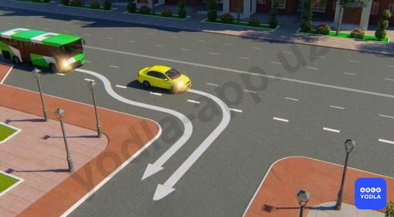

# Bilet 26

Всего вопросов: 20

## Вопрос 1

**Если транспортное средство из-за габаритов или по другим причинам не может выполнить поворот из крайнего положения, допускается ли производить его с отступлением от этого правила?**

⬜ A. Не допускается
✅ B. Допускается, если это не создает помех другим транспортным средствам. Для обеспечения безопасности движения водитель, в случае необходимости, должен прибегнуть к помощи других лиц
⬜ C. Допускается на дорогах вне населенных пунктов
⬜ D. Допускается, но только не на перекрестке

> 💡 По правилам при повороте направо или налево водитель должен занимать соответствующую крайнюю полосу.

Однако если транспортное средство имеет большие габариты и поворот из крайней полосы затруднён или невозможен, допускается отступление от этого требования.

В таком случае водитель может выполнить поворот из другой полосы, но при этом он обязан не создавать помех другим участникам дорожного движения и обеспечить безопасность.

Следовательно, правильный ответ — разрешается.

---

## Вопрос 2

**Когда водитель должен уступить дорогу пешеходам?**

⬜ A. При выезде из двора
⬜ B. При въезде во двор
⬜ C. При выезде с заправочной станции
⬜ D. При выезде со стоянки на дорогу
✅ E. Во всех перечисленных случаях

> 💡 Пешеходам необходимо уступать дорогу во всех перечисленных случаях.

В частности:
- при выезде со двора;
- при въезде во двор;
- при выезде с автозаправочной станции на дорогу;
- при выезде с места стоянки.

Следовательно, во всех перечисленных ситуациях водитель обязан уступить дорогу пешеходам.

Правильный ответ — во всех перечисленных случаях.

---

## Вопрос 3

**При интенсивном движении; когда все полосы заняты; разрешается ли выполнять разворот?**

✅ A. Разрешается в любом случае
⬜ B. Разрешается только на дорогах; где имеется не менее трех полос для движения
⬜ C. Запрещается
⬜ D. Разрешается только на перекрестках

> 💡 Этот вопрос часто вводит учеников в заблуждение.

Вопрос звучит так: «Разрешается ли разворот при интенсивном движении, когда все полосы заняты?»

Многие под влиянием формулировки вопроса выбирают ответ «запрещается». Однако это не всегда правильно.

Если:
- дорожные знаки;
- дорожная разметка;
- или другие требования Правил дорожного движения

не запрещают разворот, то его выполнение разрешается.

Следовательно, если в условии не указаны дополнительные ограничения, правильный ответ — разворот разрешён.

Главная цель этого вопроса — проверить внимательность при чтении условия.

---

## Вопрос 4

**Что обязан сделать водитель перед перестроением и другим изменением направления движения?**

✅ A. Убедиться; что данный маневр будет безопасным и не создаст помех другим участникам движения
⬜ B. Подать предупредительный сигнал левого поворота и убедиться; что никому не будет создана помеха
⬜ C. Вне населенных пунктов подать звуковой сигнал
⬜ D. Выполнить все указанные действия

> 💡 Перед перестроением или изменением направления движения водитель должен убедиться, что данный манёвр будет безопасным и не создаст помех другим участникам дорожного движения.

Это требование предусмотрено пунктом 53 Правил дорожного движения.

Следовательно, правильный ответ — убедиться в безопасности манёвра и в отсутствии помех для других участников движения.

---

## Вопрос 5

**Разворот запрещается:**

⬜ A. На пешеходных переходах
⬜ B. В тоннелях
⬜ C. На мостах, путепроводах, эстакадах и под ними
⬜ D. На железнодорожных переездах
✅ E. Во всех перечисленных случаях

> 💡 Пункт 62 главы 9 ПДД, гласит: Разворот запрещается: на пешеходных переходах; в тоннелях; на мостах, путепроводах, эстакадах и под ними (за исключением участков дорог, где соответствующие дорожные знаки разрешают такой маневр); на железнодорожных переездах; в местах с видимостью дороги хотя бы в одном направлении менее 100 м.

---

## Вопрос 6

**Водитель зеленого автомобиля:**

✅ A. Обязан уступить дорогу синему автомобилю; движущемся попутно в прямом направлении
⬜ B. Имеет преимущество перед синим автомобилем т.к. движется по полосе, предназначенной для обгона
⬜ C. Имеет преимущество, т.к. включил сигнал поворота

> 💡 Водитель зелёного автомобиля должен уступить дорогу синему автомобилю, который движется прямо в соседней полосе в том же направлении.

Поскольку перед перестроением водитель обязан уступить дорогу транспортным средствам, движущимся по соседней полосе.

Следовательно, водитель зелёного автомобиля должен уступить дорогу синему автомобилю.

---

## Вопрос 7

**Разворот запрещается:**

⬜ A. Ближе 15 м  от перекрестков

⬜ B. На нерегулируемых перекрестках, если на пересе­каемой дороге организовано одностороннее движение
✅ C. На пешеходных переходах
⬜ D. Во всех перечисленных случаях

> 💡 Внимательно прочитайте вопрос.

Разворот однозначно запрещён на пешеходных переходах.

Многие выбирают ответ «во всех перечисленных случаях», но здесь он будет неправильным.

Поскольку:
- вблизи нерегулируемого перекрёстка;
- или на некоторых перекрёстках, где пересекаемая дорога является дорогой с односторонним движением,

разворот не всегда запрещён.

Следовательно, правильный ответ — разворот запрещён на пешеходных переходах.

---

## Вопрос 8

**Водитель какого транспорта должен уступить дорогу?**

✅ A. Водитель легкового автомобиля
⬜ B. Водитель грузовика

> 💡 Вопрос: Водитель какого транспортного средства должен уступить дорогу?

В данной ситуации красный легковой автомобиль собирается обогнать медленно движущийся экскаватор.

Однако перед началом обгона водитель должен оценить дорожную обстановку. Сзади в том же направлении движется другое транспортное средство.

Согласно Правилам дорожного движения, перед перестроением или обгоном водитель обязан не создавать помех другим участникам движения и при необходимости уступить им дорогу.

Следовательно, в данной ситуации водитель красного легкового автомобиля обязан уступить дорогу.

---

## Вопрос 9

**Преимущество в движении имеет:**

⬜ A. Синий автомобиль, т.к. красный изменяет направление движения влево
✅ B. Красный автомобиль, т.к. при взаимном перестроении он находится справа
⬜ C. Синий автомобиль, т.к. при взаимном перестроении он находится слева

> 💡 Какое транспортное средство имеет преимущество при перестроении?

Если два транспортных средства одновременно намерены перестроиться, водитель обязан уступить дорогу транспортному средству, находящемуся справа.

В данной ситуации справа находится красный автомобиль.

Поэтому преимущество при перестроении имеет красный автомобиль, и именно он перестраивается первым.

Следовательно, правильный ответ — преимущество имеет красный автомобиль.

---

## Вопрос 10

**В каких местах запрещено движение задним ходом?**

⬜ A. На перекрестках, пешеходных переходах
⬜ B. На мостах, путепроводах, эстакадах и под ними
⬜ C. На автомагистралях
✅ D. Во всех перечисленных местах

> 💡 Движение задним ходом запрещается:

- на перекрёстках;
- на пешеходных переходах;
- на мостах, путепроводах, эстакадах и под ними;
- в тоннелях;
- на автобусных остановках и в других опасных местах.

Следовательно, если в вопросе перечислены именно эти варианты, правильный ответ — движение задним ходом запрещено во всех перечисленных местах.

---

## Вопрос 11

**Резкое торможение транспортного средства при интенсивном движении:**

✅ A. Может способствовать наезду сзади
⬜ B. Отражается только на техническом состоянии автомобиля
⬜ C. Является обычным приемом управления при интенсивном движении

> 💡 При интенсивном движении резкое торможение транспортного средства является опасным.

Поскольку резкое торможение может привести к тому, что движущиеся сзади автомобили не успеют остановиться и произойдёт дорожно-транспортное происшествие.

Следовательно, при интенсивном движении резкое торможение может стать причиной столкновения с автомобилями, движущимися сзади.

---

## Вопрос 12

**Как должен поступить водитель легкового автомобиля в показанной ситуации?**

⬜ A. Быстрее завершить поворот; чтобы не создавать помехи транспортным средствам
✅ B. При выезде из двора пропустить пешехода и транспортные средства
⬜ C. Уступая дорогу транспортным средствам, остановиться на краю проезжей части

> 💡 В данной ситуации водитель легкового автомобиля выезжает со двора на дорогу.

Согласно Правилам дорожного движения, водитель, выезжающий со двора или с прилегающей территории, обязан уступить дорогу:
- пешеходам;
- транспортным средствам, движущимся по дороге.

Поэтому водитель должен сначала пропустить пешехода и транспортное средство, а затем продолжить движение.

Следовательно, правильный ответ — уступить дорогу пешеходу и транспортному средству.

---

## Вопрос 13

**Водитель какого транспортного средства правильно выполняет разворот?**

⬜ A. Водитель синего автомобиля
⬜ B. Водитель синего автомобиля
✅ C. Оба водителя

> 💡 В данной ситуации оба водителя выполнили разворот правильно.

Водитель легкового автомобиля выполнил разворот из крайней левой полосы, что полностью соответствует Правилам дорожного движения.

Если из-за габаритов транспортного средства или по другим причинам выполнить разворот из крайней левой полосы невозможно, допускается выполнение разворота из другой, более правой полосы.

Следовательно, правильный ответ — оба автомобиля выполнили разворот правильно.

---

## Вопрос 14

**Водитель какого транспортного средства правильно въезжает на пересечение с круговым движением?**

✅ A. Оба водителя
⬜ B. Только водитель автобуса
⬜ C. Только водитель легкового автомобиля

> 💡 В данной ситуации оба водителя правильно въезжают на перекрёсток с круговым движением.

Согласно правилам, при въезде на перекрёсток с круговым движением водитель может занять:
- правую полосу;
- или левую полосу.

Поэтому въезд обоих автомобилей соответствует Правилам дорожного движения.

Однако при выезде с кругового движения водитель должен занимать только крайнюю правую полосу.

В данной ситуации автомобили только въезжают на круг, поэтому оба водителя действуют правильно.

Следовательно, правильный ответ — оба водителя правильно въезжают на перекрёсток с круговым движением.

---

## Вопрос 15

**Должен ли водитель уступить дорогу другим транспортным средствам при перестроении?**

✅ A. Должен, если транспортное средство движется попутно по соседней полосе
⬜ B. Не должен
⬜ C. Должен во всех случаях при взаимном перестроении

> 💡 Должен ли водитель уступить дорогу другим транспортным средствам?

При перестроении, если два автомобиля одновременно намерены перестроиться, преимущество обычно имеет транспортное средство, находящееся справа.

Однако из этого правила есть исключения.

Если автомобиль, находящийся слева, продолжает движение прямо по соседней полосе, водитель, выполняющий перестроение, обязан уступить ему дорогу.

Фраза «движется по соседней полосе» означает, что транспортное средство продолжает движение прямо.

Следовательно, правильный ответ — если транспортное средство движется прямо по соседней полосе, ему необходимо уступить дорогу.

---

## Вопрос 16

**Водитель какого транспортного средства нарушает правила въезда на дорогу; при наличии на ней полосы разгона?**

⬜ A. Оба водителя
⬜ B. Оба водителя выезжают правильно
⬜ C. Водитель синего автомобиля
✅ D. Водитель зеленого автомобиля

> 💡 В данной ситуации на дороге имеется полоса разгона.

Согласно Правилам дорожного движения, при повороте направо водитель должен занять крайнюю правую полосу или крайнее правое положение.

Водитель зелёного автомобиля не воспользовался полосой разгона и сразу выехал на вторую полосу основной дороги.

Это является нарушением Правил дорожного движения.

Следовательно, правильный ответ — водитель зелёного автомобиля нарушил правила.

---

## Вопрос 17

**Если ширина проезжей части недостаточна для разворота из крайнего левого положения; допускается ли производить его от правого края проезжей части или с правой обочины?**

⬜ A. Допускается только от правого края проезжей части. С правой обочины не допускается
✅ B. Допускается при этом водитель производящий разворот, должен уступить дорогу попутным и встречным транспортным средствам
⬜ C. Не допускается

> 💡 В данной ситуации применяется исключение, связанное с большими габаритами транспортного средства.

Если вне перекрёстка ширина проезжей части недостаточна для выполнения разворота из крайнего левого положения, разворот разрешается выполнять от право��о края проезжей части или с обочины.

Однако в этом случае водитель, выполняющий разворот, обязан уступить дорогу:
- транспортным средствам, движущимся в попутном направлении;
- транспортным средствам, движущимся во встречном направлении.

Следовательно, крупногабаритное транспортное средство может выполнить разворот от правого края, но обязано уступить дорогу другим участникам движения.

---

## Вопрос 18

**Водитель какого транспортного средства нарушает правила поворота с дороги; на которой есть полоса торможения?**

⬜ A. Оба водителя
✅ B. Водитель желтой автомобиля
⬜ C. Оба водителя поворачивают правильно

> 💡 В данной ситуации водитель жёлтого автомобиля нарушил правила.

Если на дороге имеется полоса торможения, водитель перед поворотом должен перестроиться на неё.

Водитель жёлтого автомобиля не перестроился на полосу торможения и повернул направо непосредственно со второй полосы.

Это является нарушением Правил дорожного движения.

Следовательно, правильный ответ — водитель жёлтого автомобиля нарушил правила.

---

## Вопрос 19

**Какие меры должен принять водитель при возникновении препятствия или опасности для движения; которые он в состоянии обнаружить?**

⬜ A. Снизить скорость и проехать опасный участок соблюдая меры безопасности
✅ B. Снизить скорость вплоть до остановки транспортного средства и принять меры к безопасному для других участников движения объезду препятствия
⬜ C. Сообщить о случившемся в органы внутренних дел
⬜ D. Прибыть на ближайший пост ГСБДД или в орган милиции и сообщить о возникшем препятствии или опасности

> 💡 Если водитель обнаружил опасность или препятствие для движения, он обязан немедленно принять необходимые меры.

Водитель должен:
- снизить скорость вплоть до полной остановки транспортного средства;
- либо безопасно объехать препятствие, не создавая опасности для других участников дорожного движения.

Например, если при движении на большой скорости впереди внезапно возникла опасность, водитель должен либо безопасно остановиться, либо объехать препятствие, не создавая угрозы другим.

Следовательно, правильный ответ — снизить скорость вплоть до остановки или принять безопасные меры для объезда препятствия.

---

## Вопрос 20

**Как должен поступить водитель синего автомобиля?**

⬜ A. Проехать перекресток в намеченном направлении, не уступая дорогу желтому автомобилю, так как тот движется сзади
⬜ B. Немедленно перестроиться на полосу встречного движения
✅ C. Снизить скорость - дать возможность желтому автомобилю завершив обгон, а затем повернуть налево

> 💡 Как должен поступить водитель синего автомобиля?

Водитель синего автомобиля, намеревающийся повернуть налево, обязан пропустить жёлтый автомобиль, выполняющий обгон сзади. Для этого необходимо снизить скорость, предоставить жёлтому автомобилю возможность завершить обгон, после чего включить указатель левого поворота и выполнить поворот налево.

---

