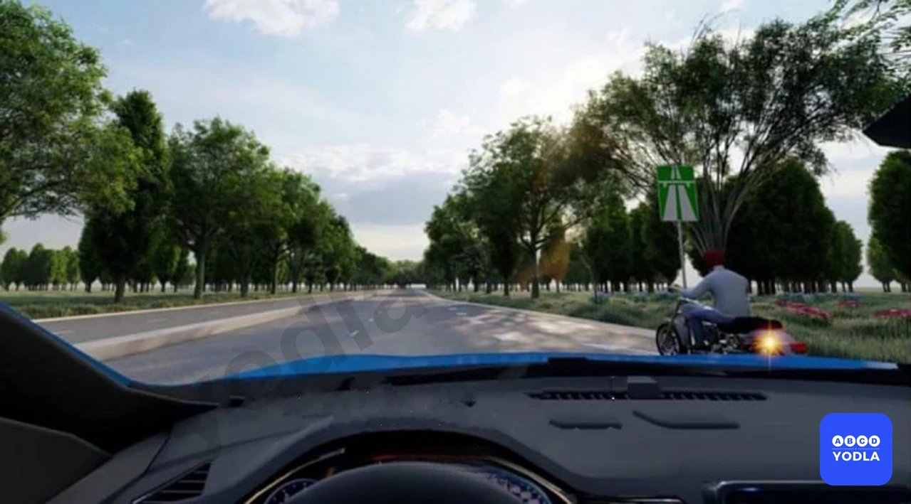
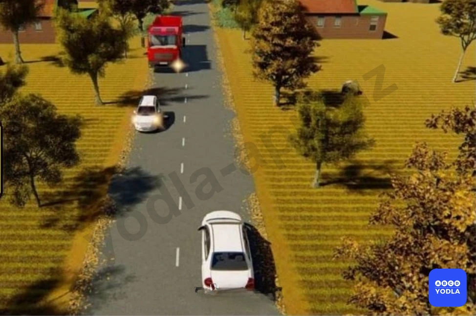
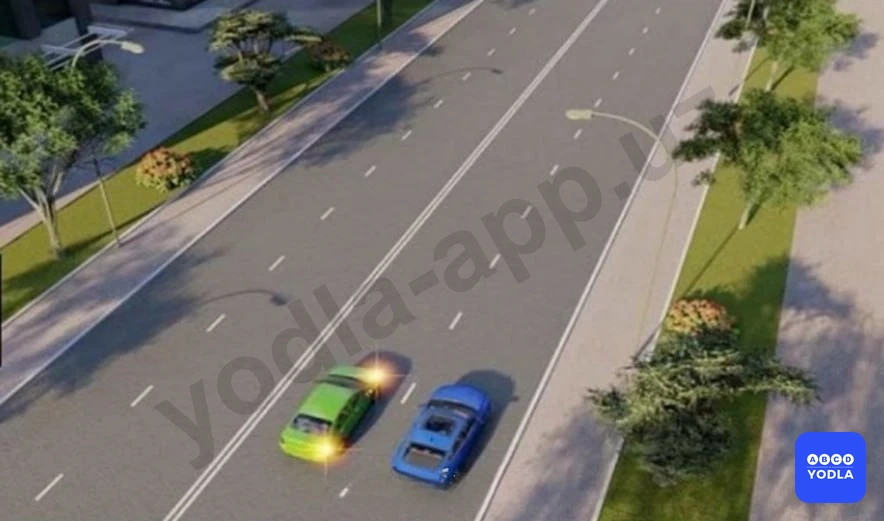

# Bilet 27

Всего вопросов: 20

## Вопрос 1

**Разворот запрещается:**

⬜ A. На перекрестках и ближе 15 м от них
⬜ B. Ближе 15 м перед перекрестками
⬜ C. Вне населенных пунктов на участках с видимостью дороги в одном направлении менее 100 м
✅ D. При видимости дороги менее 100 м хотя бы в одном направлении

> 💡 Следовательно, разворот запрещён.

Если расстояние видимости дороги хотя бы в одном направлении составляет менее 100 метров, разворот в данном месте запрещается. Этот случай относится к местам, где разворот запрещён. Остальные варианты являются отвлекающими.

---

## Вопрос 2

**Вы решили повернуть налево или развернуться. Посмотрев в зеркало заднего вида, вы поняли, что следующий за вами водитель начал вас обгонять. Ваши дальнейшие действия?**

⬜ A. Включить левый указатель поворота и, пользуясь благоприятным расположением на проезжей части, приступить к маневру
✅ B. Включить левый указатель поворота лишь после того как вас обгонит следовавший за вами водитель
⬜ C. Включить левый указатель поворота, дать возможность себя обогнать и затем приступить к маневру

> 💡 Вопрос: Вы решили повернуть налево или выполнить разворот. Посмотрев в зеркало заднего вида, вы заметили, что водитель позади намерен выполнить обгон. Какими должны быть ваши дальнейшие действия?

В данной ситуации необходимо пропустить транспортное средство, выполняющее обгон сзади. Водитель, намеревающийся повернуть налево или развернуться, должен дождаться завершения обгона, и только после этого включить указатель левого поворота и выполнить манёвр.

Следовательно, правильный ответ — пропустить транспортное средство, выполняющее обгон, и только после завершения обгона включить указатель левого поворота и выполнить манёвр.

---

## Вопрос 3

**Как должно осуществляется движения транспортных средств на дорогах проезжая часть которых разделена на полосы линиями разметки?**

✅ A. Строго по полосам. Наезжать на прерывистые линии разметки разрешается лишь при перестроении
⬜ B. Не строго по полосам, если проезжая часть свободна от транспортных средств
⬜ C. Не строго по полосам, если габариты транспортных средств по ширине не велики
⬜ D. Не строго по полосам, если на проезжей части отсутствуют автомобили с прицепами и при этом интервал движения можно соблюдать гораздо меньший

> 💡 Вопрос: Как должно осуществляться движение транспортных средств на проезжей части дороги, разделённой линиями разметки?

Если дорожная разметка обозначает отдельные полосы движения, транспортные средства должны двигаться строго по своей полосе движения.

Пересекать продольные линии разметки разрешается только при необходимости перестроения.

Следовательно, правильный ответ — транспортные средства должны двигаться строго по предназначенной для них полосе движения.

---

## Вопрос 4

**В каком из перечисленных случаев разрешается разворот от правого края проезжей части или с правой обочины?**

⬜ A. На регулируемом перекрестке
✅ B. Вне перекрестка, если ширина проезжей части недостаточна для разворота из крайнего левого положения
⬜ C. На нерегулируемом перекрестке, если транспортное средство, совершающее разворот, находится на главной дороге

> 💡 Вопрос: В каком из перечисленных случаев разрешается выполнять разворот от правого края проезжей части или с правой обочины?

Под выражением «вне перекрёстков» понимаются участки дороги, не являющиеся перекрёстками.

Если из-за габаритов транспортного средства выполнить разворот от левого края проезжей части невозможно, разрешается выполнять разворот от правого края проезжей части или с правой обочины. Данное правило, как правило, относится к крупногабаритным грузовым автомобилям.

При выполнении такого манёвра водитель обязан уступить дорогу транспортным средствам, движущимся в попутном и встречном направлениях.

Следовательно, правильный ответ — вне перекрёстков, если габариты транспортного средства не позволяют выполнить разворот от левого края проезжей части, разрешается выполнить разворот от правого края проезжей части или с правой обочины.

---

## Вопрос 5

**Разворот запрещается:**

⬜ A. На пешеходных переходах и в тоннелях
⬜ B. На мостах, путепроводах, эстакадах и под ними
⬜ C. На железнодорожных переездах
⬜ D. При видимости дороги менее 100 м хотя бы в одном направлении
✅ E. Во всех перечисленных случаях

> 💡 Разворот запрещается:

- на пешеходных переходах;
- в тоннелях;
- на мостах, путепроводах, эстакадах и под ними;
- на железнодорожных переездах.

Поэтому, если в вопросе перечислены именно эти варианты, правильный ответ — во всех перечисленных случаях разворот запрещён.

Примечание: В некоторых тестах варианты могут отличаться, поэтому необходимо внимательно читать условие вопроса.

Следовательно, правильный ответ — во всех перечисленных случаях.

---

## Вопрос 6

**В поле на сельскохозяйственных работах, траектории движения грузового автомобиля и трактора пересекаются. Кто должен уступить дорогу?**

⬜ A. Водитель грузового автомобиля водителю трактора
⬜ B. Водитель грузового автомобиля водителю трактора
✅ C. Водитель, к которому транспортное средство приближается справа
⬜ D. Водитель находящийся справа

> 💡 На поле, где проводятся сельскохозяйственные работы, траектории движения грузового автомобиля и трактора пересекаются. В такой ситуации необходимо уступить дорогу транспортному средству, приближающемуся справа.

Согласно пункту 60 Правил дорожного движения, если иной порядок не установлен правилами и траектории движения двух транспортных средств пересекаются, водитель обязан уступить дорогу транспортному средству, находящемуся справа. Водитель, у которого справа нет транспортного средства, имеет право продолжить движение.

Следовательно, правильный ответ — уступить дорогу транспортному средству, приближающемуся справа.

---

## Вопрос 7

**Обязан ли мотоциклист уступить Вам дорогу в данной ситуации?**

⬜ A. Нет
✅ B. Да

> 💡 Поскольку мотоцикл выезжает с полосы разгона, он обязан уступить дорогу транспортным средствам, движущимся по основной дороге.

Следовательно, правильный ответ — водитель мотоцикла должен уступить вам дорогу.

---

## Вопрос 8

**Разрешается ли Вам выполнить разворот с заездом во двор задним ходом?**

⬜ A. Разрешается
✅ B. Разрешается, если при этом не будут созданы помехи другим участникам движения
⬜ C. Запрещается

> 💡 Движение задним ходом на перекрёстках запрещено, однако при въезде во двор такого запрета нет.

Поэтому въезд во двор задним ходом для выполнения разворота разрешается, если этот манёвр не создаёт помех и не представляет опасности для других участников дорожного движения.

Следовательно, правильный ответ — разрешается, если такой манёвр не создаёт помех другим участникам дорожного движения.

---

## Вопрос 9

**Когда Вы обязаны выключить левые указатели поворота, выполняя обгон?**

✅ A. Сразу после завершения маневра
⬜ B. После опережения обгоняемого транспортного средства
⬜ C. По своему усмотрению

> 💡 Указатель левого поворота необходимо выключить сразу после завершения манёвра.

Следовательно, правильный ответ — выключить указатель левого поворота сразу после завершения манёвра.

---

## Вопрос 10

**Для обеспечения безопасности при движении задним ходом в местах, где  видимость ограничено, необходимо:**

⬜ A. Подать звуковой сигнал
⬜ B. Включить аварийную сигнализацию
✅ C. Прибегнуть к помощи других лиц

> 💡 При движении задним ходом в условиях ограниченной видимости для обеспечения безопасности движения необходимо воспользоваться помощью других лиц.

Следовательно, правильный ответ — воспользоваться помощью других лиц для обеспечения безопасности движения.

---

## Вопрос 11

**Когда водитель, который хочет повернуть на дорогах с полосой торможения, должен начать торможение?**

⬜ A. Пока он не перейдет на полосу торможения
✅ B. После выхода на полосу торможения

> 💡 На дороге, имеющей полосу торможения, водитель, намеревающийся выполнить поворот, должен сначала перестроиться на полосу торможения, а затем снизить скорость.

Следовательно, правильный ответ — снизить скорость после перестроения на полосу торможения.

---

## Вопрос 12

**Какое транспортное средство должно уступить дорогу в данной ситуации?**

⬜ A. Легковой автомобиль
✅ B. Грузовик

> 💡 На рисунке водитель автомобиля Spark намерен объехать неисправный грузовой автомобиль. В такой ситуации необходимо уступить дорогу транспортному средству, движущемуся во встречном направлении.

Поэтому в данном случае уступить дорогу должен не водитель легкового автомобиля, а водитель грузового автомобиля.

Следовательно, правильный ответ — водитель грузового автомобиля должен уступить дорогу.

---

## Вопрос 13

**Разрешается ли водителю на данном перекрестке выполнять указанный маневр движением задним ходом?**

⬜ A. Разрешено
✅ B. Запрещено

> 💡 Движение задним ходом на перекрёстках запрещено.

Следовательно, правильный ответ — выполнение данного манёвра не разрешается.

---

## Вопрос 14

**Кто должен уступить в этом случае?**

⬜ A. Водитель автомобиля
✅ B. Водитель мотоцикла

> 💡 В данной ситуации водитель мотоцикла должен уступить дорогу, поскольку он выезжает с полосы разгона.

Следовательно, правильный ответ — водитель мотоцикла должен уступить дорогу.

---

## Вопрос 15

**В этой ситуации вы едете по правой полосе, должны ли вы уступить дорогу транспортному средству, перестраивающемуся на вашу полосу?**

✅ A. Не должны
⬜ B. Должны

> 💡 В данной ситуации вы не обязаны уступать дорогу транспортному средству, которое движется по правой полосе и намерено перестроиться на вашу полосу.

Водитель, выполняющий перестроение, обязан уступить дорогу транспортным средствам, движущимся по полосе, на которую он собирается перестроиться. Он может выполнить манёвр только после того, как пропустит вас.

Следовательно, правильный ответ — вы не обязаны уступать дорогу, уступить должен водитель, выполняющий перестроение.

---

## Вопрос 16

**Способ разворота с использованием прилегающей территории слева, обеспечивающий безопасность движения, показан:**

⬜ A. Только на левом рисунке
✅ B. Только на правом рисунке
⬜ C. На обоих рисунках

> 💡 В данной ситуации более безопасным считается вариант, требующий меньшего движения задним ходом. На обоих рисунках показан манёвр разворота, однако следует выбрать вариант, при котором требуется меньше двигаться задним ходом.

Чем меньше расстояние движения задним ходом, тем ниже вероятность столкновения с другими транспортными средствами.

Следовательно, правильный ответ — вариант, требующий меньшего движения задним ходом.

---

## Вопрос 17

**В каком ответе правильноуказан  места где запрещается движение задним ходом?**

⬜ A. На пешеходных переходах
⬜ B. В тоннелях
⬜ C. На перекрестках
✅ D. Во всех перечисленных случея

> 💡 Движение задним ходом запрещено на перекрёстках, в тоннелях и на пешеходных переходах.

Следовательно, правильный ответ — движение задним ходом запрещено во всех перечисленных местах.

---

## Вопрос 18

**Жельтый автомобил поворачивая налево какую полосу дольжен занимать?**

⬜ A. Правую полосу
⬜ B. Левую полосу
⬜ C. Средную полосу
✅ D. Любую полосу

> 💡 При повороте налево водитель может занять любую полосу движения. Однако рекомендуется по возможности занимать крайнюю левую или среднюю полосу.

Для транспортных средств, движущихся во встречном направлении, крайняя правая полоса предназначена для поворота направо. При включении зелёного сигнала светофора разрешается как поворот налево, так и поворот направо.

Согласно правилам, водитель, поворачивающий налево, обязан уступить дорогу транспортному средству, поворачивающему направо со встречного направления. Однако, если транспортные средства не создают помех друг другу, они могут выполнить поворот одновременно.

Следовательно, правильный ответ — водитель, поворачивающий налево, может занять любую полосу движения.

---

## Вопрос 19

**Кто должен уступить дорогу при одновременном развороте?**

✅ A. Водитель автобуса
⬜ B. Водитель легкового автомобиля
⬜ C. В данной ситуации водителям следует действовать по взаимной договоренности

> 💡 При повороте налево водитель может занять любую полосу движения. Однако рекомендуется по возможности занимать крайнюю левую или среднюю полосу.

Для транспортных средств, движущихся во встречном направлении, крайняя правая полоса предназначена для поворота направо. При включении зелёного сигнала светофора обоим направлениям разрешается выполнять поворот.

Согласно правилам, водитель, поворачивающий налево, обязан уступить дорогу транспортному средству, поворачивающему направо со встречного направления. Однако, если транспортные средства не создают помех друг другу, они могут выполнить поворот одновременно.

Следовательно, правильный ответ — водитель, поворачивающий налево, может занять любую полосу движения.

---

## Вопрос 20

**Как Вам следует действовать, выезжая с места стоянки одновременно с другим автомобилем?**

✅ A. Уступить дорогу
⬜ B. Проехать первым
⬜ C. По взаимной договоренности с водителем этого автомобиля

> 💡 При выезде с места стоянки, если траектории движения транспортных средств пересекаются, необходимо уступить дорогу транспортному средству, приближающемуся справа.

Если в вопросе не указано, какое транспортное средство имеется в виду, предполагается, что вашим транспортным средством является автомобиль, расположенный на рисунке ближе всего к вам. В данном случае это красный автомобиль.

Следовательно, правильный ответ — уступить дорогу транспортному средству, приближающемуся справа.

---

