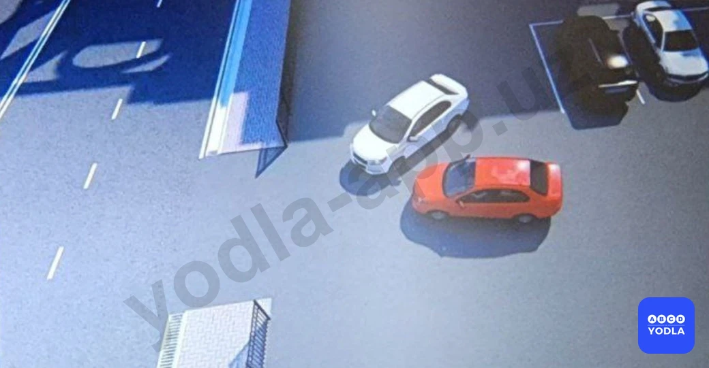
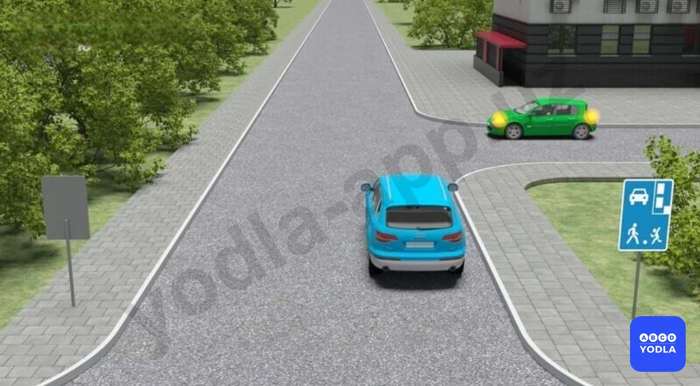
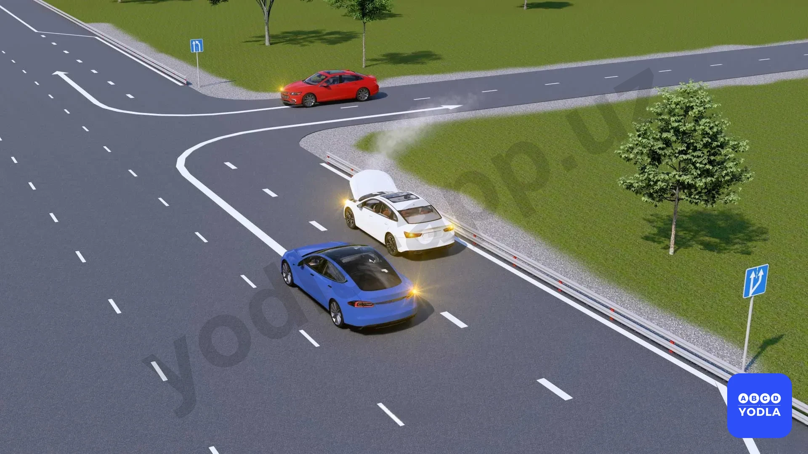
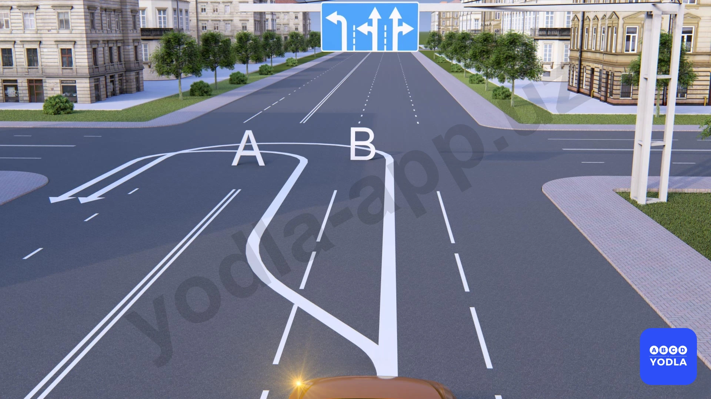
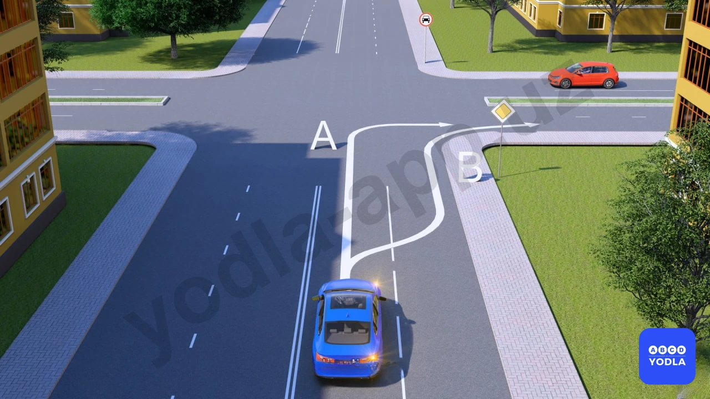
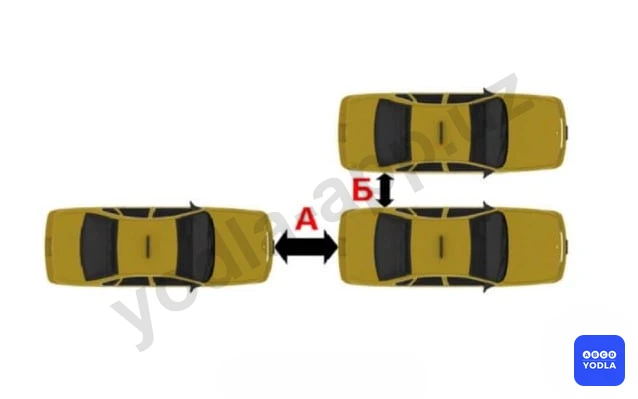

# Bilet 28

Всего вопросов: 20

## Вопрос 1

**Водитель какого транспортного средства должен уступить дорогу в данной ситуации?**

⬜ A. Водитель белого автомобиля
✅ B. Водитель красного автомобиля

> 💡 В данной ситуации уступить дорогу должен водитель транспортного средства, у которого справа находится другое транспортное средство.

В этом случае правая сторона водителя красного автомобиля занята, поэтому именно он обязан уступить дорогу.

Следовательно, правильный ответ — водитель красного автомобиля должен уступить дорогу.

---

## Вопрос 2

**В этой ситуации кто должен уступить дорогу?**

⬜ A. Водитель микроавтобуса
✅ B. Водитель легкового автомобиля

> 💡 В данной ситуации водитель легкового автомобиля продолжает движение, поскольку его правая сторона занята.

Следовательно, правильный ответ — водитель легкового автомобиля продолжает движение.

---

## Вопрос 3

**Какой водитель автомобиля должен уступить дорогу?**

✅ A. Водитель синего автомобиля
⬜ B. Водитель зелёного автомобиля

> 💡 В данной ситуации водитель синего автомобиля должен уступить дорогу, поскольку применяется правило «помехи справа».

Следовательно, правильный ответ — водитель синего автомобиля должен уступить дорогу.

---

## Вопрос 4

**Какой автомобиль нарушил правило поворота на перекрёстке?**

✅ A. Красный автомобиль
⬜ B. Синий автомобиль
⬜ C. Оба нарушили
⬜ D. Ни один не нарушил

> 💡 В данной ситуации водитель синего автомобиля не нарушил правила. Из-за неисправного белого автомобиля средняя и правая полосы были заняты, поэтому поворот был выполнен со второй полосы.

Водитель красного автомобиля, не въехав на полосу разгона, сразу выехал на основную дорогу. Такое действие является нарушением Правил дорожного движения.

Следовательно, правильный ответ — правила нарушил водитель красного автомобиля.

---

## Вопрос 5

**Разрешается опережение безрельсового транспортного средства, движущегося в одном направлении (не начавшего поворот):**

⬜ A. Только слева
⬜ B. Только справа
✅ C. С обеих сторон

> 💡 Безрельсовое транспортное средство, движущееся в попутном направлении и не выехавшее на трамвайные пути для поворота налево, разрешается обгонять как слева, так и справа.

Следовательно, правильный ответ — обгон разрешается как с левой, так и с правой стороны.

---

## Вопрос 6

**В каком направлении автомобилю разрешено повернуть?**

✅ A. Hаправлении A
⬜ B. Hаправлении B
⬜ C. В обоих направлениях

> 💡 Разворот разрешается выполнять только с крайней левой полосы. В данной ситуации разворот разрешён в направлении А.

Следовательно, правильный ответ — разворот разрешён в направлении А.

---

## Вопрос 7

**Водитель автомобиля в каком направлении нарушает правила?**

⬜ A. A
⬜ B. B
✅ C. Нарушает правила в обоих направлениях
⬜ D. Не нарушает правила ни в одном направлении

> 💡 Поворот направо в направлении А запрещён. Поворот в направлении Б разрешён, однако при перестроении на данную полосу водитель пересёк сплошную линию разметки.

Таким образом, в обоих случаях требования Правил дорожного движения нарушены.

Следовательно, правильный ответ — нарушения допущены в направлениях А и Б.

---

## Вопрос 8

**Как называют водителя этого черного автомобиля, когда он меняет направление движения?**

⬜ A. Маневрирование
⬜ B. Измените количество деталей
⬜ C. Медленное движение
✅ D. Создание аварийной ситуации 
⬜ E. Все ответы верны.

> 💡 Резкое изменение направления движения водителем чёрного транспортного средства расценивается как создание аварийной ситуации.

Следовательно, правильный ответ — создание аварийной ситуации.

---

## Вопрос 9

**Какой водитель правильно выполнил поворот?**

⬜ A. Оба неправильно
⬜ B. Синий
✅ C. Оба правильно
⬜ D. Зелёный

> 💡 В данной ситуации оба водителя выполнили поворот правильно. Въезд на перекрёсток с круговым движением разрешается с любой полосы.

Синий автомобиль выполняет поворот со второй полосы из-за препятствия на дороге, что не считается нарушением.

Следовательно, правильный ответ — оба водителя выполнили поворот правильно.

---

## Вопрос 10

**На каком рисунке водителям запрещён разворот?**

⬜ A. На всех рисунках
⬜ B. Только на рисунке ниже
⬜ C. Только на рисунке справа
✅ D. Только на рисунках слева и справа
⬜ E. Только на рисунке слева

> 💡 На первом и втором рисунках разворот запрещён.

На втором рисунке разворот запрещён, поскольку он должен выполняться только с крайней левой полосы.

На третьем рисунке разворот не запрещён. В данном месте запрещён только поворот налево.

Следовательно, правильный ответ — разворот запрещён на первом и втором рисунках.

---

## Вопрос 11

**Когда запрещается выезжать на сторону дороги, предназначенную для встречного движения?**

⬜ A. На дорогах с двухсторонним движением, имеющим четыре полосы и более
⬜ B. На дорогах двухсторонним движением, имеющих четыре полосы для движения при наличии дорожной разметки в виде двух сплошных линий, разделяющих транспортные потоки противоположных направлений
✅ C. Во всех перечисленных случаях

> 💡 Выезд на сторону дороги, предназначенную для встречного движения, запрещается независимо от наличия или отсутствия дорожной разметки.

Следовательно, правильный ответ — выезд на встречную полосу запрещён во всех перечисленных случаях.

---

## Вопрос 12

**На дороге с двухсторонним движением, имеющей три полосы, Вам необходимо повернуть направо. С какой полосы Вы осуществите данный маневр?**

✅ A. С правой полосы
⬜ B. Со средней полосы
⬜ C. С правой или средней полосы
⬜ D. Со средней полосы, но лишь когда занята правая полоса

> 💡 На трёхполосной дороге с двусторонним движением поворот направо выполняется только из крайней правой полосы.

Средняя полоса используется только для поворота налево или разворота.

Следовательно, правильный ответ — поворот направо выполняется из крайней правой полосы.

---

## Вопрос 13

**В каком направлении разрешается движение автомобилям?**

⬜ A. Красному автомобилю –прямо, синему автомобилю- прямо и налево
⬜ B. Красному и синему автомобилям-прямо
✅ C. Красному автомобилю –прямо, синему- налево или обратно

> 💡 В данной ситуации грузовому автомобилю с крайней левой полосы разрешается только поворот налево и разворот. Движение прямо с этой полосы запрещено.

Транспортные средства, намеревающиеся двигаться прямо, могут использовать остальные полосы движения, но не крайнюю левую.

Дорожный знак распространяется на все транспортные средства. Поэтому не следует делать вывод только по знаку, необходимо также учитывать правила движения по полосам.

Следовательно, правильный ответ — красному автомобилю разрешено движение прямо, а синему автомобилю разрешены поворот налево и разворот.

---

## Вопрос 14

**Когда транспортное средство должно двигаться только по крайней правой полосе?**

⬜ A. При перевозке тяжеловесных и крупногабаритных грузов
⬜ B. Если водитель почувствовал болезненное состояние
⬜ C. Если во время движения ослабло крепление груза
✅ D. Когда транспортное средство по техническим причинам не может превышать скорость 40 км/ч

> 💡 Транспортное средство должно двигаться только по крайней правой полосе, если по техническим причинам оно не может развивать скорость более 40 км/ч.

Следовательно, правильный ответ — транспортное средство должно двигаться только по крайней правой полосе, если по техническим причинам не может двигаться со скоростью более 40 км/ч.

---

## Вопрос 15

**Что называется; дистанцией?**

✅ A. Расстояние «А»
⬜ B. Расстояние «Б»
⬜ C. Расстояние «А» и «Б»

> 💡 Под дистанцией понимается расстояние, обозначенное буквой А.

Следовательно, правильный ответ — расстояние А.

---

## Вопрос 16

**Кто из водителей легковых автомобилей нарушает правила при движении в населенном пункте?**

⬜ A. Только водитель автомобиля «Б»
⬜ B. Оба нарушают
✅ C. Оба не нарушают

> 💡 В данной ситуации ни один из водителей легковых автомобилей не нарушает правила движения. Водитель грузового автомобиля также не нарушает Правила дорожного движения.

Согласно Правилам дорожного движения, в населённых пунктах при отсутствии интенсивного движения и заторов рекомендуется двигаться по крайней правой полосе. Однако, если правая полоса свободна, допускается движение и по другим полосам.

Следовательно, правильный ответ — в данной ситуации никто из водителей не нарушает правила.

---

## Вопрос 17

**Вы поворачиваете на дорогу с реверсивным движением. По какой полосе после поворота Вы имеете право двигаться?**

⬜ A. В населенных пунктах движение разрешается по любой полосе
✅ B. По крайней правой полосе. Перестраиваться разрешается только после проезда реверсивного светофора или знака “Направления движения по полосам”; разрешающего движение и по другим полосам
⬜ C. Вне населенных пунктов по возможности ближе к правому краю проезжей части

> 💡 После поворота с полосы реверсивного движения водитель должен двигаться только по крайней правой полосе.

Перестроение на другие полосы допускается только в том случае, если сигналы реверсивного светофора разрешают движение по этим полосам, и после проезда знаков направления движения по полосам.

Следовательно, правильный ответ — сначала необходимо двигаться по крайней правой полосе, а затем, при наличии разрешения, можно перестроиться на другие полосы.

---

## Вопрос 18

**Разрешается ли движение по трамвайным путям при проезде перекрестка?**

⬜ A. Запрещается
⬜ B. Разрешается; если не создаются помехи трамваю
⬜ C. Разрешается; по трамвайным путям попутного направления
✅ D. Разрешается по трамвайным путям попутного направления при интенсивном движении на других полосах, объезде, опережении. При этом не должно создаваться помех трамваю

> 💡 При пересечении перекрёстка движение по трамвайным путям попутного направления разрешается для объезда, если остальные полосы движения загружены.

Это допускается при отсутствии дорожных знаков 5.8.1 и 5.8.2. При этом водитель не должен создавать помех движению трамвая.

Следовательно, правильный ответ — движение по трамвайным путям попутного направления разрешается, если другие полосы загружены и отсутствуют знаки 5.8.1 и 5.8.2.

---

## Вопрос 19

**По какой полосе разрешается движение грузовых автомобилей с разрешенной максимальной массой более 3,5 т в населенных пунктах?**

⬜ A. По возможности ближе к правому краю проезжей части
⬜ B. По любой полосе; при интенсивном движении на других полосах
✅ C. По любой полосе, однако, если для движения безрельсовых транспортных средств в одном направлении имеются три полосы и более, то на крайнюю левую полосу разрешается выезжать только для поворота налево, разворота и остановки на дорогах с односторонним движением

> 💡 В населённых пунктах грузовые автомобили с разрешённой максимальной массой более 3,5 тонн должны двигаться как можно ближе к крайней правой полосе проезжей части.

Следовательно, правильный ответ — двигаться как можно ближе к крайней правой полосе.

---

## Вопрос 20

**Вы движетесь по дороге с двухсторонним движением; имеющей три полосы. В каком случае разрешается выезжать на среднюю полосу?**

⬜ A. Только для обгона
⬜ B. Только для объезда
⬜ C. Только для поворота налево или разворота
✅ D. Во всех перечисленных случаях

> 💡 При пересечении перекрёстка движение по трамвайным путям попутного направления разрешается для объезда, если остальные полосы движения загружены.

Это допускается при отсутствии дорожных знаков 5.8.1 и 5.8.2. При этом водитель не должен создавать помех движению трамвая.

Следовательно, правильный ответ — движение по трамвайным путям попутного направления разрешается, если другие полосы загружены и отсутствуют знаки 5.8.1 и 5.8.2.

---

